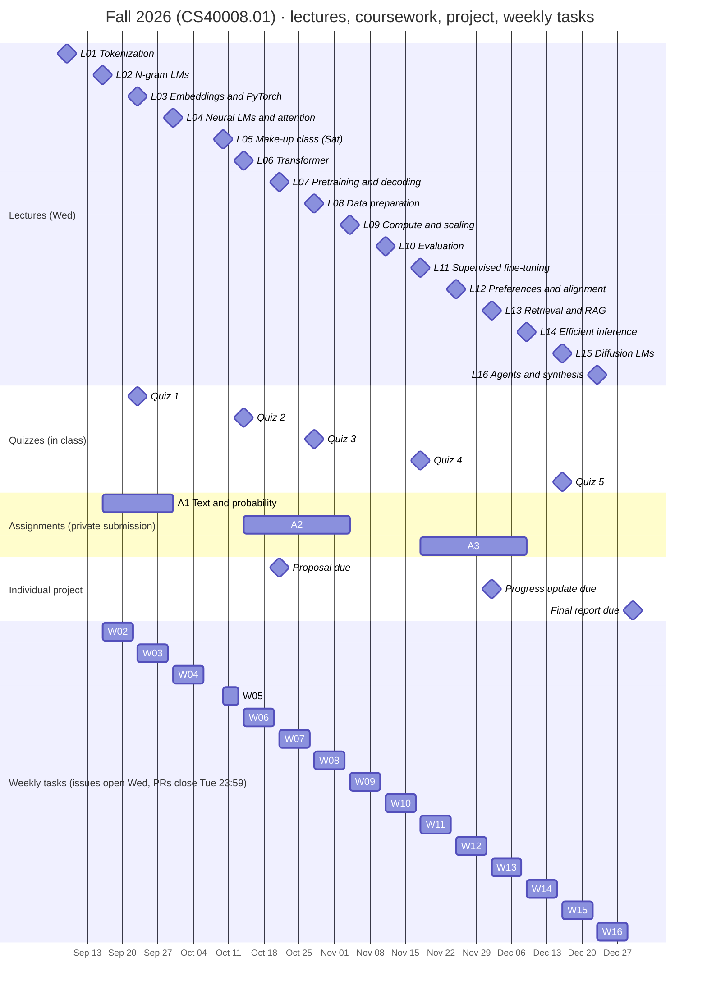
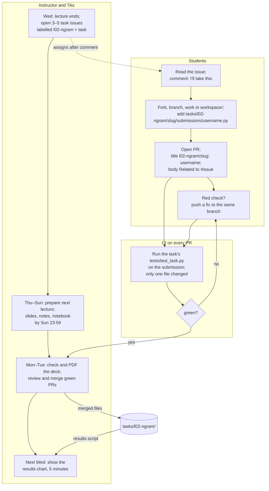
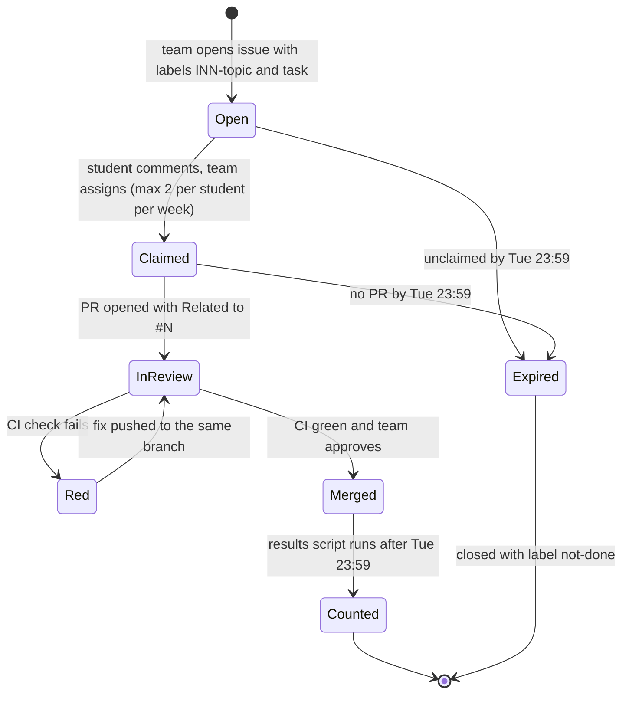

# Participation workflow: timelines, issues, and pull requests

This page is the reusable operating chart for the course's GitHub-based
participation: when the teaching team opens issues, when students submit,
who checks what, and how the results return to the class. The diagrams are
[Mermaid](https://mermaid.js.org/) and render on GitHub; edit the text to
change them. Dates come from [schedule.md](schedule.md) and the
[course website](../index.html); change them there first, then here.

Related: the Week 1 survey ([surveys/lecture-01](../surveys/lecture-01/)),
which is the template for every weekly activity: one file per student, a
mechanical check, nothing to leak, and a chart shown at the next lecture.

## 1. Semester timeline

Week 5's window is short because the make-up class is on Saturday, Oct 10
and the next lecture is Wednesday, Oct 14.

## 2. One week, three roles

Every teaching week runs the same loop. The instructor's lecture preparation
for the *next* week overlaps with the students' task window for *this* week.

Deadlines inside one week:

| Day | Instructor and TAs | Students |
| --- | --- | --- |
| Wed (lecture) | Open the lecture's task issues (labels `lNN-topic` + `task`); announce the deadline | Pick a task; comment to claim |
| Thu–Sun | Prepare next week's lecture: slides, notes, notebook by **Sun 23:59** (a tracking issue like #39 per lecture) | Work on the task; open the PR early so CI can run |
| Mon–Tue | Run `npm --prefix slides run check` and `pdf` on the new deck; merge green task PRs | Fix red checks; final push by **Tue 23:59** |
| Wed (next lecture) | Regenerate the chart from `tasks/lNN-topic/`; show it | See the class result |

## 3. Life of a task issue

Late PRs are merged if correct but not counted for that week. An issue is
never closed by a student PR: PR bodies say `Related to #N`, not `Fixes #N`,
so several students can submit to the same issue.

## 4. Labels and naming rules (do not vary them)

Every issue carries **one lecture label and one type label**. Lecture labels
are stable even when dates move (the Oct 7 class moved to Oct 10, but L05 is
still L05), and zero-padding keeps them sorted.

| Lecture labels (blue) | Type labels |
| --- | --- |
| `l01-tokenization`, `l02-ngram`, `l03-embeddings`, `l04-attention`, `l05-makeup`, `l06-transformer`, `l07-pretraining`, `l08-data`, `l09-scaling`, `l10-evaluation`, `l11-sft`, `l12-alignment`, `l13-rag`, `l14-inference`, `l15-diffusion`, `l16-agents` | `task` (student exercise, many submissions), `help wanted` (one student, improves the repo), `bug`, `figure`, `survey`, `prep` (teaching team's own lecture preparation, e.g. #39), `project`, `not-done` |

| Item | Rule | Example |
| --- | --- | --- |
| Issue title | `<lecture label>: <short title>` | `l02-ngram: bigram perplexity on your own text` |
| Issue labels | one lecture label + one type label | `l02-ngram`, `task` |
| Issue body | Link to the task folder; the folder's `instruction.md` holds goal, interface, examples, checker, deadline | `tasks/l02-ngram/bigram-perplexity/` |
| Student file | `tasks/<lecture label>/<slug>/submissions/<username>.py`, username in lowercase (see [tasks/README.md](../tasks/README.md)) | `tasks/l02-ngram/bigram-perplexity/submissions/octocat.py` |
| PR title | `<lecture label>/<slug>: <username>` | `l02-ngram/bigram-perplexity: octocat` |
| PR body | `Related to #<issue>` | `Related to #45` |
| Branch in the fork | `<lecture label>-<slug>` | `l02-ngram-bigram-perplexity` |
| Deadline | Tuesday 23:59 (Asia/Shanghai) of the same week | — |

Privacy: GitHub username only, no real names or student IDs; the same rule as
the survey. Assignments A1–A3 stay on the private channel because their
solutions are shared; weekly tasks are public because every answer differs.

## 5. Kinds of task that check themselves

| Kind | What the student submits | How it is checked | Cost to the team |
| --- | --- | --- | --- |
| Measured number | A number computed on an input the student chose, with the input stated | Script recomputes from the stated input | none after setup |
| Self-checked cell | Output of a notebook cell that contains an assert | CI runs the file's declared cells | none after setup |
| Comparison table | A small table with fixed columns | CI checks the columns; a TA skims values | minutes |
| Figure or diagram | An SVG/PNG plus the script that made it | TA runs the script once | minutes |
| Fix in the course repo | A PR that changes course files (typo, bug, test) | Normal code review | review time |

Aim for at most one review-heavy task per week.

## 6. Reusing this next semester

1. Update the dates in `docs/schedule.md` and the week rows of `index.html`
   (with `assets/translations.js`), then the Gantt dates in section 1.
2. Keep the file layout, the labels, and the naming rules in section 4
   unchanged; scripts and CI depend on them.
3. Recreate the lecture and type labels from section 4 (rename the lecture
   slugs if topics change) and one milestone per lecture.
4. Re-run the survey flow in Week 1 as the first PR exercise; the results
   script `scripts/survey_results.py` shows the closed loop.
5. Open a lecture-preparation issue per week for the instructor with the
   Sunday 23:59 deadline (issue #39 is the first one).
