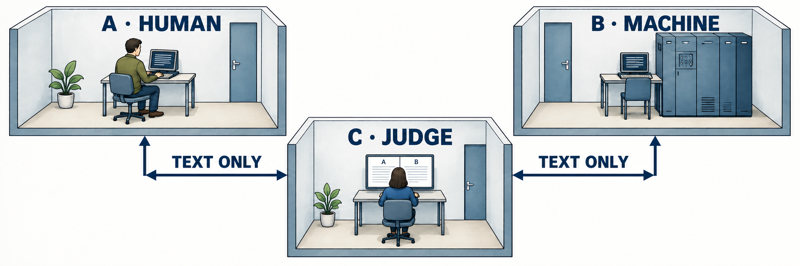
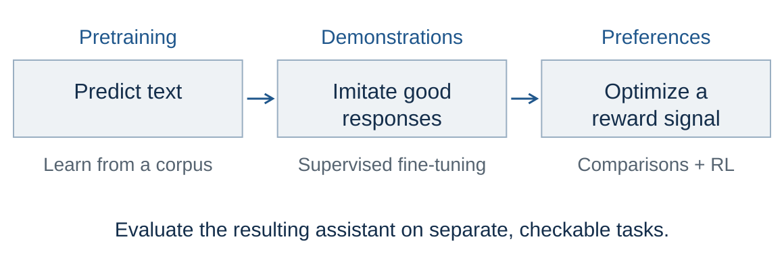
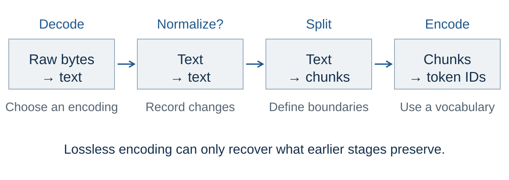
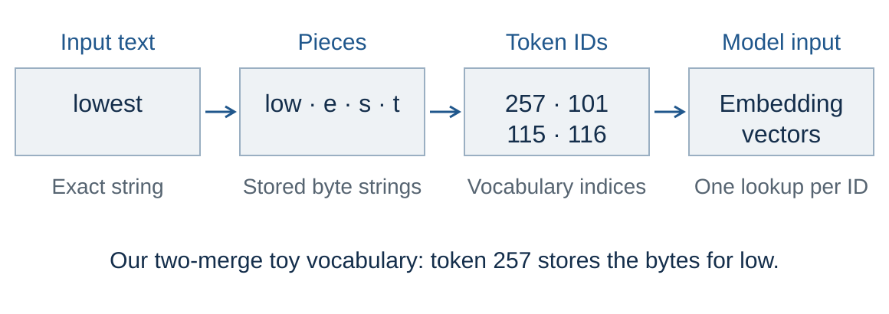

<!-- .slide: class="title-slide" id="title" -->

<p class="eyebrow">CS40008.01</p>

# Introduction and Tokenization

<p class="subtitle">Lecture 01 – Introduction to NLP &amp; LLMs</p>

<p class="byline">Baojian Zhou<br>School of Data Science<br>Fudan University<br>September 9, 2026</p>

Note:
Ask students how they think a model represents a Chinese sentence.

---

<!-- .slide: id="about-me" -->

## About me

<div class="columns columns-wide-left">
<div>
<p><strong>Email:</strong> <a href="mailto:bjzhou@fudan.edu.cn">bjzhou@fudan.edu.cn</a></p>
<p><strong>Course website:</strong> <a href="https://baojian.github.io/llm-26-fall/">baojian.github.io/llm-26-fall/</a></p>
<p><strong>Course GitHub:</strong> <a href="https://github.com/baojian/llm-26-fall">github.com/baojian/llm-26-fall</a></p>
<p><strong>Office:</strong> Francis and Rose Yuen Campus, C611</p>
<p><strong>Office hours:</strong> Mon. 14:00–15:30</p>
</div>
<div>
<p class="caption">Scan to join the WeChat group</p>
<a href="assets/llm-26-fall-wechat.png"></a>
</div>
</div>

Note:
Introduce yourself and invite students to office hours. Allow students to scan the course WeChat QR code on the right; clicking the image opens its full-size original. The instructor supplied this unchanged image on September 8, 2026; it states that the invitation is valid before September 15. Contact details: Fudan Spring Lecture 01, https://baojian.github.io/llm-26/slides/lecture-01-slides/index.html#/1. Office hours and course links: the Fall 2026 course page, ../../index.html.

---

<!-- .slide: class="outline-slide" id="outline-overview" -->

## Outline

<ul class="outline-topics">
<li aria-current="step">Course Overview</li>
<li>Development of NLP &amp; LLMs</li>
<li>Basics for Text Preprocessing</li>
<li>Text Tokenization</li>
</ul>

Note:
Period 1, minutes 0–25: course overview. Read the four topics once. There are three 45-minute teaching periods, with breaks outside the 135 minutes. Return to this outline at each transition. Source: the four-part structure in Fudan Spring Lecture 01, https://baojian.github.io/llm-26/slides/lecture-01-slides/.

---

<!-- .slide: id="nlp-and-llms" -->

## NLP, LLMs, and this course

**Natural language processing (NLP):** computational methods for analyzing and generating human language.

**Large language models (LLMs):** large neural models that learn patterns of language from text and support many NLP tasks.

**This course:** understand how language models work, build small models, and evaluate them through controlled experiments.

Note:
Introduce NLP as the field and LLMs as a family of models used within it. NLP includes tasks such as translation, classification, and question answering. An LLM is one component of an application; we will distinguish the model, tools, and interface in the examples. Start with this course-wide purpose before introducing today's tokenization goals. Background: Jurafsky and Martin, Chapter 1 introduction and Section 1.1, https://web.stanford.edu/~jurafsky/slp3/1.pdf (August 19, 2026 draft). Course scope and learning approach: ../../index.html#overview.

---

<!-- .slide: id="course-logic" -->

## How the course fits together

| Step | What we study |
| :--- | :--- |
| Represent text | Tokens and embeddings |
| Build language models | Probability, attention, and Transformers |
| Train within a budget | Data quality, optimization, and compute |
| Evaluate and apply | Controlled comparisons, adaptation, and retrieval |

For each idea: **understand it → implement it → test it**.

Note:
Explain why the topics build on one another: models need numerical text representations; training needs data and compute; useful applications need evaluation. Evaluation is a habit throughout the course, not only a final stage. The weekly schedule develops these ideas into fine-tuning, alignment, retrieval, and efficient inference. We use small systems to make mechanisms inspectable, and each student investigates one meaningful question through the individual project. Course roadmap: ../../index.html#schedule; learning approach: ../../index.html#overview.

---

<!-- .slide: id="course-topics" -->

## What we will cover

**Foundations:** text preprocessing and tokenization; n-gram models; word embeddings; neural language models; RNNs; self-attention; Transformers.

**Training and evaluation:** pretraining and fine-tuning; data quality; compute budgets; evaluation and benchmarking.

**Applications and frontiers:** prompting and in-context learning; alignment and safety; retrieval; efficient inference; diffusion language models; reasoning and agents.

See the [weekly schedule](../../index.html#schedule) for the sequence and practical work.

Note:
Adapted from Spring Lecture 01 slide 15: https://baojian.github.io/llm-26/slides/lecture-01-slides/index.html#/15. The Fall schedule defines actual scope and timing: ../../index.html#schedule. Word2vec supplies an embedding example; RNN/LSTM modeling provides brief motivation for attention. Data, compute, retrieval, and experimental design are explicit parts of the Fall course. This topic map gives concrete subjects for the preceding course-logic slide. Spend about 45 seconds on the map; students can revisit the weekly schedule after class.

---

<!-- .slide: id="beyond-course" -->

## Resources for independent study

| Start with | Use it for |
| :--- | :--- |
| [Speech and Language Processing](https://web.stanford.edu/~jurafsky/slp3/) | Language, probability, and tokenization |
| [Stanford CS336](https://cs336.stanford.edu/) | Building language models from components |
| [Neural Networks: Zero to Hero](https://karpathy.ai/zero-to-hero.html) | Small, inspectable implementations |

The notebook has the full Spring reading and course list.

Choose a companion that helps answer your current question.

Note:
45 seconds. The full resource inventory from Spring slide 16 is retained in the notebook's Course Overview, including the four books, seven courses, and research communities. These are optional study resources. The Fall course page defines required work. Ask students to use one main reading and consult other sources for a specific question. Source: https://baojian.github.io/llm-26/slides/lecture-01-slides/index.html#/16.

---

<!-- .slide: id="course-work" -->

## Coursework and Assessment

Build small models and run experiments, and do one course project.

| Assessment | Weight |
| :--- | ---: |
| Quizzes | 10% |
| Assignments | 45% |
| Individual course project | 45% |

A1 is released in **Week 2**. See the [course page](../../index.html#assessment) for details.

Note:
Distinguish today’s ungraded practice from graded assignments. The course website is the source of current assessment rules. Do not import the Stanford workload or the previous semester’s deadlines. Connect small reproducible experiments to the individual project. This is the Fall counterpart of Spring Lecture 01 slide 17, which opens the earlier course page: https://baojian.github.io/llm-26/slides/lecture-01-slides/index.html#/17. The displayed weights and individual project follow ../../index.html#assessment.

---

<!-- .slide: id="course-materials" -->

## Course materials

- [Course website](../../index.html): weekly slides, exercises, readings, and assessment.
- [GitHub repository](https://github.com/baojian/llm-26-fall): source files and updates.
- **Notebook:** open your personal Jupyter copy under `workspace/`.

Fetch course updates before class:

```sh
cd llm-26-fall
git pull
```

Note:
Adapted from Spring Lecture 01 slide 18 with the Fall repository and URLs: https://baojian.github.io/llm-26/slides/lecture-01-slides/index.html#/18. From the repository root, run uv sync and uv run python scripts/slides.py serve for local slides and notebook integration. The course website links materials as they become available. Existing personal notebook answers are preserved when course files change; to obtain a revised handout, rename the old personal notebook and reopen Notebook. Keep the renamed file for earlier work. Point out these locations now; do setup and troubleshooting after class.

---

<!-- .slide: id="learning-strategy" -->

## How to learn this course effectively

- **Linear algebra:** vectors, matrices, and tensor shapes.
- **Probability and ML:** distributions, losses, and optimization.
- **Python:** practice with NumPy, PyTorch, and Transformers.
- **Communication:** explain evidence and decisions in your individual work.

**Read → implement → experiment → explain.**

Practice regularly. Verify results and investigate failures.

Note:
Adapted from Spring Lecture 01 slide 19: https://baojian.github.io/llm-26/slides/lecture-01-slides/index.html#/19. Connect prerequisites to the next experiment: inspect the tensor or text representation, implement a small case, change one factor, and explain the result. Fall prerequisites and learning expectations are in ../../index.html#overview. Fall projects are individual written submissions, so communication means clear experimental records and explanations rather than the Spring team's presentation requirement. The course AI policy permits assistance in practical work while requiring students to verify results and explain their decisions; use ../../index.html#policies for the full policy.

---

<!-- .slide: id="survey" -->

## The LLM apps you use

Which apps do you use most in everyday life?

Choose **at most two** in the [first-lecture survey](https://github.com/baojian/llm-26-fall/issues/6).

Submit your response through one pull request, following the issue’s guide.

> What do you usually ask these apps to do?

Note:
Take two or three examples aloud. Explain that an app may combine a model, search, tools, and an interface. Introduce the GitHub workflow here; students can finish the PR after class. Do not spend the period debugging individual accounts.

---

<!-- .slide: id="app-model-tokenizer" -->

## App, model, tokenizer

| Component | In our local experiment |
| :--- | :--- |
| Interface | A Jupyter notebook |
| Model runtime | Ollama |
| Model | Qwen3, using an installed model tag |
| Tokenizer | The vocabulary and rules paired with that model |

Our toy tokenizer is a separate learning exercise.

Note:
Ollama serves the model; it is not itself the language model. The tokenizer we train today is not compatible with Qwen’s existing embedding table. A model tag identifies a packaged model; record its digest because tags can change. API source: https://docs.ollama.com/api/tags.

---

<!-- .slide: id="notebook-demo" -->

## Example 01: A Qwen language model

> Fudan University is located in which city? Answer with one word.

<a href="../shared/notebook.html?lecture=lecture-01" target="_blank" rel="noopener noreferrer">Open the classroom notebook</a> → **One prompt, one response**.

1. Predict the answer.
2. Run the cell with an installed Qwen model.
3. Inspect the answer, token counts, and stop reason.

<div class="answer fragment"><p>Expected city: <strong>Shanghai</strong>. Check the response against the fact.</p></div>

Note:
One minute; prepare the call before class. Use the shared launcher, which opens the student's working copy and preserves answers. The notebook supplies the exact prompt and request settings. Use an already installed Qwen3 tag; do not spend lecture time on a download. Thinking and model-size comparisons are optional follow-ups in the notebook. Token counts include model prompt formatting and are not just a count of the displayed words. Source prompt: Spring slide 5, https://baojian.github.io/llm-26/slides/lecture-01-slides/index.html#/5; API: https://docs.ollama.com/api/generate.

---

<!-- .slide: id="nlp-tasks" -->

## Language and multimodal examples

| Task | Input → output |
| :--- | :--- |
| 1. Sentiment | Camera review → label and explanation |
| 2. Translation | Chinese passage → English passage |
| 3. Article generation | Topic or opening → article |
| 4. Image understanding | Image + question → description |
| 5. Text to image / video | Description → generated visual content |

Note:
Introduce the five numbered task groups, then go directly to Task 1. The following slides stay in this order; text-to-image and text-to-video are both examples of Task 5. The app/model/tokenizer explanation and short Qwen call precede this overview. Model calls run in Notebook; prepared videos play directly in the deck. Text-to-image and text-to-video broaden the examples to multimodal generation rather than text-only LLM tasks. Sources: Fudan Spring Lecture 01, https://baojian.github.io/llm-26/slides/lecture-01-slides/index.html#/5 through #/11.

---

<!-- .slide: class="exercise" id="exercise-01" -->

## Task 1: Sentiment analysis

<p class="exercise-meta">Exercise E01 · 5 minutes · Notebook E01</p>

1. “Nice and compact to carry!”
2. “The camera is small and light; I avoid carrying bulky cameras.”
3. “The camera feels flimsy, plastic, and very light.”

Does “light” mean positive? Predict the labels, then compare with Ollama.

<div class="answer fragment"><p>Expected: positive, positive, negative.</p> <p> The surrounding words change the meaning of “light.”</p></div>

Note:
Allow one minute to label individually, two to run notebook E01, and two to compare. These are shortened versions of the camera reviews in the previous Fudan lecture; the notebook keeps the full review text. The expected labels are human judgments for these examples, not guaranteed model outputs. Discuss any disagreement.

---

<!-- .slide: class="exercise" id="example-translation-stats" -->

## Task 2: Machine translation

<p class="exercise-meta">Exercise E02 · 3 minutes · Notebook E02 · Historical examples</p>

<div class="columns">
<div>
<h3>A: Numbers and dates</h3>
<blockquote><p>Google Translate支持249种语言。日均用户超过2亿人，2016年4月总用户数超过5亿人，每天翻译超过1000亿个单词。</p></blockquote>
</div>
<div>
<h3>B: Definition and prediction</h3>
<blockquote><p>人工智能亦称智械、机器智能，指由人制造出来的机器所表现出来的智能。……常态预测则认为人类的很多职业也逐渐被其取代。</p></blockquote>
</div>
</div>

Translate into English. Check A’s numbers and B’s meaning.

<div class="answer fragment"><p>A: 249 languages; over 200 million daily users; April 2016; over 500 million total users; over 100 billion words per day.</p></div>

Note:
Allow one minute to predict A’s quantities, one to run Notebook E02, and one to compare. Students should write the four English quantities and the date, then identify any changed or omitted information in the model output. One 亿 is 100 million, so 2亿 is 200 million, 5亿 is 500 million, and 1000亿 is 100 billion. Preserve “over,” the daily units, and the April 2016 date attached to total users. If Ollama is unavailable, compare student translations with these checks. A is the full Google Translate passage from the original source; these are historical source statistics, not a current fact sheet. B excerpts the original AI-definition passage, with omissions marked. Both full passages are retained in the notebook’s existing translation cell. Use B as a follow-on comparison if time permits: preserve both the definition of machine intelligence and the final prediction about occupations. Translating that prediction does not establish its truth. Keep the model and decoding settings fixed. Source: https://baojian.github.io/llm-26/slides/lecture-01-slides/index.html#/7.

---

<!-- .slide: id="example-article-blog" -->

## Task 3: Can you identify the author?

<div class="columns">
<div>
<h3>A · Productivity blog</h3>
<blockquote><p>In order to get something done, maybe we need to think less. Seems counter-intuitive, but I believe sometimes our thoughts can get in the way of the creative process.</p></blockquote>
</div>
<div>
<h3>B · News article</h3>
<blockquote><p>After two days of intense debate, the United Methodist Church has agreed to a historic split — one that is expected to end in the creation of a new denomination…</p></blockquote>
</div>
</div>

Human or machine? What evidence supports your guess?

<div class="answer fragment"><p>The Spring deck attributes <strong>both to GPT-3</strong>. Fluency alone does not verify authorship or facts.</p></div>

Note:
One minute. These are excerpts from the complete passages in the notebook, not outputs generated in this session. Let students make independent guesses before revealing the source attribution. The Spring deck supplies the attribution; the news-style text is a historical generation example, not verified reporting. Read the longer notebook excerpts after class. This motivates Turing's operational question and the need for task-specific evaluation. Source: https://baojian.github.io/llm-26/slides/lecture-01-slides/index.html#/8. The omitted part of B is explicitly marked; A is the first two complete sentences. This poll is ungraded and separate from E01–E06.

---

<!-- .slide: id="example-vision-rainfall" -->

## Task 4: Image understanding

<div class="columns">
<div>

</div>
<div>
<p><strong>Prompt:</strong> Describe the image in one paragraph.</p>
<p>What do the axes, red line, and green bar represent?</p>
<p><a href="assets/vision-rainfall.jpg" target="_blank" rel="noopener">Open the full-size image</a>, then use <strong>vision-rainfall.jpg</strong> in Notebook.</p>
</div>
</div>

Note:
Restore the original rainfall-chart image. Its embedded credits name the National Climate Center and Xinhuanet; the title refers to precipitation over 1951–2016. The green bar is labeled 346.1 mm; the red reference is labeled the 1981–2010 average. Do not infer missing dates or measurement periods beyond the image. The model must read labels and relate them to marks, not merely describe colors. Use an installed vision-capable model. Source: https://baojian.github.io/llm-26/slides/lecture-01-slides/index.html#/9; media provenance: assets/README.md.

---

<!-- .slide: id="example-vision-big-data" -->

## Task 4: Visible evidence and inference

<div class="columns">
<div>

</div>
<div>
<p><strong>Prompt:</strong> Describe the image in one paragraph.</p>
<p><strong>Visible:</strong> labels, logos, connecting lines.</p>
<p><strong>Inferred:</strong> what those connections might mean.</p>
<p>Notebook selector:<br><code>VISION_EXAMPLE</code> → <code>"big data"</code></p>
</div>
</div>

Note:
30 seconds. This is a concept illustration, not a measured chart. The notebook changes both the image and the evidence-checking question when VISION_EXAMPLE changes. Keep the same model, general description task, and decoding settings. A connected logo does not establish data sharing or a commercial relationship. Source: Spring slide 9, https://baojian.github.io/llm-26/slides/lecture-01-slides/index.html#/9; asset provenance: assets/README.md.

---

<!-- .slide: id="example-text-to-image" -->

## Task 5: Text → image

**Stable Diffusion**

> a watercolor painting of a university campus gate at sunset, people fully clothed, family-friendly

Open Notebook's optional **Text → image: Stable Diffusion** section.

Keep the prompt fixed; change the seed and compare the images.

<p class="caption">Original demonstration settings: 30 steps and guidance scale 7.5.</p>

Note:
Restore the exact prompt from the original sd-demo.html iframe, which uses Stable Diffusion 1.5. The optional notebook cell uses an already prepared local checkpoint and does not download model weights. Prepare the multimodal packages and checkpoint before class; image generation is optional. Identify generated images as model outputs and compare whether each one follows the prompt. Source: https://baojian.github.io/llm-26/slides/lecture-01-slides/index.html#/10 and https://baojian.github.io/llm-26/slides/lecture-01-slides/sd-demo.html.

---

<!-- .slide: id="example-video-antarctica" -->

## Task 5: Text → video — Antarctica

**Prompt:** an old man wearing blue jeans and a white T-shirt taking a pleasant stroll in Antarctica during a winter storm

<video class="animation" src="assets/text-to-video-antarctica.mp4" poster="assets/text-to-video-antarctica-poster.jpg" controls playsinline preload="metadata" aria-label="Original generated video example of a man walking through snow in Antarctica."></video>

<p class="caption">Play the clip. Compare clothing, walking motion, and weather with the prompt.</p>

Note:
This is the original locally hosted clip, not a newly generated output. Playback is manual and stops when leaving the slide. The poster is a frame extracted at one second for print and before playback. Ask students to identify one matching detail and one limitation; do not infer an actual filmed location. Original prompt and clip: https://baojian.github.io/llm-26/slides/lecture-01-slides/index.html#/11. Model attribution was not supplied in that source, so none is added. Media provenance: assets/README.md.

---

<!-- .slide: id="example-video-johannesburg" -->

## Task 5: Text → video — Johannesburg

**Prompt:** a woman wearing purple overalls and cowboy boots taking a pleasant stroll in Johannesburg South Africa during a beautiful sunset

<video class="animation" src="assets/text-to-video-johannesburg.mp4" poster="assets/text-to-video-johannesburg-poster.jpg" controls playsinline preload="metadata" aria-label="Original generated video example of a woman walking outdoors at sunset."></video>

<p class="caption">Play the clip. Compare the person, clothing, setting, and lighting with the prompt.</p>

Note:
This is the second original locally hosted clip. Compare the same action in another requested setting. A plausible-looking scene does not verify a real location. Playback is manual; the poster is extracted at one second and appears in print. Original prompt and clip: https://baojian.github.io/llm-26/slides/lecture-01-slides/index.html#/11. Media provenance: assets/README.md.

---

<!-- .slide: id="goals" -->

## Today’s question: how does text reach a model?

How does an LLM application turn our text into something a model can predict?

- Inspect a response using a concrete check.
- Explain what preprocessing preserves or discards.
- Distinguish visible symbols, code points, bytes, and tokens.
- Train BPE, encode unseen text, and measure the tradeoff.

**First: how did language models develop?**

Note:
One minute. Close the example gallery. E01 checks sentiment against context; E02 checks translation quantities; the image and authorship examples separate plausibility from evidence. These questions remain relevant across generations of NLP systems. The next section traces changes in the methods, before we build one component ourselves.

---

<!-- .slide: class="outline-slide" id="outline-development" -->

## Outline

<ul class="outline-topics">
<li>Course Overview</li>
<li aria-current="step">Development of NLP &amp; LLMs</li>
<li>Basics for Text Preprocessing</li>
<li>Text Tokenization</li>
</ul>

Note:
Period 1, minutes 25–45. Ten history content pages, progressing from Weaver and Turing to available weights, reasoning, and tools. Each page introduces a mechanism, an example, and a remaining question. Dates identify selected papers; older methods continue to coexist. Take the first break after the tenth history page.

---

<!-- .slide: id="early-nlp" -->

## 1949 · Translation as a computational problem

**Warren Weaver:** use context, statistical patterns, and a decoding analogy to study translation.

<div class="columns">
<div><h3>The task</h3><p>Source sentence → target sentence</p><p>“bank” in a financial report</p></div>
<div><h3>The obstacle</h3><p>Words do not map one to one.</p><p>“bank” beside a river</p></div>
</div>

> The surrounding text helps determine the intended meaning.

<p class="source">Weaver, <em>Translation</em> (1949), discussion of context and cryptography.</p>

Note:
1.5 minutes. Begin the timeline with a concrete task from E02. Weaver's July 15, 1949 memorandum quotes his March 1947 letter to Norbert Wiener, but these are distinct dates. The bank examples are new teaching examples, not a quotation. Weaver discusses multiple possible meanings and the role of surrounding words. His cryptographic analogy motivates research; it does not establish that language is a simple substitution cipher. Source: https://mt-archive.net/Weaver-1949.pdf, pages 5–6 and the discussion of context. Adapted from Spring slide 23.

---

<!-- .slide: id="turing-test" -->

## 1950 · The Turing test



The judge sees the replies, but not who produced them.

<p class="caption">Simplified machine-versus-human version · AI-generated conceptual illustration.</p>

Note:
2 minutes. Ask why the channel must conceal faces and voices, and who has which information. The audience sees the identities in the illustration; the judge does not. Turing's original imitation game begins with a man, a woman, and an interrogator, then asks what changes when a machine replaces one participant. This is the familiar simplified machine-versus-human adaptation, not a literal reconstruction of a historical test. A result depends on judges, instructions, duration, and participants. Do not interpret it as a proof of consciousness or general competence. Source: Turing (1950), Computing Machinery and Intelligence, Sections 1–2, https://doi.org/10.1093/mind/LIX.236.433; accessible paper: https://www.csee.umbc.edu/courses/471/papers/turing.pdf. Illustration provenance and prompt: assets/image-prompts.md.

---

<!-- .slide: id="turing-evidence" -->

## 1950 · Convincing replies and correct answers

<div class="columns">
<div>

</div>
<div>
<h3>Turing’s arithmetic example</h3>
<p>Question: <strong>34,957 + 70,764</strong></p>
<p>Reply in the paper: <strong>105,621</strong></p>
<div class="answer fragment"><p>Correct sum: <strong>105,721</strong>.</p><p>What should a useful assistant optimize?</p></div>
</div>
</div>

<p class="caption">Turing (1950), §2 · AI-generated illustration; the numerical example comes from the paper.</p>

Note:
1.5 minutes. Give the audience a moment to check the sum. The paper's sample reply follows an approximately 30-second pause and contains an error of 100. Turing discusses imitation of human behavior; our course also needs independently checkable performance. Connect this to translation numbers and the authorship poll. A human-like error is not a goal for a calculator. The image is an illustrative scene, not an archival photograph. Source: Turing (1950), Section 2, https://www.csee.umbc.edu/courses/471/papers/turing.pdf. No numerical model result is claimed. Ask students to name one evaluation that goes beyond sounding human.

---

<!-- .slide: id="rules-and-statistics" -->

## 1960s–1990s · Rules and statistical learning

| Approach | What supplies the behavior? |
| :--- | :--- |
| Rules; ELIZA (1966) | Handwritten patterns and response templates |
| Statistical translation (1990) | Translation and language probabilities estimated from corpora |

**Toy rule:** “I need X” → “Why do you need X?”

Learning from examples expands coverage. Unseen phrases remain difficult.

<p class="source">Weizenbaum (1966); Brown et al. (1990).</p>

Note:
2 minutes. Use the toy rule to explain how an apparently responsive sentence can arise from pattern transformation; it is not quoted ELIZA output. ELIZA's DOCTOR script uses decomposition and reassembly rules, not a large pretrained neural model. Statistical machine translation estimates models from aligned bilingual text and scores candidate translations using probabilities. The approaches coexist; this timeline does not claim that rule-based systems disappeared in 1990. Sources: Weizenbaum, https://doi.org/10.1145/365153.365168; Brown et al., A Statistical Approach to Machine Translation, https://aclanthology.org/J90-2002/, Sections 1–2. This expands the Spring rules-to-statistics timeline with a mechanism students can recognize.

---

<!-- .slide: id="development" -->

## 2003–2014 · Learning representations

| Landmark | What changes? |
| :--- | :--- |
| Neural language model · 2003 | Learn word vectors and prediction together |
| Word2vec · 2013 | Learn reusable vectors from word contexts |
| Sequence-to-sequence · 2014 | Learn an encoder and a decoder jointly |

Similar contexts can support shared statistical strength.

A fixed sentence vector can lose details needed for translation.

<p class="source">Bengio et al. (2003); Mikolov et al. (2013); Sutskever et al. (2014).</p>

Note:
2 minutes. A vector is a learned numerical representation, not a dictionary definition. Related words can receive similar representations because of their training contexts, but proximity is not a universal test of synonymy. Bengio et al. jointly learn a distributed word representation and a language model. Word2vec gives efficient representation-learning objectives. The 2014 seq2seq model uses LSTMs; the LSTM paper itself is from 1997. A fixed-length encoding motivates the next slide's attention mechanism. Sources: https://www.jmlr.org/papers/v3/bengio03a.html; https://arxiv.org/abs/1301.3781; https://arxiv.org/abs/1409.3215; LSTM: https://doi.org/10.1162/neco.1997.9.8.1735. These are selected paper dates, not start dates for all neural NLP.

---

<!-- .slide: id="milestones" -->

## 2014–2017 · Attention and the Transformer

<div class="columns">
<div>
<a href="assets/transformer-architecture.png" target="_blank" rel="noopener"></a>
</div>
<div>
<p><strong>2014 / 2015 · Translation attention</strong><br>Consult relevant source positions while producing each output.</p>
<p><strong>2017 · Transformer</strong><br>Use attention without recurrence in the main sequence architecture.</p>
<p>Training can process token positions in parallel.</p>
</div>
</div>

<p class="caption">Bahdanau et al. (2014 preprint; ICLR 2015); Vaswani et al. (2017), Figure 1.</p>

Note:
2.5 minutes. Use the earlier translation task: when generating an English quantity, the decoder needs the relevant Chinese words and numbers. Attention appeared before the Transformer. The original Transformer has both an encoder and a decoder; GPT-style models commonly use a causal decoder. Parallel processing here describes training with known targets, not simultaneous production of every generated token. Positional information is needed because attention alone does not impose the sequence order. Do not explain every box in this introductory lecture; point at inputs, attention, and outputs. Sources: https://arxiv.org/abs/1409.0473, Sections 2–3; https://arxiv.org/abs/1706.03762, Sections 1 and 3 and Figure 1. The figure is preserved from the Spring deck.

---

<!-- .slide: id="pretraining" -->

## 2018 · Pretrain once, adapt to many tasks

| | BERT | GPT |
| :--- | :--- | :--- |
| Main text objective | Predict masked tokens | Predict the next token |
| Available context | Both sides of a mask | Earlier tokens |
| Example | The camera is [MASK]. | The camera is … |

**Pretraining:** learn from text before task-specific adaptation.

**Fine-tuning:** update those weights for a downstream task.

<p class="source">Devlin et al. (2018 preprint); Radford et al. (2018).</p>

Note:
2 minutes. The ellipsis and [MASK] are schematic displays, not verified tokenizations of a specific string. BERT also uses a next-sentence prediction objective in the original paper, so the table deliberately says main text objective. Contrast supervised labels for each task with objectives constructed from text itself. Both original BERT and GPT adapt pretrained parameters by fine-tuning. BERT's paper was posted in 2018 and published at NAACL 2019. Sources: https://arxiv.org/abs/1810.04805, Sections 3.1–3.2; Radford et al., Improving Language Understanding by Generative Pre-Training, https://cdn.openai.com/research-covers/language-unsupervised/language_understanding_paper.pdf, Sections 2–3.

---

<!-- .slide: id="in-context-learning" -->

## 2020 · Tasks specified in the prompt

**GPT-3:** demonstrations can specify a task at inference time.

```text
Review: easy to carry   Label: positive
Review: feels flimsy   Label: negative
Review: sharp photos   Label:
```

<div class="fragment"><p>Expected continuation in this toy example: <strong>positive</strong>.</p></div>

The context changes; the model’s weights stay fixed.

<p class="source">Brown et al. (2020), GPT-3 · 175B parameters in its largest model.</p>

Note:
2 minutes. Connect this directly to E01; this is a new illustrative prompt, not a recorded GPT-3 output. The paper examines zero-, one-, and few-shot prompting without task-specific gradient updates. More examples in context consume tokens and may help, but are not guaranteed to improve a task. Distinguish the model's pretraining from its inference-time use. Source: https://arxiv.org/abs/2005.14165, Section 2 and Figure 2.1. The 175B count names the largest model evaluated in that paper, not a requirement for all LLMs. Ask whether adding another review updates the weights: no.

---

<!-- .slide: id="instruction-tuning" -->

## 2022 · Training models to follow instructions



The training objective changes the behavior students see in chat.

<p class="caption">InstructGPT workflow, simplified from Ouyang et al. (2022), Figure 2.</p>

Note:
2 minutes. Pretraining alone learns continuation behavior. InstructGPT first uses human demonstrations for supervised fine-tuning, then comparisons to train a reward model, and policy optimization using that reward. This diagram compresses the comparison, reward-model, and policy-optimization steps into one stage; explain them verbally without suggesting that human raters score every token at inference. ChatGPT brought conversational interaction to a wide audience in late 2022, but it is an application and product, not the name of the entire algorithm. Preference reward is a proxy; it does not guarantee truth. Sources: https://arxiv.org/abs/2203.02155, Section 3 and Figure 2; https://openai.com/index/chatgpt/.

---

<!-- .slide: id="llm-landscape" -->

## 2023–2025 · Access, reasoning, and tools

| Direction | Example | New course question |
| :--- | :--- | :--- |
| Available model weights | LLaMA · 2023 | Can we run and inspect a model locally? |
| Tool-using systems | ReAct · 2023 | Can external observations improve a response? |
| Reasoning post-training | DeepSeek-R1 · 2025 | Does extra computation improve checked answers? |

Weights, training data, code, and licenses are distinct artifacts.

<p class="caption">Selected historical landmarks through 2025; no ranking of current models.</p>

Note:
2 minutes. End the history with the connection to our notebook: students can run an existing model while implementing smaller components themselves. LLaMA 2023 released weights to researchers subject to its original access conditions; avoid calling that release unrestricted open source. DeepSeek-R1 reports reinforcement learning for reasoning and releases models; task performance still needs external checks, and generated reasoning is model output. ReAct interleaves reasoning and actions with observations from an environment; tool use is a system design, not simply a longer answer. ReAct's preprint is October 2022 and its conference publication is ICLR 2023; the table is grouped by directions rather than an ordering within this period. Sources: https://arxiv.org/abs/2302.13971; https://arxiv.org/abs/2501.12948; https://arxiv.org/abs/2210.03629. The Spring 2019–2024 timeline remains available as assets/llm-timeline-2019-2024.png in the notebook history guide. Ask which artifacts are needed to reproduce training, rather than just to run inference. Pause for the first break.

---

<!-- .slide: class="outline-slide" id="outline-preprocessing" -->

## Outline

<ul class="outline-topics">
<li>Course Overview</li>
<li>Development of NLP &amp; LLMs</li>
<li aria-current="step">Basics for Text Preprocessing</li>
<li>Text Tokenization</li>
</ul>

Note:
Period 2, minutes 0–25. Inspect sources and information loss, restore regex basics with P01, then connect code points and UTF-8 through E03. Use the notebook for outputs and discussion; do not turn this into a complete regex language tutorial.

---

<!-- .slide: id="text-sources" -->

## A corpus reflects its sources

| Source | Useful signal | What to inspect |
| :--- | :--- | :--- |
| Books and articles | Extended prose | Topic and language coverage |
| Forums and reviews | Informal language | Repetition, context, personal information |
| Code and documentation | Structured text | Language, version, formatting |

Our classroom corpus is small and synthetic.

Real data decisions affect what a tokenizer learns.

Note:
1 minute. Restore the Spring Text Data: Sources & Coverage topic. A corpus is a collection of texts; sources differ in style, topic, quality, and coverage. Inspect sample documents rather than assuming a named source is uniformly high quality. A source list in a model report is not the full training corpus. Keep evaluation texts separate before learning a vocabulary. E06 will make the training-language effect measurable. Source: Spring slide 29, https://baojian.github.io/llm-26/slides/lecture-01-slides/; source code section Text Data: Sources & Coverage. No undocumented training-data inventory for a named model is asserted.

---

<!-- .slide: id="preprocessing-pipeline" -->

## The text processing pipeline



At every stage: what is preserved, and what can be recovered?

Note:
1 minute. Decode bytes using an encoding such as UTF-8; choose normalization deliberately; define boundaries; then apply a learned vocabulary. Some implementations combine these stages, and some omit normalization or pre-tokenization. A tokenizer that normalizes text may reconstruct the normalized text but not the original representation. This diagram separates conceptual responsibilities rather than prescribing one universal software architecture. Sources: Python Unicode HOWTO, https://docs.python.org/3/howto/unicode.html; SentencePiece, https://aclanthology.org/D18-2012/, Section 3; Spring preprocessing/tokenization sections.

---

<!-- .slide: id="preprocessing" -->

## Preserve the text you intend to model

```python
text = "Hello,  世界!\n🙂"
print(repr(text))
print(repr(text.lower().strip()))
```

Spaces, punctuation, capitalization, and line breaks can carry information.

Choose normalization deliberately and document it.

Note:
There are two spaces after the comma and a newline before the emoji. Lowercasing changes H to h; strip only removes whitespace at the ends, not the internal spaces or newline. A lossless tokenizer should round-trip its input. A normalizing tokenizer may only recover the normalized input. Python Unicode HOWTO: https://docs.python.org/3/howto/unicode.html.

---

<!-- .slide: id="language-ambiguity" -->

## Text processing needs task context

| Input | A destructive shortcut |
| :--- | :--- |
| “The camera is **not** good.” | Removing “not” changes sentiment |
| <code>US</code> and <code>us</code> | Lowercasing removes a distinction |
| <code>3.14</code> | Dropping punctuation changes a number |
| Python indentation | Collapsing spaces can change a program |

A useful transformation for one task can harm another.

Note:
1 minute. Link back to E01. The old lecture's ambiguity and messy-text examples motivate task-aware decisions; they have moved here so all ten history pages can follow the historical development. Keep the telescope, quit-smoking, Chinese winter/summer, and penny/world-peace examples in the notebook as discussion. These four new transformation examples are independently checkable teaching cases, not empirical model-failure claims. Deleting punctuation or stop words can be suitable in a carefully defined information-retrieval baseline, but it is not a universal LLM preprocessing recipe.

---

<!-- .slide: id="regex-basics" -->

## Regular expressions: character choices

| Pattern | Meaning | Example matches |
| :--- | :--- | :--- |
| <code>[wW]oodchuck</code> | One character from a set | woodchuck, Woodchuck |
| <code>[A-Z]</code> | An ASCII uppercase letter | A, B, Z |
| <code>[^0-9]</code> | One character outside this range | A, space, 你 |
| <code>cat&#124;dog</code> | Either alternative | cat, dog |

Use raw Python strings, such as <code>r"[wW]oodchuck"</code>.

Note:
1.5 minutes. Restore character classes, ranges, negation, and alternation from Spring regex slides. [^0-9] also matches whitespace and punctuation; it is not a letter detector. The caret negates a class only in its special first position. [A-Z] is an ASCII range, not all Unicode uppercase letters. Alternation chooses alternatives; spaces beside a pipe are literal unless a verbose-mode rule says otherwise. Source: https://docs.python.org/3/library/re.html, Regular Expression Syntax; Spring slides RE: disjunctions, negation, and more disjunction.

---

<!-- .slide: id="regex-repetition" -->

## Regular expressions: repetition

| Pattern | Meaning | Example matches |
| :--- | :--- | :--- |
| <code>colou?r</code> | Zero or one <code>u</code> | color, colour |
| <code>oh*</code> | Zero or more <code>h</code> | o, oh, ohh |
| <code>oh+</code> | One or more <code>h</code> | oh, ohh |
| <code>beg.n</code> | One character, except newline by default | begin, begun |

<code>re.search</code> finds the first match; <code>re.findall</code> collects matches.

Note:
1.5 minutes. Keep patterns short enough to inspect. Quantifiers apply to the preceding item. With Python defaults the dot excludes a newline; DOTALL changes this. search returns a Match or None, whereas findall returns matches and has special return behavior when capturing groups are used. Our exercise uses a noncapturing group to retain whole matches. Source: https://docs.python.org/3/library/re.html, syntax and search/findall API; adapted from Spring RE: ? * + .

---

<!-- .slide: class="exercise" id="regex-practice" -->

## What does this word pattern discard?

<p class="exercise-meta">Practice P01 · 2 minutes · Notebook P01</p>

```python
import re
text = "Senjō 3 can't 你好🙂"
pattern = r"[A-Za-z]+(?:'[A-Za-z]+)?"
print(re.findall(pattern, text))
```

Predict the output. Can you reconstruct the exact input?

<div class="answer fragment"><p><code>['Senj', "can't"]</code><br>The accent, number, Chinese, emoji, and spaces are lost.</p></div>

Note:
Two-minute exercise: 30 seconds predict, 30 seconds run P01, one minute explain the discarded information. [A-Za-z] excludes ō; the noncapturing group permits one apostrophe followed by ASCII letters. This is an extractor, not a lossless tokenizer. The full Valkyria passage from Spring remains in the extended notebook. Replacing the pattern with Unicode \w+ would preserve more letters but still omit spaces/punctuation and would not perform linguistic Chinese word segmentation. Source: Spring Task – Tokenization with Regular Expression; Python re documentation. Expected result checked in the classroom notebook.

---

<!-- .slide: id="regex-preserving" -->

## Splitting while preserving the input

```python
import re
text = "Senjō 3 can't 你好🙂"
chunks = re.findall(r"\s+|\w+|[^\w\s]", text)
print(chunks)
assert "".join(chunks) == text
```

The pattern covers whitespace, word characters, and everything else.

Preserving text does not establish correct word boundaries.

Note:
1.5 minutes. This illustrative Python pattern partitions the entire string because its alternatives cover all characters, including newlines via \s. It keeps the apostrophe separately and keeps 你好 together. Unicode \w includes alphanumeric characters and underscore; it is not a word-segmentation model, and combining marks can be separate chunks. Show the lossless assertion, then ask whether the resulting chunks are Chinese words. Production pre-tokenizers use different patterns; the notebook makes no compatibility claim. Source: Python re documentation, \s, \w, and findall.

---

<!-- .slide: id="bytes" -->

## Code points and UTF-8 bytes

<div class="columns">
<div>
<h3>Different measurements</h3>
<p>A Unicode code point identifies a character value.</p>
<p>UTF-8 encodes that value using one or more bytes.</p>
</div>
<div>
<table>
<thead><tr><th>Text</th><th class="num">Code points</th><th class="num">Bytes</th></tr></thead>
<tbody>
<tr><td><code>hello</code></td><td class="num">5</td><td class="num">5</td></tr>
<tr><td><code>你好</code></td><td class="num">2</td><td class="num">6</td></tr>
<tr><td><code>🙂</code></td><td class="num">1</td><td class="num">4</td></tr>
</tbody>
</table>
</div>
</div>

<p class="source">These counts use the exact strings shown. A visible symbol can contain multiple code points.</p>

Note:
Python len counts code points for these strings. JavaScript string.length counts UTF-16 code units, so the live demonstration uses Array.from.

---

<!-- .slide: id="code" -->

## Measuring the same text in Python

```python
examples = ["hello", "你好", "🙂"]

for text in examples:
    code_points = len(text)
    utf8_bytes = len(text.encode("utf-8"))
    print(text, code_points, utf8_bytes)
```

Predict each line before running the cell in the notebook.

Note:
The notebook contains this exact example. Pause before showing the output.

---

<!-- .slide: id="browser-demo" -->

## Exploring the counts

<form class="demo-form" id="utf8-demo">
<label for="demo-text">Try English, Chinese, or emoji</label>
<input id="demo-text" type="text" value="你好🙂" maxlength="48" autocomplete="off" spellcheck="false">
<button type="button" id="demo-reset">Reset example</button>
</form>

<div class="demo-result" aria-live="polite">
<p><strong id="point-count">3</strong> Unicode code points</p>
<p><strong id="byte-count">10</strong> UTF-8 bytes</p>
</div>

<p class="caption">Try a space, a line of digits, or an accented letter. Explain each change.</p>

Note:
This demonstration runs entirely in the browser. Input stays on this page.
For a decomposed accent, compare the precomposed é with e followed by a combining acute accent.

---

<!-- .slide: class="exercise" id="exercise-02" -->

## Same appearance, different strings

<p class="exercise-meta">Exercise E03 · 3 minutes · Notebook E03</p>

Compare <code>"é"</code>, <code>"e\u0301"</code>, and <code>"你好🙂"</code>.

Predict the code-point and UTF-8 byte counts. Check the round trip.

<div class="answer fragment"><p>Counts: 1 / 2, 2 / 3, and 3 / 10.<br>The two accented strings look alike but are not equal.</p></div>

Note:
The second displayed string contains e followed by U+0301 COMBINING ACUTE ACCENT. Python len counts two code points; UTF-8 uses three bytes. NFC normalization makes the two accented strings equal but changes the original code-point sequence. Let students predict first, then run E03.

---

<!-- .slide: id="normalization" -->

## Normalization changes the representation

| Operation | Before → after |
| :--- | :--- |
| NFC: canonical composition | <code>e + ◌́</code> → <code>é</code> |
| NFKC: compatibility normalization | <code>Ａ</code> → <code>A</code> |
| Lowercasing | <code>US</code> → <code>us</code> |

NFC and NFKC do not mean “remove every accent.”

State whether a round trip recovers the **original** or **normalized** text.

Note:
1 minute following E03. NFC can compose a base letter and combining accent when a canonical composition exists. NFKC can additionally fold compatibility distinctions such as fullwidth Latin A. Lowercasing is a separate operation, not a Unicode normalization form. A normalizer may map distinct inputs to one result, so its output need not identify the original code-point sequence. Source: Unicode Standard Annex #15, https://www.unicode.org/reports/tr15/, Sections 1.1–1.2; Python unicodedata. The notebook runs these examples and checks equality.

---

<!-- .slide: id="byte-roundtrip" -->

## A complete UTF-8 round trip

```python
text = "你好🙂"
ids = list(text.encode("utf-8"))
restored = bytes(ids).decode("utf-8")
assert restored == text
```

A token may contain only part of a UTF-8 character.

Join the token bytes **before** decoding the full text.

Note:
A byte has 256 possible values. A single byte from 你 is not valid UTF-8 by itself; strict decoding should fail instead of silently replacing it. The notebook demonstrates that failure and the successful full round trip. Source: Python Unicode HOWTO and CS336 Lecture 1 byte tokenizer.

---

<!-- .slide: class="outline-slide" id="outline-tokenization" -->

## Outline

<ul class="outline-topics">
<li>Course Overview</li>
<li>Development of NLP &amp; LLMs</li>
<li>Basics for Text Preprocessing</li>
<li aria-current="step">Text Tokenization</li>
</ul>

Note:
Period 2, minutes 25–45. Connect tokens to next-token prediction, compare basic units, then trace BPE on low/lower and the overlap exercise E04. P02 takes two minutes; E04 takes four. Stop for the second break after the learned vocabulary.

---

<!-- .slide: id="representation" -->

## Tokens connect text to the model



A token ID is an index in **one particular vocabulary**.

Note:
1.5 minutes. Preview the result we will build. Our two-merge tokenizer will encode lowest as [257,101,115,116]. An embedding lookup maps each ID to a learned vector; the diagram deliberately gives no invented learned values. Token IDs have no intrinsic numerical meaning: ID 257 is not semantically larger than ID 101. The decode operation joins stored bytes and reconstructs text. Do not pass these toy IDs into Qwen; its tokenizer and embeddings must agree. Source: Spring tokenization learner/segmenter distinction and CS336 Lecture 1 tokenizer interface. Diagram is an editable teaching schematic.

---

<!-- .slide: id="next-token" -->

## A language model predicts the next token

Prompt: “Fudan University is located in …”

The model assigns probabilities to possible **next tokens**.

$$p_\theta(t_1,\ldots,t_L)=\prod_{i=1}^{L}p_\theta(t_i\mid t_{<i})$$

Choose a token, append it, and repeat.

<p id="prediction-limits">A likely continuation can still be factually wrong.</p>

Note:
CS336 Lecture 1, intro_to_tokenization(), lines 579–588 of the local lecture_01.py, https://cs336.stanford.edu/lectures/?trace=lecture_01, defines a language model as a distribution over token sequences. The equation here develops that definition using the probability chain rule. This equation is the autoregressive factorization, not an assumption that tokens are independent; theta denotes learned parameters. “Shanghai” is an intended answer, but do not claim it is one token without inspecting the tokenizer. Generation is one use of a language model, not the definition of all NLP systems. Prompting changes the context, fine-tuning changes weights, and a tool-using agent wraps the model in a larger system. Preserve the earlier prediction/correctness lesson: test a held-out set with expected answers; neither probabilities nor generated thinking are guarantees of correctness. The optional notebook log-probability experiment connects the equation to actual outputs.

---

<!-- .slide: id="tokenizer-choices" -->

## Choosing the basic unit

| Unit | Benefit | Limitation |
| :--- | :--- | :--- |
| Word | Familiar units | Unseen words; segmentation choices |
| Code point | Simple character representation | Large alphabet; rare characters |
| Byte | Only 256 base entries | Long sequences |
| Learned subword | Frequent pieces become short | Depends on training data and rules |

Note:
Adapted from CS336 Lecture 1 character, byte, word, and BPE comparisons. A learned character vocabulary can have unknown characters; directly using Unicode scalar values avoids that but yields a sparse ID space. Chinese words are not reliably separated by spaces. BPE is one way to learn subwords, not the only algorithm.

---

<!-- .slide: class="exercise" id="word-types" -->

## Tokens and types depend on the rules

<p class="exercise-meta">Practice P02 · 2 minutes · Notebook P02</p>

Toy text: **“low low lower”**

Using whitespace-separated words, count:

- **Tokens:** all word occurrences.
- **Types:** distinct word forms.

<div class="answer fragment"><p><strong>3 tokens; 2 types.</strong> At the byte level, the same text has <strong>13 tokens</strong>, including spaces.</p></div>

Note:
30 seconds define, 30 seconds predict, one minute run and compare. Python split produces ['low','low','lower']; the set has two values. UTF-8 length is 3+1+3+1+5=13. The term token is overloaded: a corpus word occurrence and an LLM subword/byte unit are not interchangeable. A vocabulary is a set of types under a specified tokenization scheme. This motivates reporting the rules whenever giving corpus or context lengths. Source: Spring tokenization and notebook vocabulary-growth sections; Jurafsky and Martin, Words and Tokens. Expected responses are checked in P02.

---

<!-- .slide: id="subword-motivation" -->

## Why use subwords?

| Whole-word vocabulary | Reusable pieces |
| :--- | :--- |
| <code>low</code> | <code>low</code> |
| <code>lower</code> | <code>low</code> + <code>er</code> |
| Unseen <code>lowest</code> | <code>low</code> + <code>est</code> |

Frequent pieces can be shared across new word forms.

<p class="caption">Illustrative segmentation. Learned pieces depend on the training corpus and algorithm.</p>

Note:
1 minute. This illustrates the motivation from the Spring subword slide, not the precise vocabulary of our later two-merge byte tokenizer, which has low but not est or er. In that tokenizer lowest becomes low,e,s,t. A subword is a statistical piece and need not be a linguistic morpheme. All-base-byte coverage provides a fallback for valid UTF-8 text; arbitrary character-subword vocabularies do not automatically guarantee coverage. Source: Sennrich et al. (2016), Section 3, https://aclanthology.org/P16-1162/.

---

<!-- .slide: id="bpe" -->

## Byte pair encoding

1. Begin with small units: bytes in our implementation.
2. Count adjacent token pairs in the training corpus.
3. Add the most frequent pair as one new vocabulary entry.
4. Replace its occurrences and repeat.

Save the **ordered merges** and the **vocabulary**.

Note:
Adapted from CS336 Lecture 1 and Sennrich et al. 2016 Section 3.2, ../../papers/sennrich-2016-subword-units.pdf. Our byte vocabulary differs from the character-based, word-boundary-aware algorithm in the paper. No merges cross our input-sequence boundaries. Stop when the merge budget is reached or no pair remains.

---

<!-- .slide: id="worked-example" -->

## A toy training corpus

| Initial sequence | Frequency |
| :--- | ---: |
| `l o w` | 5 |
| `l o w e r` | 2 |

The pairs `l o` and `o w` each occur 7 times.

<div class="fragment">
<p>Choose <code>l o</code> to break this tie. The next merge combines <code>lo w</code>.</p>
</div>

<p class="caption">Count pairs inside each word. Weight the counts by word frequency.</p>

Note:
This is a toy character-based example with no end-of-word symbol. State these choices explicitly.
Different tie-breaking choices can lead to different learned merges.

---

<!-- .slide: id="pair-counts" -->

## Count the pairs, including frequency

| Pair | In `low` × 5 | In `lower` × 2 | Total |
| :--- | ---: | ---: | ---: |
| `l o` | 5 | 2 | 7 |
| `o w` | 5 | 2 | 7 |
| `w e` | 0 | 2 | 2 |
| `e r` | 0 | 2 | 2 |

Tie rule: choose the smallest pair of token IDs.

Note:
ASCII base IDs are l=108, o=111, w=119, e=101, r=114. The maximum count is seven; (108,111) wins over (111,119). Break only the tied maximum, not all pairs. Deterministic ties make the lesson reproducible; production implementations may choose a different rule.

---

<!-- .slide: id="bpe-live" -->

## BPE: inspect each training step

<p id="bpe-step" aria-live="polite">Initial corpus · 25 tokens</p>

<table>
<thead><tr><th>Text × frequency</th><th>Current pieces</th></tr></thead>
<tbody id="bpe-corpus"><tr><td>low × 5</td><td><code>l · o · w</code></td></tr><tr><td>lower × 2</td><td><code>l · o · w · e · r</code></td></tr></tbody>
</table>

<p id="bpe-next">Next: l + o · count 7</p>

<div class="demo-form">
<button id="bpe-advance" type="button">Next merge</button>
<button id="bpe-reset" type="button">Reset BPE</button>
<button id="bpe-overlap" type="button">Overlap example</button>
</div>

<p class="caption">Count every adjacent pair. Replace non-overlapping occurrences left to right.</p>

Note:
2 minutes. The initial low/lower corpus matches the notebook. Click Next merge twice: the weighted totals become 18 and 11, with new IDs 256=lo and 257=low. The demo stops at the two-merge teaching budget. Reset returns to the original low corpus. After E04, use Overlap example to show aaab×2 and ab×1: winning pair aa has count 4 but only two non-overlapping replacements, so the total falls 10→8. The rendered data come from the same algorithms and tie rule as the notebook, not prewritten display states. PDF shows the initial worked example; the next slide records both resulting stages. Source: Spring BPE in Action; our corpus and deterministic byte IDs follow the classroom notebook.

---

<!-- .slide: class="exercise" id="exercise-03" -->

## Counting overlaps; applying a merge

<p class="exercise-meta">Exercise E04 · 4 minutes · Notebook E04</p>

| Initial sequence | Frequency |
| :--- | ---: |
| `a a a b` | 2 |
| `a b` | 1 |

Which pair wins? How many tokens does one merge remove?

<div class="answer fragment"><p><code>a a</code>: 4 occurrences; <code>a b</code>: 3.<br>Replace left to right: <code>aa a b</code>. Total tokens: 10 → 8.</p></div>

Note:
One minute count, one minute propose replacements, two minutes check in the notebook. Pair counts include overlapping aa positions, but replacements cannot share an a. The winning count of four does not mean four replacements: only two across the weighted corpus. Expected E04 output is 10 then 8.

---

<!-- .slide: id="results" -->

## Sequence length after two merges

| Stage | Sequence for `low` | Sequence for `lower` | Total tokens |
| :--- | :--- | :--- | ---: |
| Initial | `l o w` | `l o w e r` | 25 |
| Merge `l o` | `lo w` | `lo w e r` | 18 |
| Merge `lo w` | `low` | `low e r` | 11 |

<p class="caption">Totals weight <code>low</code> by 5 and <code>lower</code> by 2.</p>

This example measures sequence length on the training corpus.

Note:
Verify the totals as 5*3+2*5, 5*2+2*4, and 5*1+2*3.
Ask what additional evidence would be needed to assess a tokenizer on unseen text.

---

<!-- .slide: id="interactive-results" -->

## Two merges: 25 → 11 tokens

<div class="plot" data-plotly="assets/sequence-length.json" role="img" aria-label="Toy corpus total tokens decrease from 25 to 18 to 11 after zero, one, and two merges."></div>

<p class="caption">The same toy corpus: <code>low</code> × 5 and <code>lower</code> × 2. Hover for exact counts.</p>

Note:
The chart loads automatically from a local Plotly specification. It plots the checked totals from the previous table, not model benchmark results. Drag to zoom; double-click to reset.

---

<!-- .slide: id="learned-vocabulary" -->

## The learned vocabulary

| Token ID | Stored bytes | Learned from |
| :--- | :--- | :--- |
| 0–255 | Each possible byte | Initial vocabulary |
| 256 | `b"lo"` | `(108, 111)` |
| 257 | `b"low"` | `(256, 119)` |

After two merges: **258 entries**.

The model would need an embedding for each entry.

Note:
The ASCII toy example is also a byte example, since each character here is one byte. Decoding uses this mapping, not the decimal digits in the token ID. IDs are specific to this tokenizer. Do not substitute these IDs into a pretrained Qwen model. Pause for the second break after this slide.

---

<!-- .slide: class="outline-slide" id="outline-tokenization-period-3" -->

## Outline

<ul class="outline-topics">
<li>Course Overview</li>
<li>Development of NLP &amp; LLMs</li>
<li>Basics for Text Preprocessing</li>
<li aria-current="step">Text Tokenization</li>
</ul>

Note:
Period 3. Minutes 0–17: fixed-rank encoding with E05, the Spring corpus, boundaries, and tokenization families. Minutes 17–37: costs, E06, and held-out comparison. Minutes 37–45: failure probes, exit questions, and reading.

---

<!-- .slide: id="training-encoding" -->

## Training and encoding

| Training | Encoding a new input |
| :--- | :--- |
| Count pairs in a training corpus | Begin with the input’s bytes |
| Learn the next merge | Apply the saved merges in order |
| Extend the vocabulary | Keep the vocabulary fixed |

Encoding a new prompt does **not** retrain the tokenizer.

Note:
Source: CS336 Lecture 1 BPETokenizer and train_bpe. Our simple implementation scans the whole sequence once per learned merge. Production code uses more efficient structures and may restrict merges with a pre-tokenizer. The conceptual distinction is essential for E05.

---

<!-- .slide: class="exercise" id="exercise-04" -->

## Encode a word we did not train on

<p class="exercise-meta">Exercise E05 · 5 minutes · Notebook E05</p>

Saved merges: **`l o` → `lo`**, then **`lo w` → `low`**.

Encode <code>"lowest"</code>. Then try <code>"你好🙂"</code>.

<div class="answer fragment"><p><code>lowest</code> → <code>[257, 101, 115, 116]</code>.<br>Chinese and emoji still round-trip through the base bytes.</p></div>

Note:
Two minutes trace lowest; three minutes run and inspect both examples. The pieces are low, e, s, t. The Chinese/emoji example has ten byte tokens here because neither learned ASCII pair occurs. No unknown token is needed for a valid UTF-8 string when all 256 base bytes are retained.

---

<!-- .slide: id="merge-order" -->

## Why the merge order matters

Suppose training learned:

1. `b c` → `bc`
2. `a b` → `ab`

Encoding <code>"abc"</code> gives <code>[a, bc]</code>.

It does not choose <code>[ab, c]</code> just because <code>ab</code> starts earlier.

Note:
An independently checkable example: training strings bc repeated three times and ab repeated twice learn bc before ab. At inference the earlier-ranked available merge wins. The notebook constructs this tokenizer and checks its output. Greedy longest-prefix matching is not a general substitute for BPE merge ranks.

---

<!-- .slide: id="spring-bpe" -->

## The Spring corpus: word boundaries

<div class="columns">
<div>
<table><thead><tr><th>Word + marker</th><th>Count</th></tr></thead><tbody>
<tr><td><code>low_</code></td><td>5</td></tr>
<tr><td><code>lowest_</code></td><td>2</td></tr>
<tr><td><code>newer_</code></td><td>6</td></tr>
<tr><td><code>wider_</code></td><td>3</td></tr>
<tr><td><code>new_</code></td><td>2</td></tr>
</tbody></table>
</div>
<div>
<p><strong>First merge:</strong><br><code>e r</code> → <code>er</code><br>9 weighted occurrences.</p>
<p><strong>Second merge:</strong><br><code>er _</code> → <code>er_</code><br>9 occurrences.</p>
<p>The marker preserves word-end information.</p>
</div>
</div>

Note:
1.5 minutes. Restore the larger low/lowest/newer/wider/new example from Spring BPE Toy Example. Each word is still a separate sequence; the underscore is a pedagogical end-of-word marker. The sequence boundary prevents cross-word merges, not the printed underscore by itself. Pairs er and r_ initially tie at nine, and the notebook's smallest-ID rule picks er. The next merge is er_. Subsequent ties may differ from the Spring sequence; use the implemented rule and actual results. The old source's final summary contains a typo, (low,er_)→low_; concatenation would produce lower_, so that step is not repeated. Notebook spring-boundaries checks these first two merges and weighted totals 96→87→78. The marker is a stand-in reserved for this ASCII toy corpus, not a literal production chat token. Source: Spring BPE Toy Example and Sennrich et al. (2016), Section 3.2.

---

<!-- .slide: id="boundaries" -->

## Where merges are allowed

Our toy corpus stores each string as a separate sequence.

Production tokenizers may first separate text using rules for spaces, letters, numbers, or punctuation.

> These boundaries can change the tokens, even when two implementations both use BPE.

Keep boundary rules fixed when comparing results.

Note:
Source: CS336 Lecture 1 notes on pre-tokenization and https://github.com/openai/tiktoken. Our learner has no within-string pre-tokenizer: it can learn pieces that include spaces, and it never merges across input strings. The toy low/lower table treats words as separate sequences for transparent counting. Do not describe that as the full production pipeline.

---

<!-- .slide: id="special-tokens" -->

## Text and control tokens

Chat systems also need to represent roles and message boundaries.

- Ordinary text is encoded using the text vocabulary.
- Special tokens can have reserved IDs and defined roles.
- The model’s chat template specifies the expected structure.

Typing a special token’s spelling is not always equivalent to inserting its ID.

Note:
Source: CS336 Lecture 1 special-token discussion and tiktoken README, https://github.com/openai/tiktoken. Our toy BPE only handles ordinary text. Do not invent Qwen chat-token IDs. The optional tiktoken cell uses encode_ordinary so user text is treated literally, including strings that resemble special tokens.

---

<!-- .slide: id="algorithm-families" -->

## BPE is one way to learn subwords

| Method | Central idea |
| :--- | :--- |
| BPE | Learn frequent adjacent merges; encode by merge rank |
| WordPiece | Use a learned vocabulary; standard BERT encoding takes longest matching pieces |
| Unigram | Learn piece probabilities; score alternative segmentations |

**SentencePiece is a toolkit** that supports BPE and Unigram.

<p class="caption">Shared goal: a useful vocabulary and a defined encoding procedure.</p>

Note:
1.5 minutes. Restore the Spring three-algorithm comparison. Do not claim WordPiece training is fully specified by a universally used frequency formula; distinguish its vocabulary learner from the standard BERT segmenter. BERT uses longest-match-first with continuation markers and an unknown fallback. Unigram treats segmentation probabilistically and can support sampling during training. SentencePiece is not a fourth competing objective; it implements algorithms and text handling. Sources: BERT Section 3, https://arxiv.org/abs/1810.04805; canonical BERT tokenization.py, https://github.com/google-research/bert/blob/master/tokenization.py; Kudo (2018), https://aclanthology.org/P18-1007/; Kudo and Richardson (2018), https://aclanthology.org/D18-2012/. We implement BPE only in the core.

---

<!-- .slide: id="equation" -->

## Average sequence length

For a fixed collection of $N$ texts:

$$
\bar{L} = \frac{1}{N} \sum_{i=1}^{N} \left|\operatorname{encode}(x_i)\right|
$$

Use the same texts when comparing tokenizers.

Report the tokenizer version and any text normalization.

Note:
This is an average per text, so document length affects it. Explain why a comparison must hold the input collection fixed.

---

<!-- .slide: id="vocabulary-cost" -->

## Vocabulary size has a cost

An embedding table with vocabulary size $V$ and width $d$ has $Vd$ entries.

| Toy configuration, $d=1{,}024$ | Embedding entries |
| :--- | ---: |
| $V=32{,}000$ | 32,768,000 |
| $V=64{,}000$ | 65,536,000 |

A larger vocabulary may shorten sequences, but increases this table.

Note:
These are calculated configurations, not measurements of a named model. Values are parameters, not bytes; storage depends on dtype and optimizer state. An untied output head would have additional parameters. Source: CS336 Lecture 1 vocabulary/compression tradeoff.

---

<!-- .slide: id="sequence-cost" -->

## Sequence length also has a cost

For full self-attention, each position can interact with other positions.

$$1{,}000^2=1{,}000{,}000 \qquad 2{,}000^2=4{,}000{,}000$$

Doubling length gives four times as many position pairs.

This illustrates attention during training or prompt processing; total runtime depends on the implementation.

Note:
Toy count of all pairs. Causal attention masks future positions, but its pair count still grows quadratically. Efficient kernels need not materialize a full attention matrix. Cached generation has different per-step behavior, so do not say all inference costs scale as L squared. Source: Vaswani et al. 2017 Section 4, https://arxiv.org/abs/1706.03762.

---

<!-- .slide: id="resource-budget" -->

## Working within a compute budget

**Given fixed resources, which choices improve model quality?**

| Choice | What it changes |
| :--- | :--- |
| Model size | Capacity, memory, and computation |
| Training data | Coverage, quality, and training cost |
| Tokenizer | Sequence length and vocabulary size |

Compare alternatives under the same budget and evaluation.

Today’s question: **How should we represent text efficiently?**

Note:
Source: CS336 Lecture 1, why_this_course_exists() and course_syllabus(), especially lines 115–123 and 242–251 of https://github.com/stanford-cs336/lectures/blob/607a238629cf5332f71085d19c97dff41decf661/lecture_01.py#L242-L251. The budget includes data, compute, memory, and communication; deployment also adds latency constraints. Larger models or more data alone are not a complete recipe. Balance expressivity, training stability, and efficiency. Our laptop experiments teach mechanics and measurement; their winning settings may not transfer to frontier scale. Today we measure vocabulary size, tokens for fixed text, and lossless round trips. Better compression alone does not establish better model quality. Use this as the bridge to E06: vary the merge budget while keeping training and evaluation data fixed.

---

<!-- .slide: class="exercise" id="exercise-05" -->

## Test on held-out English and Chinese

<p class="exercise-meta">Exercise E06 · 8 minutes · Notebook E06</p>

Train toy tokenizers with **0, 8, and 32 merges**.

Use the same held-out sentences each time. Report tokens and UTF-8 bytes per token separately for English and Chinese.

<div class="answer fragment"><p>Every input must round-trip. Compression depends on the corpus; a smaller token count alone does not establish a better language model.</p></div>

Note:
Two minutes inspect the training/held-out split, three minutes run the experiment, three minutes interpret. The notebook supplies small synthetic teaching corpora and an English-only training comparison. Record the actual number of learned merges, which can be below the budget if no pair remains. Ratios aggregate bytes and tokens within each language, not across an imbalanced mix.

---

<!-- .slide: id="heldout-results" -->

## Chinese text after different training

<div class="plot" data-plotly="assets/heldout-chinese.json" role="img" aria-label="On the same held-out Chinese text, mixed training reduces token counts from 54 to 48 to 35 at zero, eight, and thirty-two merges. English-only training leaves the count at 54."></div>

<p class="caption">Two fixed Chinese sentences · 54 UTF-8 bytes · Toy corpora from Notebook E06.</p>

Note:
These values are calculated with the exact training and held-out strings in notebook E06. With mixed English/Chinese training, counts are 54, 48, and 35; English-only training gives 54 throughout. English-only merges contain ASCII bytes that never occur in these Chinese strings. This small controlled demonstration is not a benchmark of real model tokenizers or language quality. Ask students to connect the plot to their own printed results.

---

<!-- .slide: id="comparison" -->

## What belongs in a tokenizer comparison?

| Keep fixed | Report |
| :--- | :--- |
| Input strings and normalization | Vocabulary and implementation |
| Training and held-out split | Token count by language |
| Treatment of spaces and boundaries | UTF-8 bytes per token |
| Ordinary versus special tokens | Exact round-trip results |

Measure downstream model quality separately.

Note:
The notebook also offers an optional comparison of the named cl100k_base and o200k_base encodings. Those are encoding names, not verified tokenizer identities for every commercial model. No unsupported claims about DeepSeek, Kimi, GLM, or Qwen versions belong in this lesson.

---

<!-- .slide: id="tokenization-failures" -->

## Tokenization affects what the model sees

| Input change | What to inspect |
| :--- | :--- |
| <code>"low"</code> → <code>" low"</code> | A leading space may change pieces |
| <code>2026</code> → <code>2,026</code> | Digits and punctuation change boundaries |
| <code>é</code> → <code>e + ◌́</code> | Normalization changes bytes |
| English → Chinese | Training coverage changes sequence length |

Inspect the actual tokenizer. Avoid guessing token counts from words.

Note:
1 minute. These are controlled probes, not assertions about one unexamined commercial model. The core notebook applies the first three to our toy tokenizer; the optional named tiktoken comparison inspects real vocabularies. The fourth is E06. Tokenization can make character-level tasks less directly accessible, but it does not prove that every LLM will fail counting or spelling. Separate tokenization behavior from downstream model accuracy. Source: Spring Limitations of Tokenization; Sennrich et al. (2016); tokenizer API and the Unicode references.

---

<!-- .slide: id="extended-tokenization-notebook" -->

## Extended tokenization notebook

Open the <a href="../shared/notebook.html?lecture=lecture-01&amp;notebook=lecture-01-exercise-tokenization.ipynb" target="_blank" rel="noopener noreferrer">extended tokenization notebook</a>.

| Section | Explore |
| :--- | :--- |
| 1 | Ollama responses and token probabilities |
| 2 | Unicode, regular expressions, and spaCy |
| 3 | Vocabulary growth and datasets |
| 4 | BPE, WordPiece, and pretrained tokenizers |

The **Notebook** toolbar link opens classroom exercises E01–E06.

Note:
Use this as a map for further practice after the timed classroom exercises. Install the optional packages with uv sync --extra tokenization, then start the preview with uv run --extra tokenization python scripts/slides.py serve. Prepare Ollama models, spaCy pipelines, and remote datasets before running their sections. The extension is adapted from https://github.com/baojian/llm-26/blob/main/lecture-01-tokenization/lecture-01-exercise-tokenization.ipynb. The classroom notebook remains the source of E01–E06.

---

<!-- .slide: id="exit-questions" -->

## Before you leave

1. Why can one visible symbol require several tokens?
2. What changes during BPE training, and what stays fixed during encoding?
3. Does a shorter token sequence prove the model is more accurate?

Next: probabilities over token sequences and a first language-model baseline.

Note:
Use the final five minutes, including readings. Expected: visible symbols may have multiple code points and bytes; tokenizer vocabulary determines grouping. Training learns merges/vocabulary; encoding keeps them fixed. Compression alone gives no evidence about model accuracy. Ask students to finish any notebook discussion questions and the survey after class.

---

<!-- .slide: class="references" id="lecture-sources" -->

## Lecture sources and notebook extensions

- [Fudan Spring Lecture 01](https://baojian.github.io/llm-26/slides/lecture-01-slides/)<br>Language examples, applications, and the four-part outline.
- [Stanford CS336, Spring 2026, Lecture 1](https://cs336.stanford.edu/lectures/?trace=lecture_01)<br>Building language models, tokenizer baselines, and BPE.
- [Ollama API](https://docs.ollama.com/api/generate)<br>Notebook extensions: log probabilities, thinking, and vision.

The notebook contains the executable local-model demonstrations.

Note:
These sources support this adapted Fudan lecture. Stanford’s full lecture sequence and assignments are not requirements. The text experiments are core; the heavier extensions are available for interested students.

---

<!-- .slide: class="references" id="references" -->

## Readings for Lecture 01

- [Jurafsky and Martin, *Words and Tokens*](https://web.stanford.edu/~jurafsky/slp3/2.pdf)<br>Read the Unicode and subword-tokenization sections.
- <a href="../../papers/sennrich-2016-subword-units.pdf" target="_blank" rel="noopener noreferrer">Sennrich, Haddow, and Birch (2016)</a><br>Section 3.2: BPE for subword segmentation.
- <a href="../../papers/kudo-2018-sentencepiece.pdf" target="_blank" rel="noopener noreferrer">Kudo and Richardson (2018), SentencePiece</a><br>Further reading on language-independent tokenization.

Note:
Read the textbook sections first, then trace the BPE example in Sennrich et al. Compare its word-boundary convention with our byte-based teaching implementation. SentencePiece is further reading, not an additional required implementation. Notebook references also link the Python Unicode HOWTO.
