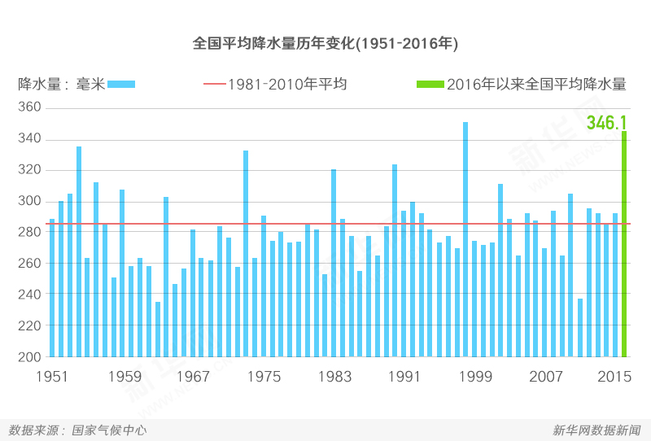
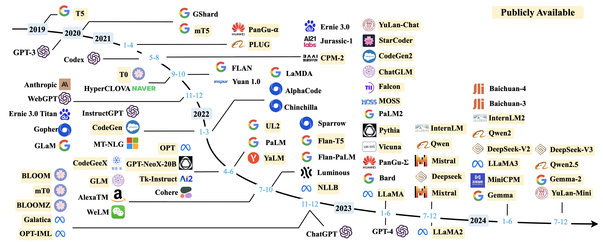

<!-- .slide: class="title-slide" id="title" -->

<p class="eyebrow">CS40008.01</p>

# Introduction and Tokenization

<p class="subtitle">Lecture 01 – Introduction to NLP &amp; LLMs</p>

<p class="byline">Baojian Zhou<br>School of Data Science<br>Fudan University<br>September 9, 2026</p>

Note:
Ask students how they think a model represents a Chinese sentence.

---

<!-- .slide: id="about-me" -->

## About me

<div class="columns columns-wide-left">
<div>
<p><strong>Email:</strong> <a href="mailto:bjzhou@fudan.edu.cn">bjzhou@fudan.edu.cn</a></p>
<p><strong>Course website:</strong> <a href="https://baojian.github.io/llm-26-fall/">baojian.github.io/llm-26-fall/</a></p>
<p><strong>Course GitHub:</strong> <a href="https://github.com/baojian/llm-26-fall">github.com/baojian/llm-26-fall</a></p>
<p><strong>Office:</strong> Francis and Rose Yuen Campus, C611</p>
<p><strong>Office hours:</strong> Mon. 14:00–15:30</p>
</div>
<div>
<p class="caption">Scan to join the WeChat group</p>
<a href="assets/llm-26-fall-wechat.png"></a>
</div>
</div>

Note:
Introduce yourself and invite students to office hours. Allow students to scan the course WeChat QR code on the right; clicking the image opens its full-size original. The instructor supplied this unchanged image on September 8, 2026; it states that the invitation is valid before September 15. Contact details: Fudan Spring Lecture 01, https://baojian.github.io/llm-26/slides/lecture-01-slides/index.html#/1. Office hours and course links: the Fall 2026 course page, ../../index.html.

---

<!-- .slide: class="outline-slide" id="outline-overview" -->

## Outline

<ul class="outline-topics">
<li aria-current="step">Course Overview</li>
<li>Development of NLP &amp; LLMs</li>
<li>Basics for Text Preprocessing</li>
<li>Text Tokenization</li>
</ul>

Note:
Period 1, minutes 0–25: course overview. Read the four topics once. There are three 45-minute teaching periods, with breaks outside the 135 minutes. Return to this outline at each transition. Source: the four-part structure in Fudan Spring Lecture 01, https://baojian.github.io/llm-26/slides/lecture-01-slides/.

---

<!-- .slide: id="nlp-and-llms" -->

## NLP, LLMs, and this course

**Natural language processing (NLP):** computational methods for analyzing and generating human language.

**Large language models (LLMs):** large neural models that learn patterns of language from text and support many NLP tasks.

**This course:** understand how language models work, build small models, and evaluate them through controlled experiments.

Note:
Introduce NLP as the field and LLMs as a family of models used within it. NLP includes tasks such as translation, classification, and question answering. An LLM is one component of an application; we will distinguish the model, tools, and interface in the examples. Start with this course-wide purpose before introducing today's tokenization goals. Background: Jurafsky and Martin, Chapter 1 introduction and Section 1.1, https://web.stanford.edu/~jurafsky/slp3/1.pdf (August 19, 2026 draft). Course scope and learning approach: ../../index.html#overview.

---

<!-- .slide: id="course-logic" -->

## How the course fits together

| Step | What we study |
| :--- | :--- |
| Represent text | Tokens and embeddings |
| Build language models | Probability, attention, and Transformers |
| Train within a budget | Data quality, optimization, and compute |
| Evaluate and apply | Controlled comparisons, adaptation, and retrieval |

For each idea: **understand it → implement it → test it**.

Note:
Explain why the topics build on one another: models need numerical text representations; training needs data and compute; useful applications need evaluation. Evaluation is a habit throughout the course, not only a final stage. The weekly schedule develops these ideas into fine-tuning, alignment, retrieval, and efficient inference. We use small systems to make mechanisms inspectable, and each student investigates one meaningful question through the individual project. Course roadmap: ../../index.html#schedule; learning approach: ../../index.html#overview.

---

<!-- .slide: id="course-topics" -->

## What we will cover

**Foundations:** text preprocessing and tokenization; n-gram models; word embeddings; neural language models; RNNs; self-attention; Transformers.

**Training and evaluation:** pretraining and fine-tuning; data quality; compute budgets; evaluation and benchmarking.

**Applications and frontiers:** prompting and in-context learning; alignment and safety; retrieval; efficient inference; diffusion language models; reasoning and agents.

See the [weekly schedule](../../index.html#schedule) for the sequence and practical work.

Note:
Adapted from Spring Lecture 01 slide 15: https://baojian.github.io/llm-26/slides/lecture-01-slides/index.html#/15. The Fall schedule defines actual scope and timing: ../../index.html#schedule. Word2vec supplies an embedding example; RNN/LSTM modeling provides brief motivation for attention. Data, compute, retrieval, and experimental design are explicit parts of the Fall course. This topic map gives concrete subjects for the preceding course-logic slide. Spend about 45 seconds on the map; students can revisit the weekly schedule after class.

---

<!-- .slide: id="beyond-course" -->

## More materials beyond this course

**Books:** [Speech and Language Processing](https://web.stanford.edu/~jurafsky/slp3/); [Foundations of Large Language Models](https://arxiv.org/abs/2501.09223); [Introduction to NLP (Eisenstein)](https://mitpress.mit.edu/9780262042840/introduction-to-natural-language-processing/); [Introduction to NLP (Zhang, Gui & Huang)](https://intro-nlp.github.io/).

**Courses:** Stanford [CS336](https://cs336.stanford.edu/) and [CS224N](https://web.stanford.edu/class/cs224n/); [CMU 11-711](https://cmu-l3.github.io/anlp-fall2025/); [UMass CS685](https://people.cs.umass.edu/~miyyer/cs685/); [Princeton COS 484](https://princeton-nlp.github.io/cos484/); [Stanford CS124](https://web.stanford.edu/class/cs124/); Karpathy’s [Neural Networks: Zero to Hero](https://karpathy.ai/zero-to-hero.html).

**Research:** NLP: ACL, EMNLP, NAACL, EACL, COLING ([ACL Anthology](https://aclanthology.org/)); ML: NeurIPS, ICML, ICLR; IR: SIGIR, WWW, WSDM, CIKM; data mining: KDD.

Choose **one book and one course** for optional study alongside our materials.

Note:
Adapted from Spring Lecture 01 slide 16: https://baojian.github.io/llm-26/slides/lecture-01-slides/index.html#/16. This preserves the source's four books, seven courses, and research-community inventory. Book authors: Dan Jurafsky and James H. Martin; Tong Xiao and Jingbo Zhu; Jacob Eisenstein; Qi Zhang, Tao Gui, and Xuanjing Huang. Eisenstein's published book is Introduction to Natural Language Processing (2019), per MIT Press; the earlier slide labels a 2018 version. Course emphases: CS336 builds language models; CS224N covers deep learning for NLP; CMU 11-711 and UMass CS685 cover advanced NLP; Princeton COS 484 covers NLP; CS124 connects language and information; Zero to Hero develops neural-network implementations. These are optional companions, not additional required courses. Encourage students to follow a small selection and use research papers or blogs when investigating a specific question.

---

<!-- .slide: id="course-work" -->

## Coursework and Assessment

Build small models and run experiments, and do one course project.

| Assessment | Weight |
| :--- | ---: |
| Quizzes | 10% |
| Assignments | 45% |
| Individual course project | 45% |

A1 is released in **Week 2**. See the [course page](../../index.html#assessment) for details.

Note:
Distinguish today’s ungraded practice from graded assignments. The course website is the source of current assessment rules. Do not import the Stanford workload or the previous semester’s deadlines. Connect small reproducible experiments to the individual project. This is the Fall counterpart of Spring Lecture 01 slide 17, which opens the earlier course page: https://baojian.github.io/llm-26/slides/lecture-01-slides/index.html#/17. The displayed weights and individual project follow ../../index.html#assessment.

---

<!-- .slide: id="course-materials" -->

## Course materials

- [Course website](../../index.html): weekly slides, exercises, readings, and assessment.
- [GitHub repository](https://github.com/baojian/llm-26-fall): source files and updates.
- **Notebook:** open your personal Jupyter copy under `workspace/`.

Fetch course updates before class:

```sh
cd llm-26-fall
git pull
```

Note:
Adapted from Spring Lecture 01 slide 18 with the Fall repository and URLs: https://baojian.github.io/llm-26/slides/lecture-01-slides/index.html#/18. From the repository root, run uv sync and uv run python scripts/slides.py serve for local slides and notebook integration. The course website links materials as they become available. Existing personal notebook answers are preserved when course files change; to obtain a revised handout, rename the old personal notebook and reopen Notebook. Keep the renamed file for earlier work. Point out these locations now; do setup and troubleshooting after class.

---

<!-- .slide: id="learning-strategy" -->

## How to learn this course effectively

- **Linear algebra:** vectors, matrices, and tensor shapes.
- **Probability and ML:** distributions, losses, and optimization.
- **Python:** practice with NumPy, PyTorch, and Transformers.
- **Communication:** explain evidence and decisions in your individual work.

**Read → implement → experiment → explain.**

Practice regularly. Verify results and investigate failures.

Note:
Adapted from Spring Lecture 01 slide 19: https://baojian.github.io/llm-26/slides/lecture-01-slides/index.html#/19. Connect prerequisites to the next experiment: inspect the tensor or text representation, implement a small case, change one factor, and explain the result. Fall prerequisites and learning expectations are in ../../index.html#overview. Fall projects are individual written submissions, so communication means clear experimental records and explanations rather than the Spring team's presentation requirement. The course AI policy permits assistance in practical work while requiring students to verify results and explain their decisions; use ../../index.html#policies for the full policy.

---

<!-- .slide: id="survey" -->

## The LLM apps you use

Which apps do you use most in everyday life?

Choose **at most two** in the [first-lecture survey](https://github.com/baojian/llm-26-fall/issues/6).

Submit your response through one pull request, following the issue’s guide.

> What do you usually ask these apps to do?

Note:
Take two or three examples aloud. Explain that an app may combine a model, search, tools, and an interface. Introduce the GitHub workflow here; students can finish the PR after class. Do not spend the period debugging individual accounts.

---

<!-- .slide: id="app-model-tokenizer" -->

## App, model, tokenizer

| Component | In our local experiment |
| :--- | :--- |
| Interface | A Jupyter notebook |
| Model runtime | Ollama |
| Model | Qwen3, using an installed model tag |
| Tokenizer | The vocabulary and rules paired with that model |

Our toy tokenizer is a separate learning exercise.

Note:
Ollama serves the model; it is not itself the language model. The tokenizer we train today is not compatible with Qwen’s existing embedding table. A model tag identifies a packaged model; record its digest because tags can change. API source: https://docs.ollama.com/api/tags.

---

<!-- .slide: id="notebook-demo" -->

## Example 01: A Qwen language model

> Fudan University is located in which city? Answer with one word.

**Expected answer:** Shanghai.

**[Example 01 — Open notebook](http://127.0.0.1:8888/lab/workspaces/course-bc5dda9848dbf835/tree/workspace/slides/lecture-01/lecture-01-exercise.ipynb)**

Run the first local-model call.

- Compare installed Qwen model sizes.
- Try the same prompt with thinking off and on.
- Compare the answer, returned thinking, and runtime.

Note:
This restores the original Qwen prompt from https://baojian.github.io/llm-26/slides/lecture-01-slides/index.html#/5. The original selector includes qwen3:0.6b, qwen3:1.7b, and qwen3:4b; use an already installed tag. The first-call cell and optional thinking cell use the city question. Treat returned thinking as model output, not a verified explanation of internal computation. Model runtime depends on local hardware; do not download models during class. API: https://docs.ollama.com/api/generate.

---

<!-- .slide: id="nlp-tasks" -->

## Language and multimodal examples

| Task | Input → output |
| :--- | :--- |
| 1. Sentiment | Camera review → label and explanation |
| 2. Translation | Chinese passage → English passage |
| 3. Article generation | Topic or opening → article |
| 4. Image understanding | Image + question → description |
| 5. Text to image / video | Description → generated visual content |

Note:
Introduce the five numbered task groups, then go directly to Task 1. The following slides stay in this order; text-to-image and text-to-video are both examples of Task 5. The app/model/tokenizer explanation and short Qwen call precede this overview. Model calls run in Notebook; prepared videos play directly in the deck. Text-to-image and text-to-video broaden the examples to multimodal generation rather than text-only LLM tasks. Sources: Fudan Spring Lecture 01, https://baojian.github.io/llm-26/slides/lecture-01-slides/index.html#/5 through #/11.

---

<!-- .slide: class="exercise" id="exercise-01" -->

## Task 1: Sentiment analysis

<p class="exercise-meta">Exercise E01 · 5 minutes · Notebook E01</p>

1. “Nice and compact to carry!”
2. “The camera is small and light; I avoid carrying bulky cameras.”
3. “The camera feels flimsy, plastic, and very light.”

Does “light” mean positive? Predict the labels, then compare with Ollama.

<div class="answer fragment"><p>Expected: positive, positive, negative.</p> <p> The surrounding words change the meaning of “light.”</p></div>

Note:
Allow one minute to label individually, two to run notebook E01, and two to compare. These are shortened versions of the camera reviews in the previous Fudan lecture; the notebook keeps the full review text. The expected labels are human judgments for these examples, not guaranteed model outputs. Discuss any disagreement.

---

<!-- .slide: class="exercise" id="example-translation-stats" -->

## Task 2: Machine translation

<p class="exercise-meta">Exercise E02 · 3 minutes · Notebook E02 · Historical examples</p>

<div class="columns">
<div>
<h3>A: Numbers and dates</h3>
<blockquote><p>Google Translate支持249种语言。日均用户超过2亿人，2016年4月总用户数超过5亿人，每天翻译超过1000亿个单词。</p></blockquote>
</div>
<div>
<h3>B: Definition and prediction</h3>
<blockquote><p>人工智能亦称智械、机器智能，指由人制造出来的机器所表现出来的智能。……常态预测则认为人类的很多职业也逐渐被其取代。</p></blockquote>
</div>
</div>

Translate into English. Check A’s numbers and B’s meaning.

<div class="answer fragment"><p>A: 249 languages; over 200 million daily users; April 2016; over 500 million total users; over 100 billion words per day.</p></div>

Note:
Allow one minute to predict A’s quantities, one to run Notebook E02, and one to compare. Students should write the four English quantities and the date, then identify any changed or omitted information in the model output. One 亿 is 100 million, so 2亿 is 200 million, 5亿 is 500 million, and 1000亿 is 100 billion. Preserve “over,” the daily units, and the April 2016 date attached to total users. If Ollama is unavailable, compare student translations with these checks. A is the full Google Translate passage from the original source; these are historical source statistics, not a current fact sheet. B excerpts the original AI-definition passage, with omissions marked. Both full passages are retained in the notebook’s existing translation cell. Use B as a follow-on comparison if time permits: preserve both the definition of machine intelligence and the final prediction about occupations. Translating that prediction does not establish its truth. Keep the model and decoding settings fixed. Source: https://baojian.github.io/llm-26/slides/lecture-01-slides/index.html#/7.

---

<!-- .slide: class="reading-comparison" id="example-article-blog" -->

## Task 3: Article generation

<div class="columns">
<div>
<h3>A: Productivity blog</h3>
<p><strong>Feeling unproductive? Maybe you should stop overthinking.</strong></p>
<blockquote><p>In order to get something done, maybe we need to think less. Seems counter-intuitive, but I believe sometimes our thoughts can get in the way of the creative process. We can work better at times when we "tune out" the external world and focus on what's in front of us. I've been thinking about this lately, so I thought it would be good to write an article about it…</p></blockquote>
</div>
<div>
<h3>B: News article</h3>
<p><strong>United Methodists Agree to Historic Split</strong></p>
<blockquote><p>After two days of intense debate, the United Methodist Church has agreed to a historic split — one that is expected to end in the creation of a new denomination, one that will be “theologically and socially conservative,” according to The Washington Post. The majority of delegates attending the church‘s annual General Conference in May voted to strengthen a ban on the ordination of LGBTQ clergy and to write new rules that will “discipline” clergy who officiate at same-sex weddings. But those who opposed these measures have a new plan…</p></blockquote>
</div>
</div>

Who wrote each article: **human or machine**?

<div class="answer fragment"><p>The original deck attributes <strong>both examples to GPT-3</strong>.</p></div>

Note:
The complete source excerpts and the authorship poll share this slide; the terminal ellipses are present in the original material. Give students about 30 seconds to label A and B independently as human or machine, then reveal the original deck’s attribution: both examples are attributed to GPT-3. The four possible combinations are human/human, machine/human, human/machine, and machine/machine. Fluent writing alone does not establish authorship or factual accuracy. This attribution comes from the source teaching material; these samples were not generated in the current notebook session. B is a historical generation example, not verified reporting or a current news update. Distinguish this classroom poll from graded quizzes and E01–E06. The notebook’s Article generation section contains the same complete excerpts and an optional generation prompt. Source: https://baojian.github.io/llm-26/slides/lecture-01-slides/index.html#/8.

---

<!-- .slide: id="example-vision-rainfall" -->

## Task 4: Image understanding

<div class="columns">
<div>

</div>
<div>
<p><strong>Prompt:</strong> Describe the image in one paragraph.</p>
<p>What do the axes, red line, and green bar represent?</p>
<p><a href="assets/vision-rainfall.jpg" target="_blank" rel="noopener">Open the full-size image</a>, then use <strong>vision-rainfall.jpg</strong> in Notebook.</p>
</div>
</div>

Note:
Restore the original rainfall-chart image. Its embedded credits name the National Climate Center and Xinhuanet; the title refers to precipitation over 1951–2016. The green bar is labeled 346.1 mm; the red reference is labeled the 1981–2010 average. Do not infer missing dates or measurement periods beyond the image. The model must read labels and relate them to marks, not merely describe colors. Use an installed vision-capable model. Source: https://baojian.github.io/llm-26/slides/lecture-01-slides/index.html#/9; media provenance: assets/README.md.

---

<!-- .slide: id="example-vision-big-data" -->

## Task 4: Describe a different image

<div class="columns">
<div>

</div>
<div>
<p><strong>Prompt:</strong> Describe the image in one paragraph.</p>
<p>Separate visible content from inferred meaning.</p>
<p>Use <strong>vision-big-data.png</strong> in Notebook with the same model and prompt.</p>
</div>
</div>

Note:
The second original image is a Big Data concept illustration rather than a measured chart. Ask what evidence is visible: a central label, surrounding logos, and connecting lines. A logo arrangement does not by itself establish data sharing or a commercial relationship. Source: https://baojian.github.io/llm-26/slides/lecture-01-slides/index.html#/9; media provenance: assets/README.md.

---

<!-- .slide: id="example-text-to-image" -->

## Task 5: Text → image

**Stable Diffusion**

> a watercolor painting of a university campus gate at sunset, people fully clothed, family-friendly

Open Notebook's optional **Text → image: Stable Diffusion** section.

Keep the prompt fixed; change the seed and compare the images.

<p class="caption">Original demonstration settings: 30 steps and guidance scale 7.5.</p>

Note:
Restore the exact prompt from the original sd-demo.html iframe, which uses Stable Diffusion 1.5. The optional notebook cell uses an already prepared local checkpoint and does not download model weights. Prepare the multimodal packages and checkpoint before class; image generation is optional. Identify generated images as model outputs and compare whether each one follows the prompt. Source: https://baojian.github.io/llm-26/slides/lecture-01-slides/index.html#/10 and https://baojian.github.io/llm-26/slides/lecture-01-slides/sd-demo.html.

---

<!-- .slide: id="example-video-antarctica" -->

## Task 5: Text → video — Antarctica

**Prompt:** an old man wearing blue jeans and a white T-shirt taking a pleasant stroll in Antarctica during a winter storm

<video class="animation" src="assets/text-to-video-antarctica.mp4" poster="assets/text-to-video-antarctica-poster.jpg" controls playsinline preload="metadata" aria-label="Original generated video example of a man walking through snow in Antarctica."></video>

<p class="caption">Play the clip. Compare clothing, walking motion, and weather with the prompt.</p>

Note:
This is the original locally hosted clip, not a newly generated output. Playback is manual and stops when leaving the slide. The poster is a frame extracted at one second for print and before playback. Ask students to identify one matching detail and one limitation; do not infer an actual filmed location. Original prompt and clip: https://baojian.github.io/llm-26/slides/lecture-01-slides/index.html#/11. Model attribution was not supplied in that source, so none is added. Media provenance: assets/README.md.

---

<!-- .slide: id="example-video-johannesburg" -->

## Task 5: Text → video — Johannesburg

**Prompt:** a woman wearing purple overalls and cowboy boots taking a pleasant stroll in Johannesburg South Africa during a beautiful sunset

<video class="animation" src="assets/text-to-video-johannesburg.mp4" poster="assets/text-to-video-johannesburg-poster.jpg" controls playsinline preload="metadata" aria-label="Original generated video example of a woman walking outdoors at sunset."></video>

<p class="caption">Play the clip. Compare the person, clothing, setting, and lighting with the prompt.</p>

Note:
This is the second original locally hosted clip. Compare the same action in another requested setting. A plausible-looking scene does not verify a real location. Playback is manual; the poster is extracted at one second and appears in print. Original prompt and clip: https://baojian.github.io/llm-26/slides/lecture-01-slides/index.html#/11. Media provenance: assets/README.md.

---

<!-- .slide: id="goals" -->

## From examples to today’s goals

How does an LLM application turn our text into something a model can predict?

- Call a local model and examine its answers.
- Explain the difference between characters, bytes, and tokens.
- Train a small BPE tokenizer and test it on unseen text.

Note:
Close Course Overview by connecting the examples to the technical lesson. We have called a model and inspected outputs; now ask how text becomes model input. Invite one hypothesis before giving the vocabulary. The development section explains how these models emerged, followed by text preprocessing and tokenizer construction. The core tokenizer needs only Python’s standard library.

---

<!-- .slide: class="outline-slide" id="outline-development" -->

## Outline

<ul class="outline-topics">
<li>Course Overview</li>
<li aria-current="step">Development of NLP &amp; LLMs</li>
<li>Basics for Text Preprocessing</li>
<li>Text Tokenization</li>
</ul>

Note:
Period 1, minutes 25–45. Ten content slides: language difficulties, historical development, then the modeling and resource perspective from CS336. Allow thirteen minutes for the first seven and seven minutes for the final three. This section transition preserves the four topics and active Development of NLP & LLMs section from Spring Lecture 01 slide 20: https://baojian.github.io/llm-26/slides/lecture-01-slides/index.html#/20.

---

<!-- .slide: id="language-ambiguity" -->

## Why language is difficult: ambiguity

| Example | What must we resolve? |
| :--- | :--- |
| A man saw a boy **with a telescope**. | Who had the telescope? |
| What does **Mighty Dragon** mean? | Which referent does the context support? |
| He has **quit smoking**. | What does this imply about the past? |
| 冬天，能穿多少穿多少；<br>夏天，能穿多少穿多少。 | Why do the instructions differ? |

LLMs also need context to resolve these examples.

Note:
Restores the examples from Spring slide 21: https://baojian.github.io/llm-26/slides/lecture-01-slides/index.html#/21. Telescope attachment illustrates syntax; Mighty Dragon needs referential context, so do not assign one meaning without a scenario. “Quit smoking” normally presupposes earlier smoking. The winter instruction means wear as much as possible; the summer instruction means wear as little as possible. These difficulties did not disappear with LLMs. Ask for one interpretation before advancing; this is discussion, not an additional timed exercise.

---

<!-- .slide: id="language-messy" -->

## Messy text and reasoning

<div class="columns">
<div>
<h3>Language varies</h3>
<p>“Were SOO PROUD … U taught us 2 #neversaynever”</p>
<p>Spelling, hashtags, emojis, code-switching, and word boundaries.</p>
<p>“break a leg” · “unfriend” · “鸡娃”</p>
</div>
<div>
<h3>A reasoning trap</h3>
<p>A penny is better than nothing.</p>
<p>Nothing is better than world peace.</p>
<p>Therefore, a penny is better than world peace?</p>
</div>
</div>

<div class="answer fragment"><p>“Nothing” changes meaning between the two premises.</p></div>

Note:
Adapted from Spring slide 22: https://baojian.github.io/llm-26/slides/lecture-01-slides/index.html#/22. The social-media quotation is an excerpt, preserving its nonstandard spelling. Discuss segmentation when spaces do not mark words, figurative meanings, and new vocabulary. In the first premise “nothing” refers to having no money; in the second it means no thing exceeds world peace. The apparent syllogism equivocates rather than proving a comparison. Keep these challenges relevant to current models, without claiming that an untested model fails every example.

---

<!-- .slide: id="early-nlp" -->

## Early NLP: translation and intelligence

**1947 → 1949 · Warren Weaver**

Proposed machine translation through a decoding analogy; developed the idea in his 1949 memorandum.

**1950 · Alan Turing**

Reframed the question of machine intelligence using a text-based imitation game.

Two enduring questions: **Can machines transform language? Can they use it convincingly?**

Note:
Adapted from Spring slide 23: https://baojian.github.io/llm-26/slides/lecture-01-slides/index.html#/23. Distinguish Weaver's March 1947 letter to Norbert Wiener from the July 1949 “Translation” memorandum that quotes that letter. The decoding analogy motivates a research question, not a sufficient translation algorithm. Weaver source: “Translation,” July 15, 1949, pp. 5–6 and 13, https://mt-archive.net/Weaver-1949.pdf. Turing, “Computing Machinery and Intelligence,” Mind 59(236), 1950, Sections 1–2: https://doi.org/10.1093/mind/LIX.236.433. The next slide uses the familiar machine-versus-human adaptation of the imitation game; it is not the complete original setup.

---

<!-- .slide: id="turing-test" -->

## The Turing test: judging conversation

| Participant | Role in a simplified version |
| :--- | :--- |
| A: Machine | Answer questions through text |
| B: Human | Answer through the same channel |
| C: Judge | Try to distinguish A from B |

**Judge:** Add 34,957 to 70,764.

**Turing’s example reply:** 105,621. **Correct sum:** 105,721.

Human-like conversation and reliable task performance require different evidence.

Note:
Adapted from Spring slide 24: https://baojian.github.io/llm-26/slides/lecture-01-slides/index.html#/24 and Turing 1950, Sections 1–2, https://doi.org/10.1093/mind/LIX.236.433. Turing's examples include refusing a sonnet request and deliberately giving 105621 for 34957 + 70764; the correct sum is 105721. This illustrates imitation, not a target for mathematical accuracy. Results depend on the judge, participants, instructions, and duration. Do not treat a conversational test as proof of general intelligence or consciousness. Connect this to the earlier human-or-machine article quiz.

---

<!-- .slide: id="development" -->

## From rules to learned representations

| Period or landmark | Main idea |
| :--- | :--- |
| 1970s–1980s | Handcrafted rules and knowledge |
| 1990s | Learn statistical models from corpora |
| LSTM, 1997 | Learn recurrent memory for sequences |
| Neural language model, 2003 | Learn word vectors and probabilities together |
| Word2vec, 2013 | Learn useful word representations |
| Sequence-to-sequence, 2014 | Learn to map one sequence to another |

Note:
Condenses Spring slide 25 into readable landmarks: https://baojian.github.io/llm-26/slides/lecture-01-slides/index.html#/25. The source figure extends beyond its 1970–2017 title and has an LSTM date/label error; this table corrects LSTM to 1997 and leaves the Transformer to the next slide. Approaches overlap and continue to coexist. The dates mark selected papers, not inventions of entire fields. Hochreiter and Schmidhuber, “Long Short-Term Memory,” 1997, https://doi.org/10.1162/neco.1997.9.8.1735; Bengio et al. 2003, https://www.jmlr.org/papers/v3/bengio03a.html; Mikolov et al. 2013, https://arxiv.org/abs/1301.3781; Sutskever et al. 2014, https://arxiv.org/abs/1409.3215. CS336 Lecture 1, current_lm_landscape(), reviews these neural ingredients. Reconnect rules, feature learning, and representations to the earlier sentiment task.

---

<!-- .slide: id="milestones" -->

## Transformers and pretrained models

<div class="columns">
<div>
<a href="assets/transformer-architecture.png" target="_blank" rel="noopener"></a>
</div>
<div>
<p><strong>2017 · Transformer</strong><br>Attention-based sequence modeling.</p>
<p><strong>2018 · BERT and GPT</strong><br>Pretrain on text, then adapt to tasks.</p>
<p><strong>2020 · GPT-3</strong><br>Specify tasks using examples in the prompt.</p>
</div>
</div>

<p class="caption">Left: original encoder–decoder Transformer. Fine-tuning updates weights; prompting supplies context.</p>

Note:
Adapts Spring slide 26 and CS336 Lecture 1, current_lm_landscape() and why_this_course_exists(). The original Transformer figure is an encoder–decoder, not a diagram of a decoder-only GPT model. Explain only the shift toward attention and reusable pretraining; students do not need to parse every block yet. The Spring deck's authors photograph is from GTC 2024, so it is not used as a 2017 event image. Vaswani et al. 2017, Figure 1, https://arxiv.org/abs/1706.03762; Devlin et al., BERT preprint 2018 (published 2019), https://arxiv.org/abs/1810.04805; Radford et al. 2018, https://cdn.openai.com/research-covers/language-unsupervised/language_understanding_paper.pdf; Brown et al. 2020, https://arxiv.org/abs/2005.14165. In-context examples do not update weights. Figure copied from the Spring asset; see assets/README.md.

---

<!-- .slide: id="llm-landscape" -->

## LLM development: a historical snapshot



Access to weights does not imply access to training code and data.

<p class="caption">Survey timeline, 2019–2024 (2025 revision). <a href="assets/llm-timeline-2019-2024.png" target="_blank" rel="noopener">Open the full-size figure</a>.</p>

Note:
Restores the actual figure from Spring slide 27: https://baojian.github.io/llm-26/slides/lecture-01-slides/index.html#/27. The survey was first released in 2023, but this revised figure reaches 2024; do not label it a current 2026 inventory or a genealogy of weight inheritance. Source: Zhao et al., “A Survey of Large Language Models,” v16 (March 11, 2025), Figure 3, https://arxiv.org/html/2303.18223v16#S2.F3. The figure selects models above 10B parameters and dates mainly by paper release or otherwise earliest announcement. Use only three anchors in class: GPT-3/in-context learning, ChatGPT/conversational use, and the expanding set of available model families. The original color key says “Publicly Available”; it does not establish that every training artifact is open. CS336 Lecture 1, current_lm_landscape(), distinguishes weights plus paper from code and data that enable reproduction. That distinction is the takeaway; students need not memorize the timeline's small labels.

---

<!-- .slide: id="next-token" -->

## A language model predicts the next token

Prompt: “Fudan University is located in …”

The model assigns probabilities to possible **next tokens**.

$$p_\theta(t_1,\ldots,t_L)=\prod_{i=1}^{L}p_\theta(t_i\mid t_{<i})$$

Choose a token, append it, and repeat.

<p id="prediction-limits">A likely continuation can still be factually wrong.</p>

Note:
CS336 Lecture 1, intro_to_tokenization(), lines 579–588 of the local lecture_01.py, https://cs336.stanford.edu/lectures/?trace=lecture_01, defines a language model as a distribution over token sequences. The equation here develops that definition using the probability chain rule. This equation is the autoregressive factorization, not an assumption that tokens are independent; theta denotes learned parameters. “Shanghai” is an intended answer, but do not claim it is one token without inspecting the tokenizer. Generation is one use of a language model, not the definition of all NLP systems. Prompting changes the context, fine-tuning changes weights, and a tool-using agent wraps the model in a larger system. Preserve the earlier prediction/correctness lesson: test a held-out set with expected answers; neither probabilities nor generated thinking are guarantees of correctness. The optional notebook log-probability experiment connects the equation to actual outputs.

---

<!-- .slide: id="training-pipeline" -->

## Understand language models by building

| Component | What we choose or implement |
| :--- | :--- |
| Data | Training text and a separate evaluation set |
| Tokenizer | Convert text into a sequence of token IDs |
| Architecture | Map context to next-token probabilities |
| Training | Compute loss and update model parameters |
| Evaluation | Measure held-out loss and task behavior |

Today: build the tokenizer. Later: build and train the model.

Note:
Adapted from CS336 Spring 2026 Lecture 1, why_this_course_exists(), basics(), and its assignment-1 overview. Local source: stanford-cs336-lectures/lecture_01.py, lines 265–316, file revision 607a238629cf5332f71085d19c97dff41decf661: https://github.com/stanford-cs336/lectures/blob/607a238629cf5332f71085d19c97dff41decf661/lecture_01.py#L265-L316. Tokenizer training learns vocabulary and segmentation rules; model training learns numerical parameters. Held-out text belongs in neither training stage. CS336's useful method is implementing components and measuring their behavior; its assignment hardware, leaderboard, and grading rules do not apply to our course.

---

<!-- .slide: id="resource-budget" -->

## Working within a compute budget

**Given fixed resources, which choices improve model quality?**

| Choice | What it changes |
| :--- | :--- |
| Model size | Capacity, memory, and computation |
| Training data | Coverage, quality, and training cost |
| Tokenizer | Sequence length and vocabulary size |

Compare alternatives under the same budget and evaluation.

Today’s question: **How should we represent text efficiently?**

Note:
Source: CS336 Lecture 1, why_this_course_exists() and course_syllabus(), especially lines 115–123 and 242–251 of https://github.com/stanford-cs336/lectures/blob/607a238629cf5332f71085d19c97dff41decf661/lecture_01.py#L242-L251. The budget includes data, compute, memory, and communication; deployment also adds latency constraints. Larger models or more data alone are not a complete recipe. Balance expressivity, training stability, and efficiency. Our laptop experiments teach mechanics and measurement; their winning settings may not transfer to frontier scale. Today we measure vocabulary size, tokens for fixed text, and lossless round trips. Better compression alone does not establish better model quality. Pause for the first break; preprocessing begins the next period.

---

<!-- .slide: class="outline-slide" id="outline-preprocessing" -->

## Outline

<ul class="outline-topics">
<li>Course Overview</li>
<li>Development of NLP &amp; LLMs</li>
<li aria-current="step">Basics for Text Preprocessing</li>
<li>Text Tokenization</li>
</ul>

Note:
Period 2, minutes 0–20: Unicode, UTF-8, and preserving the input. Python basics are prerequisites; this is not a full regex tutorial.

---

<!-- .slide: id="preprocessing" -->

## Preserve the text you intend to model

```python
text = "Hello,  世界!\n🙂"
print(repr(text))
print(repr(text.lower().strip()))
```

Spaces, punctuation, capitalization, and line breaks can carry information.

Choose normalization deliberately and document it.

Note:
There are two spaces after the comma and a newline before the emoji. Lowercasing changes H to h; strip only removes whitespace at the ends, not the internal spaces or newline. A lossless tokenizer should round-trip its input. A normalizing tokenizer may only recover the normalized input. Python Unicode HOWTO: https://docs.python.org/3/howto/unicode.html.

---

<!-- .slide: id="bytes" -->

## Code points and UTF-8 bytes

<div class="columns">
<div>
<h3>Different measurements</h3>
<p>A Unicode code point identifies a character value.</p>
<p>UTF-8 encodes that value using one or more bytes.</p>
</div>
<div>
<table>
<thead><tr><th>Text</th><th class="num">Code points</th><th class="num">Bytes</th></tr></thead>
<tbody>
<tr><td><code>hello</code></td><td class="num">5</td><td class="num">5</td></tr>
<tr><td><code>你好</code></td><td class="num">2</td><td class="num">6</td></tr>
<tr><td><code>🙂</code></td><td class="num">1</td><td class="num">4</td></tr>
</tbody>
</table>
</div>
</div>

<p class="source">These counts use the exact strings shown. A visible symbol can contain multiple code points.</p>

Note:
Python len counts code points for these strings. JavaScript string.length counts UTF-16 code units, so the live demonstration uses Array.from.

---

<!-- .slide: id="code" -->

## Measuring the same text in Python

```python
examples = ["hello", "你好", "🙂"]

for text in examples:
    code_points = len(text)
    utf8_bytes = len(text.encode("utf-8"))
    print(text, code_points, utf8_bytes)
```

Predict each line before running the cell in the notebook.

Note:
The notebook contains this exact example. Pause before showing the output.

---

<!-- .slide: id="browser-demo" -->

## Exploring the counts

<form class="demo-form" id="utf8-demo">
<label for="demo-text">Try English, Chinese, or emoji</label>
<input id="demo-text" type="text" value="你好🙂" maxlength="48" autocomplete="off" spellcheck="false">
<button type="button" id="demo-reset">Reset example</button>
</form>

<div class="demo-result" aria-live="polite">
<p><strong id="point-count">3</strong> Unicode code points</p>
<p><strong id="byte-count">10</strong> UTF-8 bytes</p>
</div>

<p class="caption">Try a space, a line of digits, or an accented letter. Explain each change.</p>

Note:
This demonstration runs entirely in the browser. Input stays on this page.
For a decomposed accent, compare the precomposed é with e followed by a combining acute accent.

---

<!-- .slide: class="exercise" id="exercise-02" -->

## Same appearance, different strings

<p class="exercise-meta">Exercise E03 · 3 minutes · Notebook E03</p>

Compare <code>"é"</code>, <code>"e\u0301"</code>, and <code>"你好🙂"</code>.

Predict the code-point and UTF-8 byte counts. Check the round trip.

<div class="answer fragment"><p>Counts: 1 / 2, 2 / 3, and 3 / 10.<br>The two accented strings look alike but are not equal.</p></div>

Note:
The second displayed string contains e followed by U+0301 COMBINING ACUTE ACCENT. Python len counts two code points; UTF-8 uses three bytes. NFC normalization makes the two accented strings equal but changes the original code-point sequence. Let students predict first, then run E03.

---

<!-- .slide: id="byte-roundtrip" -->

## A complete UTF-8 round trip

```python
text = "你好🙂"
ids = list(text.encode("utf-8"))
restored = bytes(ids).decode("utf-8")
assert restored == text
```

A token may contain only part of a UTF-8 character.

Join the token bytes **before** decoding the full text.

Note:
A byte has 256 possible values. A single byte from 你 is not valid UTF-8 by itself; strict decoding should fail instead of silently replacing it. The notebook demonstrates that failure and the successful full round trip. Source: Python Unicode HOWTO and CS336 Lecture 1 byte tokenizer.

---

<!-- .slide: class="outline-slide" id="outline-tokenization" -->

## Outline

<ul class="outline-topics">
<li>Course Overview</li>
<li>Development of NLP &amp; LLMs</li>
<li>Basics for Text Preprocessing</li>
<li aria-current="step">Text Tokenization</li>
</ul>

Note:
Period 2, minutes 20–45: representation choices and the first two merges. Reserve four minutes for E04. Continue with encoding and experiments after the break.

---

<!-- .slide: id="representation" -->

## Text representation

A tokenizer maps text to a sequence of token IDs.

The model reads those IDs through an embedding table.

> The tokenizer defines which pieces of text share a vocabulary entry.

Note:
Distinguish a tokenizer from the model that uses it. A token ID has meaning only within its tokenizer's vocabulary.

---

<!-- .slide: id="tokenizer-choices" -->

## Choosing the basic unit

| Unit | Benefit | Limitation |
| :--- | :--- | :--- |
| Word | Familiar units | Unseen words; segmentation choices |
| Code point | Simple character representation | Large alphabet; rare characters |
| Byte | Only 256 base entries | Long sequences |
| Learned subword | Frequent pieces become short | Depends on training data and rules |

Note:
Adapted from CS336 Lecture 1 character, byte, word, and BPE comparisons. A learned character vocabulary can have unknown characters; directly using Unicode scalar values avoids that but yields a sparse ID space. Chinese words are not reliably separated by spaces. BPE is one way to learn subwords, not the only algorithm.

---

<!-- .slide: id="bpe" -->

## Byte pair encoding

1. Begin with small units: bytes in our implementation.
2. Count adjacent token pairs in the training corpus.
3. Add the most frequent pair as one new vocabulary entry.
4. Replace its occurrences and repeat.

Save the **ordered merges** and the **vocabulary**.

Note:
Adapted from CS336 Lecture 1 and Sennrich et al. 2016 Section 3.2, ../../papers/sennrich-2016-subword-units.pdf. Our byte vocabulary differs from the character-based, word-boundary-aware algorithm in the paper. No merges cross our input-sequence boundaries. Stop when the merge budget is reached or no pair remains.

---

<!-- .slide: id="worked-example" -->

## A toy training corpus

| Initial sequence | Frequency |
| :--- | ---: |
| `l o w` | 5 |
| `l o w e r` | 2 |

The pairs `l o` and `o w` each occur 7 times.

<div class="fragment">
<p>Choose <code>l o</code> to break this tie. The next merge combines <code>lo w</code>.</p>
</div>

<p class="caption">Count pairs inside each word. Weight the counts by word frequency.</p>

Note:
This is a toy character-based example with no end-of-word symbol. State these choices explicitly.
Different tie-breaking choices can lead to different learned merges.

---

<!-- .slide: id="pair-counts" -->

## Count the pairs, including frequency

| Pair | In `low` × 5 | In `lower` × 2 | Total |
| :--- | ---: | ---: | ---: |
| `l o` | 5 | 2 | 7 |
| `o w` | 5 | 2 | 7 |
| `w e` | 0 | 2 | 2 |
| `e r` | 0 | 2 | 2 |

Tie rule: choose the smallest pair of token IDs.

Note:
ASCII base IDs are l=108, o=111, w=119, e=101, r=114. The maximum count is seven; (108,111) wins over (111,119). Break only the tied maximum, not all pairs. Deterministic ties make the lesson reproducible; production implementations may choose a different rule.

---

<!-- .slide: class="exercise" id="exercise-03" -->

## Counting overlaps; applying a merge

<p class="exercise-meta">Exercise E04 · 4 minutes · Notebook E04</p>

| Initial sequence | Frequency |
| :--- | ---: |
| `a a a b` | 2 |
| `a b` | 1 |

Which pair wins? How many tokens does one merge remove?

<div class="answer fragment"><p><code>a a</code>: 4 occurrences; <code>a b</code>: 3.<br>Replace left to right: <code>aa a b</code>. Total tokens: 10 → 8.</p></div>

Note:
One minute count, one minute propose replacements, two minutes check in the notebook. Pair counts include overlapping aa positions, but replacements cannot share an a. The winning count of four does not mean four replacements: only two across the weighted corpus. Expected E04 output is 10 then 8.

---

<!-- .slide: id="results" -->

## Sequence length after two merges

| Stage | Sequence for `low` | Sequence for `lower` | Total tokens |
| :--- | :--- | :--- | ---: |
| Initial | `l o w` | `l o w e r` | 25 |
| Merge `l o` | `lo w` | `lo w e r` | 18 |
| Merge `lo w` | `low` | `low e r` | 11 |

<p class="caption">Totals weight <code>low</code> by 5 and <code>lower</code> by 2.</p>

This example measures sequence length on the training corpus.

Note:
Verify the totals as 5*3+2*5, 5*2+2*4, and 5*1+2*3.
Ask what additional evidence would be needed to assess a tokenizer on unseen text.

---

<!-- .slide: id="interactive-results" -->

## Two merges: 25 → 11 tokens

<div class="plot" data-plotly="assets/sequence-length.json" role="img" aria-label="Toy corpus total tokens decrease from 25 to 18 to 11 after zero, one, and two merges."></div>

<p class="caption">The same toy corpus: <code>low</code> × 5 and <code>lower</code> × 2. Hover for exact counts.</p>

Note:
The chart loads automatically from a local Plotly specification. It plots the checked totals from the previous table, not model benchmark results. Drag to zoom; double-click to reset.

---

<!-- .slide: id="learned-vocabulary" -->

## The learned vocabulary

| Token ID | Stored bytes | Learned from |
| :--- | :--- | :--- |
| 0–255 | Each possible byte | Initial vocabulary |
| 256 | `b"lo"` | `(108, 111)` |
| 257 | `b"low"` | `(256, 119)` |

After two merges: **258 entries**.

The model would need an embedding for each entry.

Note:
The ASCII toy example is also a byte example, since each character here is one byte. Decoding uses this mapping, not the decimal digits in the token ID. IDs are specific to this tokenizer. Do not substitute these IDs into a pretrained Qwen model. Pause for the second break after this slide.

---

<!-- .slide: class="outline-slide" id="outline-tokenization-period-3" -->

## Outline

<ul class="outline-topics">
<li>Course Overview</li>
<li>Development of NLP &amp; LLMs</li>
<li>Basics for Text Preprocessing</li>
<li aria-current="step">Text Tokenization</li>
</ul>

Note:
Period 3, minutes 0–20: encoding and boundaries. Minutes 20–40: vocabulary tradeoffs and E06. Final five minutes: exit questions and reading.

---

<!-- .slide: id="training-encoding" -->

## Training and encoding

| Training | Encoding a new input |
| :--- | :--- |
| Count pairs in a training corpus | Begin with the input’s bytes |
| Learn the next merge | Apply the saved merges in order |
| Extend the vocabulary | Keep the vocabulary fixed |

Encoding a new prompt does **not** retrain the tokenizer.

Note:
Source: CS336 Lecture 1 BPETokenizer and train_bpe. Our simple implementation scans the whole sequence once per learned merge. Production code uses more efficient structures and may restrict merges with a pre-tokenizer. The conceptual distinction is essential for E05.

---

<!-- .slide: class="exercise" id="exercise-04" -->

## Encode a word we did not train on

<p class="exercise-meta">Exercise E05 · 5 minutes · Notebook E05</p>

Saved merges: **`l o` → `lo`**, then **`lo w` → `low`**.

Encode <code>"lowest"</code>. Then try <code>"你好🙂"</code>.

<div class="answer fragment"><p><code>lowest</code> → <code>[257, 101, 115, 116]</code>.<br>Chinese and emoji still round-trip through the base bytes.</p></div>

Note:
Two minutes trace lowest; three minutes run and inspect both examples. The pieces are low, e, s, t. The Chinese/emoji example has ten byte tokens here because neither learned ASCII pair occurs. No unknown token is needed for a valid UTF-8 string when all 256 base bytes are retained.

---

<!-- .slide: id="merge-order" -->

## Why the merge order matters

Suppose training learned:

1. `b c` → `bc`
2. `a b` → `ab`

Encoding <code>"abc"</code> gives <code>[a, bc]</code>.

It does not choose <code>[ab, c]</code> just because <code>ab</code> starts earlier.

Note:
An independently checkable example: training strings bc repeated three times and ab repeated twice learn bc before ab. At inference the earlier-ranked available merge wins. The notebook constructs this tokenizer and checks its output. Greedy longest-prefix matching is not a general substitute for BPE merge ranks.

---

<!-- .slide: id="boundaries" -->

## Where merges are allowed

Our toy corpus stores each string as a separate sequence.

Production tokenizers may first separate text using rules for spaces, letters, numbers, or punctuation.

> These boundaries can change the tokens, even when two implementations both use BPE.

Keep boundary rules fixed when comparing results.

Note:
Source: CS336 Lecture 1 notes on pre-tokenization and https://github.com/openai/tiktoken. Our learner has no within-string pre-tokenizer: it can learn pieces that include spaces, and it never merges across input strings. The toy low/lower table treats words as separate sequences for transparent counting. Do not describe that as the full production pipeline.

---

<!-- .slide: id="special-tokens" -->

## Text and control tokens

Chat systems also need to represent roles and message boundaries.

- Ordinary text is encoded using the text vocabulary.
- Special tokens can have reserved IDs and defined roles.
- The model’s chat template specifies the expected structure.

Typing a special token’s spelling is not always equivalent to inserting its ID.

Note:
Source: CS336 Lecture 1 special-token discussion and tiktoken README, https://github.com/openai/tiktoken. Our toy BPE only handles ordinary text. Do not invent Qwen chat-token IDs. The optional tiktoken cell uses encode_ordinary so user text is treated literally, including strings that resemble special tokens.

---

<!-- .slide: id="equation" -->

## Average sequence length

For a fixed collection of $N$ texts:

$$
\bar{L} = \frac{1}{N} \sum_{i=1}^{N} \left|\operatorname{encode}(x_i)\right|
$$

Use the same texts when comparing tokenizers.

Report the tokenizer version and any text normalization.

Note:
This is an average per text, so document length affects it. Explain why a comparison must hold the input collection fixed.

---

<!-- .slide: id="vocabulary-cost" -->

## Vocabulary size has a cost

An embedding table with vocabulary size $V$ and width $d$ has $Vd$ entries.

| Toy configuration, $d=1{,}024$ | Embedding entries |
| :--- | ---: |
| $V=32{,}000$ | 32,768,000 |
| $V=64{,}000$ | 65,536,000 |

A larger vocabulary may shorten sequences, but increases this table.

Note:
These are calculated configurations, not measurements of a named model. Values are parameters, not bytes; storage depends on dtype and optimizer state. An untied output head would have additional parameters. Source: CS336 Lecture 1 vocabulary/compression tradeoff.

---

<!-- .slide: id="sequence-cost" -->

## Sequence length also has a cost

For full self-attention, each position can interact with other positions.

$$1{,}000^2=1{,}000{,}000 \qquad 2{,}000^2=4{,}000{,}000$$

Doubling length gives four times as many position pairs.

This illustrates attention during training or prompt processing; total runtime depends on the implementation.

Note:
Toy count of all pairs. Causal attention masks future positions, but its pair count still grows quadratically. Efficient kernels need not materialize a full attention matrix. Cached generation has different per-step behavior, so do not say all inference costs scale as L squared. Source: Vaswani et al. 2017 Section 4, https://arxiv.org/abs/1706.03762.

---

<!-- .slide: class="exercise" id="exercise-05" -->

## Test on held-out English and Chinese

<p class="exercise-meta">Exercise E06 · 8 minutes · Notebook E06</p>

Train toy tokenizers with **0, 8, and 32 merges**.

Use the same held-out sentences each time. Report tokens and UTF-8 bytes per token separately for English and Chinese.

<div class="answer fragment"><p>Every input must round-trip. Compression depends on the corpus; a smaller token count alone does not establish a better language model.</p></div>

Note:
Two minutes inspect the training/held-out split, three minutes run the experiment, three minutes interpret. The notebook supplies small synthetic teaching corpora and an English-only training comparison. Record the actual number of learned merges, which can be below the budget if no pair remains. Ratios aggregate bytes and tokens within each language, not across an imbalanced mix.

---

<!-- .slide: id="heldout-results" -->

## Chinese text after different training

<div class="plot" data-plotly="assets/heldout-chinese.json" role="img" aria-label="On the same held-out Chinese text, mixed training reduces token counts from 54 to 48 to 35 at zero, eight, and thirty-two merges. English-only training leaves the count at 54."></div>

<p class="caption">Two fixed Chinese sentences · 54 UTF-8 bytes · Toy corpora from Notebook E06.</p>

Note:
These values are calculated with the exact training and held-out strings in notebook E06. With mixed English/Chinese training, counts are 54, 48, and 35; English-only training gives 54 throughout. English-only merges contain ASCII bytes that never occur in these Chinese strings. This small controlled demonstration is not a benchmark of real model tokenizers or language quality. Ask students to connect the plot to their own printed results.

---

<!-- .slide: id="comparison" -->

## What belongs in a tokenizer comparison?

| Keep fixed | Report |
| :--- | :--- |
| Input strings and normalization | Vocabulary and implementation |
| Training and held-out split | Token count by language |
| Treatment of spaces and boundaries | UTF-8 bytes per token |
| Ordinary versus special tokens | Exact round-trip results |

Measure downstream model quality separately.

Note:
The notebook also offers an optional comparison of the named cl100k_base and o200k_base encodings. Those are encoding names, not verified tokenizer identities for every commercial model. No unsupported claims about DeepSeek, Kimi, GLM, or Qwen versions belong in this lesson.

---

<!-- .slide: id="extended-tokenization-notebook" -->

## Extended tokenization notebook

Open the <a href="../shared/notebook.html?lecture=lecture-01&amp;notebook=lecture-01-exercise-tokenization.ipynb" target="_blank" rel="noopener noreferrer">extended tokenization notebook</a>.

| Section | Explore |
| :--- | :--- |
| 1 | Ollama responses and token probabilities |
| 2 | Unicode, regular expressions, and spaCy |
| 3 | Vocabulary growth and datasets |
| 4 | BPE, WordPiece, and pretrained tokenizers |

The **Notebook** toolbar link opens classroom exercises E01–E06.

Note:
Use this as a map for further practice after the timed classroom exercises. Install the optional packages with uv sync --extra tokenization, then start the preview with uv run --extra tokenization python scripts/slides.py serve. Prepare Ollama models, spaCy pipelines, and remote datasets before running their sections. The extension is adapted from https://github.com/baojian/llm-26/blob/main/lecture-01-tokenization/lecture-01-exercise-tokenization.ipynb. The classroom notebook remains the source of E01–E06.

---

<!-- .slide: id="exit-questions" -->

## Before you leave

1. Why can one visible symbol require several tokens?
2. What changes during BPE training, and what stays fixed during encoding?
3. Does a shorter token sequence prove the model is more accurate?

Next: probabilities over token sequences and a first language-model baseline.

Note:
Use the final five minutes, including readings. Expected: visible symbols may have multiple code points and bytes; tokenizer vocabulary determines grouping. Training learns merges/vocabulary; encoding keeps them fixed. Compression alone gives no evidence about model accuracy. Ask students to finish any notebook discussion questions and the survey after class.

---

<!-- .slide: class="references" id="lecture-sources" -->

## Lecture sources and notebook extensions

- [Fudan Spring Lecture 01](https://baojian.github.io/llm-26/slides/lecture-01-slides/)<br>Language examples, applications, and the four-part outline.
- [Stanford CS336, Spring 2026, Lecture 1](https://cs336.stanford.edu/lectures/?trace=lecture_01)<br>Building language models, tokenizer baselines, and BPE.
- [Ollama API](https://docs.ollama.com/api/generate)<br>Notebook extensions: log probabilities, thinking, and vision.

The notebook contains the executable local-model demonstrations.

Note:
These sources support this adapted Fudan lecture. Stanford’s full lecture sequence and assignments are not requirements. The text experiments are core; the heavier extensions are available for interested students.

---

<!-- .slide: class="references" id="references" -->

## Readings for Lecture 01

- [Jurafsky and Martin, *Words and Tokens*](https://web.stanford.edu/~jurafsky/slp3/2.pdf)<br>Sections 2.3–2.4: Unicode and BPE (August 2026 draft).
- <a href="../../papers/sennrich-2016-subword-units.pdf" target="_blank" rel="noopener noreferrer">Sennrich, Haddow, and Birch (2016)</a><br>Section 3.2: BPE for subword segmentation.
- <a href="../../papers/kudo-2018-sentencepiece.pdf" target="_blank" rel="noopener noreferrer">Kudo and Richardson (2018), SentencePiece</a><br>Further reading on language-independent tokenization.

Note:
Read the textbook sections first, then trace the BPE example in Sennrich et al. Compare its word-boundary convention with our byte-based teaching implementation. SentencePiece is further reading, not an additional required implementation. Notebook references also link the Python Unicode HOWTO.
