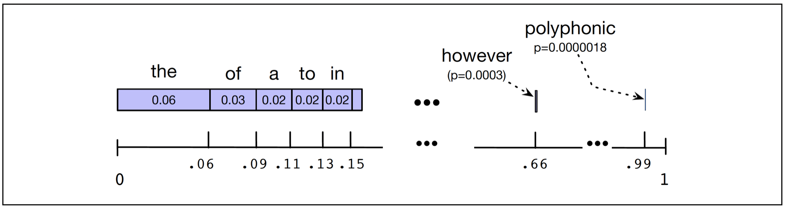
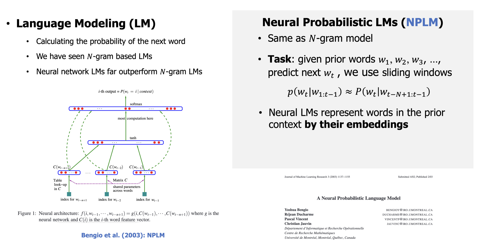
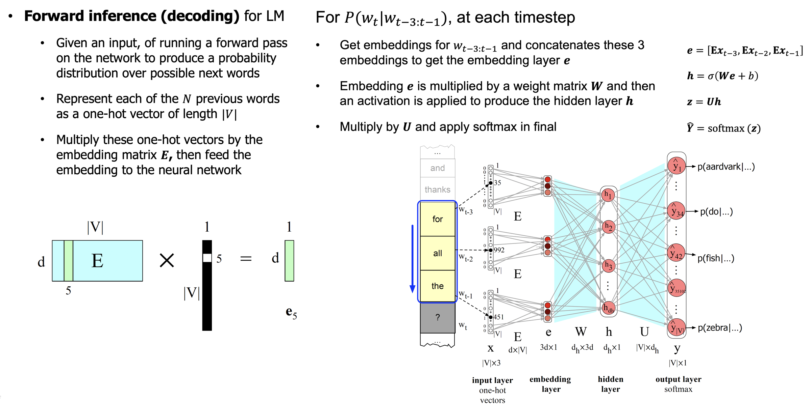
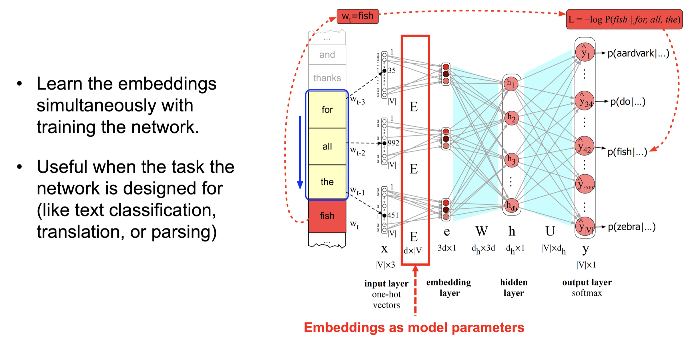

<!-- .slide: class="title-slide" id="title" -->

<p class="eyebrow">CS40008.01</p>

# N-gram Language Models

<p class="subtitle">Lecture 02 – NLP and LLMs (CS40008.01)</p>

<p class="byline">Baojian Zhou<br>School of Data Science<br>Fudan University<br>September 16, 2026</p>

Note:
Ported from Fudan Spring Lecture 02, https://baojian.github.io/llm-26/slides/lecture-02-slides/. Open with the question: how can a model assign a probability to a sentence? Three 45-minute periods: probabilistic N-gram LMs with smoothing and evaluation in periods 1–2, the perplexity filter and neural probabilistic LMs in period 3.

---

<!-- .slide: class="outline-slide" id="outline-ngram" -->

## Outline

<ul class="outline-topics">
<li aria-current="step">N-gram LMs and Smoothing</li>
<li>Evaluating LMs and Perplexity</li>
<li>Neural Probabilistic LMs</li>
</ul>

Note:
Period 1: the first topic. Return to this outline at each transition. Source: Spring Lecture 02 slide 2, https://baojian.github.io/llm-26/slides/lecture-02-slides/index.html#/1.

---

<!-- .slide: id="assign-probabilities" -->

## Assign probabilities to sentences

<div class="columns">
<div>
<p><strong>Speech recognition</strong><br>$P($<span class="text-good">It's hard to recognize speech</span>$)$<br>$\gt P($<span class="text-bad">It's hard to wreck a nice beach</span>$)$</p>
</div>
<div class="fragment" data-fragment-index="0">
<p><strong>Spell correction</strong><br>$P($<span class="text-good">about fifteen minutes from</span>$)$<br>$\gt P($<span class="text-bad">about fifteen minuets from</span>$)$</p>
</div>
</div>

<blockquote class="fragment" data-fragment-index="1"><p><strong>Machine translation (MT):</strong> “他向记者介绍了主要内容”</p></blockquote>
<ul>
<li class="fragment" data-fragment-index="2">$S_1$ = <span class="text-good">He briefed reporters on the main contents of the statement</span></li>
<li class="fragment" data-fragment-index="3">$S_2$ = He introduced reporters to the main contents of the statement</li>
<li class="fragment" data-fragment-index="4">$S_3$ = He briefed to reporters the main contents of the statement</li>
<li class="fragment" data-fragment-index="5">$S_4$ = <span class="text-bad">He to reporters introduced main content</span></li>
</ul>

<p class="fragment" data-fragment-index="6">$P($<span class="text-good">$S_1$</span>$) \gt P(S_2) \approx P(S_3) \gt P($<span class="text-bad">$S_4$</span>$)$</p>

Note:
Reveal sequence: speech recognition is visible on entry; advance to spelling, then the MT source, each of its four candidates, and finally the ranking. Pause before the last reveal and ask students which sentence should receive the highest probability. Each task needs a score that prefers fluent sentences. The speech transcriptions sound alike; a language model supplies a preference. For spelling, use the full sentence “The office is about fifteen minuets from my house.” “Minuets” is a real word, so a dictionary alone does not catch it; the surrounding words favor “minutes.” The MT candidates share one Chinese source. The ranking is illustrative rather than measured; a complete MT system must also account for source meaning. This combines the former Fall slides 3 and 4 while keeping their examples together. Source: Spring Lecture 02 slide 3, https://baojian.github.io/llm-26/slides/lecture-02-slides/index.html#/2.

---

<!-- .slide: id="unknown-distribution" -->

## LLMs approximate an unknown distribution

<p><strong>Real text-based data</strong> (languages, code, etc.) induces a distribution over token sequences:</p>
<p>$$\mathbf{w}_{1:n} = (w_1,\dots,w_n), \quad \mathbf{w}_{1:n} \sim p_{\text{data}}(\cdot),$$</p>
<p>where <span class="text-bad">$p_{\text{data}}$ is unknown</span>. We only observe a corpus (samples):</p>
<p>$$\mathcal{D}=\{\mathbf{w}^{(i)}\}_{i=1}^N,\quad \mathbf{w}^{(i)}\overset{\text{i.i.d.}}{\sim} p_{\text{data}}(\cdot).$$</p>

Note:
The population of all text is never observed; a corpus is a sample from it. Keep the i.i.d. assumption explicit; it is an idealization. Source: Spring Lecture 02 slide 4, https://baojian.github.io/llm-26/slides/lecture-02-slides/index.html#/3.

---

<!-- .slide: id="model-distribution" -->

## LLMs approximate an unknown distribution

<p>We build and train a model distribution (LLMs) $p_\theta(\mathbf{w})$ such that</p>
<p>$$p_\theta(\mathbf{w}) \approx p_{\text{data}}(\mathbf{w}).$$</p>

<blockquote><p><strong>In $p_\theta$,</strong> sequences that look like real language should get <span class="text-good">higher</span> probability than corrupted or random ones:<br>$p_\theta(\text{“natural sentence”})\;\gt\;p_\theta(\text{“random sentence”}).$</p></blockquote>

Note:
This is the whole modeling goal in one line. Everything that follows is about how to parameterize $p_\theta$ and how to fit it. Source: Spring Lecture 02 slide 4, https://baojian.github.io/llm-26/slides/lecture-02-slides/index.html#/3.

---

<!-- .slide: id="training-objective" -->

## Training objective: make $p_\theta \approx p_{\text{data}}$

<p>Ideal goal (distribution matching) is to make $p_\theta \approx p_{\text{data}}$. One principled way is to find a $\theta$ that minimizes the KL divergence:</p>
<p>$$\theta^\star \in \arg\min_\theta \mathrm{KL}\big(p_{\text{data}} \,\|\, p_\theta\big).$$</p>
<p>This is equivalent to maximizing expected log-likelihood:</p>
<p>$$\arg\min_\theta \mathrm{KL}(p_{\text{data}}\|p_\theta) \;\Longleftrightarrow\; \arg\max_\theta \mathbb{E}_{\mathbf{w} \sim p_{\text{data}}}\big[\log p_\theta(\mathbf{w})\big].$$</p>

Note:
Expand the KL divergence: the entropy of $p_{\text{data}}$ does not depend on $\theta$, so minimizing KL equals maximizing the expected log-likelihood under the data distribution. Source: Spring Lecture 02 slide 5, https://baojian.github.io/llm-26/slides/lecture-02-slides/index.html#/4.

---

<!-- .slide: id="training-objective-2" -->

## Training objective: make $p_\theta \approx p_{\text{data}}$

<p>Since $p_{\text{data}}$ is unknown, use the dataset $\{\mathbf{w}^{(i)}\}_{i=1}^N$ to approximate the expectation:</p>
<p>$$\max_\theta \frac{1}{N}\sum_{i=1}^N \log p_\theta (\mathbf{w}^{(i)}).$$</p>
<p>Let $\mathbf{w}^{(i)} := (w_1^{(i)},\ldots,w_{n_i}^{(i)})$. The LM factorization (what the model actually learns):</p>
<p>$$p_\theta(\mathbf{w}^{(i)})=\prod_{t=1}^{n_i} p_\theta \left(w_t^{(i)} \mid w_{1:t-1}^{(i)} \right).$$</p>
<p class="caption">So training teaches the model to predict the next token like real text → sampling from $p_\theta$ produces human-like sequences.</p>

Note:
The empirical average replaces the expectation. The factorization is exact by the chain rule; the modeling choice is how each conditional is represented. Source: Spring Lecture 02 slide 6, https://baojian.github.io/llm-26/slides/lecture-02-slides/index.html#/5.

---

<!-- .slide: id="training-samples" -->

## Diverse training samples

<p>$$\mathcal{D}=\left\{\mathbf{w}^{(i)}\right\}_{i=1}^{N}=$$</p>
<ul>
<li>$\mathbf{w}^{(1)}$ : It's hard to recognize speech.</li>
<li>$\mathbf{w}^{(2)}$ : <code>#include &lt;stdio.h&gt;<br>int main(void) { printf("Hello, world!\n"); }</code></li>
<li>$\mathbf{w}^{(3)}$ : 今天我们学习如何用语言模型预测下一个词。</li>
<li>$\mathbf{w}^{(4)}$ : Prove that $1+3+\cdots+(2n-1)=n^2$ for every integer $n\ge1$.</li>
<li>$\ldots,\mathbf{w}^{(i)}$ : <code>{"city": "Shanghai", "temperature_c": 22}</code></li>
</ul>
<p>Anything represented as a token sequence can be a training sample.</p>

Note:
Read the examples as English prose, C source code, Chinese prose, a mathematical proof problem, and a structured JSON record. The first two examples come from the Spring slide; the others are course-authored illustrations. The C preprocessor directive occupies its own line. The math problem can be stored as text with LaTeX notation, and the JSON record serializes named fields into text. After encoding, each sample is a token sequence; the same next-token objective applies. Other modalities can also be represented as sequences using an appropriate encoding. Encoding makes data representable; selecting useful training data is a separate decision. Retain the preceding slides' i.i.d. sampling assumption as an idealization when fitting $p_\theta$ to the corpus. Source: Spring Lecture 02 slide 7, https://baojian.github.io/llm-26/slides/lecture-02-slides/index.html#/6.

---

<!-- .slide: id="chain-rule" -->

## Compute $P(w_{1:n})$

<ul>
<li>Write sentence $\mathbf{w}=[w_1,w_2,\ldots, w_n]$ as $w_{1:n}$: $P(\mathbf{w}) \equiv P(w_{1:n})$.</li>
<li>Let $X_1 = w_1, X_2 = w_2$; recall the chain rule $P(X_1X_2)=P(X_1)\cdot P(X_2\mid X_1)$.</li>
<li>Applying the chain rule to sentence $w_{1:n}$:</li>
</ul>
<p>$$P(w_{1:n})=\prod_{t=1}^{n} P\!\left(w_t \mid w_{1:t-1}\right)$$</p>
<ul>
<li>$w_{1:t-1}$ is called the <span class="text-good">history</span> of $w_t$. We assume $w_{1:0}=w_0=\text{BOS}$ and the last token $w_n=\text{EOS}$.</li>
<li>Computing $P(w_{1:n})$ is essentially a <span class="text-good">next word prediction problem</span>.</li>
</ul>

Note:
The chain rule is exact; no approximation yet. BOS and EOS make the first and last factors well defined. Source: Spring Lecture 02 slide 8, https://baojian.github.io/llm-26/slides/lecture-02-slides/index.html#/7.

---

<!-- .slide: id="next-token-prediction" -->

## Better next-token prediction

<blockquote><p class="text-bad">Key success of almost all modern LLMs: better next-token prediction $\Rightarrow$ better language modeling.</p></blockquote>

<video class="animation" src="assets/predicting-next-word.mp4" poster="assets/predicting-next-word-poster.jpg" controls playsinline preload="metadata" aria-label="Interview clip in which the speaker explains that large language models learn by predicting the next word."></video>

Note:
Play the clip (about two and a half minutes) or a part of it. The clip was bundled with the Spring deck without a stated source; see assets/README.md. Source: Spring Lecture 02 slide 8, https://baojian.github.io/llm-26/slides/lecture-02-slides/index.html#/7.

---

<!-- .slide: id="ngram-model" -->

## The $N$-gram model

<p>Predict <strong>skills</strong> after “I want to improve my cooking”.</p>

<table>
<thead><tr><th>Model</th><th>History retained</th><th>Next-token probability</th></tr></thead>
<tbody>
<tr><td><strong>Unigram</strong> ($N=1$)</td><td>None</td><td>$p_\theta(\text{skills})$</td></tr>
<tr class="fragment" data-fragment-index="0"><td><strong>Bigram</strong> ($N=2$)</td><td>cooking</td><td>$p_\theta(\text{skills}\mid\text{cooking})$</td></tr>
<tr class="fragment" data-fragment-index="1"><td><strong>Trigram</strong> ($N=3$)</td><td>my cooking</td><td>$p_\theta(\text{skills}\mid\text{my cooking})$</td></tr>
</tbody>
</table>

<div class="fragment" data-fragment-index="2">
<p><strong>Markov assumption:</strong> keep only the previous $N-1$ tokens.</p>
<p>$P(w_t\mid w_{1:t-1})\approx p_\theta(w_t\mid w_{t-N+1:t-1})\qquad(N\ge2)$</p>
</div>

Note:
Begin with the unigram row, then reveal bigram, trigram, and the general Markov assumption. Ask how much of “I want to improve my cooking” each model retains when predicting “skills”: zero, one, or two tokens. N counts the predicted token together with its context, so an N-gram model retains the previous N-1 tokens. The unigram has no history; bigram conditions on w_{t-1}; trigram conditions on w_{t-2:t-1}. In general, an N-gram model is an (N-1)-order Markov model over tokens; the displayed history range applies for N at least 2, and N=1 uses the unconditional distribution. BOS padding handles short histories at sentence starts, as explained later. This combines the former Fall slides 11 and 12 into one comparison. Source: Spring Lecture 02 slide 9, https://baojian.github.io/llm-26/slides/lecture-02-slides/index.html#/8.

---

<!-- .slide: id="build-ngram" -->

## Build N-gram LMs

<ul>
<li><strong>Step 1</strong>: Pick an order $N$.</li>
<li><strong>Step 2</strong>: Curate your training data $\mathcal{D}$ and vocabulary $\mathcal{V}$.
<ul><li>Step 2.1: Collect raw data (tokenization, filtering)</li><li>Step 2.2: Build vocabulary $\mathcal{V}$ after tokenization</li></ul></li>
<li><strong>Step 3</strong>: Estimate your parameters $p_\theta(w_t\mid w_{t-N+1:t-1})$. <strong>Q: How many parameters will we have?</strong></li>
<li><strong>Step 4</strong>: Test your model by generating sentences or estimating log probabilities (or perplexity) of given sentences in the test dataset.</li>
</ul>
<p class="caption"><span class="text-bad">Whiteboard:</span> estimate bigram $p_\theta(w_t\mid w_{t-1})$ (Exercise E01).</p>

Note:
Work the whiteboard derivation before showing the next slide: write the likelihood of the corpus under a bigram model and maximize it under the sum-to-one constraint for each history. Source: Spring Lecture 02 slide 10, https://baojian.github.io/llm-26/slides/lecture-02-slides/index.html#/9.

---

<!-- .slide: id="bigram-parameters" -->

## Bigram parameters and MLE

<p>Let $\mathcal{V}=\{v_1,v_2,\ldots,v_{|\mathcal{V}|}\}$. Define all possible parameters $\theta_{i,j} = p_\theta(w_t=v_i\mid w_{t-1}=v_j)$:</p>
<p>$$\boldsymbol{\theta} = \begin{bmatrix} \theta_{11} & \theta_{12} & \cdots & \theta_{1 |\mathcal{V}|}\\ \theta_{21} & \theta_{22} & \cdots & \theta_{2 |\mathcal{V}|}\\ \vdots & \vdots & \ddots & \vdots \\ \theta_{|\mathcal{V}| 1} & \theta_{|\mathcal{V}| 2} & \cdots & \theta_{|\mathcal{V}| |\mathcal{V}|} \end{bmatrix}$$</p>
<ul>
<li><strong>MLE for the bigram model:</strong> $p_\theta(v_i\mid v_j) = \dfrac{C(v_j\, v_i)}{C(v_j)}$, where $C(v_j\, v_i)$ counts the total frequency of the bigram $[v_j, v_i]$ in the training corpus.</li>
<li><strong>Potential parameters ($N=2$)</strong>: $\mathcal{O}(|\mathcal{V}|^2)$. <strong>$N$-gram is not scalable: $\mathcal{O}(|\mathcal{V}|^N)$.</strong></li>
</ul>

Note:
Each column of $\boldsymbol{\theta}$ is one conditional distribution and sums to one. The Spring slide wrote the MLE ratio as $C(v_i v_j)/C(v_i)$; the history $v_j$ belongs in the denominator, as written here. Source: Spring Lecture 02 slide 10, https://baojian.github.io/llm-26/slides/lecture-02-slides/index.html#/9.

---

<!-- .slide: class="exercise" id="exercise-01" -->

## Toy example of training a bigram LM

<p class="exercise-meta">Exercise E01 · 5 minutes · Notebook E01</p>

<p><strong>Maximum likelihood estimate</strong> (bigram): $p_\theta(w_i \mid w_{i-1}) = \frac{C(w_{i-1}w_i)}{\sum_{w\in \mathcal{V}} C(w_{i-1}w)} = \frac{C(w_{i-1}w_i)}{C(w_{i-1})}$, with $C(x)$ the frequency of $x$ in the corpus.</p>
<p>Training corpus, $\mathcal{V}=\{\text{EOS, I, am, Sam, do, not, like, eggs, and, ham}\}$:</p>
<blockquote><p><span class="text-token">BOS</span> <span class="text-good">I am Sam</span> <span class="text-token">EOS</span><br><span class="text-token">BOS</span> <span class="text-good">Sam I am</span> <span class="text-token">EOS</span><br><span class="text-token">BOS</span> <span class="text-good">I do not like eggs and ham</span> <span class="text-token">EOS</span></p></blockquote>

<div class="answer fragment"><p>$p_\theta(\text{I}\mid \text{BOS})=\frac{2}{3}=0.67$, $p_\theta(\text{Sam}\mid \text{BOS})=\frac{1}{3}=0.33$, $p_\theta(\text{am}\mid \text{I})=\frac{2}{3}=0.67$, $p_\theta(\text{do}\mid \text{I})=\frac{1}{3}=0.33$, $p_\theta(\text{EOS}\mid \text{Sam})=\frac{1}{2}=0.50$, $p_\theta(\text{Sam}\mid \text{am})=\frac{1}{2}=0.50$</p></div>

Note:
Ask students to compute the six estimates by hand, then reveal. Counts: $C(\text{BOS})=3$, $C(\text{BOS I})=2$, $C(\text{I})=3$, $C(\text{I am})=2$, $C(\text{Sam})=2$, $C(\text{Sam EOS})=1$, $C(\text{am})=2$, $C(\text{am Sam})=1$. Notebook E01 counts the same corpus in code. Source: Spring Lecture 02 slide 11, https://baojian.github.io/llm-26/slides/lecture-02-slides/index.html#/10.

---

<!-- .slide: id="restaurant-reviews" -->

## Bigram statistics from restaurant reviews

<ul>
<li>$\mathcal{D}$: restaurant reviews (e.g., 1000 sentences). Example sentences from reviews:
<ul><li>Wow... Loved this place ...</li><li>Not tasty and the texture was just nasty ...</li><li>The selection on the menu was great and ...</li></ul></li>
<li>Add boundary tokens: <span class="text-token">BOS</span> ... <span class="text-token">EOS</span></li>
<li>Bigram counts $C(w_{i-1},w_i)$; bigram MLE $p_\theta(w_i\mid w_{i-1})=\dfrac{C(w_{i-1},w_i)}{C(w_{i-1})}$</li>
<li>We can visualize a small sub-matrix for selected words (e.g., <span class="text-good">i, want, to, eat, in, this, place</span>).</li>
</ul>

Note:
The counts on the next slide come from the Spring notebook run on the sentiment-labelled-sentences dataset (3000 training rows). Source: Spring Lecture 02 slide 12, https://baojian.github.io/llm-26/slides/lecture-02-slides/index.html#/11.

---

<!-- .slide: id="restaurant-counts" -->

## Bigram counts (subset)

```text
split: train rows: 3000   columns: ['text']
Vocab size: 5166          Distinct bigrams: 22179

        i   want   to  eat  in  this  place
i       0     5     0    1   0     0      0
want    0     0    11    0   0     0      0
to      0     1     0   12   2     6      2
eat     0     0     0    0   2     0      0
in      0     0     3    0   0    24      2
this    1     0     4    0   2     0     73
place   2     0    10    0   3     0      0
```

Note:
Rows are the history word, columns the next word. Most cells are zero even for common words: this is the sparsity that smoothing addresses later. Source: Spring Lecture 02 slide 12, https://baojian.github.io/llm-26/slides/lecture-02-slides/index.html#/11.

---

<!-- .slide: id="practical-boundaries" -->

## Practical issues in $N$-gram LMs: sentence boundaries

<ul>
<li>Need extra context at the start and end.</li>
<li>For trigram: $p_\theta(w_1\mid \text{BOS},\text{BOS})$</li>
<li>Add tokens: <span class="text-token">BOS</span> … <span class="text-token">EOS</span></li>
</ul>

Note:
An $N$-gram model needs $N-1$ BOS tokens so that the first word has a full history. EOS lets the model assign probability to stopping, which makes the distribution over sentences of all lengths sum to one. Source: Spring Lecture 02 slide 13, https://baojian.github.io/llm-26/slides/lecture-02-slides/index.html#/12.

---

<!-- .slide: id="practical-oov" -->

## Practical issues in $N$-gram LMs: unknown words (OOV)

<p>A word like <em class="text-bad">Thisisahardtofindword</em> simply did not occur in our training set but could be in our test set.</p>
<ul>
<li><strong>Closed vocabulary:</strong> test words must be in a fixed lexicon.</li>
<li><strong>Open vocabulary:</strong> map unseen words to a pseudo-token <span class="text-token">&lt;UNK&gt;</span>.</li>
<li><strong>How to train</strong> $p_\theta(\text{UNK}\mid \cdot)$?
<ul><li><strong>Prior vocab:</strong> convert OOV in training to <span class="text-token">&lt;UNK&gt;</span>, then count it.</li><li><strong>No prior vocab:</strong> replace rare words (freq $\lt n$) with <span class="text-token">&lt;UNK&gt;</span> (or keep the top $|V|$ words).</li></ul></li>
</ul>

Note:
Connect to Lecture 01: subword tokenizers make OOV rare at the token level, but word-level $N$-gram models still need UNK. Source: Spring Lecture 02 slide 13, https://baojian.github.io/llm-26/slides/lecture-02-slides/index.html#/12.

---

<!-- .slide: id="smoothing" -->

## Smoothing N-gram LMs in one page

<p><strong>Problem:</strong> most cells of the bigram table are 0, so an unseen $n$-gram such as $q(\text{offer} \mid \text{denied the}) = 0$ gives every sentence containing it probability 0. <strong>Fix:</strong> move a little mass from seen events to unseen ones.</p>
<p><strong>Add-$\delta$</strong> (Laplace when $\delta=1$):</p>
<p>$$P_{\text{Add}}(w_i\mid w_{i-1}) =\frac{C(w_{i-1}w_i)+\delta}{C(w_{i-1})+\delta|V|}$$</p>
<p><strong>Interpolation</strong> ($\lambda_i$ tuned on held-out data, $\sum_i\lambda_i=1$):</p>
<p>$$P_{\text{Int}}(w_n\mid w_{n-2}w_{n-1}) = \lambda_1 P(w_n\mid w_{n-2}w_{n-1}) + \lambda_2 P(w_n\mid w_{n-1}) + \lambda_3 P(w_n)$$</p>
<p class="caption"><strong>Kneser–Ney</strong> backs off by how many distinct contexts a word follows (<em>Francisco</em>: almost only after <em>San</em>); KenLM trains it, the baseline in the NPLM table. Neural LMs need no count smoothing.</p>

Note:
One page replaces the Spring section of nine slides, placed at the end of the first section right after the count table and OOV, where the zeros are on screen; Exercise E02 in the next section shows what a single zero does to a test set. Add-one on the Berkeley Restaurant counts moves too much mass: $C(\text{i want})$ falls from 827 to a reconstituted 527 with $|V|=1446$; that is why $\delta \lt 1$ and interpolation are preferred. Notebook practices P02 (Laplace tables) and P03 (held-out interpolation) keep the full worked examples for students who want them. Source: Spring Lecture 02 slides 20–27, https://baojian.github.io/llm-26/slides/lecture-02-slides/index.html#/19.

---

<!-- .slide: class="outline-slide" id="outline-evaluation" -->

## Outline

<ul class="outline-topics">
<li>N-gram LMs and Smoothing</li>
<li aria-current="step">Evaluating LMs and Perplexity</li>
<li>Neural Probabilistic LMs</li>
</ul>

Note:
Source: Spring Lecture 02 slide 14, https://baojian.github.io/llm-26/slides/lecture-02-slides/index.html#/13.

---

<!-- .slide: id="evaluation" -->

## Building LMs and evaluation

| Training data | Validation data | Testing data |
| :--- | :--- | :--- |
| Estimate parameters | Tune choices | Report once |

<p><strong>Extrinsic evaluation:</strong> compare downstream task performance.</p>

<div class="columns">
<div>
<ul>
<li><a href="https://agi.safe.ai/">Humanity’s Last Exam</a><br>Expert academic questions</li>
<li><a href="https://www.tbench.ai/">Terminal-Bench</a><br>Tasks in a terminal</li>
</ul>
</div>
<div>
<ul>
<li><a href="https://agents-last-exam.org/">Agents’ Last Exam</a><br>Professional workflows</li>
<li><a href="https://arcprize.org/arc-agi/3">ARC-AGI-3</a><br>Interactive reasoning</li>
</ul>
</div>
</div>

<p><span class="text-bad"><strong>Time-consuming</strong></span> at scale (can take days or weeks).</p>

Note:
The Spring slide shows the split as a proportional bar (about 70/15/15). The second table row summarizes each part's role. Keep the test split untouched while choosing the model, prompt, or agent setup. Traditional examples are spell-correction accuracy and machine-translation quality. Source: Spring Lecture 02 slide 15, https://baojian.github.io/llm-26/slides/lecture-02-slides/index.html#/14.

The linked benchmarks are current examples of task-based evaluation, rather than a claim that they are equally established or measure the same capability. Humanity’s Last Exam (HLE) tests expert academic questions across subjects, including multimodal questions. Agents’ Last Exam (ALE) evaluates professional computer workflows with verifiable outcomes. Terminal-Bench evaluates agents on tasks in terminal environments. ARC-AGI-3 tests interactive reasoning in unfamiliar game environments; distinguish it from the static puzzles in earlier ARC-AGI versions. These extend the motivation to modern LMs and agents; they are not proposed experiments for our N-gram model. Official sources checked September 16, 2026: https://agi.safe.ai/ and https://arxiv.org/abs/2501.14249; https://agents-last-exam.org/; https://www.tbench.ai/ and https://arxiv.org/abs/2601.11868; https://arcprize.org/arc-agi/3.

Task scores depend on the model and evaluation setup: tools, prompts, action or token budgets, and benchmark version. Compare systems under a stated protocol; task success and held-out next-token likelihood answer different questions. Time depends on task count, agent trajectory length, repeated trials, environment setup, and available parallelism. Large evaluations can take days or weeks; this is not a fixed runtime for every benchmark. This motivates the next slide's cheaper intrinsic probability-based evaluation.

---

<!-- .slide: class="exercise" id="exercise-02" -->

## Intrinsic evaluation

<p class="exercise-meta">Exercise E02 · 3 minutes · Notebook E02</p>

<ul>
<li>Does the LM prefer <strong>good</strong> sentences to <strong>bad</strong> ones?</li>
<li>Train on the <strong>training dataset</strong>, evaluate on unseen <strong>test</strong> data. Never leak test sentences into training.</li>
<li>Probability-based metric: <strong>higher log-likelihood on test ⇒ better LM</strong>.</li>
</ul>
<p><span class="text-bad">Whiteboard:</span> propose a reasonable metric.</p>

<div class="answer fragment"><p>$$\frac{1}{|\mathcal{D}_{\text{test}}|} \sum_{\mathbf{w}\in\mathcal{D}_{\text{test}}} \log p_\theta(\mathbf{w})$$</p></div>

Note:
Expected proposals: total log-likelihood, average per sentence, average per token. Discuss why per-token normalization makes different test sets comparable; this leads to perplexity. Source: Spring Lecture 02 slide 15, https://baojian.github.io/llm-26/slides/lecture-02-slides/index.html#/14.

---

<!-- .slide: id="perplexity" -->

## Perplexity

<p><strong>Definition (intrinsic metric)</strong></p>
<ul>
<li>A better LM assigns <strong>higher probability</strong> to an unseen test set $s_{1:m}$.</li>
<li><strong>Perplexity</strong> is the inverse probability of the test set, normalized by length $T=\sum_i |s_i|$:</li>
</ul>
<p>$$\mathrm{PPL}(s_{1:m}) = P_\theta(s_{1:m})^{-1/T} = \exp\!\left(-\frac{1}{T}\log P_\theta(s_{1:m})\right)$$</p>
<p>Minimizing PPL $\Longleftrightarrow$ maximizing test probability.</p>

Note:
The exponent of the average negative log-likelihood per token. With base-2 logarithms this is $2^{\text{cross-entropy}}$. Source: Spring Lecture 02 slide 16, https://baojian.github.io/llm-26/slides/lecture-02-slides/index.html#/15.

---

<!-- .slide: class="exercise" id="exercise-03" -->

## Perplexity: interpretation

<p class="exercise-meta">Exercise E03 · 3 minutes · Notebook E03</p>

<ul>
<li>Perplexity $\approx$ <strong>effective branching factor</strong>: how many plausible next tokens the model considers.</li>
<li>Example: random digits $\{0,\dots,9\}$, uniform guess $P=1/10$ for each digit. What is the perplexity of a digit string of length $t$?</li>
</ul>

<div class="answer fragment"><p>$$\mathrm{PPL}(s)=P(w_{1:t})^{-1/t} =\left(\left(\tfrac{1}{10}\right)^t\right)^{-1/t} =10$$</p>
<p>If the model is totally random, it needs $|\mathcal{V}|$ guesses on average to get the next word right. If $|\mathcal{V}|=1$, it surely picks the right one, hence $\mathrm{PPL}(s_{1:m})=1$.</p></div>

Note:
Expected answer: 10, independent of $t$. Notebook E03 computes it numerically for several lengths. Source: Spring Lecture 02 slide 16, https://baojian.github.io/llm-26/slides/lecture-02-slides/index.html#/15.

---

<!-- .slide: id="lower-perplexity" -->

## Comparing language models

<p><strong>Bits per byte:</strong> $\mathrm{BPB}=-\frac{1}{B}\sum_{d,t}\log_2 p_\theta(w_t^{(d)}\mid w_{1:t-1}^{(d)})$</p>

<p>$B$ = UTF-8 byte count of the test text.<br>Sum over token positions $t$ in each test document $d$.</p>

| Test data / metric (↓ better) | Unigram | Bigram | Trigram |
| :--- | ---: | ---: | ---: |
| WSJ: word perplexity | 962 | 170 | 109 |
| TinyStories: BPB | 2.07 | 1.30 | 1.12 |
| OpenWebText: BPB | 2.48 | 2.06 | 2.03 |
| Chinese web: BPB | 2.48 | 2.10 | 2.04 |

Note:
Read the formula as total prediction loss in bits divided by the UTF-8 byte count of the evaluated text. Here d indexes test documents and t indexes scored token positions within a document; history resets at document boundaries. Each contribution is minus log base 2 of the probability assigned to the actual next token, not a sampled token. For an N-gram model, the conditional uses only its retained history. With B = 100 bytes and total loss = 200 bits, BPB = 200/100 = 2 bits per byte. B is a byte count, not a token count: for example, ASCII "a" uses one UTF-8 byte and "中" uses three. The sum includes each document's EOS prediction in this evaluator; BOS is context only, and neither marker adds text bytes. Count bytes after the evaluator's preprocessing, excluding removed whitespace and document separators; do not use the raw file size blindly.

Connection to perplexity: if T is the number of scored predictions and ell is their average negative natural-log probability, BPB = (T/B) × ell/ln(2) = (T/B) × log₂(PPL), with PPL = exp(ell). The same scored tokens and boundaries must be used for both metrics. Thus BPB is an average loss per byte; it is not perplexity divided by bytes or the tokenizer's compression ratio. For a dataset, divide the total loss by the total bytes; do not take an unweighted average of document BPBs. Source: Gao et al. (2020), The Pile, §3.1, https://arxiv.org/html/2101.00027#S3.SS1. The displayed sum is the expanded negative-log-likelihood form of that conversion. Implementation: pipeline/ngram_lm.py::bits_per_byte and pipeline/eval.py.

Compare model columns within each row on the same test text. The course demonstration uses a 24 MiB training cap per corpus and is separate from A1.

The WSJ numbers are from Jurafsky and Martin, Chapter 3. Perplexities are only comparable across models that share the same vocabulary and tokenization; that is why the course reports bits per byte on fixed held-out shards. The three course rows were computed with scripts/lecture02_experiments.py (interpolated models tuned on a dev split, Qwen3 tokenizer, 24 MiB training cap per source; bytes per content token 4.14 / 4.46 / 4.59). The current pipeline/eval.py scores n-grams; later neural-model adapters should share its text, byte, and EOS conventions. Here EOS contributes to loss and the scored token count, but contributes no text bytes. Lower loss does not guarantee better downstream accuracy. Different corpus rows do not measure the intrinsic difficulty of different languages. GPT-3 also reports perplexity: https://arxiv.org/pdf/2005.14165.pdf; leaderboards: https://nlpprogress.com/english/language_modeling.html. Source: Spring Lecture 02 slide 17, https://baojian.github.io/llm-26/slides/lecture-02-slides/index.html#/16.

---

<!-- .slide: id="sampling" -->

## Sentence sampling

<p><strong>Unigram case</strong></p>
<ul>
<li>Partition $[0,1]$ into intervals; each word gets an interval proportional to its frequency.</li>
<li>Sample $u\sim \mathrm{Unif}[0,1]$ and output the word whose interval contains $u$.</li>
<li>Repeat until we generate <span class="text-good">EOS</span>.</li>
</ul>
<p><strong>What about the bigram case?</strong></p>

Note:
Bigram answer: condition the interval partition on the previous word, starting from BOS. Notebook P01 samples from the toy bigram model. Source: Spring Lecture 02 slide 18, https://baojian.github.io/llm-26/slides/lecture-02-slides/index.html#/17.

---

<!-- .slide: id="sampling-figure" -->

## Unigram sampling on $[0,1]$



<p class="caption">Frequent words own wide intervals; rare words own slivers near the end.</p>

Note:
Figure from Jurafsky and Martin, Chapter 3 (sampling from a unigram model), as used in the Spring deck. Source: Spring Lecture 02 slide 18, https://baojian.github.io/llm-26/slides/lecture-02-slides/index.html#/17.

---

<!-- .slide: id="sampling-outputs" -->

## Samples from a built LM

Trained on the Wall Street Journal (40M words):

- **1-gram:** Months the my and issue of year foreign new exchange's September were recession exchange new endorsed a acquire to six <span class="text-token">**executives**</span>
- **2-gram:** Last December through the way to preserve the <span class="text-token">**Hudson corporation**</span> ... would seem to complete the major central planners ... <span class="text-token">**M. X. corporation**</span> ...
- **3-gram:** They also point to ninety nine point <span class="text-token">**six billion dollars**</span> ... <span class="text-token">**six three percent**</span> ... <span class="text-token">**on market conditions**</span>

Note:
Higher order gives locally fluent phrases but still no global coherence. Samples from Jurafsky and Martin, Chapter 3. Source: Spring Lecture 02 slide 18, https://baojian.github.io/llm-26/slides/lecture-02-slides/index.html#/17.

---

<!-- .slide: id="ngram-filter" -->

## N-grams in a 2026 pipeline: the perplexity filter

<div class="plot" data-plotly="assets/lm-filter.json" role="img" aria-label="Percentages of web and TinyStories documents in common reference-model BPB bins; a dashed line marks an illustrative cutoff."></div>

<p class="caption"><strong>Predictable under Wikipedia ≠ universally high quality.</strong> CCNet supplies scores and buckets; RedPajama-V2 exposes <code>ccnet_perplexity</code>. This Qwen-tokenized trigram uses BPB and a course-selected cutoff.</p>

Note:
Period 3 begins here. This is a teaching analogue for stage 2b of docs/pretraining-plan.md. Whole WikiText-103 articles are capped before reserving the last 5% for development; assets/lecture02-results.json records the actual loaded, selected, training, and development counts. Both populations use the same bins and their own percentage denominator. The cutoff discards approximately the highest-scoring third of this web sample; it is not a universal CCNet policy. Children's stories can be useful while receiving a worse score under a Wikipedia reference. CCNet Section 5.2 describes buckets and the value of retaining specialized content: https://arxiv.org/html/1911.00359v1. RedPajama-V2 documents its score as an annotation: https://huggingface.co/datasets/togethercomputer/RedPajama-Data-V2. Dolma explicitly declined CCNet quality scores and used Gopher/C4 heuristics instead: https://arxiv.org/html/2402.00159v1, Section 3.1.2. Figure: scripts/lecture02_experiments.py. The optional future exercise is to inspect documents on both sides before selecting a cutoff.

---

<!-- .slide: id="summary" -->

## Quick summary: N-gram language models

<ul>
<li><strong>Idea:</strong> approximate next-word probability using only the last $N-1$ words: $P(w_t \mid w_{1:t-1}) \approx q(w_t \mid w_{t-N+1:t-1})$</li>
<li><strong>Training:</strong> estimate counts from a corpus (plus smoothing for unseen $n$-grams).</li>
<li><strong>Two major issues</strong>
<ul><li><strong>Parameter explosion:</strong> the number of $n$-grams grows as $|V|^N$ (e.g., $|V|=10^4 \Rightarrow$ trigram $\sim 10^{12}$).</li><li><strong>Sparsity / poor generalization:</strong> many test $n$-grams never appear in training.</li></ul></li>
<li><strong>Still in use:</strong> n-gram models score and filter pretraining data (previous slide) and give the first point on our scaling plot.</li>
<li><strong>Today:</strong> the first neural LM (NPLM) addresses both issues via learned representations; RNNs and Transformers follow from Week 4.</li>
</ul>

Note:
Source: Spring Lecture 02 slide 28, https://baojian.github.io/llm-26/slides/lecture-02-slides/index.html#/27.

---

<!-- .slide: class="outline-slide" id="outline-nplm" -->

## Outline

<ul class="outline-topics">
<li>N-gram LMs and Smoothing</li>
<li>Evaluating LMs and Perplexity</li>
<li aria-current="step">Neural Probabilistic LMs</li>
</ul>

Note:
Source: Spring Lecture 02 slide 29, https://baojian.github.io/llm-26/slides/lecture-02-slides/index.html#/28.

---

<!-- .slide: id="nplm-1" -->

## Neural Probabilistic LMs (NPLMs)



<p class="caption">Bengio et al. (2003): NPLM. Same task as the $N$-gram model; words are represented by embeddings.</p>

Note:
The figure and text are the Spring slide image, kept unchanged. Source: Spring Lecture 02 slide 30, https://baojian.github.io/llm-26/slides/lecture-02-slides/index.html#/29.

---

<!-- .slide: id="nplm-2" -->

## Neural Probabilistic LMs (NPLMs)



<p class="caption">Forward inference (decoding): $\mathbf{e}=[\mathbf{E}x_{t-3},\mathbf{E}x_{t-2},\mathbf{E}x_{t-1}]$, $\mathbf{h}=\sigma(\mathbf{W}\mathbf{e}+\mathbf{b})$, $\hat{\mathbf{y}}=\text{softmax}(\mathbf{U}\mathbf{h})$.</p>

Note:
Diagram from an earlier Jurafsky and Martin draft, then Chapter 7; the current feedforward-LM reading is Chapter 6. Source: Spring Lecture 02 slide 31, https://baojian.github.io/llm-26/slides/lecture-02-slides/index.html#/30.

---

<!-- .slide: id="nplm-3" -->

## Neural Probabilistic LMs (NPLMs)



<p class="caption">Embeddings as model parameters, learned with the loss $L=-\log P(\text{fish}\mid\text{for, all, the})$.</p>

Note:
Diagram from an earlier Jurafsky and Martin draft, then Chapter 7; the current feedforward-LM reading is Chapter 6. Source: Spring Lecture 02 slide 32, https://baojian.github.io/llm-26/slides/lecture-02-slides/index.html#/31.

---

<!-- .slide: id="nplm-4" -->

## Neural Probabilistic LMs (NPLMs)


<p class="caption">MLP10 = NPLM. Comparative results on the AP News corpus (Bengio et al., 2003). Week 9 repeats this comparison on our shards: n-gram, NPLM, and the 30M–350M ladder on one bits-per-byte axis.</p>

Note:
NPLM already beat the best smoothed $N$-gram models in 2003; the gap widened with RNNs and Transformers. Source: Spring Lecture 02 slide 33, https://baojian.github.io/llm-26/slides/lecture-02-slides/index.html#/32.

---

<!-- .slide: id="self-training-loop" -->

## The loop, in miniature

<div class="plot" data-plotly="assets/self-training-loop.json" role="img" aria-label="Held-out BPB across six rounds of replacing a training corpus with capped model samples; hover for each round's token budget."></div>

<p class="caption">Replace the original corpus with 2,000 samples per round, capped at 128 tokens each. Training drops from 6.08M to at most 0.256M tokens. This toy experiment changes both data size and content; it does not test a filter. Notebook P04.</p>

Note:
The original TinyStories corpus is itself synthetic, so “original” does not mean human-written. The measured loss changes reflect finite sampling, corpus replacement, a smaller token budget, and truncated sequence endings together. Keep this as an illustrative replacement experiment, not causal evidence that every self-training system needs a judge or that filtering fixes collapse. P04 uses an exact smoothed-mixture sampler and a fixed vocabulary on twelve original sentences; its scale and values differ from this plot. Ask students to propose equal-token-budget controls: resample original text, replace it with model samples, and retain a mixture of original and generated data. A filtered branch would need its own evaluation. For replacement versus accumulation experiments, see Gerstgrasser et al. (2024), https://arxiv.org/html/2404.01413v2. Shumailov et al. (2024) studies recursive replacement: https://www.nature.com/articles/s41586-024-07566-y. Figure: scripts/lecture02_experiments.py; hover shows actual training-token counts.

---

<!-- .slide: id="exit-questions" -->

## Before you leave

<div class="columns columns-wide-left">
<div>
<h3>Three questions</h3>
<ol>
<li>Why can a larger $N$ hurt on unseen text?</li>
<li>Does lower perplexity guarantee better task performance?</li>
<li>How do embeddings help with unseen contexts?</li>
</ol>
</div>
<div>
<h3>Sources and extensions</h3>
<p><a href="https://baojian.github.io/llm-26/slides/lecture-02-slides/index.html">Fudan Spring Lecture 02</a><br>Original examples and figures.</p>
<p><a href="https://www.jmlr.org/papers/v3/bengio03a.html">Bengio et al. (2003)</a><br>Learning shared word vectors.</p>
<p><a href="../shared/notebook.html?lecture=lecture-02" target="_blank" rel="noopener noreferrer">Notebook P01–P04</a><br>Optional sampling, smoothing, self-training.</p>
</div>
</div>

**Next:** embeddings and PyTorch — from tokens to trainable vectors and gradients.

Note:
Use two minutes for these ungraded discussion questions, then one minute for the readings. Expected answers: (1) For a fixed corpus, longer contexts have fewer observations. More possible N-grams mean sparser counts and potentially worse estimates on unseen text; increasing N does not guarantee better generalization. Smoothing or interpolation can help, and the order should be chosen on development data. (2) No. Perplexity measures predictive fit to the evaluated text; task performance also depends on the task distribution, metric, and system setup. Compare perplexities only under the same tokenization and scoring conventions; bits per byte provides a common unit across tokenizers on the same text with matched preprocessing and boundaries. See the companion note, ../../docs/lecture-02-lm-metrics.md. (3) The neural LM shares an embedding matrix and prediction network across contexts. Similar learned vectors let observations from one context inform predictions for related, unseen combinations. This helps generalization without guaranteeing that every unseen context receives a good prediction. Source: Bengio et al. (2003), https://www.jmlr.org/papers/v3/bengio03a.html.

The Spring Fudan lecture supplies the original examples and figures. Bengio et al. connects the N-gram baseline to learned representations. The notebook link uses the shared launcher and opens the existing classroom notebook; its optional P01–P04 cover sampling, additive smoothing, held-out interpolation, and the controlled interpretation of replacing data with model samples. These are ungraded extensions for all students, not extra-credit work. Next lecture follows the published Week 3 plan: embedding lookup, tensor shapes, batching, autograd, and output projections. Students will trace tensors and gradients through a small language model; see ../../index.html#schedule.

---

<!-- .slide: class="references" id="references" -->

## Language model toolkits and readings

- **Reading:** [Jurafsky and Martin, *N-gram Language Models*](https://web.stanford.edu/~jurafsky/slp3/3.pdf)<br>Chain rule, MLE, perplexity, smoothing, Kneser–Ney.
- **KenLM** (fast $n$-gram LM toolkit): <a href="https://kheafield.com/code/kenlm/" target="_blank" rel="noopener noreferrer">kheafield.com/code/kenlm/</a>
- **Google N-Gram Release (Aug 2006):** <a href="https://ai.googleblog.com/2006/08/all-our-n-gram-are-belong-to-you.html" target="_blank" rel="noopener noreferrer">ai.googleblog.com/2006/08/all-our-n-gram-are-belong-to-you.html</a><br>Tokens: 1,024,908,267,229 · Sentences: 95,119,665,584 · Unigrams: 13,588,391 · Fivegrams: 1,176,470,663
- **Bengio et al. (2003), A Neural Probabilistic Language Model:** <a href="https://www.jmlr.org/papers/volume3/bengio03a/bengio03a.pdf" target="_blank" rel="noopener noreferrer">jmlr.org/papers/volume3/bengio03a</a> · <a href="https://web.stanford.edu/~jurafsky/slp3/6.pdf" target="_blank" rel="noopener noreferrer">Jurafsky and Martin, §6.5</a> (feedforward LMs)
- **CCNet** (Wenzek et al., 2020), the Wikipedia n-gram filter: <a href="https://arxiv.org/abs/1911.00359" target="_blank" rel="noopener noreferrer">arxiv.org/abs/1911.00359</a> · **Brants et al. (2007)**, 2-trillion-token 5-grams for MT: <a href="https://aclanthology.org/D07-1090/" target="_blank" rel="noopener noreferrer">aclanthology.org/D07-1090</a>

Note:
Fast discrete sampling (alias method), used by the sampling slides: https://www.keithschwarz.com/darts-dice-coins/. The Spring slide closed with the reading for its next lecture (Chapters 4–5: Naive Bayes, logistic regression, embeddings). In the Fall sequence, Chapter 3 is the reading for this lecture; Week 3 continues with embeddings. Source: Spring Lecture 02 slide 34, https://baojian.github.io/llm-26/slides/lecture-02-slides/index.html#/33.
