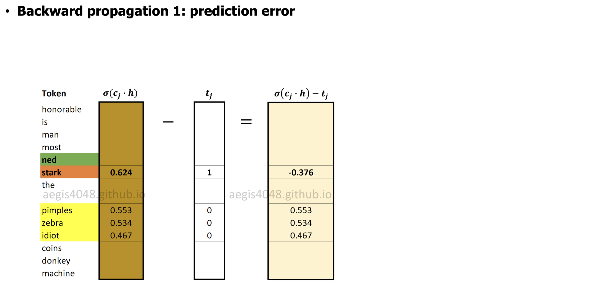
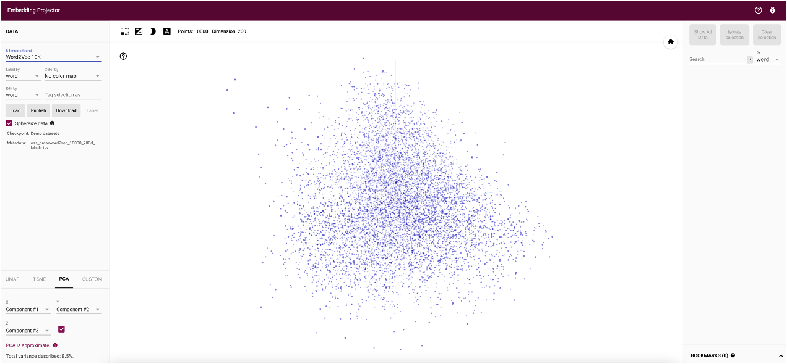

<!-- .slide: class="title-slide" id="title" -->

<p class="eyebrow">CS40008.01</p>

# Embeddings and PyTorch for Language Models

<p class="subtitle">Lecture 03 – NLP and LLMs (CS40008.01)</p>

<p class="byline">Baojian Zhou<br>School of Data Science<br>Fudan University<br>September 23, 2026</p>

Note:
Ported from Fudan Spring Lecture 03 (Text Classification and Word Embeddings), https://baojian.github.io/llm-26/slides/lecture-03-slides/, with a new closing section on PyTorch for language models. Open with the question: how do discrete tokens become trainable representations? The Spring title slide read “Lecture 03 – Text Classification and Word Embeddings”, dated 03/19/2026. Source: Spring Lecture 03 slide 1, https://baojian.github.io/llm-26/slides/lecture-03-slides/index.html#/0.

---

<!-- .slide: class="outline-slide" id="outline-classification" -->

## Outline

<ul class="outline-topics">
<li aria-current="step">Text Classification</li>
<li>Counting-based Methods</li>
<li>Learning-based Methods</li>
<li>Bridge to LLMs</li>
<li>PyTorch for Language Models</li>
</ul>

Note:
First topic: text classification with Naive Bayes and logistic regression, as the motivation for learned representations. Return to this outline at each transition. Source: Spring Lecture 03 slide 2, https://baojian.github.io/llm-26/slides/lecture-03-slides/index.html#/1.

---

<!-- .slide: id="classification-task-1" -->

## Assign probabilities to sentences

<p>A typical NLP task --- - Given a piece of text, we want to predict its label.</p>
<ul>
<li><strong>Spam detection</strong>: spam / not spam</li>
<li><strong>Authorship attribution</strong>: Madison / Hamilton</li>
<li><strong>Sentiment analysis</strong>: positive / negative</li>
</ul>
<blockquote><p><strong>Common pattern:</strong><br>different tasks, but the same goal:<br><strong>text → representation → label</strong></p></blockquote>

Note:
Ask students for other tasks that fit the pattern (topic labelling, language identification, toxicity filtering). The Spring title repeats the Lecture 02 title and the opening sentence keeps its literal dashes; both are reproduced as written. Part 1 of Spring slide 3 (left column). Source: Spring Lecture 03 slide 3, https://baojian.github.io/llm-26/slides/lecture-03-slides/index.html#/2.

---

<!-- .slide: id="classification-task-2" -->

## Assign probabilities to sentences

<p><strong>Example 1</strong><br>"Congratulations! You won <span>&#36;</span>10,000 ..."<br>→ <strong>Spam</strong> or <strong>Not Spam</strong></p>
<p><strong>Example 2</strong><br>"Federalist Paper No. ..."<br>→ <strong>Hamilton</strong> or <strong>Madison</strong></p>
<p><strong>Example 3</strong><br>"Full of fantastic characters and great plot twists."<br>→ <strong>Positive</strong> or <strong>Negative</strong></p>
<p class="fragment" data-fragment-index="0"><strong>Key question:</strong> How should we represent text so that a machine can classify it well?</p>

Note:
The three examples are visible on entry (they were the first reveal on the Spring slide); let students answer each one, then advance once for the key question. The key question sets up the whole lecture: the classifier is simple, the representation is the hard part. Part 2 of Spring slide 3 (right column and key question). Source: Spring Lecture 03 slide 3, https://baojian.github.io/llm-26/slides/lecture-03-slides/index.html#/2.

---

<!-- .slide: id="classification-methods-1" -->

## Classification methods

<ul>
<li><strong>Hand-coded rules</strong> <span class="text-bad">(outdated)</span>
<ul><li>Rules based on combinations of words or other features (e.g., spam: black-list-address OR ("dollars" AND "have been selected"))</li><li>Accuracy can be high if rules carefully refined by expert. But building and maintaining these rules is expensive. Rules change from time to time.</li></ul></li>
<li><strong>Supervised --- learning</strong> <span class="text-good">(still useful)</span>
<ul><li><strong>Input:</strong> A document $d$; set of classes $C = \{c_1, c_2, \ldots, c_k\}$; a training set of $n$ labeled documents $(d_1, c_1), \ldots, (d_n, c_n)$</li><li><strong>Output:</strong> A learned classifier $\theta$: $d \rightarrow c$</li></ul></li>
</ul>

Note:
Ask who maintains a rule list when spammers change their wording; the cost of maintenance motivates learning from labelled data. Then emphasize the supervised interface: labelled pairs in, a function from document to class out. The literal dashes in the second bullet title are reproduced from the Spring slide. Part 1 of Spring slide 4 (left column). Source: Spring Lecture 03 slide 4, https://baojian.github.io/llm-26/slides/lecture-03-slides/index.html#/3.

---

<!-- .slide: id="classification-methods-2" -->

## Classification methods

<div class="columns">
<div>
<p><strong>Popular classifiers</strong></p>
<ul>
<li><span class="text-bad">Naïve Bayes (NB)</span></li>
<li><span class="text-bad">Logistic Regression (LR)</span></li>
<li>Support-vector machines</li>
<li>k-Nearest Neighbors</li>
<li>NNs/LLMs + LR/Softmax <span class="text-good">(modern way)</span></li>
</ul>
</div>
<div>

</div>
</div>

Note:
The two classifiers in red are the ones covered today; the last item is where the course is heading. This whole column was a single reveal on the Spring slide. Part 2 of Spring slide 4 (right column). Source: Spring Lecture 03 slide 4, https://baojian.github.io/llm-26/slides/lecture-03-slides/index.html#/3.

---

<!-- .slide: id="nb-classifier-1" -->

## Naive Bayes (NB) Classifier

<div class="columns fragment" data-fragment-index="0">
<div>
<ul>
<li><strong>Goal:</strong> given a document $d$, predict its likely class $c$</li>
<li><strong>MAP decision rule:</strong> $$c_{\text{MAP}}=\arg\max_{c\in C} P(c\mid d)$$</li>
</ul>
</div>
<div>
<ul>
<li><strong>By Bayes' rule: </strong> posterior $=$ likelihood $\times$ prior / evidence $$P(c\mid d)=\frac{P(d\mid c)\,P(c)}{P(d)}$$</li>
<li>Since $P(d)$ does not depend on $c$, $$c_{\text{MAP}} = \arg\max_{c\in C} P(d\mid c)\,P(c)$$</li>
</ul>
</div>
</div>

Note:
As on the Spring slide, only the title is visible on entry: ask how one would pick a class given a document, then advance once to reveal the four bullets (read the left column first, then the right). Stress that the evidence is the same for every class, so it drops out of the arg max. Part 1 of Spring slide 5 (left column). Source: Spring Lecture 03 slide 5, https://baojian.github.io/llm-26/slides/lecture-03-slides/index.html#/4.

---

<!-- .slide: id="nb-classifier-2" -->

## Naive Bayes (NB) Classifier

<p><strong>Document representation</strong></p>
<p>Represent document $d$ as features $$d=(v_1,v_2,\dots,v_{|V|})$$ using <strong>bag-of-words</strong>.</p>
<p><strong>NB classifier</strong></p>
<p>$$c_{\text{MAP}} = \arg\max_{c\in C} P(d=(v_1,\dots,v_{|V|})\mid c)\,P(c)$$</p>
<p>The remaining question is: how should we model $P(d\mid c)$?</p>

Note:
Pause on the closing question before moving on: the likelihood of a whole document has far too many outcomes to estimate directly, which is why the next slide makes the naive assumption. This content was the second reveal on the Spring slide. Part 2 of Spring slide 5 (right column). Source: Spring Lecture 03 slide 5, https://baojian.github.io/llm-26/slides/lecture-03-slides/index.html#/4.

---

<!-- .slide: id="nb-bag-of-words-1" -->

## Naive Bayes: Bag-of-Words Model

<ul>
<li><strong>Step 1: represent a document as features</strong></li>
</ul>
<blockquote><p><strong>Example document</strong><br>“I love this movie. It’s sweet, witty, and great.”</p></blockquote>
<p>Keep only a vocabulary-based feature vector: $$d \;\longrightarrow\; x=(x_1,x_2,\dots,x_{|V|})$$ where $x_i$ is the count of word $v_i$ in the document.</p>
<blockquote><p><strong>Bag-of-words:</strong> word order is ignored; only word counts matter.</p></blockquote>

Note:
Ask students to write the count vector of the example sentence for a five-word vocabulary; most entries of a real count vector are zero. Part 1 of Spring slide 6 (left column). Source: Spring Lecture 03 slide 6, https://baojian.github.io/llm-26/slides/lecture-03-slides/index.html#/5.

---

<!-- .slide: id="nb-bag-of-words-2" -->

## Naive Bayes: Bag-of-Words Model

<div class="columns">
<div>
<ul>
<li><strong>Step 2: classify by MAP</strong> $$c_{\text{MAP}}=\arg\max_{c\in C} P(c\mid d)$$ $$c_{\text{MAP}}=\arg\max_{c\in C} P(d\mid c)\,P(c)$$</li>
</ul>
</div>
<div>
<ul>
<li><strong>Naive Bayes assumption:</strong> features are conditionally independent given class $c$ $$P(d\mid c)\approx \prod_{i=1}^{|V|} P(v_i\mid c)^{x_i}$$</li>
</ul>
</div>
</div>
<ul>
<li><strong>Why “naive”?</strong><br>In reality, words are correlated, but this approximation often works surprisingly well.</li>
</ul>

Note:
All three bullets were a single reveal on the Spring slide and are visible on entry here. Connect the product to the unigram model of Lecture 02: given the class, the document is scored by a class-specific unigram model. Part 2 of Spring slide 6 (right column). Source: Spring Lecture 03 slide 6, https://baojian.github.io/llm-26/slides/lecture-03-slides/index.html#/5.

---

<!-- .slide: id="nb-training-1" -->

## Training and Prediction in Naive Bayes

<div class="columns">
<div>
<ul>
<li><strong>Estimate the class prior</strong> $$\hat P(c)=\frac{N_c}{n}$$</li>
</ul>
</div>
<div>
<ul>
<li>$n$: total number of training documents</li>
<li>$N_c$: number of documents in class $c$</li>
</ul>
</div>
</div>
<ul>
<li><strong>Estimate word probabilities in each class</strong> $$\hat P(v_i\mid c)= \frac{\mathrm{count}(v_i,c)+\alpha} {\sum_{v\in V}\mathrm{count}(v,c)+\alpha |V|}$$</li>
<li><strong>Smoothing is important</strong><br>use $\alpha=1$ (Laplace/add-one smoothing) to avoid zero probabilities</li>
</ul>

Note:
Both estimates are relative frequencies; the second is the add-alpha smoothing of Lecture 02 applied within each class. The definitions of $n$ and $N_c$ (sub-bullets of the class prior on the Spring slide) sit beside the prior formula. Ask what happens to the product on the previous slide if one test word never occurred in a class. Part 1 of Spring slide 7 (left column). Source: Spring Lecture 03 slide 7, https://baojian.github.io/llm-26/slides/lecture-03-slides/index.html#/6.

---

<!-- .slide: id="nb-training-2" -->

## Training and Prediction in Naive Bayes

<p><strong>Prediction rule</strong></p>
<p>For a test document $d$ with count vector $x$, $$c_{\text{NB}} = \arg\max_{c\in C} \left[ \log P(c)+ \sum_{i=1}^{|V|} x_i \log P(v_i\mid c) \right]$$</p>
<div class="columns columns-wide-left">
<div>
<p><strong>Why take logs?</strong></p>
<ul>
<li>turn products into sums</li>
<li>avoid numerical underflow</li>
<li>make computation simpler and more stable</li>
</ul>
</div>
<div>
<p><strong>Naive Bayes classifier: Train $P(c)$ and $P(v_i\mid c)$ from counts, then score each class.</strong></p>
</div>
</div>

Note:
This content was a single reveal on the Spring slide and is visible on entry here. Point out that the score is linear in the counts $x_i$, which prepares the comparison with logistic regression. Part 2 of Spring slide 7 (right column). Source: Spring Lecture 03 slide 7, https://baojian.github.io/llm-26/slides/lecture-03-slides/index.html#/6.

---

<!-- .slide: id="lr-classifier-1" -->

## Logistic Regression (LR) Classifier

<div class="columns">
<div>
<ul>
<li><strong>Input:</strong> each document is represented by a feature vector $$\mathbf{x} = [x_1, x_2, \dots, x_p]^\top$$</li>
<li><strong>Idea:</strong> each feature $x_i$ has a weight $w_i$ measuring how important it is for prediction</li>
</ul>
</div>
<div class="fragment" data-fragment-index="1">
<p><strong>Sentiment example</strong><br><span class="text-token">awesome</span> $\rightarrow$ positive weight<br><span class="text-token">abysmal</span> $\rightarrow$ negative weight<br><span class="text-token">mediocre</span> $\rightarrow$ slightly negative weight</p>
<p><strong>Linear score $z = \mathbf{w}^\top \mathbf{x} + b$</strong> where $\mathbf{w}=[w_1,w_2,\dots,w_p]^\top$ and $b$ is the bias.</p>
</div>
</div>

Note:
Input and Idea are visible on entry; advance once to reveal the sentiment example together with the linear score, as on the Spring slide. Ask students to guess the sign of each word's weight before the reveal. Part 1 of Spring slide 8 (left column). Source: Spring Lecture 03 slide 8, https://baojian.github.io/llm-26/slides/lecture-03-slides/index.html#/7.

---

<!-- .slide: id="lr-classifier-2" -->

## Logistic Regression (LR) Classifier

<ul>
<li>We want a <strong>probabilistic classifier</strong>, not just a raw score; So, convert the score into a probability using the <strong>sigmoid</strong>: $$P(y=1\mid \mathbf{x}) = \sigma(z) = \frac{1}{1+e^{-z}}$$</li>
<li>Therefore, $P(y=1\mid \mathbf{x}) = \sigma(\mathbf{w}^\top \mathbf{x}+b)$</li>
<li>Predict class $1$ if the probability is high enough, otherwise predict class $0$</li>
</ul>

Note:
These three bullets appeared together as one reveal on the Spring slide. Sketch the sigmoid on the board: large positive scores map near 1, large negative scores near 0, and a score of 0 maps to 0.5. Part 2 of Spring slide 8 (right column, bullets). Source: Spring Lecture 03 slide 8, https://baojian.github.io/llm-26/slides/lecture-03-slides/index.html#/7.

---

<!-- .slide: id="lr-classifier-3" -->

## Logistic Regression (LR) Classifier

<p><strong>Interpretation:</strong></p>
<ul>
<li>LR directly models $P(y\mid \mathbf{x})$, unlike Naive Bayes, which models $P(\mathbf{x}\mid y)$ and then applies Bayes’ rule.</li>
<li>feature vector $\;\rightarrow\;$ linear score $\;\rightarrow\;$ sigmoid $\;\rightarrow\;$ probability</li>
</ul>

Note:
Use the pipeline in the second bullet as the summary of logistic regression; the same four stages reappear in neural classifiers with a learned feature vector. Part 3 of Spring slide 8 (right column, interpretation box). Source: Spring Lecture 03 slide 8, https://baojian.github.io/llm-26/slides/lecture-03-slides/index.html#/7.

---

<!-- .slide: id="lr-binary-1" -->

## Logistic Regression: Binary and Multinomial

<p><strong>Binary Logistic Regression</strong></p>
<p>Compute a linear score $z = \mathbf{w}^{\top}\mathbf{x} + b$</p>
<p>Turn it into a probability by the <strong>sigmoid</strong>: $$\sigma(z)=\frac{1}{1+e^{-z}}$$</p>

Note:
Recap of the previous slides in compact form, so that the binary and multiclass cases can be compared side by side. Part 1 of Spring slide 9 (left column, first half). Source: Spring Lecture 03 slide 9, https://baojian.github.io/llm-26/slides/lecture-03-slides/index.html#/8.

---

<!-- .slide: id="lr-binary-2" -->

## Logistic Regression: Binary and Multinomial

<p>Therefore, $$P(y=1\mid \mathbf{x})=\sigma(\mathbf{w}^{\top}\mathbf{x}+b)$$ $$P(y=0\mid \mathbf{x})=1-\sigma(\mathbf{w}^{\top}\mathbf{x}+b)=\sigma(-z)$$</p>
<p><strong>Interpretation:</strong> sigmoid maps an arbitrary score $z$ into $[0,1]$, so the output can be interpreted as a probability.</p>

Note:
Have students verify $1-\sigma(z)=\sigma(-z)$ in one line; the symmetry is used again in the word2vec negative-sampling loss. Part 2 of Spring slide 9 (left column, second half). Source: Spring Lecture 03 slide 9, https://baojian.github.io/llm-26/slides/lecture-03-slides/index.html#/8.

---

<!-- .slide: id="lr-multinomial-1" -->

## Logistic Regression: Binary and Multinomial

<p><strong>Multinomial Logistic Regression (Softmax)</strong></p>
<p>For $k$ classes, compute one score for each class: $$z_c=\mathbf{w}_c^{\top}\mathbf{x}+b_c,\qquad c=1,\dots,k$$</p>
<p>Convert the score vector $\mathbf{z}=[z_1,\dots,z_k]$ into probabilities using <strong>softmax</strong>: $$\mathrm{softmax}(z_c)=\frac{\exp(z_c)}{\sum_{j=1}^{k}\exp(z_j)}$$</p>

Note:
The multinomial column was a single reveal on the Spring slide; here it starts a new slide. Each class has its own weight vector and bias. Part 3 of Spring slide 9 (right column, first half). Source: Spring Lecture 03 slide 9, https://baojian.github.io/llm-26/slides/lecture-03-slides/index.html#/8.

---

<!-- .slide: id="lr-multinomial-2" -->

## Logistic Regression: Binary and Multinomial

<p>Hence, $$P(y=c\mid \mathbf{x}) = \frac{\exp(\mathbf{w}_c^{\top}\mathbf{x}+b_c)} {\sum_{j=1}^{k}\exp(\mathbf{w}_j^{\top}\mathbf{x}+b_j)}$$</p>
<p><strong>Interpretation:</strong> softmax is the multiclass extension of sigmoid, producing a valid probability distribution over all classes.</p>
<p><strong>score $\rightarrow$ probability: &nbsp; binary use sigmoid, multiclass use softmax</strong></p>

Note:
The last line was the footer of the Spring slide, visible from the start; here it closes the four-part sequence. Mention that the output layer of every LLM is exactly this softmax over the vocabulary. Part 4 of Spring slide 9 (right column, second half, and footer). Source: Spring Lecture 03 slide 9, https://baojian.github.io/llm-26/slides/lecture-03-slides/index.html#/8.

---

<!-- .slide: id="lr-loss-1" -->

## Logistic Regression: Loss Function

<p><strong>Why do we need a loss?</strong></p>
<ul>
<li>In supervised classification, each input $\mathbf{x}$ has a true label $y\in\{0,1\}$.</li>
<li>The model outputs a probability estimate $$\hat{y}=\sigma(\mathbf{w}^{\top}\mathbf{x}+b).$$</li>
<li>We need a function $L(\hat{y},y)$ to measure how far the prediction is from the true label.</li>
<li>Training means choosing $\mathbf{w}$ and $b$ to <strong>minimize</strong> this loss over the training set.</li>
</ul>

Note:
Ask what a good loss should do when the model says 0.99 and the label is 0: the penalty should be large. Part 1 of Spring slide 10 (left column, first box). Source: Spring Lecture 03 slide 10, https://baojian.github.io/llm-26/slides/lecture-03-slides/index.html#/9.

---

<!-- .slide: id="lr-loss-2" -->

## Logistic Regression: Loss Function

<p><strong>Key idea</strong></p>
<p>For logistic regression, the natural choice is the <strong>negative log-likelihood</strong>, which is also called the <strong>cross-entropy loss</strong>.</p>
<div class="fragment" data-fragment-index="0">
<p><strong>Cross-entropy loss for binary LR</strong></p>
<p>Logistic regression models the probability of the true label as $$P(y\mid \mathbf{x})=\hat{y}^{\,y}(1-\hat{y})^{\,1-y}, \qquad \hat{y}=\sigma(\mathbf{w}^{\top}\mathbf{x}+b).$$</p>
<p>Taking logs gives the log-likelihood: $$\log P(y\mid \mathbf{x}) = y\log \hat{y} + (1-y)\log(1-\hat{y}).$$</p>
</div>

Note:
The key idea is visible on entry; advance once to start the derivation, which was the single reveal of the Spring slide. Check the Bernoulli form by substituting $y=1$ and $y=0$, then take logs. Part 2 of Spring slide 10 (left column, second box, and the start of the right column). Source: Spring Lecture 03 slide 10, https://baojian.github.io/llm-26/slides/lecture-03-slides/index.html#/9.

---

<!-- .slide: id="lr-loss-3" -->

## Logistic Regression: Loss Function

<p>To obtain something to <strong>minimize</strong>, flip the sign: $$L_{CE}(\hat{y},y) = -\Big[y\log \hat{y} + (1-y)\log(1-\hat{y})\Big].$$</p>
<p>Substituting $\hat{y}=\sigma(\mathbf{w}^{\top}\mathbf{x}+b)$: $$L_{CE} =-\Big[ y\log \sigma(\mathbf{w}^{\top}\mathbf{x}+b) +(1-y)\log\big(1-\sigma(\mathbf{w}^{\top}\mathbf{x}+b)\big) \Big].$$ Maximize likelihood $\;\Longleftrightarrow\;$ Minimize cross-entropy</p>

Note:
Continue the derivation from the log-likelihood on the previous slide: only one of the two terms is non-zero for a given example. Relate this to Lecture 02: the same negative log-likelihood, averaged per token, gave perplexity. Part 3 of Spring slide 10 (right column, remainder). Source: Spring Lecture 03 slide 10, https://baojian.github.io/llm-26/slides/lecture-03-slides/index.html#/9.

---

<!-- .slide: id="lr-objective-1" -->

## Logistic Regression: Objective and GD

<p><strong>Training objective</strong></p>
<p>The model parameters are $$\theta=(\mathbf{w}, b).$$</p>
<p>For each example $(\mathbf{x}^{(i)}, y^{(i)})$, logistic regression produces $$\hat y^{(i)} = f(\mathbf{x}^{(i)};\theta).$$</p>

Note:
Set up notation: one parameter vector collects the weights and the bias, and $f$ is the sigmoid of the linear score. Part 1 of Spring slide 11 (left column, first half). Source: Spring Lecture 03 slide 11, https://baojian.github.io/llm-26/slides/lecture-03-slides/index.html#/10.

---

<!-- .slide: id="lr-objective-2" -->

## Logistic Regression: Objective and GD

<p>We choose $\theta$ to minimize the average loss: $$\hat\theta = \arg\min_{\theta}\; \ell(\theta) = \arg\min_{\theta}\; \frac{1}{n}\sum_{i=1}^{n} L\!\big(f(\mathbf{x}^{(i)};\theta),\, y^{(i)}\big).$$</p>
<p>For logistic regression, $\ell(\theta)$ is a <strong>convex</strong> function.</p>

Note:
Convexity means every local minimum is global, so gradient descent with a suitable learning rate reaches the optimum; this will not hold for neural networks. Part 2 of Spring slide 11 (left column, second half). Source: Spring Lecture 03 slide 11, https://baojian.github.io/llm-26/slides/lecture-03-slides/index.html#/10.

---

<!-- .slide: id="lr-gradient-descent" -->

## Logistic Regression: Objective and GD

<p><strong>Gradient descent</strong></p>
<p>The gradient $\nabla \ell(\theta)$ points in the direction of the greatest increase of the loss. So to make the loss smaller, we move in the <strong>opposite direction</strong>.</p>
<p>Gradient descent update: $$\theta^{t+1} = \theta^{t} - \eta \nabla \ell(\theta^{t}),$$ where $\eta$ is the learning rate.</p>
<p><strong>Interpretation:</strong> repeat “compute gradient $\rightarrow$ move downhill” until the loss stops decreasing. objective $\rightarrow$ gradient $\rightarrow$ update</p>

Note:
This column was the single reveal of the Spring slide. Draw a one-dimensional convex curve and take two steps with a small and a large learning rate. Part 3 of Spring slide 11 (right column). Source: Spring Lecture 03 slide 11, https://baojian.github.io/llm-26/slides/lecture-03-slides/index.html#/10.

---

<!-- .slide: id="lr-gd-step-1" -->

## Logistic Regression: One GD Step

<p><strong>Toy example setup</strong></p>
<p>Suppose the true label is $$y=1$$ and the feature vector is $$\mathbf{x}=[x_1,x_2]^\top=[3,2]^\top.$$</p>
<p>Initialize $$w_1=w_2=b=0,\qquad \eta=0.1.$$</p>

Note:
Toy data: one example with two features. Ask students to predict the model's output before any training. Part 1 of Spring slide 12 (left column, first half). Source: Spring Lecture 03 slide 12, https://baojian.github.io/llm-26/slides/lecture-03-slides/index.html#/11.

---

<!-- .slide: id="lr-gd-step-2" -->

## Logistic Regression: One GD Step

<p>So initially, $$z=\mathbf{w}^\top \mathbf{x}+b=0,\qquad \sigma(z)=\sigma(0)=0.5.$$ One step of GD adjusts the weights to increase the probability of the correct label</p>
<div class="fragment" data-fragment-index="0">
<p><strong>Compute gradient and update</strong></p>
<p>For logistic regression, $$\frac{\partial L}{\partial w_j} = \big(\sigma(\mathbf{w}^\top\mathbf{x}+b)-y\big)x_j, \qquad \frac{\partial L}{\partial b} = \sigma(\mathbf{w}^\top\mathbf{x}+b)-y.$$</p>
</div>

Note:
The initial prediction is visible on entry; advance once for the gradient formulas, which began the single reveal of the Spring slide. The gradient is the prediction error times the input. Part 2 of Spring slide 12 (end of the left column and start of the right column). Source: Spring Lecture 03 slide 12, https://baojian.github.io/llm-26/slides/lecture-03-slides/index.html#/11.

---

<!-- .slide: id="lr-gd-step-3" -->

## Logistic Regression: One GD Step

<p>Since $\sigma(0)=0.5$ and $y=1$, $\sigma(0)-y = -0.5$. Therefore,</p>
<p>$$\nabla_\theta L = \begin{bmatrix} -0.5\cdot 3 \\ -0.5\cdot 2 \\ -0.5 \end{bmatrix} = \begin{bmatrix} -1.5\\ -1.0\\ -0.5 \end{bmatrix}.$$</p>
<p>Update: $$\theta^{1} = \theta^{0}-\eta \nabla_\theta L = \begin{bmatrix}0\\0\\0\end{bmatrix} - 0.1 \begin{bmatrix}-1.5\\-1.0\\-0.5\end{bmatrix} = \begin{bmatrix} 0.15\\ 0.10\\ 0.05 \end{bmatrix}.$$</p>

Note:
Have students compute the new score $0.15\cdot 3+0.10\cdot 2+0.05=0.70$ and $\sigma(0.70)\approx 0.67$: the probability of the correct label rose from 0.5. Part 3 of Spring slide 12 (right column, remainder). Source: Spring Lecture 03 slide 12, https://baojian.github.io/llm-26/slides/lecture-03-slides/index.html#/11.

---

<!-- .slide: id="lr-training-1" -->

## Logistic Regression: Training in Practice

<div class="columns columns-wide-left">
<div>
<p><strong>Optimization objective</strong></p>
<p>Logistic regression learns parameters $\theta=(\mathbf{w},b)$ by minimizing the average cross-entropy loss: $$\hat\theta = \arg\min_{\theta}\; \frac{1}{n}\sum_{i=1}^{n} L\!\big(f(\mathbf{x}^{(i)};\theta),\, y^{(i)}\big).$$</p>
<p>We update parameters by gradient descent: $\theta^{t+1} = \theta^{t} - \eta \nabla \ell(\theta^{t})$, where $\eta$ is the learning rate.</p>
</div>
<div>
<p><strong>Full-batch, SGD, and mini-batch</strong></p>
<p><strong>Full-batch:</strong> use the whole dataset for each update</p>
<p><strong>SGD:</strong> use one example at a time</p>
<p><strong>Mini-batch:</strong> use a small batch of examples; this is the modern default because it is efficient and stable</p>
</div>
</div>

Note:
The three variants differ only in how many examples enter each gradient estimate. Mini-batches are what every PyTorch training loop later in the course uses. Part 1 of Spring slide 13 (left column). Source: Spring Lecture 03 slide 13, https://baojian.github.io/llm-26/slides/lecture-03-slides/index.html#/12.

---

<!-- .slide: id="lr-training-2" -->

## Logistic Regression: Training in Practice

<div class="columns">
<div>
<p><strong>Generalization and overfitting</strong></p>
<p>In text classification, rare words or rare $n\text{-}$grams may look highly predictive on the training set but fail on new examples.</p>
<p>This is called <strong>overfitting</strong>: high training accuracy, but poor test performance.</p>
</div>
<div>
<p><strong>Common remedy</strong></p>
<p>Add regularization to penalize overly large weights: $$\ell_{\text{reg}}(\theta) = \ell(\theta) + \lambda \|\mathbf{w}\|_2^2.$$</p>
<p>In practice: use a validation set, mini-batch optimization, and regularization to improve generalization.</p>
</div>
</div>

Note:
This content was the single reveal of the Spring slide and is visible on entry here. Example: a name that occurs in one positive review receives a large weight; the penalty shrinks weights that few examples support. Part 2 of Spring slide 13 (right column). Source: Spring Lecture 03 slide 13, https://baojian.github.io/llm-26/slides/lecture-03-slides/index.html#/12.

---

<!-- .slide: id="nb-lr-to-neural-1" -->

## From NB and LR to Neural Text Classification

<div class="columns">
<div>
<p><strong>Two classic views</strong></p>
<p><strong>Naive Bayes (NB): generative</strong><br>model the joint distribution by $P(y,\mathbf{x}) = P(y)\,P(\mathbf{x}\mid y).$ Then classify by Bayes’ rule.</p>
<p><strong>Logistic Regression (LR): discriminative</strong><br>directly model $P(y\mid \mathbf{x})$. Learn weights that separate classes well.</p>
</div>
<div>
<p><strong>Intuition</strong></p>
<p><strong>NB:</strong> explain how each class could generate the text</p>
<p><strong>LR:</strong> focus only on how to distinguish one class from another</p>
</div>
</div>

Note:
Ask which of the two models could be used to generate a document (Naive Bayes, since it models the text given the class). Nothing is staged on this Spring slide. Part 1 of Spring slide 14 (left column). Source: Spring Lecture 03 slide 14, https://baojian.github.io/llm-26/slides/lecture-03-slides/index.html#/13.

---

<!-- .slide: id="nb-lr-to-neural-2" -->

## From NB and LR to Neural Text Classification

<p><strong>Bridge to neural classifiers</strong></p>
<p>Classic models usually rely on manually designed features such as bag-of-words or $n$-gram counts. Neural models (LLMs) replace hand-crafted features with a learned representation: $\textbf{Embeddings!}$</p>
<p><strong>Key takeaway</strong></p>
<p>NB and LR are still important because they give the basic ideas: probabilistic modeling, decision rules, and linear classification.</p>
<p>Neural text classifiers keep the same classification goal, but learn better representations from data.</p>
<p><strong>classic models use fixed features; neural models learn the features</strong></p>

Note:
This is the hand-off to the rest of the lecture: the classifier stays the same, the features become learned embeddings. The last line was the footer of the Spring slide. Part 2 of Spring slide 14 (right column and footer). Source: Spring Lecture 03 slide 14, https://baojian.github.io/llm-26/slides/lecture-03-slides/index.html#/13.

---

<!-- .slide: class="outline-slide" id="outline-counting" -->

## Outline

<ul class="outline-topics">
<li>Text Classification</li>
<li aria-current="step">Counting-based Methods</li>
<li>Learning-based Methods</li>
<li>Bridge to LLMs</li>
<li>PyTorch for Language Models</li>
</ul>

Note:
Transition to the second topic: how to represent word meaning with vectors built from counts. Source: Spring Lecture 03 slide 15, https://baojian.github.io/llm-26/slides/lecture-03-slides/index.html#/14.

---

<!-- .slide: id="word-meaning-1" -->

## Word Meaning: From Symbols to Semantics

<p><strong>Discrete symbols are limited</strong></p>
<p>In $n$-gram models, each word is treated as a separate symbol.</p>
<p>A simple representation is a <strong>one-hot vector</strong>:</p>
<p>$$\text{hotel} \rightarrow \mathbf{e}_{\text{hotel}},\qquad \text{motel} \rightarrow \mathbf{e}_{\text{motel}}$$</p>
<p>where the dimension is $|V|$.</p>
<p>But one-hot vectors do not tell us that <strong>hotel</strong> and <strong>motel</strong> are semantically close.</p>
<p>So discrete symbols are useful for indexing words, but not for representing <strong>meaning</strong>.</p>

Note:
Connect to Lecture 02: an $n$-gram model only indexes words. Ask what the dot product of two different one-hot vectors is (zero), so hotel and motel are as far apart as any other pair. Part 1 of Spring slide 16. Source: Spring Lecture 03 slide 16, https://baojian.github.io/llm-26/slides/lecture-03-slides/index.html#/15.

---

<!-- .slide: id="word-meaning-2" -->

## Word Meaning: From Symbols to Semantics

<div class="columns columns-wide-left">
<div>
<p><strong>What should a meaning representation capture?</strong></p>
<ul>
<li><strong>Synonymy:</strong> car / automobile, couch / sofa</li>
<li><strong>Antonymy:</strong> hot / cold, rise / fall</li>
<li><strong>Similarity:</strong> cat / dog, car / bicycle</li>
<li><strong>Relatedness:</strong> doctor / hospital, banking / money</li>
</ul>
</div>
<div>
<p><strong>Key idea: distributional hypothesis</strong></p>
<blockquote><p><strong class="text-bad">Words that occur in similar contexts tend to have similar meanings.</strong></p><p><em>“You shall know a word by the company it keeps.” — J. R. Firth</em></p></blockquote>
</div>
</div>
<p class="fragment"><strong>Word meaning should come from how a word is used in context</strong></p>

Note:
The Spring slide revealed this right column as one step after the left column; here it is visible on entry and the closing line is the only staged reveal. Ask students for one more pair for each relation before stating the hypothesis. Part 2 of Spring slide 16. Source: Spring Lecture 03 slide 16, https://baojian.github.io/llm-26/slides/lecture-03-slides/index.html#/15.

---

<!-- .slide: id="distributional-example-1" -->

## Distributional Hypothesis: A Simple Example

<p><strong>Suppose we do not know the word “ongchoi”</strong></p>
<p>We see the following contexts:</p>
<ul>
<li>S1: Ongchoi is <span class="text-good">delicious sautéed with garlic</span>.</li>
<li>S2: Ongchoi is <span class="text-good">superb over rice</span>.</li>
<li>S3: Ongchoi <span class="text-good">leaves with salty sauces</span>.</li>
</ul>
<p><strong>Inference from context</strong></p>
<p>From words like <strong>leaves</strong>, <strong>delicious</strong>, and <strong>sautéed</strong>, we can infer that <strong>ongchoi</strong> is probably a leafy food or vegetable.</p>

Note:
Ask students to guess what ongchoi is before showing the inference; it is water spinach (空心菜). Part 1 of Spring slide 17. Source: Spring Lecture 03 slide 17, https://baojian.github.io/llm-26/slides/lecture-03-slides/index.html#/16.

---

<!-- .slide: id="distributional-example-2" -->

## Distributional Hypothesis: A Simple Example

<p><strong>What does this example show?</strong></p>
<p>We do not need a dictionary entry first.</p>
<p>Meaning can be inferred from the <strong>surrounding words</strong>. So a word can be represented by the contexts in which it appears.</p>
<p><strong>Bridge to the next topic</strong></p>
<p>This motivates representing each word by <strong>statistics of its context</strong>. We will see how to build such representations with <strong>counting-based methods</strong>.</p>
<p class="fragment"><strong>Context gives us a practical way to represent meaning</strong></p>

Note:
The Spring slide revealed this right column as one step; here it is visible on entry and the closing line is the staged reveal. Emphasize that contexts are observable, so they can be counted. Part 2 of Spring slide 17. Source: Spring Lecture 03 slide 17, https://baojian.github.io/llm-26/slides/lecture-03-slides/index.html#/16.

---

<!-- .slide: id="embedding-definition-1" -->

## Word Embeddings: A Formal Definition

<p><strong>Vocabulary and embedding map</strong></p>
<p>Let the vocabulary be</p>
<p>$$V=\{w_1,w_2,\dots,w_{|V|}\}.$$</p>
<p>A <strong>word embedding</strong> is a mapping $\phi: V \rightarrow \mathbb{R}^{d},$ which assigns each word $w$ a vector</p>
<p>$$\phi(w)=\mathbf{e}_w \in \mathbb{R}^d.$$</p>
<p>Usually $d \ll |V|$, so embeddings are a low-dimensional representation of words.</p>

Note:
Contrast $d$ (hundreds) with $|V|$ (tens of thousands or more). Part 1 of Spring slide 18. Source: Spring Lecture 03 slide 18, https://baojian.github.io/llm-26/slides/lecture-03-slides/index.html#/17.

---

<!-- .slide: id="embedding-definition-2" -->

## Word Embeddings: A Formal Definition

<p><strong>Embedding matrix</strong></p>
<p>If we stack all vectors together, we get an embedding matrix $E \in \mathbb{R}^{|V|\times d},$ where the $i$-th row $E_{i,:}$ is the embedding of word $w_i$.</p>

Note:
Multiplying a one-hot row vector by $E$ selects one row, which is how an embedding lookup works in PyTorch later in this lecture. Part 2 of Spring slide 18. Source: Spring Lecture 03 slide 18, https://baojian.github.io/llm-26/slides/lecture-03-slides/index.html#/17.

---

<!-- .slide: id="embedding-definition-3" -->

## Word Embeddings: A Formal Definition

<p><strong>What should embeddings preserve?</strong></p>
<p>Words with similar meanings should have similar vectors. Similarity is often measured by cosine similarity:</p>
<p>$$\mathrm{sim}(w_i,w_j) = \frac{\mathbf{e}_{w_i}^{\top}\mathbf{e}_{w_j}} {\|\mathbf{e}_{w_i}\|\;\|\mathbf{e}_{w_j}\|}.$$</p>
<p>So embeddings turn semantic similarity into <strong>geometric closeness</strong> in vector space.</p>
<blockquote><p>Intuition: Instead of representing a word as a one-hot symbol, we represent it by a vector whose position reflects how the word is used.</p></blockquote>

Note:
In the Spring slide this whole right column, including the intuition box, appeared in one step; here it is visible on entry. Cosine similarity ignores vector length and compares direction only. Part 3 of Spring slide 18 (its right column). Source: Spring Lecture 03 slide 18, https://baojian.github.io/llm-26/slides/lecture-03-slides/index.html#/17.

---

<!-- .slide: id="obtain-embeddings-1" -->

## How Do We Obtain Word Embeddings?

<p><strong>1. Counting-based embeddings</strong></p>
<div class="columns columns-wide-left">
<div>
<p>Build a word-context co-occurrence matrix</p>
<p>$$X \in \mathbb{R}^{|V|\times |C|},$$</p>
<p>where $X_{ij}$ counts how often word $w_i$ appears with context $c_j$. Then define the embedding of $w_i$ from the $i$-th row:</p>
<p>$$\mathbf{e}_{w_i} = X_{i,:} \quad \text{or} \quad \mathbf{e}_{w_i}=M_{i,:},$$</p>
</div>
<div>
<p>where $M$ may be a transformed matrix such as TF-IDF or PPMI. These vectors are often <strong>sparse</strong>, and can optionally be reduced to a dense low-dimensional space by matrix factorization.</p>
</div>
</div>

Note:
First of two families; the rest of this section builds $X$ and the weighted $M$. Read down the left column, then continue with "where $M$ ..." on the right. Part 1 of Spring slide 19 (its left column). Source: Spring Lecture 03 slide 19, https://baojian.github.io/llm-26/slides/lecture-03-slides/index.html#/18.

---

<!-- .slide: id="obtain-embeddings-2" -->

## How Do We Obtain Word Embeddings?

<p><strong>2. Learning-based embeddings</strong></p>
<p>Treat the embedding matrix $E$ as trainable parameters. Learn $E$ by optimizing an objective based on nearby words, e.g.</p>
<p>$$\max_E \sum_{t}\sum_{j\in \mathcal{N}(t)} \log P(w_{t+j}\mid w_t).$$</p>
<p>Models such as <strong>word2vec</strong>, <strong>GloVe</strong>, and <strong>fastText</strong> learn dense vectors so that words occurring in similar contexts get similar embeddings.</p>
<p>These embeddings are usually <strong>dense</strong> and low-dimensional.</p>

Note:
In the Spring slide this right column appeared as one step after the counting-based column; here it is visible on entry. $\mathcal{N}(t)$ is the set of window offsets around position $t$. Part 2 of Spring slide 19 (its right column). Source: Spring Lecture 03 slide 19, https://baojian.github.io/llm-26/slides/lecture-03-slides/index.html#/18.

---

<!-- .slide: id="obtain-embeddings-3" -->

## How Do We Obtain Word Embeddings?

<div class="columns">
<div>
<blockquote><p><strong>Counting-based view:</strong><br>a word is represented by observed context statistics</p></blockquote>
</div>
<div class="fragment" data-fragment-index="1">
<blockquote><p><strong>Learning-based view:</strong><br>a word is represented by parameters learned from a prediction objective</p></blockquote>
</div>
</div>

Note:
These are the two summary boxes from the bottom row of the Spring slide, kept side by side. As in Spring, the counting-based view is visible on entry and the learning-based view is the staged reveal (in Spring it appeared together with the learning-based column). Part 3 of Spring slide 19 (its bottom row). Source: Spring Lecture 03 slide 19, https://baojian.github.io/llm-26/slides/lecture-03-slides/index.html#/18.

---

<!-- .slide: id="counting-representations-1" -->

## Counting-based Representations

<div class="columns">
<div>
<p><strong>Two common matrices</strong></p>
<p><strong>Term-document matrix</strong><br>rows = words, columns = documents</p>
<p><strong>Word-context / co-occurrence matrix</strong><br>rows = target words, columns = context words</p>
<p>In both cases, each row gives a count-based vector representation.</p>
</div>
<div>
<p><strong>Small example</strong></p>
<table class="compact">
<thead><tr><th></th><th>Doc 1</th><th>Doc 2</th><th>Doc 3</th></tr></thead>
<tbody>
<tr><td><strong>battle</strong></td><td class="num">1</td><td class="num">0</td><td class="num">7</td></tr>
<tr><td><strong>good</strong></td><td class="num">114</td><td class="num">80</td><td class="num">62</td></tr>
<tr><td><strong>fool</strong></td><td class="num">36</td><td class="num">58</td><td class="num">1</td></tr>
<tr><td><strong>wit</strong></td><td class="num">20</td><td class="num">15</td><td class="num">2</td></tr>
</tbody>
</table>
</div>
</div>

Note:
Read one row aloud as a vector, for example fool = (36, 58, 1). The counts are the Shakespeare term-document example from Jurafsky and Martin. Part 1 of Spring slide 20. Source: Spring Lecture 03 slide 20, https://baojian.github.io/llm-26/slides/lecture-03-slides/index.html#/19.

---

<!-- .slide: id="counting-representations-2" -->

## Counting-based Representations

<p><strong>Geometric view</strong></p>
<p>Treat the row vector of a word as its representation: $\mathbf{v}_w = X_{w,:}$</p>
<p>Compare two words by cosine similarity: $\cos(\mathbf{v},\mathbf{w}).$</p>
<p>Words with similar count patterns will have similar vectors.</p>
<p><strong>Intuition</strong></p>
<ul>
<li><strong>battle</strong> has high counts in historical plays</li>
<li><strong>fool</strong> has high counts in comedies</li>
</ul>
<p><strong>Counting-based methods represent a word by how often it appears with documents or contexts</strong></p>

Note:
Refer back to the table: fool and wit have similar count patterns, battle does not. Part 2 of Spring slide 20. Source: Spring Lecture 03 slide 20, https://baojian.github.io/llm-26/slides/lecture-03-slides/index.html#/19.

---

<!-- .slide: id="raw-counts-1" -->

## Counting-based: Raw Counts Are Not Enough

<p><strong>The problem with raw frequency</strong></p>
<p>Frequency is useful: if <strong>sugar</strong> often appears near <strong>apricot</strong>, that tells us something meaningful.</p>
<p>But extremely common words like <strong>the</strong>, <strong>it</strong>, or <strong>they</strong> appear almost everywhere.</p>
<p>So raw counts mix together <strong>informativeness</strong> and <strong>global frequency</strong>.</p>
<p><strong>Desired effect</strong></p>
<p>We want to <strong>downweight frequent but uninformative words</strong> and <strong>upweight distinctive words</strong>.</p>

Note:
Ask which column of a word-context matrix would have the largest counts (the, of, and) and whether that column helps separate meanings. Part 1 of Spring slide 21. Source: Spring Lecture 03 slide 21, https://baojian.github.io/llm-26/slides/lecture-03-slides/index.html#/20.

---

<!-- .slide: id="raw-counts-2" -->

## Counting-based: Raw Counts Are Not Enough

<p><strong>Two standard fixes</strong></p>
<div class="columns">
<div>
<p><strong>TF-IDF</strong> for term-document matrices</p>
<p>$$w_{t,d} = \mathrm{TF}_{t,d}\cdot \mathrm{IDF}_t$$</p>
<p>Frequent in one document but rare in the whole corpus $\Rightarrow$ high weight</p>
</div>
<div>
<p><strong>PPMI</strong> for word-context matrices</p>
<p>$$\mathrm{PMI}(w,c)= \log \frac{p(w,c)}{p(w)p(c)},$$</p>
<p>$$\mathrm{PPMI}(w,c)=\max(\mathrm{PMI}(w,c),0)$$</p>
<p>Upweight word-context pairs that occur together more often than chance</p>
</div>
</div>
<blockquote><p><strong>Raw counts are a starting point; weighting makes them much more informative</strong></p></blockquote>

Note:
Preview only: TF-IDF is defined on the next slides, and PMI and PPMI get their own slides after the co-occurrence matrix. Part 2 of Spring slide 21 (its right column and closing line). Source: Spring Lecture 03 slide 21, https://baojian.github.io/llm-26/slides/lecture-03-slides/index.html#/20.

---

<!-- .slide: id="tfidf-1" -->

## TF-IDF for a Term-Document Matrix

<p><strong>Definition</strong></p>
<div class="columns">
<div>
<p><strong>Term frequency</strong></p>
<p>$$\mathrm{TF}_{t,d} = \log_{10}(\mathrm{count}(t,d)+1)$$</p>
<p><strong>Document frequency</strong></p>
<p>$$\mathrm{DF}_t = \#\{\text{documents containing } t\}$$</p>
</div>
<div>
<p><strong>Inverse document frequency</strong></p>
<p>$$\mathrm{IDF}_t = \log_{10}\!\left(\frac{N}{\mathrm{DF}_t}\right)$$</p>
<p><strong>TF-IDF weight</strong> $w_{t,d} = \mathrm{TF}_{t,d}\cdot \mathrm{IDF}_t$.</p>
</div>
</div>

Note:
$N$ is the number of documents in the corpus. The log in TF dampens large counts; IDF is zero for a term that occurs in every document. The Spring source left the bold tag on “TF-IDF weight” unclosed; the label alone is bold here. Part 1 of Spring slide 22 (its left column). Source: Spring Lecture 03 slide 22, https://baojian.github.io/llm-26/slides/lecture-03-slides/index.html#/21.

---

<!-- .slide: id="tfidf-2" -->

## TF-IDF for a Term-Document Matrix

<div class="columns columns-wide-left">
<div>
<p><strong>Effect on example words</strong></p>
<table class="compact">
<thead><tr><th>word</th><th>DF</th><th>IDF</th><th>interpretation</th></tr></thead>
<tbody>
<tr><td><strong>battle</strong></td><td class="num">21</td><td class="num">0.246</td><td>moderately distinctive</td></tr>
<tr><td><strong>wit</strong></td><td class="num">34</td><td class="num">0.037</td><td>fairly common</td></tr>
<tr><td><strong>good</strong></td><td class="num">37</td><td class="num">0</td><td>too common, little value</td></tr>
</tbody>
</table>
</div>
<div>
<p><strong>Main takeaway</strong></p>
<p>A word like <strong>good</strong> appears in almost every document, so its IDF is near zero.</p>
<p>A more distinctive word like <strong>battle</strong> gets a larger weight, especially in documents where it appears often.</p>
</div>
</div>
<blockquote><p><strong>TF-IDF keeps local importance but discounts globally common words</strong></p></blockquote>

Note:
The corpus is the 37 Shakespeare plays, so $N=37$: check $\log_{10}(37/21)\approx 0.246$ and $\log_{10}(37/37)=0$ with the class. Tie back to the term-document table: good had the largest raw counts and now contributes nothing. Part 2 of Spring slide 22 (its right column and closing line). Source: Spring Lecture 03 slide 22, https://baojian.github.io/llm-26/slides/lecture-03-slides/index.html#/21.

---

<!-- .slide: id="cooccurrence-1" -->

## Counting-based: Co-occurrence Matrix

<p><strong>Building the matrix</strong></p>
<p>Choose a context window around each target word $w$, e.g. 4 words to the left and right.</p>
<p>Build a matrix $X \in \mathbb{R}^{|V|\times |C|}$ where rows are target words and columns are context words.</p>
<p>Each entry is a count: $X_{ij} = \#(w_i,\; c_j).$</p>
<p><strong>Word representation</strong></p>
<p>The row vector of word $w_i$ is its count-based representation: $\mathbf{v}_{w_i}=X_{i,:}.$ Two words are similar if their context distributions are similar.</p>

Note:
Draw a short sentence on the board and count one window by hand before moving on. Part 1 of Spring slide 23. Source: Spring Lecture 03 slide 23, https://baojian.github.io/llm-26/slides/lecture-03-slides/index.html#/22.

---

<!-- .slide: id="cooccurrence-2" -->

## Counting-based: Co-occurrence Matrix

<p><strong>Measuring similarity</strong></p>
<table>
<thead><tr><th>word</th><th>computer</th><th>data</th><th>pie</th><th>sugar</th></tr></thead>
<tbody>
<tr><td><strong>cherry</strong></td><td class="num">2</td><td class="num">8</td><td class="num">442</td><td class="num">25</td></tr>
<tr><td><strong>strawberry</strong></td><td class="num">0</td><td class="num">0</td><td class="num">60</td><td class="num">19</td></tr>
<tr><td><strong>digital</strong></td><td class="num">1670</td><td class="num">1683</td><td class="num">5</td><td class="num">4</td></tr>
<tr><td><strong>information</strong></td><td class="num">3325</td><td class="num">3982</td><td class="num">5</td><td class="num">13</td></tr>
</tbody>
</table>
<p>Compare two row vectors by cosine similarity: $\cos(\mathbf{v},\mathbf{w})$</p>

Note:
In the Spring slide this right column appeared in one step after the left column; here it is visible on entry. Ask which pairs of rows point in the same direction before advancing. Part 2 of Spring slide 23. Source: Spring Lecture 03 slide 23, https://baojian.github.io/llm-26/slides/lecture-03-slides/index.html#/22.

---

<!-- .slide: id="cooccurrence-3" -->

## Counting-based: Co-occurrence Matrix

<ul>
<li><strong>cherry</strong> and <strong>strawberry</strong> look similar because both occur with contexts like <strong>pie</strong> and <strong>sugar</strong>.</li>
<li><strong>digital</strong> and <strong>information</strong> look similar because both occur with <strong>computer</strong> and <strong>data</strong>.</li>
</ul>
<p><strong>Key idea: two words are similar if their context-word vectors are similar</strong></p>

Note:
In the Spring slide the key idea appeared in the same step as the table and these two observations. Part 3 of Spring slide 23. Source: Spring Lecture 03 slide 23, https://baojian.github.io/llm-26/slides/lecture-03-slides/index.html#/22.

---

<!-- .slide: id="pmi-1" -->

## Counting-based: PMI / PPMI Weighting

<p><strong>Why raw counts are problematic</strong></p>
<p>Raw frequency mixes together <strong>informativeness</strong> and <strong>global popularity</strong>. Very common context words occur with almost everything, so large counts do not always mean a strong semantic relation.</p>
<p>We want to know whether $w$ and $c$ co-occur <strong>more than expected by chance</strong>.</p>

Note:
Under independence the expected joint probability is $p(w)p(c)$; PMI compares the observed joint probability with it. Part 1 of Spring slide 24. Source: Spring Lecture 03 slide 24, https://baojian.github.io/llm-26/slides/lecture-03-slides/index.html#/23.

---

<!-- .slide: id="pmi-2" -->

## Counting-based: PMI / PPMI Weighting

<p><strong>PMI</strong></p>
<p>Let $p_{ij}=p(w_i,c_j),\qquad p_{i*}=p(w_i),\qquad p_{*j}=p(c_j).$ Then pointwise mutual information is</p>
<p>$$\mathrm{PMI}(i,j) = \log \frac{p_{ij}}{p_{i*}\,p_{*j}}.$$</p>
<p>A large PMI means $w_i$ and $c_j$ appear together more often.</p>

Note:
The probabilities are estimated from the co-occurrence matrix: $p_{ij}=X_{ij}/\sum X$, and $p_{i*}$, $p_{*j}$ are the row and column sums divided by the same total. Part 2 of Spring slide 24. Source: Spring Lecture 03 slide 24, https://baojian.github.io/llm-26/slides/lecture-03-slides/index.html#/23.

---

<!-- .slide: id="pmi-3" -->

## Counting-based: PMI / PPMI Weighting

<p><strong>Positive PMI (PPMI)</strong></p>
<p>PMI can be negative, which is often less useful in practice. So we keep only positive values:</p>
<p>$$\mathrm{PPMI}(i,j)=\max(\mathrm{PMI}(i,j),\,0).$$</p>
<ul>
<li><strong>cherry–pie</strong> should get a high PPMI</li>
<li><strong>digital–computer</strong> should get a high PPMI</li>
<li>frequent but uninformative contexts get downweighted</li>
</ul>

Note:
In the Spring slide this right column appeared in one step after the left column; here it is visible on entry. Negative PMI needs very large corpora to estimate reliably, which is why it is clipped. Part 3 of Spring slide 24. Source: Spring Lecture 03 slide 24, https://baojian.github.io/llm-26/slides/lecture-03-slides/index.html#/23.

---

<!-- .slide: id="pmi-4" -->

## Counting-based: PMI / PPMI Weighting

<p><strong>Limitation and bridge</strong></p>
<p>Even after PPMI weighting, the vectors are still typically <strong>high-dimensional</strong> and <strong>sparse</strong>.</p>
<p>This motivates the next step: learn <strong>short, dense embeddings</strong> from these context statistics.</p>

Note:
This closes the counting-based section and sets up the learning-based methods that follow the next outline slide. Part 4 of Spring slide 24. Source: Spring Lecture 03 slide 24, https://baojian.github.io/llm-26/slides/lecture-03-slides/index.html#/23.

---

<!-- .slide: class="exercise" id="exercise-01" -->

## PPMI from a co-occurrence table

<p class="exercise-meta">Exercise E01 · 4 minutes · Notebook E01</p>

<p>Compute $\mathrm{PPMI}(\text{information},\text{data})$ with $\log_2$ (counts from Wikipedia).</p>
<table class="compact">
<thead><tr><th></th><th>computer</th><th>data</th><th>result</th><th>pie</th><th>sugar</th><th>total</th></tr></thead>
<tbody>
<tr><td>cherry</td><td class="num">2</td><td class="num">8</td><td class="num">9</td><td class="num">442</td><td class="num">25</td><td class="num">486</td></tr>
<tr><td>strawberry</td><td class="num">0</td><td class="num">0</td><td class="num">1</td><td class="num">60</td><td class="num">19</td><td class="num">80</td></tr>
<tr><td>digital</td><td class="num">1670</td><td class="num">1683</td><td class="num">85</td><td class="num">5</td><td class="num">4</td><td class="num">3447</td></tr>
<tr><td>information</td><td class="num">3325</td><td class="num">3982</td><td class="num">378</td><td class="num">5</td><td class="num">13</td><td class="num">7703</td></tr>
<tr><td>total</td><td class="num">4997</td><td class="num">5673</td><td class="num">473</td><td class="num">512</td><td class="num">61</td><td class="num">11716</td></tr>
</tbody>
</table>

<div class="answer fragment"><p>$\log_2\big(0.3399/(0.6575\times 0.4842)\big)=0.0944$ bits: frequent, yet barely above chance.</p></div>

Note:
New Fall exercise placed after the Spring PMI/PPMI slide. Students compute one cell by hand, then reveal. The three probabilities are 3982/11716 = 0.3399, 7703/11716 = 0.6575, and 5673/11716 = 0.4842. Follow-up questions: what is PPMI(strawberry, computer)? The count is zero, PMI is minus infinity, PPMI is 0. Which pair has the largest PPMI in the table? cherry and pie, 4.38 bits: rare words with a strong association. The notebook recomputes all values. Source for the counts and the value 0.0944: Jurafsky and Martin, Speech and Language Processing (3rd ed. draft of August 19, 2026), Appendix J, Pointwise Mutual Information, Figures J.2 and J.4, https://web.stanford.edu/~jurafsky/slp3/J.pdf.

---

<!-- .slide: class="outline-slide" id="outline-learning" -->

## Outline

<ul class="outline-topics">
<li>Text Classification</li>
<li>Counting-based Methods</li>
<li aria-current="step">Learning-based Methods</li>
<li>Bridge to LLMs</li>
<li>PyTorch for Language Models</li>
</ul>

Note:
Transition from counting to learning: the vectors so far were computed from co-occurrence counts; from here on they are parameters fitted by a prediction task. Source: Spring Lecture 03 slide 25, https://baojian.github.io/llm-26/slides/lecture-03-slides/index.html#/24.

---

<!-- .slide: id="word2vec-background-1" -->

## word2vec: Background and Core Idea

<p><strong>Background</strong></p>
<p><strong>word2vec</strong> was introduced by Tomas Mikolov and collaborators in <strong>2013</strong> and quickly became one of the most influential methods for learning word embeddings.</p>
<p>It marked a shift from <strong>counting-based</strong> representations to <strong>prediction-based</strong> representations.</p>
<p>Instead of building a word vector directly from raw co-occurrence counts, word2vec <strong>learns</strong> vectors by solving an auxiliary prediction task.</p>

Note:
Place word2vec historically: 2013, Mikolov and collaborators, the move from counting to predicting. Part 1 of Spring slide 26 (left column, background box). Source: Spring Lecture 03 slide 26, https://baojian.github.io/llm-26/slides/lecture-03-slides/index.html#/25.

---

<!-- .slide: id="word2vec-background-2" -->

## word2vec: Background and Core Idea

<p><strong>Two famous 2013 papers</strong></p>
<ul>
<li><a href="https://baojian.github.io/llm-26/papers/lecture-03-readings-1-word2vec1.pdf" target="_blank" rel="noopener noreferrer"><em>Efficient Estimation of Word Representations ...</em></a></li>
<li><a href="https://baojian.github.io/llm-26/papers/lecture-03-readings-2-word2vec2.pdf" target="_blank" rel="noopener noreferrer"><em>Distributed Representations of Words and Phrases ...</em></a></li>
</ul>
<p><strong>Core idea</strong></p>
<p>Learn an embedding matrix $E \in \mathbb{R}^{|V|\times d}$ by training a simple model to predict nearby words. Given a target word $w_t$, predict a context word $w_{t+j}$ within a small window.</p>
<p>$$\text{target word} \;\longrightarrow\; \text{predict nearby words}$$</p>
<p>Words that appear in similar contexts are pushed to have similar vectors.</p>

Note:
Both papers are course readings; the links open the PDFs. In the Spring deck the whole right column (core idea, why it matters) and the closing line appeared together as one reveal after the background and the papers; here the core idea is visible on entry. Part 2 of Spring slide 26 (left column, second box, and right column, first box). Source: Spring Lecture 03 slide 26, https://baojian.github.io/llm-26/slides/lecture-03-slides/index.html#/25.

---

<!-- .slide: id="word2vec-background-3" -->

## word2vec: Background and Core Idea

<p><strong>Why it matters</strong></p>
<ul>
<li><strong>predict rather than count</strong></li>
<li>learn <strong>dense, low-dimensional</strong> word vectors</li>
<li>provides a simple and efficient framework for modern embedding learning</li>
</ul>
<p class="caption"><strong>word2vec learns word meaning by predicting context, not by directly counting context</strong></p>

Note:
Emphasize "predict rather than count": it is the one phrase students should take from this slide. Part 3 of Spring slide 26 (right column, second box, and takeaway). Source: Spring Lecture 03 slide 26, https://baojian.github.io/llm-26/slides/lecture-03-slides/index.html#/25.

---

<!-- .slide: id="word2vec-intuition-1" -->

## word2vec: Intuition

<p><strong>From counting to prediction</strong></p>
<p>Consider a running sentence:</p>
<blockquote><p>The <span class="text-good">quick brown</span> <span class="text-bad">fox</span> <span class="text-good">jumps over</span> the lazy dog</p></blockquote>
<p>Instead of counting how often each word appears near <span class="text-bad">fox</span>, word2vec trains a small model to <strong>predict nearby words</strong>.</p>
<p><strong>Self-supervision</strong></p>
<p>No human labels are needed. If a word $c$ occurs near the target word $w$, then $(w,c)$ is automatically a useful training signal.</p>

Note:
Red marks the target word, green its context window. Ask where the labels come from: the text itself supplies them. Part 1 of Spring slide 27 (left column). Source: Spring Lecture 03 slide 27, https://baojian.github.io/llm-26/slides/lecture-03-slides/index.html#/26.

---

<!-- .slide: id="word2vec-intuition-2" -->

## word2vec: Intuition

<p><strong>Core idea</strong></p>
<p><strong>Target word</strong> $\rightarrow$ <strong>predict context words</strong></p>
<p>$$w_t \;\longrightarrow\; w_{t+j}, \qquad j \in \{-m,\dots,-1,1,\dots,m\}$$</p>
<p>Words that occur in similar contexts will end up with similar vectors.</p>
<p><strong>What do we keep after training?</strong></p>
<p>We are not mainly interested in the prediction accuracy itself. We keep the learned parameters as the <strong>word embeddings</strong>.</p>
<p class="caption"><strong>word2vec learns word vectors by solving a self-supervised prediction task</strong></p>

Note:
The prediction task is auxiliary: the by-product, the parameter matrix, is what we keep. In the Spring deck this column and the closing line were one reveal. Part 2 of Spring slide 27 (right column and takeaway). Source: Spring Lecture 03 slide 27, https://baojian.github.io/llm-26/slides/lecture-03-slides/index.html#/26.

---

<!-- .slide: id="word2vec-training-pairs-1" -->

## word2vec: Constructing Training Pairs

<p><strong>Positive pairs</strong></p>
<p>Let the target word be <span class="text-bad">fox</span> with window size $m=2$:</p>
<blockquote><p>The <span class="text-good">quick brown</span> <span class="text-bad">fox</span> <span class="text-good">jumps over</span> the lazy dog</p></blockquote>
<p>Then the observed context words are:</p>
<p>$$\{\text{quick},\text{brown},\text{jumps},\text{over}\}.$$</p>
<p>So we create positive training pairs:</p>
<p>$$(\text{fox},\text{quick}),\; (\text{fox},\text{brown}),\; (\text{fox},\text{jumps}),\; (\text{fox},\text{over}).$$</p>

Note:
Have students list the pairs for another target word, for example "jumps", before moving on. Part 1 of Spring slide 28 (left column). Source: Spring Lecture 03 slide 28, https://baojian.github.io/llm-26/slides/lecture-03-slides/index.html#/27.

---

<!-- .slide: id="word2vec-training-pairs-2" -->

## word2vec: Constructing Training Pairs

<p><strong>Negative pairs</strong></p>
<p>In addition to observed neighbors, word2vec samples <strong>noise words</strong> that did not occur in the context window, e.g.</p>
<p>$$\text{aardvark},\; \text{seven},\; \text{forever},\; \text{dear}.$$</p>
<p>This gives negative pairs such as</p>
<p>$$(\text{fox},\text{aardvark}),\; (\text{fox},\text{seven}),\; (\text{fox},\text{forever}).$$</p>

Note:
Noise words are drawn at random from the vocabulary; nothing guarantees they are unrelated, only that they were not observed in this window. Part 2 of Spring slide 28 (right column, first box). Source: Spring Lecture 03 slide 28, https://baojian.github.io/llm-26/slides/lecture-03-slides/index.html#/27.

---

<!-- .slide: id="word2vec-training-pairs-3" -->

## word2vec: Constructing Training Pairs

<p><strong>Training view</strong></p>
<p>it turns the corpus into a binary classification:</p>
<p>$$(w,c)\;\longmapsto\; \begin{cases} 1, & \text{if } c \text{ is a real neighbor of } w \\ 0, & \text{if } c \text{ is a sampled noise word} \end{cases}$$</p>
<p class="caption"><strong>Observed neighbors give positive pairs; sampled noise words give negative pairs</strong></p>

Note:
Connect to the text-classification section: this is logistic regression on word pairs, with labels generated from the corpus. In the Spring deck the negative pairs, the training view, and the closing line were one reveal. Part 3 of Spring slide 28 (right column, second box, and takeaway). Source: Spring Lecture 03 slide 28, https://baojian.github.io/llm-26/slides/lecture-03-slides/index.html#/27.

---

<!-- .slide: id="word2vec-ns-objective-1" -->

## word2vec: Negative Sampling Objective

<p><strong>Scoring a word-context pair</strong></p>
<p>Let $\mathbf{u}_w$ be the embedding of target word $w$, and $\mathbf{v}_c$ be the embedding of context word $c$. Score the pair by the dot product: $s(w,c)=\mathbf{u}_w^\top \mathbf{v}_c.$</p>
<p>Convert it to a probability by sigmoid:</p>
<p>$$P(D=1\mid w,c)=\sigma(\mathbf{u}_w^\top \mathbf{v}_c),$$</p>
<p>where $D=1$ means “$c$ is a true context word of $w$”.</p>
<p><strong>Negative pair probability</strong></p>
<p>$$P(D=0\mid w,c)=1-\sigma(\mathbf{u}_w^\top \mathbf{v}_c) =\sigma(-\mathbf{u}_w^\top \mathbf{v}_c).$$</p>

Note:
Ask students to verify $1-\sigma(x)=\sigma(-x)$ from the definition of the sigmoid; the identity is used in every later formula. Part 1 of Spring slide 29 (left column). Source: Spring Lecture 03 slide 29, https://baojian.github.io/llm-26/slides/lecture-03-slides/index.html#/28.

---

<!-- .slide: id="word2vec-ns-objective-2" -->

## word2vec: Negative Sampling Objective

<p><strong>Loss for one positive pair</strong></p>
<p>Suppose $c_{pos}$ is a real context word and $c_{neg,1},\dots,c_{neg,k}$ are $k$ sampled noise words.</p>
<p>The negative-sampling loss is</p>
<p>$$L(w,c_{pos},c_{neg,1:k}) = -\log \sigma(\mathbf{u}_w^\top \mathbf{v}_{c_{pos}}) - \sum_{i=1}^{k} \log \sigma(-\mathbf{u}_w^\top \mathbf{v}_{c_{neg,i}}).$$</p>

Note:
Read the loss term by term: the first term is the log-probability of labelling the true pair 1, the sum is the log-probability of labelling each noise pair 0. In the Spring deck the right column and the closing line were one reveal. Part 2 of Spring slide 29 (right column, loss). Source: Spring Lecture 03 slide 29, https://baojian.github.io/llm-26/slides/lecture-03-slides/index.html#/28.

---

<!-- .slide: id="word2vec-ns-objective-3" -->

## word2vec: Negative Sampling Objective

<p>This objective:</p>
<ul>
<li>makes $w$ similar to true context words</li>
<li>makes $w$ dissimilar to sampled noise words</li>
</ul>
<p class="caption"><strong>Maximize similarity to true neighbors, minimize similarity to noise samples</strong></p>

Note:
"Similar" means a large dot product $\mathbf{u}_w^\top \mathbf{v}_c$; ask which term of the loss produces each bullet. Part 3 of Spring slide 29 (right column, interpretation, and takeaway). Source: Spring Lecture 03 slide 29, https://baojian.github.io/llm-26/slides/lecture-03-slides/index.html#/28.

---

<!-- .slide: id="word2vec-parameters-1" -->

## word2vec: Model Parameters

<div class="columns">
<div>
<p><strong>What parameters are learned?</strong></p>
<p>word2vec learns two parameter matrices:</p>
<p>$$\theta = (W,\;C)$$</p>
<p>where $W \in \mathbb{R}^{|V_w|\times d}, \qquad C \in \mathbb{R}^{|V_c|\times d}.$</p>
</div>
<div>
<p><strong>Interpretation</strong></p>
<ul>
<li>$W$: <strong>target-word</strong> embedding matrix</li>
<li>$C$: <strong>context-word</strong> embedding matrix</li>
<li>$|V_w|$: target-word vocabulary size</li>
<li>$|V_c|$: context-word vocabulary size</li>
<li>$d$: embedding dimension</li>
<li>$k$: number of negative samples</li>
</ul>
</div>
</div>

Note:
Every word has two vectors, one as a target and one as a context. Ask how many parameters the model has: $(|V_w|+|V_c|)\,d$. Part 1 of Spring slide 30 (left column). Source: Spring Lecture 03 slide 30, https://baojian.github.io/llm-26/slides/lecture-03-slides/index.html#/29.

---

<!-- .slide: id="word2vec-parameters-2" -->

## word2vec: Model Parameters

<p><strong>Matrix view</strong></p>
<div class="columns">
<div>
<p><strong>$W$: target words</strong></p>
<table class="compact">
<tbody>
<tr><td><strong>the</strong></td><td class="num">2</td><td class="num">0.5</td><td>$\cdots$</td><td class="num">4</td></tr>
<tr><td><strong>quick</strong></td><td class="num">0.1</td><td class="num">0.2</td><td></td><td class="num">0.7</td></tr>
<tr><td><strong>brown</strong></td><td class="num">0.3</td><td class="num">-2</td><td></td><td class="num">0.2</td></tr>
<tr><td><strong>fox</strong></td><td class="num">-2</td><td class="num">0.2</td><td></td><td class="num">0.8</td></tr>
<tr><td>$\vdots$</td><td class="num">$\vdots$</td><td class="num">$\vdots$</td><td></td><td class="num">$\vdots$</td></tr>
<tr><td><strong>lazy</strong></td><td class="num">1</td><td class="num">0.7</td><td></td><td class="num">3</td></tr>
<tr><td><strong>dog</strong></td><td class="num">3</td><td class="num">5</td><td></td><td class="num">0.2</td></tr>
</tbody>
</table>
</div>
<div>
<p><strong>$C$: context words</strong></p>
<table class="compact">
<tbody>
<tr><td><strong>the</strong></td><td class="num">1.5</td><td class="num">0.2</td><td>$\cdots$</td><td class="num">3</td></tr>
<tr><td><strong>quick</strong></td><td class="num">0.9</td><td class="num">0.3</td><td></td><td class="num">0.7</td></tr>
<tr><td><strong>brown</strong></td><td class="num">-2</td><td class="num">1</td><td></td><td class="num">0.7</td></tr>
<tr><td><strong>fox</strong></td><td class="num">3</td><td class="num">0.4</td><td></td><td class="num">0.9</td></tr>
<tr><td>$\vdots$</td><td class="num">$\vdots$</td><td class="num">$\vdots$</td><td></td><td class="num">$\vdots$</td></tr>
<tr><td><strong>lazy</strong></td><td class="num">3</td><td class="num">0.6</td><td></td><td class="num">2.5</td></tr>
<tr><td><strong>dog</strong></td><td class="num">7</td><td class="num">2</td><td></td><td class="num">0.1</td></tr>
</tbody>
</table>
</div>
</div>

Note:
Each row is one word's $d$-dimensional vector; the numbers are illustrative, not trained values. Point at the row for "quick" in $W$: it is reused as the hidden vector in the running example that follows. The Spring slide coloured each row; the shared theme has no row colours, so the rows are plain here. Part 2 of Spring slide 30 (right column, matrix view). Source: Spring Lecture 03 slide 30, https://baojian.github.io/llm-26/slides/lecture-03-slides/index.html#/29.

---

<!-- .slide: id="word2vec-parameters-3" -->

## word2vec: Model Parameters

<p>In neural-network notation, these are often written as</p>
<p>$$W = W_{\text{in}}, \qquad C = W_{\text{out}}.$$</p>
<p>After training, we usually keep $W$, or average $W$ and $C$, as the final word embeddings.</p>

Note:
This fixes the notation for the next slides, which use $W_{\text{in}}$ and $W_{\text{out}}$. In the Spring deck the matrix view and this remark were one reveal. Part 3 of Spring slide 30 (right column, closing box). Source: Spring Lecture 03 slide 30, https://baojian.github.io/llm-26/slides/lecture-03-slides/index.html#/29.

---

<!-- .slide: id="word2vec-example-setup-1" -->

## word2vec: Running Example Setup

<p><strong>Training corpus</strong></p>
<p>Consider the sentence<br>the quick brown fox jumps over the lazy dog</p>

Note:
The sentence has nine tokens but eight types because "the" occurs twice; keep that in mind for the vocabulary on the next slide. Part 1 of Spring slide 31 (left column, training corpus). Source: Spring Lecture 03 slide 31, https://baojian.github.io/llm-26/slides/lecture-03-slides/index.html#/30.

---

<!-- .slide: id="word2vec-example-setup-2" -->

## word2vec: Running Example Setup

<p><strong>Model settings</strong></p>
<ul>
<li>window size $m=2$</li>
<li>embedding dimension $d=3$</li>
<li>vocabulary $$V=\{\text{the, quick, brown, fox, jumps, over, lazy, dog}\}$$</li>
<li>vocabulary size $|V|=8$</li>
</ul>

Note:
Ask students why $|V|=8$ when the sentence has nine tokens: "the" occurs twice. Part 2 of Spring slide 31 (left column, model settings). Source: Spring Lecture 03 slide 31, https://baojian.github.io/llm-26/slides/lecture-03-slides/index.html#/30.

---

<!-- .slide: id="word2vec-example-setup-3" -->

## word2vec: Running Example Setup

<div class="columns">
<div>
<p><strong>One training position</strong></p>
<p>Take <span class="text-token">quick</span> as the target word:</p>
<blockquote><p>the <span class="text-token">quick</span> brown fox jumps over the lazy dog</p></blockquote>
</div>
<div>
<p>With window size $m=2$, the observed context words are</p>
<p>$$\{\text{the},\text{brown},\text{fox}\}.$$</p>
</div>
</div>
<p>So the positive pairs are</p>
<p>$$(\text{quick},\text{the}),\; (\text{quick},\text{brown}),\; (\text{quick},\text{fox}).$$</p>
<p class="caption"><strong>word2vec turns the corpus into many target-context training pairs</strong></p>

Note:
"quick" is the second token, so only one word lies to its left: three context words, not four. In the Spring deck this column and the closing line were one reveal; here the slide change is that reveal. Read the left column, then the right, then the pairs below. Part 3 of Spring slide 31 (right column and takeaway). Source: Spring Lecture 03 slide 31, https://baojian.github.io/llm-26/slides/lecture-03-slides/index.html#/30.

---

<!-- .slide: id="word2vec-one-hot-1" -->

## word2vec: From One-Hot Input to Hidden Vector

<p><strong>Input representation</strong></p>
<p>The target word <span class="text-token">quick</span> is represented by a one-hot vector $\mathbf{x}\in\mathbb{R}^{|V|}.$ If the vocabulary order is</p>
<p>$$(\text{the, quick, brown, fox, jumps, over, lazy, dog}),$$</p>
<p>then $\mathbf{x}_{\text{quick}}= [0,1,0,0,0,0,0,0]^\top.$</p>
<p><strong>Input embedding matrix</strong></p>
<p>Let $W_{\text{in}}\in\mathbb{R}^{|V|\times d}.$ Each row of $W_{\text{in}}$ is the embedding of one target word.</p>

Note:
The one-hot vector has a single 1 at the index of "quick" (position 2 in this ordering). Part 1 of Spring slide 32 (left column). Source: Spring Lecture 03 slide 32, https://baojian.github.io/llm-26/slides/lecture-03-slides/index.html#/31.

---

<!-- .slide: id="word2vec-one-hot-2" -->

## word2vec: From One-Hot Input to Hidden Vector

<p><strong>Projection = embedding lookup</strong></p>
<p>The hidden vector is $\mathbf{h}=W_{\text{in}}^\top \mathbf{x}.$ Since $\mathbf{x}$ is one-hot, this simply selects the row for <span class="text-token">quick</span>.</p>
<p>Example: $W_{\text{in}}[\text{quick}] = [0.1,\;0.2,\;0.7].$ Therefore $\mathbf{h}=[0.1,\;0.2,\;0.7]^\top.$</p>
<p>So the “hidden layer” in skip-gram is not complicated: it is just the embedding vector of the target word.</p>
<p class="caption"><strong>One-hot input + embedding matrix = lookup the target word vector</strong></p>

Note:
The example row is the "quick" row of $W$ from the matrix view. Stress that no matrix multiplication is performed in practice; frameworks index the row directly, which is what an embedding layer does. In the Spring deck this column and the closing line were one reveal. Part 2 of Spring slide 32 (right column and takeaway). Source: Spring Lecture 03 slide 32, https://baojian.github.io/llm-26/slides/lecture-03-slides/index.html#/31.

---

<!-- .slide: id="word2vec-softmax-1" -->

## word2vec: Output Layer and Softmax Prediction

<p><strong>Output embedding matrix</strong></p>
<p>Let $W_{\text{out}}\in\mathbb{R}^{|V|\times d}.$ Each row $W_{\text{out}}[c]$ is a vector for a context word $c$.</p>
<p><strong>Score each possible context word</strong></p>
<p>For each candidate context word $c$, compute</p>
<p>$$s_c = W_{\text{out}}[c]^\top \mathbf{h}.$$</p>
<p>Then apply softmax: $P(c\mid w) = \dfrac{\exp(s_c)} {\sum_{c'\in V}\exp(s_{c'})}.$</p>

Note:
The denominator sums over the whole vocabulary; ask what that costs per training pair when $|V|$ is a million. Part 1 of Spring slide 33 (left column). Source: Spring Lecture 03 slide 33, https://baojian.github.io/llm-26/slides/lecture-03-slides/index.html#/32.

---

<!-- .slide: id="word2vec-softmax-2" -->

## word2vec: Output Layer and Softmax Prediction

<p><strong>Running example</strong></p>
<p>Given target word <span class="text-token">quick</span>, the model produces a probability distribution over all 8 vocabulary words:</p>
<p>$$P(\text{the}\mid \text{quick}),\; P(\text{brown}\mid \text{quick}),\; P(\text{fox}\mid \text{quick}),\dots$$</p>
<p>We want real neighbors such as <strong>the</strong>, <strong>brown</strong>, and <strong>fox</strong> to get high probability.</p>
<p><strong>Problem:</strong> softmax needs scores for <strong>every word in the vocabulary</strong>. For large vocabularies, this is expensive.</p>
<p class="caption"><strong>Full softmax is conceptually simple, but computationally expensive</strong></p>

Note:
This motivates negative sampling on the next slide. In the Spring deck this column and the closing line were one reveal. Part 2 of Spring slide 33 (right column and takeaway). Source: Spring Lecture 03 slide 33, https://baojian.github.io/llm-26/slides/lecture-03-slides/index.html#/32.

---

<!-- .slide: id="word2vec-negative-sampling-1" -->

## word2vec: Negative Sampling

<p><strong>Positive pair</strong></p>
<p>Pick one observed context word, for example</p>
<p>$$(\text{quick},\text{brown}).$$</p>
<p>This is a positive pair because <strong>brown</strong> appears near <strong>quick</strong> in the corpus.</p>
<p><strong>Negative samples</strong></p>
<p>Instead of comparing against the whole vocabulary, sample a few noise words, e.g. $\text{dog},\; \text{lazy},\; \text{jumps}.$ Then we only distinguish $(\text{quick},\text{brown})$ from</p>
<p>$$(\text{quick},\text{dog}),\; (\text{quick},\text{lazy}),\; (\text{quick},\text{jumps}).$$</p>

Note:
Four pair scores replace eight softmax scores here; with a real vocabulary the saving is $k+1$ scores instead of $|V|$. Part 1 of Spring slide 34 (left column). Source: Spring Lecture 03 slide 34, https://baojian.github.io/llm-26/slides/lecture-03-slides/index.html#/33.

---

<!-- .slide: id="word2vec-negative-sampling-2" -->

## word2vec: Negative Sampling

<p><strong>Binary objective</strong></p>
<p>Score a pair by $s(w,c)=W_{\text{in}}[w]^\top W_{\text{out}}[c].$ Turn it into a probability by sigmoid:</p>
<p>$$P(D=1\mid w,c)=\sigma(s(w,c)).$$</p>
<p>For one positive pair and $k$ negatives, minimize</p>
<p>$$L = -\log \sigma(s(w,c_{pos})) - \sum_{i=1}^{k}\log \sigma(-s(w,c_{neg,i})).$$</p>
<p>This makes <strong>(quick, brown)</strong> similar, while pushing <strong>(quick, dog)</strong>, <strong>(quick, lazy)</strong>, ... apart.</p>
<p class="caption"><strong>Negative sampling replaces expensive full softmax by a small binary classification problem</strong></p>

Note:
Same loss as on the objective slide, now written with $W_{\text{in}}$ and $W_{\text{out}}$ and the running example. In the Spring deck this column and the closing line were one reveal. Part 2 of Spring slide 34 (right column and takeaway). Source: Spring Lecture 03 slide 34, https://baojian.github.io/llm-26/slides/lecture-03-slides/index.html#/33.

---

<!-- .slide: id="word2vec-summary-1" -->

## word2vec: Quick Summary

<p><strong>Positive vs. negative pairs</strong></p>
<p>Assume the center word is <span class="text-bad">regression</span>.</p>
<p>Likely context words: <strong>logistic</strong>, <strong>machine</strong>, <strong>sigmoid</strong>, <strong>supervised</strong>, <strong>neural</strong></p>
<p>Unlikely sampled words: <strong>zebra</strong>, <strong>pimples</strong>, <strong>toothpaste</strong>, <strong>idiot</strong></p>
<p><strong>What the model tries to do</strong></p>
<ul>
<li>maximize $P(D=1\mid w,c_{pos})$ for positive pairs</li>
<li>minimize $P(D=1\mid w,c_{neg})$ for negative pairs</li>
</ul>

Note:
Ask students for more likely and unlikely context words for "regression" before showing the two lists. The Spring slide has no staged reveals. Part 1 of Spring slide 35 (left column). Source: Spring Lecture 03 slide 35, https://baojian.github.io/llm-26/slides/lecture-03-slides/index.html#/34.

---

<!-- .slide: id="word2vec-summary-2" -->

## word2vec: Quick Summary

<p><strong>Core intuition</strong></p>
<p>If the model can distinguish <strong>real target-context pairs</strong> from <strong>noise pairs</strong>, then useful word vectors will be learned.</p>
<p>After training:</p>
<ul>
<li>words with similar neighborhoods get similar embeddings</li>
<li>semantically related words tend to be close in vector space</li>
</ul>
<p class="caption"><strong>word2vec learns embeddings by turning context prediction into a binary classification problem.</strong></p>

Note:
Close the conceptual part here; the next two slides show how the parameters are actually fitted. Part 2 of Spring slide 35 (right column and takeaway). Source: Spring Lecture 03 slide 35, https://baojian.github.io/llm-26/slides/lecture-03-slides/index.html#/34.

---

<!-- .slide: id="word2vec-sgd-objective-1" -->

## word2vec: Training Objective and SGD

<p><strong>Parameters</strong></p>
<p>The model parameters are the two embedding matrices: $\theta=(W_{\text{in}}, W_{\text{out}}).$ For one training case, only the current target vector and a few context vectors are involved.</p>
<p><strong>Local negative-sampling loss</strong></p>
<p>For target vector $\mathbf{w}$, one positive context $\mathbf{c}_{pos}$, and $k$ negative contexts $\mathbf{c}_{neg,1},\dots,\mathbf{c}_{neg,k}$, define</p>
<p>$$\ell(\theta) = -\log \sigma(\mathbf{c}_{pos}^{\top}\mathbf{w}) - \sum_{i=1}^{k}\log \sigma(-\mathbf{c}_{neg,i}^{\top}\mathbf{w}).$$</p>

Note:
Notation changes again: $\mathbf{w}$ is the target row of $W_{\text{in}}$ and $\mathbf{c}$ a row of $W_{\text{out}}$. Only $k+2$ vectors receive a gradient per training case, which is why updates are cheap. Part 1 of Spring slide 36 (left column). Source: Spring Lecture 03 slide 36, https://baojian.github.io/llm-26/slides/lecture-03-slides/index.html#/35.

---

<!-- .slide: id="word2vec-sgd-objective-2" -->

## word2vec: Training Objective and SGD

<p><strong>Corpus-level objective and SGD update</strong></p>
<div class="columns">
<div>
<p>Over all training positions, minimize the average loss:</p>
<p>$$J(\theta)=\frac{1}{T}\sum_{t=1}^{T}\ell_t(\theta).$$</p>
</div>
<div>
<p>Update parameters using one training case at a time:</p>
<p>$$\theta^{t+1} = \theta^{t} - \eta_t \nabla \ell_t(\theta^{t}),$$</p>
<p>where $\eta_t$ is the learning rate.</p>
</div>
</div>
<ul>
<li>positive pairs pull embeddings closer</li>
<li>negative pairs push embeddings apart</li>
</ul>
<p class="caption"><strong>Train by minimizing a local binary-classification loss with SGD</strong></p>

Note:
$T$ counts training positions and $t$ indexes both the training case and the SGD step. In the Spring deck this column and the closing line were one reveal. Part 2 of Spring slide 36 (right column and takeaway). Source: Spring Lecture 03 slide 36, https://baojian.github.io/llm-26/slides/lecture-03-slides/index.html#/35.

---

<!-- .slide: id="word2vec-sgd-step-1" -->

## word2vec: One SGD Step for Parameter Updates

<p><strong>Gradients</strong></p>
<p>Let $s_{pos}=\sigma(\mathbf{c}_{pos}^{\top}\mathbf{w}), s_i=\sigma(\mathbf{c}_{neg,i}^{\top}\mathbf{w}).$ Then</p>
<p>$$\frac{\partial \ell}{\partial \mathbf{c}_{pos}}=(s_{pos}-1)\mathbf{w}, \qquad \frac{\partial \ell}{\partial \mathbf{c}_{neg,i}}=s_i\,\mathbf{w},$$</p>
<p>$$\frac{\partial \ell}{\partial \mathbf{w}} = (s_{pos}-1)\mathbf{c}_{pos} + \sum_{i=1}^{k} s_i\,\mathbf{c}_{neg,i}.$$</p>

Note:
Derive the first gradient on the board from $\frac{d}{dx}\left[-\log\sigma(x)\right]=\sigma(x)-1$, then let students do the negative term using $\frac{d}{dx}\left[-\log\sigma(-x)\right]=\sigma(x)$. The Spring slide has no staged reveals. Part 1 of Spring slide 37 (left column). Source: Spring Lecture 03 slide 37, https://baojian.github.io/llm-26/slides/lecture-03-slides/index.html#/36.

---

<!-- .slide: id="word2vec-sgd-step-2" -->

## word2vec: One SGD Step for Parameter Updates

<div class="columns columns-wide-left">
<div>
<p><strong>SGD updates</strong></p>
<p>$$\mathbf{c}_{pos} \leftarrow \mathbf{c}_{pos} - \eta_t (s_{pos}-1)\mathbf{w},$$</p>
<p>$$\mathbf{c}_{neg,i} \leftarrow \mathbf{c}_{neg,i} - \eta_t s_i\,\mathbf{w}, \qquad i=1,\dots,k,$$</p>
<p>$$\mathbf{w} \leftarrow \mathbf{w} - \eta_t \left[ (s_{pos}-1)\mathbf{c}_{pos} + \sum_{i=1}^{k} s_i\,\mathbf{c}_{neg,i} \right].$$</p>
</div>
<div>
<p><strong>Effect:</strong></p>
<ul>
<li>move $\mathbf{w}$ closer to the positive context vector</li>
<li>move $\mathbf{w}$ away from the negative context vectors</li>
</ul>
</div>
</div>
<p class="caption"><strong>One update step pulls target and true context together, and pushes target away from noise samples</strong></p>

Note:
Each update is the gradient from the previous slide multiplied by $-\eta_t$; only these $k+2$ vectors change in one step. Check the signs with students: $s_{pos}-1$ is negative, so $\mathbf{w}$ moves toward $\mathbf{c}_{pos}$; each $s_i$ is positive, so $\mathbf{w}$ moves away from $\mathbf{c}_{neg,i}$. The Spring slide stacked the effect box under the updates; here it sits beside them so the whole right column stays on one slide. Part 2 of Spring slide 37 (right column and takeaway). Source: Spring Lecture 03 slide 37, https://baojian.github.io/llm-26/slides/lecture-03-slides/index.html#/36.

---

<!-- .slide: class="exercise" id="exercise-02" -->

## One skip-gram update by hand

<p class="exercise-meta">Exercise E02 · 5 minutes · Notebook E02</p>

<p>One positive and one negative pair ($k=1$): $\mathbf{w}=(1,\,0.5)$, $\mathbf{c}_{pos}=(0.5,\,1)$, $\mathbf{c}_{neg}=(1,\,-1)$.</p>
<p>$$\ell=-\log\sigma(\mathbf{w}^\top\mathbf{c}_{pos})-\log\sigma(-\mathbf{w}^\top\mathbf{c}_{neg})$$</p>
<p>Compute $s_{pos}$, $s_{neg}$, the loss $\ell$, and $\partial\ell/\partial\mathbf{c}_{pos}=(s_{pos}-1)\,\mathbf{w}$. Use $\sigma(1)=0.7311$ and $\sigma(0.5)=0.6225$.</p>

<div class="answer fragment"><p>$s_{pos}=0.7311$, $s_{neg}=0.6225$, $\ell=-\log 0.7311-\log(1-0.6225)=1.2873$.<br>$\partial\ell/\partial\mathbf{c}_{pos}=(-0.2689,\,-0.1345)$: a gradient step moves $\mathbf{c}_{pos}$ toward $\mathbf{w}$.</p></div>

Note:
New Fall exercise placed after the Spring slide with the explicit gradients. The scores are 1.0 and 0.5, chosen so that students need only the two sigmoid values given. The other gradients, from the notebook: the gradient for c_neg is s_neg times w = (0.6225, 0.3112), and for w it is (0.4880, -0.8914). With learning rate 0.5 the loss falls from 1.2873 to 0.6509 after one step. The notebook then obtains the same gradients with loss.backward(), which motivates the PyTorch section at the end of the lecture.

---

<!-- .slide: id="word2vec-forward-1" -->

## word2vec: forward propagation of loss


Note:
Walk through the one-hot lookup: multiplying by $W_{\text{input}}$ only copies the row of the target word "ned" into $h$. The figure is from Eric Kim's blog (aegis4048.github.io), credited inside the image. Fixed the Spring title typo "wor2vec". Source: Spring Lecture 03 slide 38, https://baojian.github.io/llm-26/slides/lecture-03-slides/index.html#/37.

---

<!-- .slide: id="word2vec-forward-2" -->

## word2vec: forward propagation of loss


Note:
Only four rows of $W_{\text{output}}$ are touched: the positive context word and the three negative samples. Ask what a full softmax would have to compute instead. Fixed the Spring title typo "wor2vec". Source: Spring Lecture 03 slide 39, https://baojian.github.io/llm-26/slides/lecture-03-slides/index.html#/38.

---

<!-- .slide: id="word2vec-backward-1" -->

## word2vec: backward propagation of gradients



Note:
The label $t_j$ is 1 for the true context word and 0 for each negative sample, so the error is negative for "stark" and positive for the noise words. Fixed the Spring title typo "wor2vec". Source: Spring Lecture 03 slide 40, https://baojian.github.io/llm-26/slides/lecture-03-slides/index.html#/39.

---

<!-- .slide: id="word2vec-backward-2" -->

## word2vec: backward propagation of gradients


Note:
The gradient for the target word is the error-weighted sum of the four output vectors; every other row of $\nabla W_{\text{input}}$ is zero. Fixed the Spring title typo "wor2vec". Source: Spring Lecture 03 slide 41, https://baojian.github.io/llm-26/slides/lecture-03-slides/index.html#/40.

---

<!-- .slide: id="word2vec-backward-3" -->

## word2vec: backward propagation of gradients


Note:
Each touched output row receives its scalar error times $h$, an outer product. The figure label "W_ouput" is a typo inside the original image. Fixed the Spring title typo "wor2vec". Source: Spring Lecture 03 slide 42, https://baojian.github.io/llm-26/slides/lecture-03-slides/index.html#/41.

---

<!-- .slide: id="word2vec-backward-4" -->

## word2vec: backward propagation of gradients


Note:
Check one entry with students: $-0.018 - 0.05\times(-0.932) = 0.029$. Only one row of $W_{\text{input}}$ moves per training pair. Fixed the Spring title typo "wor2vec". Source: Spring Lecture 03 slide 43, https://baojian.github.io/llm-26/slides/lecture-03-slides/index.html#/42.

---

<!-- .slide: id="word2vec-backward-5" -->

## word2vec: backward propagation of gradients


Note:
Four rows of $W_{\text{output}}$ move: "stark" toward $h$, the three negatives away from it. Summarize the whole step: one target row and $k+1$ output rows are updated, independent of $|V|$. Fixed the Spring title typo "wor2vec". Source: Spring Lecture 03 slide 44, https://baojian.github.io/llm-26/slides/lecture-03-slides/index.html#/43.

---

<!-- .slide: id="word2vec-initialization-1" -->

## Training word2vec: Initialization of $\theta$

<p><strong>Initialization strategy</strong></p>
<div class="columns columns-wide-left">
<div>
<p>The model parameters are two matrices:</p>
<p>$$W_{\text{in}} \in \mathbb{R}^{|V|\times d}, \qquad W_{\text{out}} \in \mathbb{R}^{|V|\times d}.$$</p>
<ul>
<li><strong>Input matrix $W_{\text{in}}$:</strong> initialize with small random values $W_{\text{in}}[a,b] = \frac{x}{d},$ $\quad{x \sim U(-0.5,\,0.5)}.$</li>
<li><strong>Output matrix $W_{\text{out}}$:</strong> initialize as zeros $W_{\text{out}}[a,b] = 0.$</li>
</ul>
</div>
<div>
<blockquote><p><strong>Why this design?</strong><br>Small random values break symmetry for target embeddings, while zero of $W_{\text{out}}$ is simple and works well in the original implementation.</p></blockquote>
</div>
</div>

Note:
Ask why both matrices cannot start at zero: every gradient would then be zero or identical across words. Part 1 of Spring slide 45 (left column). Source: Spring Lecture 03 slide 45, https://baojian.github.io/llm-26/slides/lecture-03-slides/index.html#/44.

---

<!-- .slide: id="word2vec-initialization-2" -->

## Training word2vec: Initialization of $\theta$

<p><strong>Corresponding implementation idea</strong></p>

```text
allocate memory for Win and Wout

for a = 0, ..., |V|-1:
    for b = 0, ..., d-1:
        Win[a,b]  = random(-0.5, 0.5) / d
        Wout[a,b] = 0
```

Note:
Read the loop aloud: every entry of $W_{\text{in}}$ is uniform in $(-0.5, 0.5)$ divided by $d$; every entry of $W_{\text{out}}$ is zero. Part 2 of Spring slide 45 (right column); the Spring pre block is reproduced line for line. Source: Spring Lecture 03 slide 45, https://baojian.github.io/llm-26/slides/lecture-03-slides/index.html#/44.

---

<!-- .slide: id="word2vec-initialization-3" -->

## Training word2vec: Initialization of $\theta$

<p>In the original C code:</p>
<ul>
<li><code>syn0</code> corresponds to $W_{\text{in}}$</li>
<li><code>syn1neg</code> corresponds to $W_{\text{out}}$</li>
<li><code>posix_memalign</code> is used to allocate memory</li>
</ul>
<p><a href="https://github.com/tmikolov/word2vec/" target="_blank" rel="noopener noreferrer">Original word2vec implementation</a></p>

Note:
Map the pseudo-code on the previous slide to the C identifiers, and open the repository if time allows. Part 3 of Spring slide 45 (right column, last two boxes). Source: Spring Lecture 03 slide 45, https://baojian.github.io/llm-26/slides/lecture-03-slides/index.html#/44.

---

<!-- .slide: id="word2vec-window" -->

## Training word2vec: Window and Visualization

<p><strong>Effect of window size</strong></p>
<ul>
<li><strong>Small window</strong> ($c=\pm 2$)
<ul><li>emphasizes <strong class="text-good">syntactic similarity</strong></li><li>nearest neighbors are often words in the same category or taxonomy</li></ul></li>
<li><strong>Large window</strong> ($c=\pm 5$)
<ul><li>emphasizes <strong class="text-good">semantic relatedness</strong></li><li>nearest neighbors are often words in the same semantic field</li></ul></li>
</ul>
<p>For a word like <strong>Hogwarts</strong>: with a <strong>small window</strong>, neighbors may be other fictional schools; with a <strong>large window</strong>, neighbors may come from the broader Harry Potter world</p>

Note:
Ask students to predict the neighbors of "Hogwarts" under each window before reading the last paragraph. Part 1 of Spring slide 46 (left column). Source: Spring Lecture 03 slide 46, https://baojian.github.io/llm-26/slides/lecture-03-slides/index.html#/45.

---

<!-- .slide: id="word2vec-visualization" -->

## Training word2vec: Window and Visualization

<div class="columns">
<div>
<p><strong>Visualizing learned embeddings</strong></p>
<p>A useful tool is the <a href="https://projector.tensorflow.org/" target="_blank" rel="noopener noreferrer">TensorFlow Embedding Projector</a>. It lets us inspect neighborhoods and 2D projections of word vectors.</p>
<blockquote><p>Try searching for words such as <strong>apple</strong> or <strong>linux</strong>, and compare: nearest neighbors; PCA / t-SNE / UMAP projections</p></blockquote>
</div>
<div>

</div>
</div>

Note:
Open the projector live if the network allows and give students two minutes: "apple" mixes fruit and company neighbors, which previews the static-embedding limitation. In the Spring slide the "Try searching" box sat under the screenshot; here it sits under the text, beside the screenshot. Part 2 of Spring slide 46 (right column). Source: Spring Lecture 03 slide 46, https://baojian.github.io/llm-26/slides/lecture-03-slides/index.html#/45.

---

<!-- .slide: id="evaluation-similarity-1" -->

## Embedding Evaluation: Word Similarity

<p><strong>Intrinsic evaluation</strong></p>
<p>The question is: <strong class="text-good">do embeddings capture human notions of meaning?</strong> A simple proxy is <strong>word similarity</strong>: words with similar meanings should have similar vectors.</p>
<p><strong>Evaluation procedure</strong></p>
<ol>
<li>Take a benchmark set of word pairs with human scores</li>
<li>Compute cosine similarity for each pair: $\cos(\mathbf{u},\mathbf{v})=\dfrac{\mathbf{u}^{\top}\mathbf{v}}{\|\mathbf{u}\|\,\|\mathbf{v}\|}$</li>
<li>Rank all pairs by model similarity</li>
<li>Compare model ranking with human ranking using <strong>Spearman correlation</strong> $\rho$</li>
</ol>

Note:
Contrast intrinsic evaluation (does the space agree with people?) with extrinsic evaluation on a downstream task. Spearman compares rankings, so the scale of the human scores does not matter. Part 1 of Spring slide 47 (left column); the cosine formula was a display equation in Spring and is set inline here to fit. Source: Spring Lecture 03 slide 47, https://baojian.github.io/llm-26/slides/lecture-03-slides/index.html#/46.

---

<!-- .slide: id="evaluation-similarity-2" -->

## Embedding Evaluation: Word Similarity

<div class="columns">
<div>
<p><strong>Common benchmarks</strong></p>
<ul>
<li><strong>WordSim-353; MEN</strong></li>
<li><strong>Rare Words; SimLex-999</strong></li>
</ul>
</div>
<div>
<p><strong>Example word pairs</strong></p>
<table class="compact">
<thead><tr><th>word 1</th><th>word 2</th><th>human score</th></tr></thead>
<tbody>
<tr><td>vulgarism</td><td>profanity</td><td class="num">9.62</td></tr>
<tr><td>friendships</td><td>brotherhood</td><td class="num">7.50</td></tr>
<tr><td>misleading</td><td>beat</td><td class="num">1.25</td></tr>
<tr><td>radiators</td><td>beginning</td><td class="num">0.00</td></tr>
</tbody>
</table>
</div>
</div>
<blockquote><p><strong>Interpretation:</strong> a higher score means the embedding space agrees more with human similarity judgments.</p></blockquote>

Note:
The example pairs look like the Rare Words benchmark (scores from 0 to 10). Ask which pair a count-based model would find hardest. Part 2 of Spring slide 47 (right column). Source: Spring Lecture 03 slide 47, https://baojian.github.io/llm-26/slides/lecture-03-slides/index.html#/46.

---

<!-- .slide: id="evaluation-analogy-1" -->

## Embedding Evaluation: Word Analogy

<p><strong>Analogy task</strong></p>
<p>Evaluate whether embeddings preserve simple relational patterns:<br><strong class="text-good">“a is to a* as b is to b*”</strong><br>Given $a, a^*, b$, the model must predict the missing word $b^*$ from the vocabulary.</p>
<p><strong>Common benchmarks</strong></p>
<ul>
<li><strong>MSR analogy dataset</strong><br>mostly morpho-syntactic questions, e.g. <strong class="text-good">good : best :: smart : smartest</strong></li>
<li><strong>Google analogy dataset</strong><br>mixes syntactic and semantic relations, e.g. <strong class="text-good">Paris : France :: Tokyo : Japan</strong></li>
</ul>

Note:
Write one analogy on the board and ask for $b^*$ before naming the benchmarks. MSR is syntactic; Google mixes both; these are the two columns of the results table on the Solving Word Analogies slides. Part 1 of Spring slide 48 (left column). Source: Spring Lecture 03 slide 48, https://baojian.github.io/llm-26/slides/lecture-03-slides/index.html#/47.

---

<!-- .slide: id="evaluation-analogy-2" -->

## Embedding Evaluation: Word Analogy

<p><strong>Geometric intuition</strong></p>
<blockquote><p>A good embedding space often represents analogies as approximately parallel vector offsets: $\mathbf{v}(a^*)-\mathbf{v}(a)\;\approx\;\mathbf{v}(b^*)-\mathbf{v}(b).$</p></blockquote>
<p>To solve the analogy, compute $\mathbf{q}=\mathbf{v}(a^*)-\mathbf{v}(a)+\mathbf{v}(b)$ and return the vocabulary word whose embedding is nearest to $\mathbf{q}$ (usually by cosine similarity).</p>
<ul>
<li><strong>Semantic example</strong>: $\mathbf{v}(\text{king})-\mathbf{v}(\text{man})+\mathbf{v}(\text{woman}) \approx \mathbf{v}(\text{queen})$</li>
<li><strong>Syntactic example</strong>: $\mathbf{v}(\text{kings})-\mathbf{v}(\text{king})+\mathbf{v}(\text{queen}) \approx \mathbf{v}(\text{queens})$</li>
</ul>
<p><strong>Analogy evaluation asks whether linear relations of embeddings match human semantic</strong></p>

Note:
Draw the parallelogram for man, woman, king, queen. The closing line is the Spring slide's bottom takeaway, kept verbatim (it ends at "human semantic"). Part 2 of Spring slide 48 (right column and bottom line); the two example equations were display equations in Spring and are set inline here to fit. Source: Spring Lecture 03 slide 48, https://baojian.github.io/llm-26/slides/lecture-03-slides/index.html#/47.

---

<!-- .slide: id="solving-analogies-1" -->

## Embedding Evaluation: Solving Word Analogies

<p><strong>Vector arithmetic view</strong></p>
<p>Both <strong>sparse</strong> and <strong>dense</strong> embeddings can be tested by analogy. The basic idea is that some relations are encoded as vector offsets:</p>
<p>$$\mathbf{v}(a^*) - \mathbf{v}(a) + \mathbf{v}(b) \approx \mathbf{v}(b^*)$$</p>
<blockquote><p><strong>Example 1: </strong> king − man + woman $\approx$ queen<br><strong>Example 2: </strong> Paris − France + Italy $\approx$ Rome</p></blockquote>
<p><strong>Retrieval rule</strong></p>
<p>For the analogy $a : a^* :: b : b^*$ compute the query vector $\mathbf{q} = \mathbf{v}(a^*) - \mathbf{v}(a) + \mathbf{v}(b),$ then search for the closest word vector in the vocabulary (excluding $a, a^*, b$).</p>

Note:
Sparse PPMI vectors can be tested the same way, which is why PPMI appears in the results table. Ask why the three given words are excluded: otherwise the nearest neighbor of $\mathbf{q}$ is very often $b$ itself. Part 1 of Spring slide 49 (left column). Source: Spring Lecture 03 slide 49, https://baojian.github.io/llm-26/slides/lecture-03-slides/index.html#/48.

---

<!-- .slide: id="solving-analogies-2" -->

## Embedding Evaluation: Solving Word Analogies

<div class="columns">
<div>
<p><strong>Benchmark comparison</strong></p>
<table class="compact">
<thead><tr><th>Method</th><th>Google<br>Add / Mul</th><th>MSR<br>Add / Mul</th></tr></thead>
<tbody>
<tr><td><strong>PPMI</strong></td><td>.553 / .629</td><td>.289 / .413</td></tr>
<tr><td><strong>SVD</strong></td><td>.547 / .587</td><td>.402 / .457</td></tr>
<tr><td><strong>SGNS</strong></td><td><strong>.599</strong> / <strong>.625</strong></td><td>.514 / .546</td></tr>
<tr><td><strong>GloVe</strong></td><td>.539 / .563</td><td>.503 / .559</td></tr>
<tr><td><strong>CBOW</strong></td><td>.547 / .591</td><td><strong>.557</strong> / <strong>.598</strong></td></tr>
</tbody>
</table>
</div>
<div>
<p><strong>Takeaway</strong></p>
<p>Analogy evaluation tests whether the embedding space preserves <strong>relational structure</strong>, not just pairwise similarity.</p>
<p><strong>SGNS</strong> and <strong>CBOW</strong> are among the strongest methods. The evaluation is simple: <strong>form a vector query, retrieve the nearest word, and check whether it is correct.</strong></p>
</div>
</div>

Note:
Add and Mul are the additive (3CosAdd) and multiplicative (3CosMul) retrieval objectives; the numbers are analogy accuracies. The bolding follows the Spring slide exactly. Part 2 of Spring slide 49 (right column). Source: Spring Lecture 03 slide 49, https://baojian.github.io/llm-26/slides/lecture-03-slides/index.html#/48.

---

<!-- .slide: id="semantic-change-1" -->

## Applications: Semantic Change

<p><strong>Diachronic word embeddings</strong></p>
<p>Train embeddings on texts from different historical periods, then compare the neighborhoods of the same word across decades. If the nearby words change, that suggests the word’s meaning or usage has shifted over time.</p>
<blockquote><p><strong>Examples in the figure:</strong></p>
<ul>
<li><strong>gay</strong> shifts from “cheerful / bright” toward sexual-identity-related usage</li>
<li><strong>broadcast</strong> shifts from “spread / scatter” toward radio and television</li>
<li><strong>awful</strong> shifts from “solemn / majestic” toward strongly negative meaning</li>
</ul></blockquote>

Note:
The figure is on the next slide. Ask for a Chinese word whose usage changed within students' lifetimes. Part 1 of Spring slide 50 (left column). Source: Spring Lecture 03 slide 50, https://baojian.github.io/llm-26/slides/lecture-03-slides/index.html#/49.

---

<!-- .slide: id="semantic-change-2" -->

## Applications: Semantic Change


<p class="source">Hamilton, Leskovec, and Jurafsky (2016), <a href="https://arxiv.org/abs/1605.09096" target="_blank" rel="noopener noreferrer"><em>Diachronic Word Embeddings Reveal Statistical Laws of Semantic Change, ACL.</em></a></p>

Note:
Trace each arrow from the oldest decade to the 1990s and read the gray neighbor words aloud. Part 2 of Spring slide 50 (right column). Source: Spring Lecture 03 slide 50, https://baojian.github.io/llm-26/slides/lecture-03-slides/index.html#/49.

---

<!-- .slide: id="document-embeddings-1" -->

## Embeddings for Sentences and Documents

<p><strong>Main idea</strong></p>
<p>Learn a <strong>dense vector</strong> not only for each word, but also for a <strong>sentence</strong>, <strong>paragraph</strong>, or <strong>document</strong>; The vector representation is trained to be useful for <strong>predicting words in the paragraph</strong>.</p>
<p><strong>Why do this?</strong></p>
<ul>
<li>Bag-of-words ignores <strong>word order</strong> and <strong>global context</strong></li>
<li>Averaging word vectors is simple, but may lose document-level information; A document embedding provides a compact representation for classification, retrieval, and similarity</li>
</ul>

Note:
Link back to the bag-of-words classifier from the first section: the same document now gets a learned dense vector. Part 1 of Spring slide 51 (left column). Source: Spring Lecture 03 slide 51, https://baojian.github.io/llm-26/slides/lecture-03-slides/index.html#/50.

---

<!-- .slide: id="document-embeddings-2" -->

## Embeddings for Sentences and Documents

<div class="columns">
<div>
<p><strong>Classic method</strong></p>
<blockquote><p><strong>Paragraph Vector / Doc2Vec</strong><br>learn a paragraph ID vector together with word vectors, then use the learned paragraph vector as the document representation.</p></blockquote>
<p><strong>extend word embeddings to paragraph-level vectors for richer sentence/document representations</strong></p>
</div>
<div>

<p class="source">Le and Mikolov (2014), <a href="https://proceedings.mlr.press/v32/le14.html" target="_blank" rel="noopener noreferrer"><em>Distributed Representations of Sentences and Documents</em></a></p>
</div>
</div>

Note:
The paragraph ID behaves like one more context word that is shared by every window of the same paragraph. Point at Word Vector Averaging (19.9%) against Paragraph Vector (12.2%): the learned document vector beats averaging on sentiment. Part 2 of Spring slide 51 (right column); the Spring slide's bottom takeaway line, kept verbatim, sits under the Classic method box. Source: Spring Lecture 03 slide 51, https://baojian.github.io/llm-26/slides/lecture-03-slides/index.html#/50.

---

<!-- .slide: id="cbow-skipgram-1" -->

## Other Static Embeddings: CBOW vs. Skip-gram

<p><strong>Two word2vec training styles</strong></p>
<p><strong>Skip-gram:</strong> use the center word to predict nearby words; <strong>CBOW:</strong> use nearby context words to predict the center</p>
<p><strong>Example</strong></p>
<blockquote><p>Sentence: I <span class="text-good">like to</span> ___ <span class="text-good">apples and</span> bananas<br><strong>CBOW:</strong> from context words <strong>like, to, apples, and</strong>, predict the missing word; likely answer: <strong>eat</strong></p></blockquote>

Note:
Let students fill the blank first; they are running CBOW in their heads. Part 1 of Spring slide 52 (left column, first two boxes). Source: Spring Lecture 03 slide 52, https://baojian.github.io/llm-26/slides/lecture-03-slides/index.html#/51.

---

<!-- .slide: id="cbow-skipgram-2" -->

## Other Static Embeddings: CBOW vs. Skip-gram

<p><strong>Key modeling idea</strong></p>
<p>In CBOW, the context word vectors are typically <strong>summed or averaged</strong>, then used to predict the target word. The order of the context words is usually ignored.</p>
<p><strong>Comparison</strong></p>
<table class="compact">
<thead><tr><th>Model</th><th>Input</th><th>Output</th></tr></thead>
<tbody>
<tr><td><strong>Skip-gram</strong></td><td>center word</td><td>context words</td></tr>
<tr><td><strong>CBOW</strong></td><td>context words</td><td>center word</td></tr>
</tbody>
</table>

Note:
"Continuous bag of words": the bag is the unordered sum of context vectors. Then read the table row by row. Part 2 of Spring slide 52 (left column, last box, and the comparison table of the right column). Source: Spring Lecture 03 slide 52, https://baojian.github.io/llm-26/slides/lecture-03-slides/index.html#/51.

---

<!-- .slide: id="cbow-skipgram-3" -->

## Other Static Embeddings: CBOW vs. Skip-gram

<ul>
<li><strong>CBOW</strong> is usually faster and smoother, because it combines several context words into one prediction.</li>
<li><strong>Skip-gram</strong> often works better for rare words, because each center word directly predicts multiple contexts.</li>
</ul>
<blockquote><p>Both are <strong>static embedding</strong> methods: each word type gets one fixed vector, regardless of sentence context.</p></blockquote>
<p><strong>CBOW predicts the center word from its neighbors; Skip-gram does the reverse</strong></p>

Note:
Ask which model sees more training signals per window: Skip-gram makes one prediction per context word, CBOW one per window. Stress "static": one vector per word type is the limitation that the Bridge to LLMs section answers. Part 3 of Spring slide 52 (right column, last two boxes, and bottom takeaway). Source: Spring Lecture 03 slide 52, https://baojian.github.io/llm-26/slides/lecture-03-slides/index.html#/51.

---

<!-- .slide: id="svd-glove-1" -->

## Other Static Embeddings: SVD and GloVe

<p><strong>SVD / matrix factorization view</strong></p>
<p>Start from a word-context matrix, often after weighting such as <strong>PPMI</strong>. Then factorize it:</p>
<p>$$X \approx U\Sigma V^\top$$</p>
<p>and use the low-rank rows of $U\Sigma^{1/2}$ or related forms as word embeddings.</p>
<blockquote><p><strong>Main idea:</strong> reduce a large sparse co-occurrence matrix into a lower-dimensional dense space while preserving the main structure.</p></blockquote>

Note:
This connects the counting-based section (PPMI) to dense vectors without any neural training. Part 1 of Spring slide 53 (left column). Source: Spring Lecture 03 slide 53, https://baojian.github.io/llm-26/slides/lecture-03-slides/index.html#/52.

---

<!-- .slide: id="svd-glove-2" -->

## Other Static Embeddings: SVD and GloVe

<p><strong>GloVe / global co-occurrence view</strong></p>
<p>GloVe learns vectors by fitting global co-occurrence statistics. Roughly, it wants dot products to match log-counts:</p>
<p>$$\mathbf{w}_i^\top \mathbf{c}_j + b_i + \tilde b_j \approx \log X_{ij}$$</p>
<p>where $X_{ij}$ is a word-context co-occurrence count.</p>
<blockquote><p><strong>Main idea:</strong> combine the strengths of <strong>counting-based statistics</strong> and <strong>learned dense vectors</strong>.</p></blockquote>

Note:
GloVe fits this relation with a weighted least-squares loss over the non-zero counts. Part 2 of Spring slide 53 (right column). Source: Spring Lecture 03 slide 53, https://baojian.github.io/llm-26/slides/lecture-03-slides/index.html#/52.

---

<!-- .slide: id="svd-glove-3" -->

## Other Static Embeddings: SVD and GloVe

<div class="columns">
<div>
<blockquote><p><strong>SVD:</strong> count first, then factorize</p></blockquote>
</div>
<div>
<blockquote><p><strong>GloVe:</strong> learn vectors to match global counts</p></blockquote>
</div>
</div>
<p><strong>SVD and GloVe are two alternative ways to obtain static word embeddings from co-occurrence statistics</strong></p>

Note:
One-line summary of each method, then the Spring slide's bottom takeaway. Part 3 of Spring slide 53 (the two summary boxes and the closing line). Source: Spring Lecture 03 slide 53, https://baojian.github.io/llm-26/slides/lecture-03-slides/index.html#/52.

---

<!-- .slide: id="fasttext-1" -->

## Other Static Embeddings: fastText

<p><strong>Basic idea</strong></p>
<p>fastText is similar to Skip-gram, but it does not treat a word as a single atomic symbol. Instead, it represents a word using its <strong>character n-grams</strong>.</p>
<p><strong>Example</strong></p>
<blockquote><p>For the word <strong>where</strong>, some subword units are:</p>
<ul>
<li>3-grams: $\langle wh, whe, her, ere, re \rangle$</li>
<li>4-grams: $\langle whe, wher, here, ere \rangle$</li>
<li>5-grams: $\langle wher, where, here \rangle$</li>
</ul></blockquote>

Note:
Connect to Lecture 01: subword units again, this time inside the embedding model rather than the tokenizer. In the fastText paper the word is wrapped in boundary symbols before the n-grams are taken. Part 1 of Spring slide 54 (left column). Source: Spring Lecture 03 slide 54, https://baojian.github.io/llm-26/slides/lecture-03-slides/index.html#/53.

---

<!-- .slide: id="fasttext-2" -->

## Other Static Embeddings: fastText

<p><strong>Representation</strong></p>
<p>Instead of using only one vector for word $w$, fastText uses the sum of its subword vectors:</p>
<p>$$\mathbf{u}_w = \sum_{g \in \mathcal{G}(w)} \mathbf{z}_g$$</p>
<p>where $\mathcal{G}(w)$ is the set of n-grams of $w$.</p>

Note:
$\mathbf{z}_g$ is the vector of one character n-gram; the word vector is their sum, so words that share n-grams share parameters. Part 2 of Spring slide 54 (right column, first box). Source: Spring Lecture 03 slide 54, https://baojian.github.io/llm-26/slides/lecture-03-slides/index.html#/53.

---

<!-- .slide: id="fasttext-3" -->

## Other Static Embeddings: fastText

<p>This makes fastText especially useful for:</p>
<ul>
<li>morphologically rich languages; rare words</li>
<li>unseen words with familiar subword patterns</li>
</ul>
<blockquote><p><strong>Key advantage:</strong> unlike standard word2vec or GloVe, fastText can produce a representation even for an out-of-vocabulary word, as long as its character n-grams are known.</p></blockquote>
<p><strong>fastText extends static embeddings from whole words to subword units</strong></p>

Note:
Ask how word2vec would embed an unseen word such as "unfriendliness": it cannot; fastText sums the known n-gram vectors. Part 3 of Spring slide 54 (right column, last two boxes, and bottom takeaway). Source: Spring Lecture 03 slide 54, https://baojian.github.io/llm-26/slides/lecture-03-slides/index.html#/53.

---

<!-- .slide: id="classic-embeddings-1" -->

## Classic Word Embeddings

<p><strong>Three classic static embeddings</strong></p>
<ul>
<li><strong>word2vec</strong> <span class="muted">(Mikolov et al., 2013)</span><br>Prediction-based embeddings trained with <strong>Skip-gram</strong> or <strong>CBOW</strong>. <a href="https://code.google.com/archive/p/word2vec/" target="_blank" rel="noopener noreferrer">Project page</a></li>
<li><strong>GloVe</strong> <span class="muted">(Pennington, Socher, Manning, 2014)</span><br>Global log-bilinear embeddings learned from <strong>co-occurrence statistics</strong>. <a href="https://nlp.stanford.edu/projects/glove/" target="_blank" rel="noopener noreferrer">Project page</a> &nbsp;|&nbsp; <a href="https://github.com/stanfordnlp/GloVe" target="_blank" rel="noopener noreferrer">GitHub</a></li>
<li><strong>fastText</strong> <span class="muted">(Bojanowski et al., 2017)</span><br>Subword-aware embeddings using <strong>character n-grams</strong>, useful for rare and unseen words. <a href="https://fasttext.cc/" target="_blank" rel="noopener noreferrer">Project page</a></li>
</ul>

Note:
Resource slide; students can download all of these. The GloVe project link was http:// in the Spring deck and is now https://. Part 1 of Spring slide 55 (left column). Source: Spring Lecture 03 slide 55, https://baojian.github.io/llm-26/slides/lecture-03-slides/index.html#/54.

---

<!-- .slide: id="classic-embeddings-2" -->

## Classic Word Embeddings

<p><strong>Popular pretrained vectors</strong></p>
<ul>
<li><strong>word2vec Google News</strong><br>Part of Google News corpus, about <strong>100B words</strong>. Provides <strong>300-dimensional</strong> vectors for about <strong>3M words and phrases</strong>.</li>
<li><strong>GloVe releases</strong>
<ul><li><strong>Wikipedia + Gigaword</strong>: 6B tokens, 400K vocab</li><li><strong>Common Crawl</strong>: 42B / 840B tokens, up to 2.2M vocab</li><li><strong>Twitter</strong>: 2B tweets, 27B tokens</li></ul></li>
</ul>

Note:
Compare the corpus sizes: 100B words for Google News against 6B to 840B tokens for GloVe. Part 2 of Spring slide 55 (right column, first two boxes). Source: Spring Lecture 03 slide 55, https://baojian.github.io/llm-26/slides/lecture-03-slides/index.html#/54.

---

<!-- .slide: id="classic-embeddings-3" -->

## Classic Word Embeddings

<blockquote><p><strong>Practical takeaway</strong><br>All three produce <strong>static embeddings</strong>: each word type gets one fixed vector.<br>They differ mainly in how the vector is learned: <strong>prediction</strong> (word2vec), <strong>global counts</strong> (GloVe), or <strong>subwords</strong> (fastText).</p></blockquote>
<p><strong>word2vec, GloVe, and fastText are the three most widely used classic static embeddings</strong></p>

Note:
One sentence per method: prediction, global counts, subwords. Part 3 of Spring slide 55 (last box and bottom takeaway). Source: Spring Lecture 03 slide 55, https://baojian.github.io/llm-26/slides/lecture-03-slides/index.html#/54.

---

<!-- .slide: class="outline-slide" id="outline-bridge" -->

## Outline

<ul class="outline-topics">
<li>Text Classification</li>
<li>Counting-based Methods</li>
<li>Learning-based Methods</li>
<li aria-current="step">Bridge to LLMs</li>
<li>PyTorch for Language Models</li>
</ul>

Note:
Transition: from one fixed vector per word type to embedding models built on LLMs. The Spring outline had four topics; the fifth is the new Fall section. Source: Spring Lecture 03 slide 56, https://baojian.github.io/llm-26/slides/lecture-03-slides/index.html#/55.

---

<!-- .slide: id="bridge-qwen-1" -->

## Bridge to LLMs: Qwen Embeddings

<p><strong>What this demo shows</strong></p>
<p>Qwen Embeddings maps each input text to a dense vector in a shared semantic space. Similar texts should have nearby vectors, so we can use cosine similarity for semantic search, clustering, and retrieval.</p>
<p><strong>Demo flow</strong></p>
<ul>
<li>encode several sentences or queries</li>
<li>compute cosine similarities between embeddings</li>
<li>show that semantically related texts are closer</li>
<li>optionally rank documents by similarity to a query</li>
</ul>

Note:
Run the demo alongside this slide and follow the four steps in order. Part 1 of Spring slide 57 (left column). Source: Spring Lecture 03 slide 57, https://baojian.github.io/llm-26/slides/lecture-03-slides/index.html#/56.

---

<!-- .slide: id="bridge-qwen-2" -->

## Bridge to LLMs: Qwen Embeddings

<p><strong>Connection to earlier content</strong></p>
<blockquote><p>Classic word embeddings assign one fixed vector to each word type. Modern embedding models instead produce vectors for longer texts such as sentences, queries, and documents, making them much more useful for retrieval and downstream NLP applications.</p></blockquote>
<p><strong>Key takeaway</strong></p>
<p>Embeddings are now a practical interface between language models and applications: encode text once, then compare vectors efficiently.</p>

Note:
Same cosine similarity as the word-similarity slide, now applied to whole texts. Part 2 of Spring slide 57 (right column). Source: Spring Lecture 03 slide 57, https://baojian.github.io/llm-26/slides/lecture-03-slides/index.html#/56.

---

<!-- .slide: id="bridge-embeddinggemma-1" -->

## Bridge to LLMs: Google EmbeddingGemma

<p><strong>What this demo shows</strong></p>
<p>EmbeddingGemma is another modern text embedding model. It converts inputs into semantic vectors that can support tasks such as nearest-neighbor retrieval, semantic matching, and retrieval-augmented generation.</p>
<p><strong>Demo flow</strong></p>
<ul>
<li>encode a query and a small document set</li>
<li>retrieve the nearest texts in embedding space</li>
<li>compare ranking quality with lexical overlap</li>
<li>emphasize semantic matching rather than exact word matching</li>
</ul>

Note:
Pick a query that shares no words with its best document, so lexical overlap fails and the embedding ranking succeeds. Part 1 of Spring slide 58 (left column). Source: Spring Lecture 03 slide 58, https://baojian.github.io/llm-26/slides/lecture-03-slides/index.html#/57.

---

<!-- .slide: id="bridge-embeddinggemma-2" -->

## Bridge to LLMs: Google EmbeddingGemma

<p><strong>Why this matters for LLMs</strong></p>
<blockquote><p>Modern LLM systems often use two components together:</p>
<ul>
<li>an <strong>embedding model</strong> for retrieval</li>
<li>a <strong>generative LLM</strong> for answering or reasoning</li>
</ul>
<p>This is one of the most important real-world bridges from classic embeddings to LLM applications.</p></blockquote>
<p><strong>Key takeaway:</strong><br>In modern NLP pipelines, embedding models are often the retrieval engine, while LLMs are the reasoning and generation engine.</p>

Note:
This is the retrieval-augmented generation pattern; name it, then close the Bridge to LLMs section with the takeaway. Part 2 of Spring slide 58 (right column). Source: Spring Lecture 03 slide 58, https://baojian.github.io/llm-26/slides/lecture-03-slides/index.html#/57.

---

<!-- .slide: class="outline-slide" id="outline-pytorch" -->

## Outline

<ul class="outline-topics">
<li>Text Classification</li>
<li>Counting-based Methods</li>
<li>Learning-based Methods</li>
<li>Bridge to LLMs</li>
<li aria-current="step">PyTorch for Language Models</li>
</ul>

Note:
New Fall section. The published Week 3 plan asks for embedding lookup, tensor shapes, batching, autograd, and output projections. It reuses the word2vec objects of the previous section: the table W becomes nn.Embedding, the hand-derived gradients become loss.backward(). Students need this for Assignment 1 Part 3, which uses different data and a different model.

---

<!-- .slide: id="lookup-table" -->

## An embedding is a lookup table

<div class="columns">
<div>
<p>The tokenizer gives integer IDs. The embedding matrix $E\in\mathbb{R}^{|V|\times d}$ has one row per ID.</p>
<p>Row $i$ is the vector of token $i$:</p>
<p>$$\mathbf{e}_i = E[i] \in \mathbb{R}^{d}$$</p>
</div>
<div class="fragment">
<p>The same thing as a matrix product with a one-hot vector $\mathbf{x}_i\in\{0,1\}^{|V|}$:</p>
<p>$$\mathbf{e}_i = \mathbf{x}_i^\top E$$</p>
<p>Nobody builds $\mathbf{x}_i$: indexing costs $d$ numbers, the product costs $|V|\times d$.</p>
</div>
</div>

Note:
This is the word2vec slide “From One-Hot Input to Hidden Vector” restated for any neural language model. In word2vec the table was called W; in Lecture 02's neural probabilistic LM it was the matrix E, and C in Bengio et al. (2003). The values of E are parameters: they start random and are learned with the rest of the model. Documentation: https://pytorch.org/docs/stable/generated/torch.nn.Embedding.html.

---

<!-- .slide: id="lookup-code" -->

## Lookup in PyTorch

```python
import torch

V, d = 10, 4                       # vocabulary size, dimension
E = torch.nn.Embedding(V, d)       # E.weight: (10, 4)

ids = torch.tensor([[1, 5, 5],
                    [7, 1, 0]])    # (B, T) = (2, 3)
x = E(ids)                         # (B, T, d) = (2, 3, 4)
```

<p>A batch holds $B$ sequences of $T$ token IDs. The lookup adds one axis of size $d$ at the end.</p>

Note:
Run this in the notebook, E03. Ask before running: what is the shape of x? The IDs must be integers (int64); the vectors are floats. The batch axis exists because a GPU processes many sequences at once. Sequences of different lengths are padded to a common T, or packed; that returns in Week 4. CS336 Lecture 2 treats tensor mechanics in more depth and introduces einops notation for named axes: https://cs336.stanford.edu/lectures/?trace=lecture_02.

---

<!-- .slide: id="output-projection" -->

## From vectors back to the vocabulary

<p>To predict the next token, the model needs one score (a <strong>logit</strong>) for every vocabulary entry, at every position.</p>
<p>$$\text{logits} = H\,W_{out}^\top,\qquad H:(B,T,d),\quad W_{out}:(|V|,d),\quad \text{logits}:(B,T,|V|)$$</p>
<ul>
<li class="fragment">Softmax over the last axis gives $p_\theta(\cdot\mid \text{context})$.</li>
<li class="fragment">The loss is Lecture 02's negative log-likelihood, averaged over the $B\times T$ positions: <strong>cross-entropy</strong>.</li>
<li class="fragment">All logits zero $\Rightarrow$ uniform prediction $\Rightarrow$ loss $=\log|V|$, perplexity $=|V|$.</li>
</ul>

Note:
H is whatever the model computed from the embedded context: in word2vec it is the embedding itself, in Lecture 02's NPLM it is the tanh hidden layer, from Week 6 on it is the output of a Transformer. The last bullet is a practical check: a freshly initialized model should start near log |V|. For |V| = 10 that is 2.3026, which the notebook reproduces exactly with a zero output table. The softmax over |V| entries is the expensive part that word2vec's negative sampling avoided; language models pay it because they need a normalized next-token distribution.

---

<!-- .slide: class="exercise" id="exercise-03" -->

## Predict the tensor shapes

<p class="exercise-meta">Exercise E03 · 4 minutes · Notebook E03</p>

```python
E = torch.nn.Embedding(10, 4)
W_out = torch.randn(10, 4)
ids = torch.tensor([[1, 5, 5], [7, 1, 0]])
x = E(ids)
logits = x @ W_out.T
```

<p>What are the shapes of <code>x</code> and <code>logits</code>? Which rows of <code>E.weight</code> receive a gradient from this batch?</p>

<div class="answer fragment"><p><code>x</code>: $(2,3,4)$; <code>logits</code>: $(2,3,10)$. Only rows $0, 1, 5, 7$: a token that never occurs in training keeps its initial vector.</p></div>

Note:
Students write the shapes before anyone runs the cell. Common mistake: (2, 3, 10, 4), from imagining the one-hot product. The gradient question previews the next slide; the notebook answers it after a cross-entropy loss and loss.backward(). The remark about unseen tokens connects to Lecture 01: tokens that are rare in the training data have poorly trained embeddings.

---

<!-- .slide: id="autograd" -->

## Autograd: gradients without derivations

<p>PyTorch records the operations of the forward pass in a graph. <code>loss.backward()</code> applies the chain rule through it; every parameter receives a <code>.grad</code> of its own shape.</p>

```python
w = torch.tensor([1.0, 0.5], requires_grad=True)
c_pos = torch.tensor([0.5, 1.0], requires_grad=True)
c_neg = torch.tensor([1.0, -1.0], requires_grad=True)

s_pos, s_neg = torch.sigmoid(w @ c_pos), torch.sigmoid(w @ c_neg)
loss = -(s_pos.log() + (1 - s_neg).log())     # 1.2873
loss.backward()
print(w.grad)                                 # (0.4880, -0.8914)
```

Note:
This is exercise E02 again: the same vectors, the same loss 1.2873, and the gradient that the word2vec slide derived as (s_pos - 1) c_pos + s_neg c_neg. The notebook uses F.logsigmoid, which is numerically safer than sigmoid followed by log; the slide shows the literal formula. Message: from now on we design the forward pass and the loss; the gradient is computed for us. Reference: https://pytorch.org/tutorials/beginner/blitz/autograd_tutorial.html.

---

<!-- .slide: id="training-step" -->

## One training step is five lines

```python
for inputs, targets in batches:          # (B, T) each
    optimizer.zero_grad()                # 1. clear old gradients
    logits = model(inputs)               # 2. forward: (B, T, V)
    loss = F.cross_entropy(              # 3. average NLL
        logits.view(-1, V), targets.view(-1))
    loss.backward()                      # 4. autograd
    optimizer.step()                     # 5. theta -= lr * grad
```

<p>The SGD update of the word2vec slides, for every parameter at once. First test of any loop: it must memorize one tiny batch.</p>

Note:
cross_entropy expects (N, V) logits and (N,) integer targets, so the batch and time axes are flattened; it applies log-softmax itself, so the model returns raw logits. Forgetting zero_grad accumulates gradients across steps. Notebook P03 runs this loop on a two-sequence batch: the loss starts at log 10 = 2.3026 and falls below 0.5 in 200 steps. Week 4 builds the feedforward language model on this loop.

---

<!-- .slide: id="weight-sharing" -->

## Two tables, or one?

<table class="compact">
<thead><tr><th>Model</th><th>$|V|$</th><th>$d$</th><th>One table $|V|\times d$</th><th>Share of the model</th></tr></thead>
<tbody>
<tr><td>Toy (notebook)</td><td class="num">10</td><td class="num">4</td><td class="num">40</td><td>all of it</td></tr>
<tr><td>GPT-2 small</td><td class="num">50,257</td><td class="num">768</td><td class="num">38,597,376</td><td>31% of 124,439,808</td></tr>
<tr><td>Qwen3-0.6B</td><td class="num">151,936</td><td class="num">1024</td><td class="num">155,582,464</td><td>about 0.16B of 0.6B</td></tr>
</tbody>
</table>

<ul>
<li>Input table $E$ and output table $W_{out}$ have the same shape. <strong>Weight sharing</strong> sets $W_{out}=E$.</li>
<li class="fragment">Both models above share; without it each would need the table twice.</li>
<li class="fragment">Memory $=$ parameters $\times$ bytes: 4 in fp32, 2 in bf16. Qwen3-0.6B's table: 593.5 MiB or 296.8 MiB.</li>
</ul>

<p class="source">Sources: Radford et al. (2019); Qwen3-0.6B model card; Press and Wolf (2017) on weight sharing.</p>

Note:
Small models with large vocabularies are dominated by their embedding tables, which is why they usually share weights. Large models often keep separate tables, because the table is a small fraction of the total. The Qwen3-0.6B model card reports 0.6B parameters, 0.44B of them non-embedding: https://huggingface.co/Qwen/Qwen3-0.6B. GPT-2: https://cdn.openai.com/better-language-models/language_models_are_unsupervised_multitask_learners.pdf. Press and Wolf (2017), Using the Output Embedding to Improve Language Models: https://aclanthology.org/E17-2025/. Training needs more memory than the parameters alone (gradients, optimizer state); that returns in the weeks on pretraining and compute budgets, following CS336 Lecture 2. The course's model table of vocabulary sizes and embedding dimensions is tracked in issue 154.

---

<!-- .slide: class="exercise" id="exercise-04" -->

## Count the parameters

<p class="exercise-meta">Exercise E04 · 3 minutes · Notebook E04</p>

<p>A model with $|V|=32{,}000$ and $d=512$ has an input embedding and an output projection without bias.</p>
<ol>
<li>How many parameters do the two tables have without weight sharing? With it?</li>
<li>How much memory does one table need in bf16?</li>
</ol>

<div class="answer fragment"><p>One table: $32{,}000\times512=16{,}384{,}000$. Without sharing $32{,}768{,}000$; with sharing $16{,}384{,}000$.<br>bf16: $16{,}384{,}000\times2$ bytes $=32{,}768{,}000$ bytes $=31.25$ MiB.</p></div>

Note:
Mental arithmetic: 32,000 times 512 = 16.384 million. 31.25 MiB = 32,768,000 / 2^20. The notebook's E04 does the same count for the toy model (80 without sharing, 40 with it) by summing p.numel() over model.parameters(), and for GPT-2 small and Qwen3-0.6B. Extension question: what happens to the table if the tokenizer's vocabulary doubles? The table doubles, while sequences get shorter: the trade-off from Lecture 01.

---

<!-- .slide: id="exit-questions" -->

## Before you leave

<div class="columns columns-wide-left">
<div>
<h3>Three questions</h3>
<ol>
<li>Why do words with similar contexts get similar vectors?</li>
<li>Why does word2vec avoid the softmax, while a language model pays for it?</li>
<li>Which parameters receive a gradient from one batch?</li>
</ol>
</div>
<div>
<h3>Sources and extensions</h3>
<p><a href="https://baojian.github.io/llm-26/slides/lecture-03-slides/" target="_blank" rel="noopener noreferrer">Fudan Spring Lecture 03</a><br>Original slides and figures.</p>
<p><a href="https://web.stanford.edu/~jurafsky/slp3/5.pdf" target="_blank" rel="noopener noreferrer">Jurafsky and Martin, Embeddings</a><br>PPMI, word2vec, evaluation.</p>
<p><a href="../shared/notebook.html?lecture=lecture-03" target="_blank" rel="noopener noreferrer">Notebook P01–P03</a><br>Optional skip-gram training in PyTorch.</p>
</div>
</div>

**Next:** neural language models and attention — a training loop, then selecting context.

Note:
Two minutes of ungraded discussion. Expected answers: (1) Skip-gram raises the score of a word with its observed contexts. Two words that occur with the same contexts are pushed toward the same context vectors, so they end up close to each other: the distributional hypothesis as an optimization outcome. (2) word2vec only needs good vectors, so a binary classifier against k sampled negatives is enough and costs k + 1 dot products. A language model must output a normalized next-token distribution for the likelihood, perplexity, and sampling, so it computes all |V| logits. (3) The embedding rows of the tokens in the batch, and every parameter used after the lookup, such as the full output table when a softmax is used. Next lecture follows the published Week 4 plan; see ../../index.html#schedule.

---

<!-- .slide: class="references" id="references-main-1" -->

## References and Next Lecture

<p><strong>Main references</strong></p>
<ul>
<li>[1] <a href="https://web.stanford.edu/~jurafsky/slp3/" target="_blank" rel="noopener noreferrer">Chapters 4 and 5 of Dan Jurafsky &amp; James H. Martin’s book</a></li>
<li>[2] Banko, Michele, and Eric Brill. <a href="https://aclanthology.org/P01-1005/" target="_blank" rel="noopener noreferrer"><em>Scaling to Very Very Large Corpora for Natural Language Disambiguation</em></a>, ACL 2001.</li>
<li>[3] Mikolov, Tomas, Kai Chen, Greg Corrado, and Jeffrey Dean. <a href="https://baojian.github.io/llm-26/papers/lecture-03-readings-1-word2vec1.pdf" target="_blank" rel="noopener noreferrer"><em>Efficient Estimation of Word Representations in Vector Space</em></a>, 2013.</li>
</ul>

Note:
The Spring link for [3] was a broken relative path (papers/...); it now points to the absolute URL on the Spring site. Part 1 of Spring slide 59. Source: Spring Lecture 03 slide 59, https://baojian.github.io/llm-26/slides/lecture-03-slides/index.html#/58.

---

<!-- .slide: class="references" id="references-main-2" -->

## References and Next Lecture

<ul>
<li>[4] Mikolov, Tomas, Ilya Sutskever, Kai Chen, Greg Corrado, and Jeffrey Dean. <a href="https://baojian.github.io/llm-26/papers/lecture-03-readings-2-word2vec2.pdf" target="_blank" rel="noopener noreferrer"><em>Distributed Representations of Words and Phrases and their Compositionality</em></a>, NeurIPS 2013.</li>
<li>[5] Pennington, Socher, and Manning. <a href="https://nlp.stanford.edu/projects/glove/" target="_blank" rel="noopener noreferrer"><em>GloVe: Global Vectors for Word Representation</em></a>, 2014.</li>
<li>[6] Bojanowski, Grave, Joulin, and Mikolov. <a href="https://fasttext.cc/" target="_blank" rel="noopener noreferrer"><em>Enriching Word Vectors with Subword Information</em></a>, 2017.</li>
</ul>

Note:
The Spring link for [4] was a broken relative path (papers/...); it now points to the absolute URL on the Spring site. Part 2 of Spring slide 59. Source: Spring Lecture 03 slide 59, https://baojian.github.io/llm-26/slides/lecture-03-slides/index.html#/58.

---

<!-- .slide: class="references" id="references" -->

## References and Next Lecture

<div class="columns">
<div>
<p><strong>Useful resources and credits</strong></p>
<ul>
<li><a href="https://lena-voita.github.io/nlp_course.html" target="_blank" rel="noopener noreferrer">Lena Voita’s NLP course</a></li>
<li><a href="https://courses.cs.washington.edu/courses/csep517/20wi/slides/csep517wi20-WordEmbeddings.pdf" target="_blank" rel="noopener noreferrer">UW word embeddings slides</a></li>
<li><a href="https://lena-voita.github.io/nlp_course/word_embeddings.html" target="_blank" rel="noopener noreferrer">Lena Voita’s word embeddings notes</a></li>
<li>Thanks to Eric Kim: <a href="https://aegis4048.github.io/" target="_blank" rel="noopener noreferrer">https://aegis4048.github.io/</a><br>Some visualization ideas in the word2vec training slides are adapted from his materials.</li>
</ul>
</div>
<div>
<p><strong>Next lecture</strong></p>
<blockquote><p><strong>Neural Language Models and Attention</strong><br>We will move from embeddings and the PyTorch training step to a feedforward neural language model, and then to attention.</p></blockquote>
</div>
</div>

Note:
Eric Kim's blog is the source of the seven forward and backward propagation figures. The Spring "Next lecture" box read: Neural Language Models and Sequence Labeling; "We will move from classic static embeddings to neural language models, and then study sequence labeling tasks such as POS tagging and NER." It now names the Fall Week 4 lecture from the course website. Part 3 of Spring slide 59. Source: Spring Lecture 03 slide 59, https://baojian.github.io/llm-26/slides/lecture-03-slides/index.html#/58.
