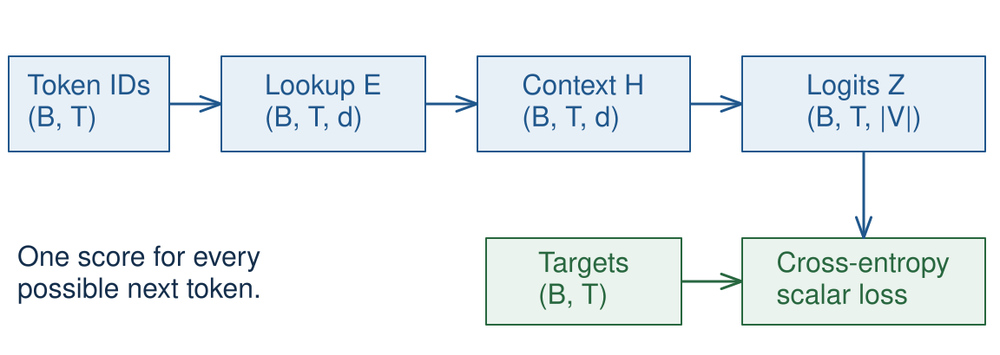
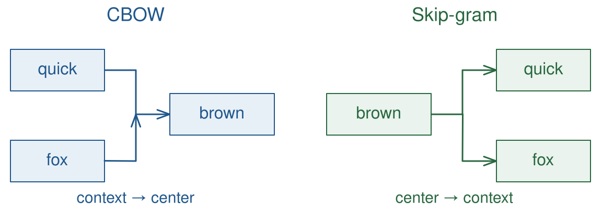
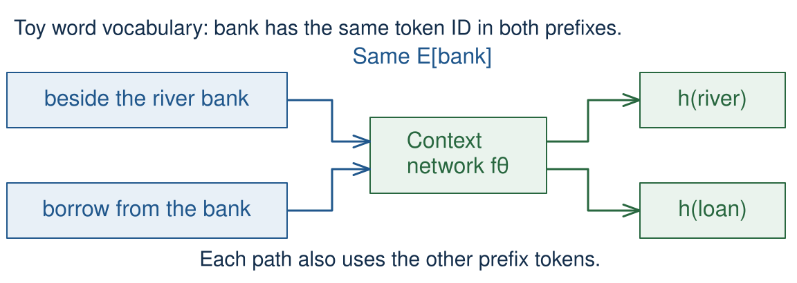
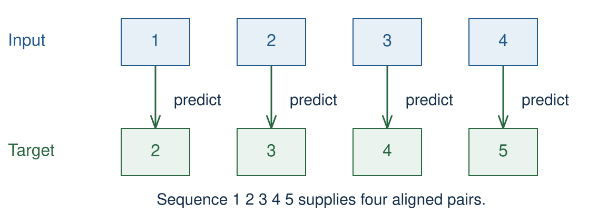
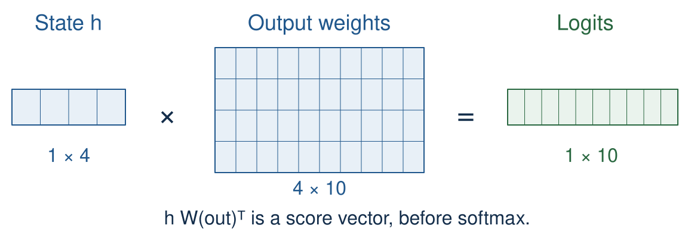
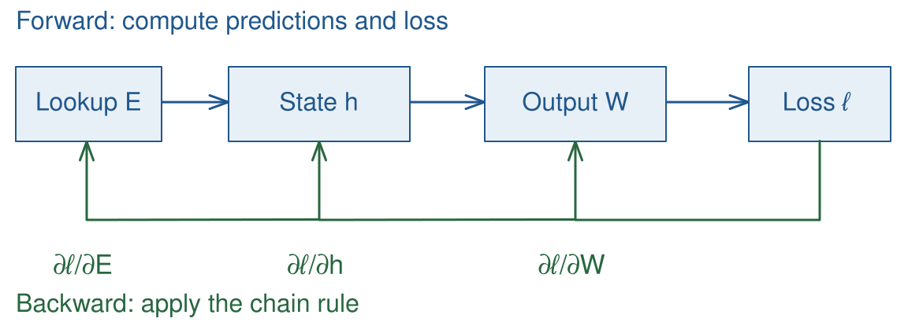
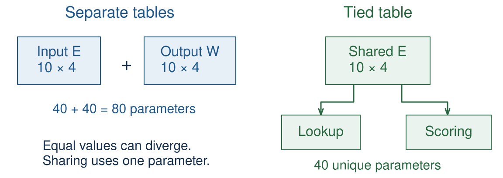

<!-- .slide: class="title-slide" id="title" -->

# Embeddings and PyTorch for LLMs

<p class="eyebrow">Lecture 03 · September 23, 2026</p>
<p class="subtitle">How do discrete tokens become trainable representations?</p>
<p class="byline">Baojian Zhou · Fudan University · CS40008.01</p>

Note:
Three 45-minute periods, including 15 minutes for Quiz 1. The 60-slide deck includes a ten-slide classical bridge, from distributional-hypothesis through similarity-limits. The six exercises are ungraded practice. Start from the n-gram language model introduced last week.

---

<!-- .slide: id="learning-objectives" -->

## What you will be able to do

- Trace token IDs through an embedding table to a next-token loss.
- Run a training step and inspect its gradients.
- Explain weight tying and estimate table and logit memory.

<p class="source">Predict first, then run the notebook. Training examples use toy data; the notebook runs offline on a CPU.</p>

Note:
The running implementation is deliberately a bigram model with learned vectors. A feedforward context network comes next week. Distinguish the mechanics learned today from claims about real-world model quality.

---

<!-- .slide: id="ngram-recap" -->

## From counts to next-token probabilities

<div class="plot" id="ngram-visual" data-plotly="assets/ngram-review.json" role="img" aria-live="polite" aria-label="Toy bigram probabilities after I: am has count 2 and probability 2/3; do has count 1 and probability 1/3. Other output tokens have probability zero."></div>

<form class="demo-form" id="ngram-controls" aria-label="Bigram review controls">
<button type="button" data-ngram-context="I" aria-label="Use context I">I</button>
<button type="button" data-ngram-context="Sam" aria-label="Use context Sam">Sam</button>
<button type="button" data-ngram-context="BOS" aria-label="Use context BOS">BOS</button>
<button type="button" id="ngram-trace">Trace pairs</button>
<button type="button" id="ngram-sample">Sample next</button>
<button type="button" id="ngram-reset">Reset review</button>
</form>

Note:
Allow 3 minutes here and 1 minute for the following neural bridge. Recall Lecture 01: word tokens here are deliberately simple; modern tokenizers can split a word into subwords. IDs are arbitrary indices, not numerical meanings. For this recap, assign IDs 0–9 in Lecture 02's output vocabulary order: EOS, I, am, Sam, do, not, like, eggs, and, ham. BOS is an input-only boundary marker, outside the ten output tokens. This mapping is local to the recap; the later notebook uses its own synthetic IDs.

Reuse Lecture 02, Exercise E01 exactly: [BOS I am Sam EOS], [BOS Sam I am EOS], [BOS I do not like eggs and ham EOS]. Blue marks the context and green the following token. Start with I: ask which token can follow, then Trace pairs → Next pair → Next pair. These clicks traverse only the three matching I contexts, in corpus order. Counts are (am:1, do:0), (am:2, do:0), then (am:2, do:1). Normalize divides by all three outgoing counts. The vertical axis explicitly changes from Count to Probability; all eight omitted output tokens have value zero. There is no smoothing. No pair crosses a sentence boundary, and EOS has no outgoing pair.

Sample next draws once from the displayed complete distribution; it does not choose the largest bar every time or continue a whole sentence. Sampling is disabled during the incomplete count trace. Switch to Sam to show EOS and I at 1/2 each; an EOS draw means stop. BOS gives I at 2/3 and Sam at 1/3. Reset review restores the complete I distribution. These controls accept mouse or keyboard; the initial complete distribution also appears in print. If time is short, show the initial figure and one sample only.

The general task remains p(w1,...,wT) = product_t p(wt | w<t). A bigram approximation keeps only the preceding token, and its unsmoothed MLE is count(context,next) / sum_v count(context,v). Avoid repeating smoothing or perplexity derivations. Corpus and estimates: [Lecture 02 E01](../lecture-02/index.html#/exercise-01). Neural transition: Bengio et al. (2003), Section 2: https://www.jmlr.org/papers/v3/bengio03a.html.

---

<!-- .slide: id="token-to-loss" -->

## The token-to-loss computation



**Same next-token task; learned parameters replace counts.**

Note:
Cross-entropy compares each position’s logits with its next-token target. Follow the arrows during the first explanation, then revisit after E03.

Allow 1 minute. Last week, we estimated next-token probabilities by counting. Today, we learn parameters that produce those probabilities. Point from token IDs to the trainable embedding, output scores, and loss; the prediction task and negative log-likelihood stay the same. This lecture's TinyLM uses h_t = E[w_t], so it is still a bigram model. Learning an embedding does not by itself provide a longer context.

B is the number of sequences, T the input length, d the vector width. In this simple setup the context output has the same width as the embedding; this is a modeling choice, not a universal constraint. Revisit this diagram after each exercise. CS336 Lecture 2 motivates shape reasoning: https://github.com/stanford-cs336/lectures/blob/main/lecture_02.py.

---

<!-- .slide: class="outline-slide" id="outline-representations" -->

## Outline

<ul class="outline-topics">
<li aria-current="step">Token representations</li>
<li>Next-token training in PyTorch</li>
<li>Weight tying and resource costs</li>
</ul>

Note:
Pause to locate the current computation in the token-to-loss path.

---

<!-- .slide: id="representation-types" -->

## Three meanings of “embedding”

| Representation | What determines the vector? |
| --- | --- |
| Token embedding $E[w_t]$ | The token ID |
| Contextual state $h_t$ | The token and its context |
| Retrieval embedding | A query or document, encoded for comparison |

Today we start with the **trainable token table**.

Note:
Do not equate the input lookup with the representation after a Transformer, or with a pooled retrieval vector. A retrieval model can use contextual states internally. Avoid suggesting that modern language models have replaced the token table with a sentence embedding.

---

<!-- .slide: id="lookup-table" -->

## An embedding is a lookup table

<svg id="lookup-visual" width="1152" height="300" viewBox="0 0 1152 300" role="img" aria-label="Embedding lookup example"></svg>

<form class="demo-form" id="lookup-controls" aria-label="Choose a token ID">
<button type="button" data-token-id="1">ID 1</button>
<button type="button" data-token-id="5">ID 5</button>
<button type="button" data-token-id="7">ID 7</button>
<button type="button" id="lookup-reset">Reset lookup</button>
</form>

<p id="lookup-status" aria-live="polite">ID 5 selects a trainable vector; the table is trained with the model.</p>

Note:
Select ID 1, then ID 5 twice: repeating an ID must return the same values. Reset returns ID 5. Values are the notebook E01 initialization, rounded to two decimals; only four of ten rows are drawn. The complete table E has shape (10,4). One-hot multiplication is equivalent to lookup, not the implementation. This replaces about one minute of explanation, adding no new timed activity.

In the toy vocabulary IDs are contiguous and every row has a token. Real model tables can allocate extra rows; we will distinguish those later. One-hot multiplication is a mathematical equivalence: implementations use indexing. PyTorch Embedding documentation: https://docs.pytorch.org/docs/stable/generated/torch.nn.Embedding.html.

---

<!-- .slide: id="lookup-code" -->

## Lookup in PyTorch

```python
V, d = 10, 4
E = torch.nn.Embedding(V, d)
ids = torch.tensor([[1, 5, 5],
                    [7, 1, 0]])
x = E(ids)
```

`ids` contains integers. `E.weight` and `x` contain floating-point numbers.

Repeated ID `5` selects the same vector twice.

Note:
Imports are in the notebook setup cell. Run the code only after students make their prediction in E01. The embedding module is a parameterized operation; E.weight is the actual matrix.

---

<!-- .slide: class="exercise" id="exercise-01" -->

## Predict the lookup shapes

<p class="exercise-meta">Exercise E01 · 4 minutes · Notebook E01</p>

For the preceding code, give the shapes of:

1. `E.weight`, `ids`, and `x`.
2. A one-hot representation of `ids`.

<div class="answer fragment"><p>$(10,4)$, $(2,3)$, $(2,3,4)$; one-hot: $(2,3,10)$.<br>The one-hot product equals lookup, but uses an unnecessary vocabulary axis.</p></div>

Note:
Pairs write the four shapes before running the notebook. A common wrong answer for x is (2,3,10,4). Check equality with F.one_hot(ids, V).float() @ E.weight. Expected output is verified in tests/test_lecture_03.py.

---

<!-- .slide: id="tensor-contract" -->

## A tensor has more than a shape

| Object | Shape | Type in this notebook |
| --- | --- | --- |
| Token IDs | $(B,T)$ | `torch.int64` |
| Lookup weights | $(V,d)$ | `torch.float32` |
| Lookup result | $(B,T,d)$ | `torch.float32` |

```python
print(ids.dtype, E.weight.dtype)
print(ids.device, E.weight.device)
```

Keep model parameters and input tensors on the same device.

Note:
The notebook stays on CPU. Integer IDs select rows; converting IDs to floating point does not turn them into embeddings. Later GPU work moves both the model and its input tensors to the chosen device. Inspect shape, dtype and device together before debugging a loss. CS336 Lecture 2, tensors_basics and tensors_on_gpus: https://github.com/stanford-cs336/lectures/blob/main/lecture_02.py. PyTorch Embedding accepts integer indices; this notebook deliberately uses int64.

---

<!-- .slide: id="distributional-hypothesis" -->

## Learning from contexts

| Toy word | “drink ___” | “hot ___” | “drive ___” |
| --- | ---: | ---: | ---: |
| tea | 8 | 6 | 0 |
| coffee | 7 | 5 | 0 |
| car | 0 | 0 | 9 |

Similar context patterns provide a signal for learning similar representations.

Counting stores the patterns directly; prediction learns compact vectors.

Note:
Start the ten-slide classical bridge here; spend about 25 minutes including E02. These are invented counts, not corpus measurements. Distributional similarity is a useful tendency, not a guarantee of synonymy: antonyms can share contexts. The next two slides reuse this exact table. Detailed TF-IDF belongs with retrieval. Jurafsky and Martin, Chapter 5: https://web.stanford.edu/~jurafsky/slp3/5.pdf.

---

<!-- .slide: id="count-to-ppmi" -->

## Count association, not just frequency

<div class="plot" data-plotly="assets/counts-ppmi.json" role="img" aria-label="Invented counts and their PPMI in bits for tea, coffee, car and drink, hot, drive. Tea and drink: count 8, PPMI 0.415 bits."></div>

$\operatorname{PPMI}(w,c)=\max\left(0,\log_2\frac{p(w,c)}{p(w)p(c)}\right)$; tea–drink: **0.415 bits**.

Note:
Both panels use the preceding notebook counts: total 35, tea row total 14, drink column total 15. PMI(tea,drink) = log2(8×35/(14×15)) = 0.415 bits. The color scales differ: counts 0–9; PPMI 0–2 bits. Compare labeled values, not colors across panels. Hover exposes exact values. The car–drive cell illustrates concentration relative to independence, not raw frequency alone.

Classical bridge 2/10. The denominator is the expectation under independence. The notebook recomputes this example and maps a zero count to PPMI zero; it also notes that rare events can give noisy association estimates. Do the richer published-count exercise only in optional P01. Source: Jurafsky and Martin, Appendix J, equations J.3–J.6: https://web.stanford.edu/~jurafsky/slp3/J.pdf.

---

<!-- .slide: id="count-to-dense" -->

## Compress counts into dense vectors

| Method | Signal used to learn vectors |
| --- | --- |
| Truncated SVD | Low-rank approximation of a weighted count matrix |
| GloVe | Weighted fit to global log co-occurrence counts |

For SVD: $X\approx U_k\Sigma_kV_k^\top$; one choice is $E=U_k\Sigma_k$.

Both give a static vector for each vocabulary word.

**LLM connection:** compact representations; the training objective determines what they preserve.

Note:
Classical bridge 3/10. Notebook X is the preceding 3-by-3 toy PPMI matrix; k=2 gives a 3-by-2 word table. Different weighting and factorization choices produce different geometry. GloVe uses its own weighted least-squares objective with biases; it is not simply the SVD written above. Modern token tables are learned jointly with a language model's context network and objective. Sources: Pennington et al. (2014), Sections 2–3, especially equation 8: https://aclanthology.org/D14-1162/; Bengio et al. (2003), Section 2: https://www.jmlr.org/papers/v3/bengio03a.html.

---

<!-- .slide: id="skipgram-pairs" -->

## word2vec: choose a prediction task



Toy sentence: “the quick brown fox jumps”. Observed pair: **(brown, fox)**; sampled pair: **(brown, car)**.

Note:
Follow the arrow directions. In CBOW the two context vectors are combined before predicting the center. The merge is schematic; it is not two independent CBOW predictions.

Classical bridge 4/10. Radius-one context of brown is quick and fox. CBOW combines context vectors to predict a center word; skip-gram reverses the prediction direction. A sampled negative comes from a chosen noise distribution, not a claim that the pair is impossible. These windows can include both sides; causal next-token training uses preceding tokens. Sources: Mikolov et al. (2013), Sections 3.1–3.2: https://arxiv.org/abs/1301.3781; negative sampling, Section 2.2: https://papers.nips.cc/paper_files/paper/2013/file/9aa42b31882ec039965f3c4923ce901b-Paper.pdf.

---

<!-- .slide: id="skipgram-tables" -->

## Two tables for two roles

$$W,C\in\mathbb{R}^{\lvert V\rvert\times d}$$
$$s(w,c)=W[w]^\top C[c]$$

- $W[w]$: center-word vector.
- $C[c]$: context-word vector.
- The dot product gives a compatibility score.

Training changes both tables.

Note:
Keep the W/C notation within this brief historical example. E and W_out will name the input and output tables of the language model. We retain one score and one update rather than the full word2vec derivation.

---

<!-- .slide: id="skipgram-objective" -->

## Negative sampling

For one positive context $c_+$ and one sampled context $c_-$:

$$\ell=-\log\sigma(\mathbf w^\top\mathbf c_+)
       -\log\sigma(-\mathbf w^\top\mathbf c_-)$$

The sigmoid $\sigma(s)=1/(1+e^{-s})$ scores **observed versus sampled pairs**.

It does not normalize a next-token distribution over the vocabulary. This loss is not language-model perplexity.

Note:
Define sigmoid sigma(z)=1/(1+exp(-z)) verbally. For k negatives, sum k negative terms. Contrast the objective with the normalized vocabulary softmax later. Source: Mikolov et al. (2013), Section 2.2, equation 4; https://papers.nips.cc/paper_files/paper/2013/file/9aa42b31882ec039965f3c4923ce901b-Paper.pdf.

---

<!-- .slide: class="exercise" id="exercise-02" -->

## Predict one gradient

<p class="exercise-meta">Exercise E02 · 4 minutes · Notebook E02</p>

$\mathbf w=(1,0.5)$, $\mathbf c_+=(0.5,1)$, $\mathbf c_-=(1,-1)$.

Given $\sigma(1)=0.7311$ and $\sigma(0.5)=0.6225$:

$$\nabla_{\mathbf c_+}\ell=(\sigma(\mathbf w^\top\mathbf c_+)-1)\mathbf w$$

Compute this gradient. Does an SGD step increase the positive score if $\mathbf w$ stays fixed?

<div class="answer fragment"><p>$(-0.2689,-0.1345)$. Yes: subtracting this gradient moves $\mathbf c_+$ in the direction of $\mathbf w$.</p></div>

Note:
Expected scores are 1.0 and 0.5; total loss is 1.2873. Ask for only the positive-context gradient by hand. The notebook checks all three gradients with autograd. With all three vectors updated at learning rate 0.5, the loss falls to about 0.6509. The fixed-w qualification makes the score-increase statement precise.

---

<!-- .slide: id="autograd" -->

## The same gradient with autograd

```python
w = torch.tensor([1., .5], requires_grad=True)
c_pos = torch.tensor([.5, 1.], requires_grad=True)
c_neg = torch.tensor([1., -1.], requires_grad=True)
loss = -F.logsigmoid(w @ c_pos)
loss = loss - F.logsigmoid(-(w @ c_neg))
loss.backward()
print(c_pos.grad)  # tensor([-0.2689, -0.1345])
```

PyTorch applies the chain rule through the recorded computation.

Note:
Do this immediately after E02. F.logsigmoid computes the log-sigmoid stably; do not replace it with log(1-sigmoid(z)). Explain that only participating tensors that require gradients accumulate .grad, not every tensor in a program. https://docs.pytorch.org/tutorials/beginner/basics/autogradqs_tutorial.html.

---

<!-- .slide: id="subword-heritage" -->

## fastText: share information inside words

fastText composes a word vector from character n-gram vectors and a word feature.

Example trigrams of `<cats>`: `<ca`, `cat`, `ats`, `ts>`.

| Approach | Representation unit |
| --- | --- |
| fastText | Overlapping features summed into a word vector |
| LLM subword tokenizer | A sequence of token IDs, each with a lookup |

Shared lesson: word boundaries need not define the smallest reusable unit.

Note:
Classical bridge 9/10. Boundary symbols mark the word edges; the four trigrams are an illustration, not the full feature inventory. Subword features can help compose vectors for rare or unseen words, but the resulting fastText word representation is still context independent. An LLM tokenizer segments a sequence before the context network acts; it is a different construction. Source: Bojanowski et al. (2017), Section 3.2: https://aclanthology.org/Q17-1010/. Connect this distinction to Lecture 01.

---

<!-- .slide: id="similarity-limits" -->

## What do nearby vectors tell us?

$$\cos(\mathbf u,\mathbf v)=
\frac{\mathbf u^\top\mathbf v}{\lVert\mathbf u\rVert \lVert\mathbf v\rVert}$$

- Neighbors can reveal patterns learned from the corpus.
- Similar contexts can occur for synonyms, antonyms, or related topics.
- A successful analogy is not evidence of general language understanding.

Optional practice trains small vectors and inspects their neighbors.

Note:
End the ten-slide classical bridge here. Static methods remain useful baselines and teaching tools; the next slide distinguishes their table lookup from a contextual state. Avoid a catalog of analogy benchmark scores. The optional corpus is made from templates, so recovered groups largely reflect those templates. Zero vectors need care when computing cosine. See optional notebook P02 and classical-reading.md.

---

<!-- .slide: id="contextual-state" -->

## One token, different contexts



$h_t=f_\theta(E[w_1],\ldots,E[w_t])$: the same lookup can yield different states.

Note:
The box represents the same network with the same parameters, applied separately to each prefix. All prefix tokens enter each computation, including the identical E[bank]. Arrows show possible different states, not numerical evidence or a guarantee.

Use a toy word vocabulary so bank is exactly the same ID in both examples; real subword boundaries can change IDs. Different contexts permit different states but do not mathematically guarantee different outputs for arbitrary parameters. Later lectures develop the context network. End period 1 here.

---

<!-- .slide: class="outline-slide" id="outline-training" -->

## Outline

<ul class="outline-topics">
<li>Token representations</li>
<li aria-current="step">Next-token training in PyTorch</li>
<li>Weight tying and resource costs</li>
</ul>

Note:
Pause to locate the current computation in the token-to-loss path.

---

<!-- .slide: id="shifted-sequences" -->

## Constructing next-token examples



A sequence of length $T+1$ supplies $T$ input–target pairs. Each target is the **next** token.

Note:
Point down each aligned column. The diagram does not feed targets back into a current prediction; targets are used only to compute loss.

Teacher forcing supplies the observed tokens as inputs. A causal model must not use future tokens when computing a current prediction. Here we use equal-length toy sequences and no padding; masking and packing come later.

---

<!-- .slide: id="shift-code" -->

## Shifting a batch in code

```python
tokens = torch.tensor([[1, 2, 3, 4, 5],
                       [5, 6, 7, 8, 9]])
inputs = tokens[:, :-1]
targets = tokens[:, 1:]
B, T = inputs.shape
```

Both slices have shape $(2,4)$.

Use `reshape` when flattening these slices: they need not be contiguous.

Note:
The notebook uses this batch throughout E03 and E04. IDs are invented integers in a ten-token vocabulary, not a real tokenizer output. Show how row boundaries remain separate: there is no training pair joining the end of the first row to the start of the second.

---

<!-- .slide: class="exercise" id="exercise-03" -->

## Check the targets and loss shape

<p class="exercise-meta">Exercise E03 · 4 minutes · Notebook E03</p>

For the two sequences, $\lvert V\rvert=10$ and $d=4$:

1. Write the last target in each row.
2. Give the shapes of the embeddings and logits.
3. How many predictions enter the mean loss?

<div class="answer fragment"><p>Targets: $5$ and $9$. Shapes: $(2,4,4)$ and $(2,4,10)$. There are $8$ predictions.</p></div>

Note:
Pairs predict before running. The loss will receive logits reshaped to (8,10) and integer targets reshaped to (8,). E03 continues through the output projection and stable-loss cells that follow.

---

<!-- .slide: id="context-computation" -->

## Choosing a context computation

| Model | Representation used for prediction |
| --- | --- |
| Today's toy bigram model | $h_t=E[w_t]$ |
| Feedforward neural LM | Network over a fixed window of embeddings |
| Causal Transformer | Contextual state using the prefix |

The output layer turns any suitable $h_t$ into vocabulary scores.

Note:
Bengio et al. (2003), Section 2, concatenates a fixed window of embeddings and uses a nonlinear hidden layer: https://www.jmlr.org/papers/v3/bengio03a.html. Do not teach attention details here. Our toy model is a learned, low-dimensional bigram parameterization; it is not a Transformer or a model of the full prefix.

---

<!-- .slide: id="tiny-lm" -->

## A tiny neural bigram model

```python
class TinyLM(torch.nn.Module):
    def __init__(self, V, d):
        super().__init__()
        self.embedding = torch.nn.Embedding(V, d)
        self.output = torch.nn.Linear(d, V, bias=False)

    def forward(self, ids):
        h = self.embedding(ids)
        return self.output(h)
```

The notebook uses small initial embeddings and a zero output table.

Note:
This is the complete forward computation of the untied toy model. Notebook initialization is explicit for a controlled uniform-loss check. The notebook class also accepts a share_weights option introduced in E05. Do not initialize both tables to zero: then neither table has a learning signal through this product.

---

<!-- .slide: id="bigram-limits" -->

## What this toy model cannot learn

If two prefixes end in the same token ID, `TinyLM` produces the same next-token distribution.

“river **bank**” and “borrow from the **bank**” have the same input to its prediction.

Learning a table does not automatically add context.

Next week we will replace $h_t=E[w_t]$ with a network over a longer history.

Note:
Show repeated positions in the notebook and compare their logits. This constraint also limits the tiny-batch overfitting check: conflicting next-token labels for the same input token cannot all receive probability one.

---

<!-- .slide: id="output-projection" -->

## Vocabulary logits



$Z=H W_{out}^{\top}$ maps $(B,T,d)$ to $(B,T,|V|)$, one score per output token.

Note:
The picture expands one position in the notebook: d=4 and V=10. The same multiplication is repeated across B×T positions. W_out itself is (10,4); its transpose is (4,10).

PyTorch Linear stores its weight as (out_features,in_features), hence the transpose in the explicit matrix product. A bias is omitted throughout these examples. The model returns raw scores, not probabilities.

---

<!-- .slide: id="softmax-loss" -->

## Softmax and next-token loss

$$p(j\mid\text{context})=\frac{e^{z_j}}{\sum_{k=1}^{\lvert V\rvert}e^{z_k}}$$
$$\ell=-\log p(y\mid\text{context})$$

Cross-entropy averages this loss over the input positions.

Unlike negative sampling, this objective uses a normalized distribution over the output vocabulary.

Note:
This is the classification background needed today: scores, a normalized distribution, and negative log-likelihood. The target y is a token ID. We omit the Naive Bayes and logistic-regression survey. With extra allocated output rows, the implemented softmax dimension is the number of rows M; later distinguish M from tokenizer entries.

---

<!-- .slide: id="cross-entropy-code" -->

## Cross-entropy takes raw logits

```python
logits = model(inputs)              # (B, T, V)
loss = F.cross_entropy(
    logits.reshape(-1, V),          # (B*T, V)
    targets.reshape(-1),            # (B*T,)
)
```

Do not apply softmax before `cross_entropy`.

The function combines log-softmax with the target-token loss.

Note:
Reference: https://docs.pytorch.org/docs/stable/generated/torch.nn.CrossEntropyLoss.html. The class dimension is the second dimension after flattening. Integer class-index targets must lie within the output range. Show the notebook agreement with -log_softmax(...).gather(...).mean().

---

<!-- .slide: id="reshape-batch" -->

## Flatten positions without mixing labels

The slice `targets = tokens[:, 1:]` can be non-contiguous.

```python
print(targets.shape, targets.is_contiguous())
flat_targets = targets.reshape(-1)
flat_logits = logits.reshape(-1, V)
print(flat_targets.shape, flat_logits.shape)
```

Shapes: `(8,)` and `(8, 10)`; both flatten positions in the same order.

`reshape` may copy storage when needed. `view` requires compatible strides.

Note:
The notebook shows that view(-1) fails on this particular target slice and verifies the flattened label order. Non-contiguous tensors are not intrinsically wrong; the issue is whether a requested view can represent their layout. No row boundary is turned into an extra prediction pair. Source: PyTorch tensor views and reshape: https://docs.pytorch.org/docs/stable/tensor_view.html and https://docs.pytorch.org/docs/stable/generated/torch.reshape.html.

---

<!-- .slide: id="uniform-loss" -->

## A controlled loss check

Set all logits to zero:

$$p(j)=\frac{1}{\lvert V\rvert},\qquad \ell=\log\lvert V\rvert$$

For $\lvert V\rvert=10$: loss $=2.3026$ nats; perplexity $=10$.

**Exactly uniform logits** give this baseline. Random initialization can give a different loss, depending on its scale.

Note:
E03 zeros the output table on purpose, so the result is exact up to floating-point rounding. Do not teach that an arbitrary randomly initialized model must have loss near log V, or that any larger loss proves a bug. Large logits can make the initial prediction sharply nonuniform.

---

<!-- .slide: id="stable-loss" -->

## Numerical stability matters

For a negative sample with score $s$:

| float32 computation | $s=1$ | $s=100$ |
| --- | ---: | ---: |
| $-\log(1-\sigma(s))$ | 1.3133 | infinity |
| `-F.logsigmoid(-s)` | 1.3133 | 100.0 |

Mathematically equivalent formulas can behave differently in finite precision.

Note:
The notebook reproduces both rows on CPU in E03. For score 100, sigmoid rounds to 1 in float32, causing log(0). Use stable log-sigmoid for negative sampling and cross_entropy for next-token loss. This is a small numerical example, not a request to train in low precision today.

---

<!-- .slide: id="backward-pass" -->

## Inspecting gradients



`loss.backward()` accumulates gradients; `zero_grad()` clears them. Each parameter gradient has its parameter’s shape.

Note:
The diagram expands the backward call in the notebook; the following slide retains the full training step. The lookup gradient is (10,4), and the output gradient is (10,4). Arrows show dependencies, not a guarantee that each gradient is nonzero.

Expected shape is (10,4). With zero output weights, the input table receives a zero gradient on the first step; the output table receives a nonzero gradient and enables learning of the input table on later steps. Nonzero gradient depends on the computation and current parameter values. Autograd documentation: https://docs.pytorch.org/tutorials/beginner/basics/autogradqs_tutorial.html.

---

<!-- .slide: id="training-step" -->

## One training step

```python
optimizer.zero_grad()
logits = model(inputs)
loss = F.cross_entropy(
    logits.reshape(-1, V), targets.reshape(-1))
loss.backward()
optimizer.step()
```

With SGD, the final line applies $\theta\leftarrow\theta-\eta\nabla_\theta\ell$.

Note:
Choose the optimizer once, outside the training loop. Clearing gradients, computing a forward pass and loss, backpropagating, and taking an optimizer step form the basic loop. Other optimizers use different updates. CS336 Lecture 2, train_loop: https://github.com/stanford-cs336/lectures/blob/main/lecture_02.py.

---

<!-- .slide: class="exercise" id="exercise-04" -->

## Train on one tiny batch

<p class="exercise-meta">Exercise E04 · 6 minutes · Notebook E04</p>

Train `TinyLM` on the shifted batch for 200 SGD updates.

1. Record the initial and final loss.
2. Compare predicted token IDs with the targets.
3. Explain why fitting this batch does not measure generalization.

<div class="answer fragment"><p>The controlled initial loss is $\log 10$. The loss should fall and all eight predictions should match. This batch is training data.</p></div>

Note:
Use an untied model, dimension 4, small input initialization, zero output initialization, seed 0, and learning rate 0.5. This batch has one target for each observed input token, so its labels are compatible with a bigram model. The offline test verifies predictions and a final loss below 0.1; do not require an identical floating-point trajectory across platforms.

---

<!-- .slide: id="training-curve" -->

## Learning the toy batch

<div class="plot" data-plotly="assets/tiny-lm-loss.json" role="img" aria-label="Cross-entropy in nats versus SGD updates on the fixed eight-pair toy training batch"></div>

<p class="caption">One deterministic CPU demonstration. Hover for values; this is training loss, not validation performance.</p>

Note:
The teaching figure samples the E04 run. Zero on the horizontal axis is before any update; the rightmost value is after 200 updates. Source: lecture-03-exercise.ipynb, E04; seeds and optimizer settings are recorded in the asset provenance. Ask what extra data is needed to measure generalization.

---

<!-- .slide: id="evaluation-step" -->

## Evaluate without updating the model

Hold out two toy pairs: **0 → 1** and **9 → 0**.

```python
val_inputs = torch.tensor([[0, 9]])
val_targets = torch.tensor([[1, 0]])
model.eval()
with torch.no_grad():
    val_loss = next_token_loss(model(val_inputs), val_targets)
model.train()
```

`eval()` changes module behavior; `no_grad()` disables gradient recording.

Note:
These are deliberately selected coverage probes: IDs 0 and 9 never occurred as inputs in the E04 training batch. They were held out from all 200 updates. Two constructed pairs cannot estimate representative corpus performance. The helper next_token_loss is the E03 cross-entropy computation. TinyLM has no dropout or batch normalization, so eval() does not change its output here; the distinction matters in larger models. The notebook restores the previous training mode and verifies that evaluation leaves parameters and gradients unchanged. PyTorch evaluation modes: https://docs.pytorch.org/docs/stable/notes/autograd.html#locally-disabling-gradient-computation.

---

<!-- .slide: id="evaluation-coverage" -->

## Low training loss can leave blind spots

| Check | What it tells us |
| --- | --- |
| Fit the eight training pairs | The update loop can learn compatible labels |
| Probe unseen input IDs 0 and 9 | Their untied lookup rows received no training gradient |
| Evaluate representative held-out text | Needed to assess language-model generalization |

Read both losses in Notebook E04.

The two-pair probe checks coverage; it is not a benchmark score.

Note:
The output table was updated during training, including its rows for possible output tokens; the absent input rows were not. Unchanged input rows can still produce changed predictions through the learned output table. Do not infer that every unseen input must have high loss, or choose these two pairs to tune training hyperparameters. A meaningful evaluation needs sufficient independently held-out text and a specified sampling distribution. Keep the toy fitting demonstration separate from that claim.

---

<!-- .slide: id="training-checks" -->

## Checks before a larger experiment

- Check that inputs and targets are shifted correctly.
- Verify shapes, target ranges, and finite losses.
- Confirm that relevant parameters receive gradients and change.
- Fit a compatible tiny batch, then evaluate held-out data.

A model with insufficient context or capacity may be unable to fit a batch perfectly.

Note:
Do not make zero training loss a universal requirement. Conflicting labels for identical bigram inputs provide a simple counterexample. Keep validation text separate from training data; refer to Lecture 02 for held-out perplexity. End period 2 here.

---

<!-- .slide: class="outline-slide" id="outline-resources" -->

## Outline

<ul class="outline-topics">
<li>Token representations</li>
<li>Next-token training in PyTorch</li>
<li aria-current="step">Weight tying and resource costs</li>
</ul>

Note:
Pause to locate the current computation in the token-to-loss path.

---

<!-- .slide: id="weight-sharing" -->

## Using one table for two roles



`model.output.weight = model.embedding.weight` shares one parameter.

Note:
Read the left side as two independent Parameter objects, even if initialized with equal values. On the right the two modules point to the same object; both gradient pathways contribute to it. The diagram counts only input and output tables.

Tie before constructing the optimizer. Copying the values once is not tying because subsequent updates could diverge. The notebook constructor handles the assignment. Weight tying is an architectural choice; it does not occur in every language model. Press and Wolf (2017): https://aclanthology.org/E17-2025/.

---

<!-- .slide: class="exercise" id="exercise-05" -->

## Which rows receive gradients?

<p class="exercise-meta">Exercise E05 · 4 minutes · Notebook E05</p>

Input IDs: `[[1, 5, 5], [7, 1, 0]]`; $\lvert V\rvert=10$.

Compare a nonzero, untied output table with a tied table.

Which rows of the **input embedding parameter** can receive gradients from next-token cross-entropy?

<div class="answer fragment"><p>Untied lookup: only selected rows $0,1,5,7$ can receive gradients. Tied output: every row can; this example gives all ten nonzero gradients.</p></div>

Note:
E05 copies the same nonzero values into the untied input and output tables and the tied table, so both models start with identical logits. The untied tables remain distinct Parameter objects. This isolates the change in gradient pathways. The targets are [[5,5,2],[1,0,3]], used only to illustrate gradients. This batch is not the E04 memorization batch. No optimizer step is involved; weight decay and previous optimizer state are outside the claim.

---

<!-- .slide: id="tied-gradient" -->

## The output layer reaches every row

For an output row $j$ at one position:

$$\frac{\partial\ell}{\partial W_{out}[j]}=
\bigl(p(j)-\mathbf 1[j=y]\bigr)h$$

- Softmax compares the target with all output rows.
- Tying adds this output contribution to the lookup gradient.
- A token absent from the inputs can therefore have its shared row updated.

Note:
This describes gradient pathways, not a guarantee of a nonzero gradient for arbitrary data and parameters: h can be zero, and contributions can cancel. For an untied lookup with no other parameter use, only selected rows get loss gradients. An optimizer with weight decay or momentum can still change a row without a new nonzero lookup gradient. Press and Wolf (2017), Section 3, discusses tied embedding updates.

---

<!-- .slide: id="table-parameters" -->

## Counting unique parameters

With $M$ allocated rows and width $d$:

| Input and output tables | Unique parameters |
| --- | ---: |
| Separate tables, no bias | $2Md$ |
| Tied table, no bias | $Md$ |

In our toy model, $M=\lvert V\rvert=10$ and $d=4$: **80 versus 40**.

Note:
Count unique Parameter objects, not module references. sum(p.numel() for p in model.parameters()) deduplicates the shared table. M is introduced for real model configurations that may allocate more rows than the tokenizer has entries. These counts exclude all context-network parameters.

---

<!-- .slide: id="model-configurations" -->

## Two Qwen configurations

| Configuration | Qwen3-0.6B | Qwen3-8B |
| --- | ---: | ---: |
| Embedding rows $M$ | 151,936 | 151,936 |
| Hidden width $d$ | 1,024 | 4,096 |
| Tied input/output | Yes | No |

Read `vocab_size`, `hidden_size`, and `tie_word_embeddings` in the configuration.

<p class="source">Source: pinned official Qwen configurations; links and revisions in the notebook.</p>

Note:
These are selected fields, not a complete architecture comparison. Do not infer a universal size-based rule for tying from two examples. Qwen3-0.6B revision c1899de289a04d12100db370d81485cdf75e47ca; Qwen3-8B revision b968826d9c46dd6066d109eabc6255188de91218. All source URLs and hashes are in assets/model-configs.json; no weights are required.

---

<!-- .slide: id="vocabulary-vs-rows" -->

## Tokenizer entries and embedding rows

The two pinned Qwen tokenizer files contain **151,669 distinct token IDs**, with maximum ID **151,668**.

Their configurations allocate **151,936 rows**.

- Count tokenizer IDs to describe the tokenizer.
- Use allocated rows $M$ to count model parameters.
- Valid token IDs must fit inside the table.

Note:
Both pinned tokenizer.json files have SHA-256 aeb13307a71acd8fe81861d94ad54ab689df773318809eed3cbe794b4492dae4. Count the union of model.vocab IDs and added_tokens IDs to avoid double counting. In general IDs may have gaps, so entry count alone does not determine required table height: M must exceed the largest supported ID. These artifacts use contiguous IDs. The model config field is called vocab_size, but its role here is table allocation.

---

<!-- .slide: class="exercise" id="exercise-06" -->

## Count parameters and storage

<p class="exercise-meta">Exercise E06 · 4 minutes · Notebook E06</p>

$M=32{,}000$, $d=512$; no output bias.

1. Count unique table parameters with and without tying.
2. Find the storage for one table in bf16 (2 bytes per value).

<div class="answer fragment"><p>Tied: $16,384,000$. Untied: $32,768,000$.<br>One bf16 table: $32,768,000$ bytes $=31.25$ MiB.</p></div>

Note:
MiB means 2^20 bytes. Ask students to verify the toy counts by summing model.parameters(), then apply the same arithmetic to the two real configurations. This is parameter storage, not total training memory.

---

<!-- .slide: id="model-table-costs" -->

## The cost of the two Qwen tables

<table class="compact">
<thead><tr><th>Model</th><th>One table</th><th>Unique input + output</th><th>bf16 storage</th></tr></thead>
<tbody>
<tr><td>Qwen3-0.6B</td><td>155,582,464</td><td>155,582,464</td><td>296.75 MiB</td></tr>
<tr><td>Qwen3-8B</td><td>622,329,856</td><td>1,244,659,712</td><td>2,374 MiB</td></tr>
</tbody>
</table>

Counts exclude the rest of the model.

Training also stores gradients, optimizer state, and intermediate activations.

Note:
Arithmetic uses the pinned configurations and is computed in E06. For 8B, two separate bf16 tables use 1,244,659,712 times 2 bytes. No claim about total device memory follows from these values. CS336 Lecture 2 separates parameters, gradients, activations and optimizer state: https://github.com/stanford-cs336/lectures/blob/main/lecture_02.py.

---

<!-- .slide: id="training-memory" -->

## Build a training-memory ledger

<svg id="memory-visual" width="1152" height="345" viewBox="0 0 1152 345" role="img" aria-label="fp32 parameter, gradient, and Adam moment storage"></svg>

<form class="demo-form" id="memory-controls" aria-label="Change the table dimensions; fp32 throughout">
<button type="button" id="memory-rows">Rows: 32,000</button>
<button type="button" id="memory-width">Width: 512</button>
<button type="button" id="memory-reset">Reset memory</button>
</form>

<p class="caption">fp32 throughout. Activations, scalar counters, temporary buffers and allocator overhead are additional.</p>

Note:
Click Rows to double 32,000 to 64,000, and Width to double 512 to 1,024. Each dimension doubles all displayed payloads; both together quadruple them. The fixed bar scale is 0–500 MiB. Reset returns the E06 count and 250 MiB subtotal (62.5 parameters + 62.5 gradients + 125 moments). These are the selected table parameters, not a full LLM memory estimate. Use about one minute inside the existing resource segment; no extra exercise is added.

Reuse E06's parameter count. This is an explicit fp32 accounting example, not a universal mixed-precision formula or a total device-memory estimate. SGD without momentum has no persistent moment tensors: parameters plus gradients would be 125 MiB under the same assumptions. Adam adds first- and second-moment tensors; optional variants or master copies can change storage. CS336 Lecture 2, optimizer and tensors_memory: https://github.com/stanford-cs336/lectures/blob/main/lecture_02.py. PyTorch Adam: https://docs.pytorch.org/docs/stable/generated/torch.optim.Adam.html.

---

<!-- .slide: id="inspect-training-state" -->

## Check the tensors actually stored

Notebook E06 takes one Adam step on an **80-parameter** fp32 model.

```python
nbytes = lambda t: t.numel() * t.element_size()
parameter_bytes = sum(nbytes(p) for p in probe.parameters())
gradient_bytes = sum(nbytes(p.grad) for p in probe.parameters())
state_bytes = sum(
    nbytes(t) for state in probe_opt.state.values()
    for t in state.values() if torch.is_tensor(t)
)
```

Count unique parameters, then inspect gradients and initialized optimizer state.

Note:
The notebook prints the three payload totals and checks the two Adam moment tensors separately from scalar step counters. State is created on the first optimizer step, so measuring a fresh optimizer would miss the moments. This counts tensor contents, not peak process or accelerator memory; PyTorch allocators, workspaces, activations and Python objects add other costs. All tensors in this demonstration are small and remain on CPU. Compare the formula on the preceding slide with these measured payloads.

---

<!-- .slide: id="logit-costs" -->

## The vocabulary also affects activations

Logits have $BTM$ values.

For $B=2$, $T=1024$, $M=151{,}936$:

**593.5 MiB** for a materialized bf16 logits tensor.

Dense output projection takes about $2BTdM$ floating-point operations.

Weight tying saves table storage; it does not remove these output scores.

Note:
Count a multiply and an add as two FLOPs; omit bias and lower-order operations. This is forward projection only, not full training FLOPs. Actual peak memory depends on precision, kernels and whether logits are materialized; cross-entropy may use higher precision. Later systems lectures cover ways to avoid materializing full intermediates. E06 verifies the byte count.

---

<!-- .slide: id="projection-work" -->

## Count work as well as stored parameters

In the toy model: $B=2$, $T=4$, $d=4$, $V=10$.

| Quantity | Count |
| --- | ---: |
| Output-table parameters | $dV=40$ |
| Prediction positions | $BT=8$ |
| Forward projection FLOPs | $2BTdV=640$ |

The same weights are used at every position.

More tokens increase computation even when the parameter count stays fixed.

Note:
Count each multiply and add as one FLOP, giving the usual approximate 2mnk matmul convention. This excludes softmax, loss, backward computation and optimizer updates. E06 verifies the arithmetic without a hardware benchmark. Embedding lookup selects rows; it does not execute the full one-hot matrix product used to explain its equivalence. CS336 Lecture 2, tensor_operations_flops and gradients_flops: https://github.com/stanford-cs336/lectures/blob/main/lecture_02.py. Later systems lectures relate operation counts to measured runtime.

---

<!-- .slide: id="tokenizer-tradeoff" -->

## Vocabulary size is a design choice

A larger tokenizer vocabulary may shorten token sequences for the same text.

It also enlarges the input and output tables and the output vocabulary axis.

Compare **token count on the same text**, allocated rows, and model width together.

Changing the tokenizer can affect both sequence cost and vocabulary cost.

Note:
Do not promise that increasing vocabulary always shortens every sequence or always saves computation. Tokenizer algorithm, training data and languages matter. Connect this trade-off to Lecture 01 and the tokenizer-comparison task. Keep the full model timeline in issue 154 as a separate document.

---

<!-- .slide: id="retrieval-preview" -->

## A document vector for retrieval

A retrieval model encodes a query or document into a vector for similarity search.

Its training objective and pooling or projection determine what that vector represents.

Qwen3-Embedding is one example; it is a different model family from the Qwen3 causal LMs just inspected.

We will return to retrieval embeddings when studying search and RAG.

Note:
Do not suggest that a raw token-table row or an arbitrary average of causal-LM states automatically gives a good retrieval embedding. Source: Qwen3 Embedding technical report, https://arxiv.org/abs/2506.05176. No model download or live retrieval service is needed for this lecture.

---

<!-- .slide: id="student-contribution" -->

## Contribute one verified model row

Work in pairs on the [course model table](https://github.com/baojian/llm-26-fall/issues/154).

- Verify one model's configuration and tokenizer metadata.
- Record embedding rows, token IDs, width, and weight tying.
- Compute table parameters; include a **Sources and Notes** column.
- Have another pair check the evidence and arithmetic.

<p class="caption">Optional course contribution. Read metadata; model weights are unnecessary.</p>

Note:
This is an invitation to collaborate on issue 154, not a new graded assignment. Follow the issue scope for release dates and context lengths; do not infer tokenizer details for closed models when public artifacts are unavailable. Pin revisions and distinguish published facts from derived values. Notebook P03 shows a source-check procedure.

---

<!-- .slide: id="exit-questions" -->

## Before you leave

1. Why can the same token have different contextual states?
2. What connects a batch of token IDs to a scalar training loss?
3. Why can tying update an embedding row absent from the input?
4. Which costs increase when the output vocabulary grows?

**Next lecture:** use a longer context in a neural language model.

Note:
Expected responses: (1) context network, not lookup alone; (2) lookup, context computation, output projection and shifted-target cross-entropy; (3) output softmax gradients; (4) table parameters, materialized logits and dense projection work, holding other dimensions fixed. End the 120-minute teaching portion, then reserve 15 minutes for Quiz 1. Keep quiz content in the private instructor repository.

---

<!-- .slide: class="references" id="reading-pytorch" -->

## Reading: language-model mechanics

- [CS336 Lecture 2](https://github.com/stanford-cs336/lectures/blob/main/lecture_02.py): `tensors_basics`, `tensors_memory`, `gradients_basics`, `train_loop`.
- [PyTorch Embedding](https://docs.pytorch.org/docs/stable/generated/torch.nn.Embedding.html) and [CrossEntropyLoss](https://docs.pytorch.org/docs/stable/generated/torch.nn.CrossEntropyLoss.html): shapes and inputs.
- [Bengio et al. (2003)](https://www.jmlr.org/papers/v3/bengio03a.html), Section 2: the neural probabilistic language model.

Note:
These are the closest CS336 connections at this stage. Detailed GPU arithmetic intensity, distributed execution and Transformer architecture belong later. Students can use the notebook offline; these readings need network access.

---

<!-- .slide: class="references" id="references" -->

## References and optional reading

- [Mikolov et al. (2013)](https://papers.nips.cc/paper_files/paper/2013/file/9aa42b31882ec039965f3c4923ce901b-Paper.pdf), §2.2: negative sampling.
- [Press and Wolf (2017)](https://aclanthology.org/E17-2025/), §3: tied embeddings.
- [Qwen3-Embedding report](https://arxiv.org/abs/2506.05176): retrieval representations.
- [Classical background](classical-reading.md): counting, static embeddings, and the Spring lecture.

<p class="source">Official model revisions and selected fields: <a href="assets/model-configs.json">configuration evidence</a>.</p>

Note:
Notebook P01 covers PPMI; P02 trains and inspects toy skip-gram vectors; P03 verifies the source metadata. These are optional, ungraded activities. The full Spring deck remains available from the background reading.
