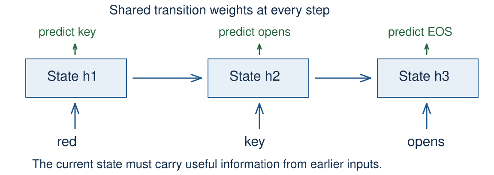
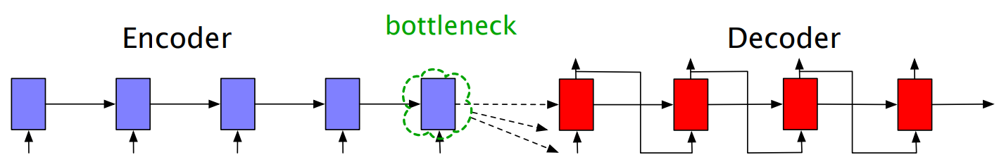

<!-- .slide: class="title-slide" id="title" -->

<p class="eyebrow">CS40008.01</p>

# Neural language models and recurrent attention

<p class="subtitle">Lecture 04 – NLP and LLMs</p>

<p class="byline">Baojian Zhou<br>School of Data Science<br>Fudan University<br>September 30, 2026</p>

Note:
Three 45-minute periods. The notebook's E01–E05 are ungraded classroom practices. All examples run offline on CPU. The first period extends last week's model, the second develops recurrent states and gated memory, and the third introduces additive alignment in an RNN encoder–decoder. The shared Notebook link opens a personal working copy.

---

<!-- .slide: id="learning-objectives" -->

## What you will be able to do

**How can a model retain and select useful context?**

- Train a fixed-window neural language model.
- Trace a recurrent state and its gradient paths.
- Explain an LSTM cell update and its gates.
- Compute an RNN decoder's weighted source context.
- Distinguish source context from target history.

Note:
Allow 1 minute for the opening two slides. The first period extends Lecture 03's one-token model. The second develops recurrent memory. The third introduces Bahdanau's additive alignment inside an RNN encoder–decoder. Lecture 05 develops Q/K/V projections, scaled dot products, and causal self-attention.

---

<!-- .slide: id="bigram-recap" -->

## Lecture 03's context limit

$$h_t=E[w_t],\qquad z_t=W_o h_t+b_o$$

$$p(w_{t+1}\mid w_t)=\operatorname{softmax}(z_t)$$

The lookup and output projection learn parameters.

**Only the current token determines the next prediction.**

Note:
Allow 2 minutes with the next slide. Recall the vector-bottleneck bigram TinyLM from Lecture 03. Adding a trainable embedding does not let this computation see earlier words. Here t indexes the current input token and z_t predicts t+1. Source: ../lecture-03/teaching-plan.md, learning objectives and running model.

---

<!-- .slide: id="same-last-token" -->

## Two prefixes, one last token

| Observed prefix | Next token in our toy corpus |
| --- | --- |
| BOS **red** key | opens |
| BOS **blue** key | closes |

A bigram must use the same distribution after **key**.

A two-token context can distinguish the prefixes.

<p class="source">Invented text. The two cases occur equally often.</p>

Note:
Ask which information the model needs. Restrict attention to these two targets: the optimal bigram probabilities are 1/2 and 1/2, giving mean loss log(2) nats. Do not claim that all natural-language continuations are deterministic. This corpus is a deliberately controlled debugging example. The notebook trains on six length-2 context/target pairs across the two complete sentences.

---

<!-- .slide: class="outline-slide" id="outline-feedforward" -->

## Outline

<ul class="outline-topics">
<li aria-current="step">Feedforward language models</li>
<li>Recurrent states and gated memory</li>
<li>Attention in an RNN encoder–decoder</li>
</ul>

<p class="caption">Period 1 · 45 minutes, including E01 and E02</p>

Note:
Allow 1 minute. Keep this same three-topic outline at each period transition. Trace one end-to-end computation before discussing alternative context mechanisms.

---

<!-- .slide: id="toy-vocabulary" -->

## A small vocabulary

| ID | 0 | 1 | 2 | 3 | 4 | 5 | 6 |
| --- | --- | --- | --- | --- | --- | --- | --- |
| Token | BOS | red | blue | key | opens | closes | EOS |

- IDs are arbitrary lookup indices.
- BOS marks the start; EOS marks the end.
- Each context predicts one following token.

Note:
Allow 2 minutes with the next slide. These IDs are local to this lecture, not the Lecture 02 or 03 mappings. Our seven-row output layer includes BOS, although BOS is never a target. There is no padding. We start each length-2 window only once two observed input tokens exist. No example crosses a sentence boundary or predicts after EOS.

---

<!-- .slide: id="context-windows" -->

## Context windows and targets


<p class="caption">Context size C = 2. Advance the window by one token.</p>

Note:
Point to the target outside each context. The blue sentence supplies three more examples in the notebook. Splitting a corpus into train/dev documents must happen before extracting overlapping windows. This particular demonstration uses only a tiny training batch. It has no held-out evaluation.

---

<!-- .slide: id="feedforward-path" -->

## The feedforward language model


<p class="caption">Every position in the fixed window has a place in the concatenated vector.</p>

Note:
Allow 3 minutes with the next slide. Retain the NPLM mechanism from the Spring Lecture 04 slides, pages 17–20, and notebook section 3. The new CPU example uses nn.Module and a local vocabulary, with no Transformers wrapper or downloads. This simplified Bengio-style network omits the optional direct input-to-output connection. Source: Bengio et al. (2003), §2, https://www.jmlr.org/papers/v3/bengio03a.html.

---

<!-- .slide: id="hidden-nonlinearity" -->

## A hidden representation of the context

$$x=[E[w_{t-1}];E[w_t]]$$

$$h=\tanh(W_hx+b_h),\qquad z=W_oh+b_o$$

The nonlinearity lets the network learn interactions.

Consecutive affine layers alone collapse to one affine map.

Note:
Use column-vector notation here. In PyTorch the batch stores row vectors and nn.Linear stores weights as (out_features, in_features). The semicolon in x means concatenation, not summation. This carries forward the Spring slides' nonlinearity and hidden-representation explanation, pages 4–14, without repeating the full XOR derivation. A deeper stack is possible but unnecessary for our debugging example.

---

<!-- .slide: id="shape-ledger" -->

## Shapes through the model

| Quantity | Shape |
| --- | --- |
| Context IDs | $(B,C)$ |
| Embedding lookup | $(B,C,d)$ |
| Concatenated context | $(B,Cd)$ |
| Hidden representation | $(B,h)$ |
| Vocabulary logits | $(B,\lvert V\rvert)$ |

Note:
Allow 2 minutes. B is the number of context windows, not necessarily the number of original documents. There is one target per row. Preserve the within-window position order during flattening. This shape-first reasoning follows CS336 Lecture 2's tensor/einops examples: https://github.com/stanford-cs336/lectures/blob/main/lecture_02.py, tensor_einops().

---

<!-- .slide: class="exercise" id="exercise-01" -->

<p class="exercise-meta">Exercise E01 · 4 minutes · predict, then check</p>

## Contexts and tensor shapes

For **BOS red key opens EOS**, list the three windows and targets.

With $B=2$, $C=2$, $d=4$, $h=8$, and $|V|=7$, give the lookup, concatenated, hidden, and logit shapes.

<div class="answer fragment">
<p>BOS red → key; red key → opens; key opens → EOS.</p>
<p>Shapes: (2, 2, 4), (2, 8), (2, 8), (2, 7).</p>
</div>

Note:
Ask students to write their answers before revealing them. In the notebook E01 uses the first two of six windows, matching B=2. Common mistake: keeping a sequence-length axis in the output even though this model produces one next-token prediction for each complete window. The answer is checked by the notebook's e01_shapes computation.

---

<!-- .slide: id="feedforward-code" -->

## The same path in PyTorch

```python
self.embedding = nn.Embedding(V, d)
self.hidden = nn.Linear(C * d, h)
self.output = nn.Linear(h, V)

def forward(self, ids):
    x = self.embedding(ids)       # B, C, d
    x = x.flatten(start_dim=1)    # B, C*d
    h = torch.tanh(self.hidden(x))
    return self.output(h)        # B, V
```

Note:
Allow 2 minutes. These are excerpts from ContextLM in the notebook; initialization belongs in __init__. The named widths V, d, h, and C correspond to the previous slide. nn.Linear includes a bias by default. Do not apply softmax before passing these logits to cross_entropy. The embedding parameters and hidden/output weights train together.

---

<!-- .slide: id="next-token-loss" -->

## One target per context

$$\ell(z,y)=-z_y+\log\sum_j e^{z_j}$$

```python
logits = model(contexts)           # B, V
loss = F.cross_entropy(logits, y)  # y: B
```

Uniform logits give mean loss $\log |V|$.

For this vocabulary, $\log 7\approx1.9459$ nats.

Note:
Allow 2 minutes. This is a quick retrieval check from Lecture 03 applied to a different context model. The default reduction is the mean over the B examples. The seven-way uniform baseline includes the BOS row. The randomly initialized model need not start exactly at the uniform baseline. Target IDs use the same vocabulary mapping as the output rows.

---

<!-- .slide: id="stable-cross-entropy" -->

## Numerical stability of the loss

For logits $(1000,1001,999)$ and target index $1$:

```python
log_z = torch.logsumexp(logits, dim=-1)
loss = log_z - logits[..., 1]
```

Direct exponentiation overflows. The stable loss is **0.4076 nats**.

<p class="caption">Use raw logits with cross_entropy in the training loop.</p>

Note:
Allow 2 minutes. The notebook computes both versions in float64 and deliberately displays infinity for the naive normalizer. For a general batch, gather each row's target logit rather than always choosing column 1. Subtracting the largest logit changes neither softmax probabilities nor the final log-normalized loss. CS336 Assignment 1 asks students to implement softmax and cross-entropy: https://github.com/stanford-cs336/assignment1-basics/blob/main/tests/adapters.py, run_softmax and run_cross_entropy.

---

<!-- .slide: id="training-step" -->

## One training step

```python
optimizer.zero_grad(set_to_none=True)
logits = model(contexts)
loss = F.cross_entropy(logits, targets)
loss.backward()
optimizer.step()
history.append(loss.item())
```

Gradients accumulate until cleared. The optimizer updates parameters.

Note:
Allow 2 minutes. Ask which line creates gradients and which changes weights. The diagram and model remain the same throughout all 200 updates. history here records the loss before each update. The plotted notebook history instead explicitly measures before training and after every update, so its x-axis reports completed updates correctly. CS336 Lecture 2, train_loop() and gradients_basics(): https://github.com/stanford-cs336/lectures/blob/main/lecture_02.py.

---

<!-- .slide: class="exercise" id="exercise-02" -->

<p class="exercise-meta">Exercise E02 · 6 minutes · explain, repair, run</p>

## A disconnected training loss

```python
loss = F.cross_entropy(model(contexts), y).detach()
loss.backward()
```

Why does this fail? Repair the loop, then fit the six windows.

<div class="answer fragment">
<p>Remove detach. Clear gradients before backward, then call step.</p>
<p>Goal: loss below 0.03 nats after 200 updates.</p>
</div>

Note:
Use the E02 cells. detach removes the connection to trainable parameters; backward raises an error for this scalar. The notebook catches that expected failure before running the corrected loop. Recording loss.item() is safe after obtaining the connected loss. Use CPU, seed 7, SGD learning rate 0.5, C=2, d=4, h=8, and V=7. All six context/target pairs are compatible, making a near-zero fit possible.

---

<!-- .slide: id="tiny-training-curve" -->

## Fitting the tiny batch

<div class="plot" data-plotly="assets/tiny-lm-loss.json" role="img" aria-label="Mean toy training loss falls from about 2.1729 nats to 0.0070 after 200 SGD updates. The dashed uniform-logit baseline is log 7, about 1.9459."></div>

<p class="caption">Six windows · CPU · SGD · a debugging experiment</p>

Note:
Allow 2 minutes with the next slide. This curve is computed from the notebook, not drawn as an idealized trend. Step 0 is before training; step 200 is after 200 updates. Final loss is about 0.006996 on the reference CPU environment. Small floating-point differences are expected across platforms. Low training loss alone provides no evidence about new documents.

---

<!-- .slide: id="context-predictions" -->

## The learned distinction

| Context | Target | Model prediction |
| --- | --- | --- |
| red key | opens | opens |
| blue key | closes | closes |

The model now uses the earlier token.

**All six training windows are predicted correctly.**

Note:
Read the notebook output for all six cases: key, opens, EOS, key, closes, EOS. Ask students why this is impossible for the one-token baseline on the two key contexts. It is possible here because the concatenated vectors distinguish red key from blue key. These are training-set predictions, not held-out accuracy.

---

<!-- .slide: id="training-diagnosis" -->

## When the tiny batch will not fit

| Observation | First check |
| --- | --- |
| Backward fails | Detached loss or disabled gradients |
| Loss stays flat | Updates, learning rate, target alignment |
| Loss becomes non-finite | Logits, gradients, learning rate |
| Same input, conflicting targets | The model's visible context |

Note:
Allow 2 minutes. These are starting checks, not unique diagnoses. Print a few context/target pairs, inspect gradient norms, and verify that a parameter changes after step. Nonzero gradients alone do not prove a correct implementation. Conflicting targets can have irreducible conditional entropy even with perfect optimization. The current length-2 batch intentionally avoids such conflicts.

---

<!-- .slide: id="fitting-and-generalization" -->

## Training fit and generalization

| Question | Evidence |
| --- | --- |
| Can this implementation learn? | Fit a small, consistent training batch |
| Does it predict new text? | Loss on separately held-out documents |

Split documents **before** making overlapping windows.

Keep tokenizer, target alignment, and loss units consistent.

Note:
Use the final minutes of period 1 for discussion and notebook catch-up. Our six-window experiment has no held-out evaluation. eval() changes modules such as dropout; no_grad() controls gradient recording. Neither changes which data are evaluated. Held-out perplexity exp(mean NLL) is comparable only under the same tokenization and scoring conventions, as discussed in Lecture 02. Resume with the next outline after the break.

---

<!-- .slide: class="outline-slide" id="outline-recurrence" -->

## Outline

<ul class="outline-topics">
<li>Feedforward language models</li>
<li aria-current="step">Recurrent states and gated memory</li>
<li>Attention in an RNN encoder–decoder</li>
</ul>

<p class="caption">Period 2 · 45 minutes, including E03–E04</p>

Note:
Allow 1 minute. Develop recurrence before introducing attention. Students trace a state and a gradient, then a supplied LSTM cell update. Full sequence-model training remains optional.

---

<!-- .slide: id="context-mechanisms" -->

## Fixed windows and recurrent states

| Model | Information available to a prediction |
| --- | --- |
| Bigram | The current token |
| Fixed-window neural LM | A fixed number of recent token vectors |
| Recurrent LM | A state updated through the prefix |

The recurrent state has the same width as the prefix grows.

Note:
Allow 2 minutes. Reuse red key versus blue key: a recurrent state can carry the earlier color forward. Available information and successfully learned memory are different claims. This comparison is about the context path, not a universal quality ranking.

---

<!-- .slide: id="recurrent-state" -->

## A recurrent state



<p class="caption">Each update uses the previous state and the current input.</p>

Note:
Allow 3 minutes. Trace one sequence through the diagram. The repeated boxes use the same parameters but produce different states. Reset the state at independent document boundaries. Source: the instructor's Spring Lecture 04, pages 38–44, linked in optional-reading.md.

---

<!-- .slide: id="recurrent-update" -->

## The recurrent update

$$h_t=\tanh(W_xx_t+W_hh_{t-1}+b)$$

| Quantity | Shape for one sequence |
| --- | --- |
| Input $x_t$ | $d$ |
| State $h_t$ | $m$ |
| Input / recurrent matrices | $m\times d$ / $m\times m$ |

The parameters are shared across time.

Note:
Allow 4 minutes. Use column-vector notation on this slide. The notebook supplies a row-vector implementation and compares it with torch.nn.RNN using the same weights. The number of parameters does not grow with sequence length. The state is an activation, not a new trainable parameter at each step.

---

<!-- .slide: class="exercise" id="exercise-03" -->

<p class="exercise-meta">Exercise E03 · 7 minutes · trace, then check</p>

## Trace a memory path

Use the **linear toy recurrence** $h_t=0.5h_{t-1}+x_t$.

Start with $h_0=0$ and inputs $(1,0,1)$.
Find $h_1,h_2,h_3$ and $\partial h_3/\partial x_1$.

What changes if the first input becomes 2?

<div class="answer fragment">

States: $1,0.5,1.25$. The derivative is $0.25$.
Changing the first input to 2 changes the final state to $1.5$.

</div>

Note:
Allow 7 minutes. This scalar recurrence deliberately omits tanh to make the memory path exact and transparent. Expand h3 = 0.25 x1 + 0.5 x2 + x3. The last input is unchanged, but its state retains information from an earlier input. Run recurrent-trace in the notebook and compare autograd with the expansion.

---

<!-- .slide: id="recurrent-language-model" -->

## An RNN language model

$$x_t=E[w_t],\qquad z_t=Uh_t+b_o$$

The state at position $t$ predicts token $t+1$.

- Training supplies the observed prefix.
- Generation feeds each chosen token into the next update.
- The state carries information between updates.

Note:
Allow 4 minutes. Revisit the shifted loss from Lecture 03, now with a recurrent context function. Teacher forcing supplies known inputs during training; the recurrent state still depends on the preceding state. Keep decoding choices for Lecture 06. Source: Graves (2013), Generating Sequences With Recurrent Neural Networks, §2, https://arxiv.org/abs/1308.0850.

---

<!-- .slide: id="recurrent-gradients" -->

## Gradients through repeated updates

The chain rule multiplies local derivatives along a state path.

$$0.9^{50}\approx0.0052,\qquad 1.1^{50}\approx117.4$$

Real recurrent gradients involve **products of Jacobians**.

Shrinking and growing signals can make long dependencies hard to learn.

Note:
Allow 4 minutes. These scalar products illustrate a mechanism, not measured RNN gradients. Activation derivatives and recurrent weights both matter. Do not claim that every recurrent gradient vanishes or explodes. Source: Pascanu, Mikolov, and Bengio (2013), §2, https://proceedings.mlr.press/v28/pascanu13.html.

---

<!-- .slide: id="shared-recurrent-gradient" -->

## Shared weights receive contributions across time

For $h_t=ah_{t-1}+x_t$ and $h_0=0$:

$$h_3=a^2x_1+ax_2+x_3$$

$$\frac{\partial h_3}{\partial a}=2ax_1+x_2$$

With E03's inputs and $a=0.5$, this derivative is **1**.

Note:
Allow 4 minutes. Backpropagation through time differentiates the unrolled computation while accumulating into the same parameter a. Distinguish the derivative to the first input (0.25) from the derivative to a shared weight (1). The notebook checks both. Detaching a carried state truncates its gradient path, even if its numerical value is preserved.

---

<!-- .slide: id="lstm-purpose" -->

## LSTM cell memory

$$c_t=f_t\odot c_{t-1}+i_t\odot\widetilde c_t$$

| Term | Role |
| --- | --- |
| $f_t\odot c_{t-1}$ | Retain part of the previous cell |
| $i_t\odot\widetilde c_t$ | Add selected candidate information |

The cell state $c_t$ and exposed state $h_t$ are different quantities.

Note:
Allow 3 minutes. This is the common modern LSTM with a forget gate. The original Hochreiter–Schmidhuber 1997 model predates that gate; do not attribute this exact later form to the original paper. The current equations follow torch.nn.LSTM and the instructor's Spring gate explanation. Gating helps preserve a direct state path but does not guarantee stable gradients.

---

<!-- .slide: id="lstm-gates" -->

## Gates control storage and exposure

$$g_t=\sigma(W_gx_t+U_gh_{t-1}+b_g)$$

Each gate $f_t$, $i_t$, and $o_t$ has its own parameters.

$$\widetilde c_t=\tanh(\text{learned candidate}),\qquad
h_t=o_t\odot\tanh(c_t)$$

Gate entries lie between 0 and 1.

The output gate controls what reaches the next prediction.

Note:
Allow 3 minutes. The three gates have separate parameters. The notation abbreviates three affine maps, not one shared gate. A small output gate can hide stored cell information without erasing it. The notebook checks a complete cell against torch.nn.LSTMCell; E04 isolates the arithmetic with supplied gates.

---

<!-- .slide: class="exercise" id="exercise-04" -->

<p class="exercise-meta">Exercise E04 · 7 minutes · calculate, then check</p>

## One gated memory update

Use $c_{t-1}=2$, $f_t=0.75$, $i_t=0.5$,
$\widetilde c_t=-0.5$, and $o_t=0.5$.

Find $c_t$ and $h_t$. Holding these gates fixed,
what is $\partial c_t/\partial c_{t-1}$?

<div class="answer fragment">

$c_t=1.25$, $h_t=0.5\tanh(1.25)\approx0.4241$.
The direct cell-path derivative is $0.75$.

</div>

Note:
Allow 7 minutes. The direct derivative holds the supplied gates fixed. A complete recurrent derivative also includes dependencies through earlier hidden states and gate computations. Ask how f=0 versus f=1 changes the retained term, and how o=0 changes exposure without changing c. Run lstm-update and the separate complete-cell comparison.

---

<!-- .slide: id="recurrent-limitations" -->

## What gated recurrence still requires

- State updates depend on preceding states.
- Information must survive repeated updates.
- A fixed-context encoder–decoder passes only one source summary.

The last limitation motivates attention in an encoder–decoder.

Note:
Allow 3 minutes. The fixed final-vector bottleneck belongs to the particular encoder–decoder design considered next, not to every possible recurrent architecture. LSTM gates address memory propagation but do not automatically give a decoder access to every encoder state. Bahdanau et al., §§2–3.

---

<!-- .slide: class="outline-slide" id="outline-alignment" -->

## Outline

<ul class="outline-topics">
<li>Feedforward language models</li>
<li>Recurrent states and gated memory</li>
<li aria-current="step">Attention in an RNN encoder–decoder</li>
</ul>

Note:
Allow 1 minute. Attention now solves a specific recurrent translation problem. Use encoder source states and a decoder state throughout this section. Transformer self-attention is developed in Lecture 05.

---

<!-- .slide: id="encoder-decoder" -->

## Machine translation with an RNN

**Translate:** “I am hungry” (English) → “J’ai faim” (French).

**Encoder:** source sentence → fixed-size final state $c=h_n^{\mathrm{enc}}$.



**Decoder:** $s_t=f(s_{t-1},y_{t-1},c)$, with the same $c$ for every target step.

Source and target lengths can differ.

<p class="caption"><strong>Bottleneck:</strong> the decoder sees the source only through $c$. Attention lets each target step select from all encoder states.</p>

Note:
Allow 6 minutes for the translation task, encoder–decoder update, and bottleneck. Establish the task before the architecture: read a complete sentence in one language and generate its translation in another. The English–French sentence is an illustrative teaching example; the diagram's state counts are schematic. Bahdanau et al. developed their attention-based recurrent model for neural machine translation and evaluated English-to-French translation (§4). First explain this fixed-context baseline, then show how attention gives each target word its own source context.

Here y_(t-1) denotes the previous target word or its embedding in the update function. The summary is fixed in dimension, not a constant independent of the source: different source sentences produce different c. The decoder generates target words using that same source summary at every step, and source and target lengths can differ.

Use the illustration from slide 7 of the instructor's lecture-05-slides-transformers.pptx. Each purple box is an encoder state after reading one source token; the green circle marks the final state c. The red boxes show successive decoder states, and the loops carry the preceding generated token to the next step. The drawing depicts a fixed-context recurrent encoder–decoder: all source information available to the decoder passes through c. Its width stays fixed as the source sentence grows. Ask which earlier source state the decoder can inspect directly: none in this model. The next slides introduce attention over the retained encoder states, with a decoder-dependent context at each target step. Source illustration: embedded ppt/media/image10.png, reused without modification. Conceptual sources: Bahdanau et al., §§2–3; Cho et al. (2014), https://aclanthology.org/D14-1179/.

---

<!-- .slide: id="bahdanau-attention" -->

## Learned alignment for neural translation

**Bahdanau, Cho, and Bengio**

*Neural Machine Translation by Jointly Learning to Align and Translate*

2014 preprint; ICLR 2015.

For machine translation, an alignment network learns which encoder states to combine for each target word.

<p class="source"><a href="../../papers/2015-iclr-bahdanau-neural-machine-translation-align-translate.pdf">Course PDF, §§2–3 and Appendix A.1.2</a></p>

Note:
Allow 2 minutes. Present this as the seminal additive soft-attention model for neural machine translation. Do not call it the first attention mechanism in all of neural computing. Its §6.1 discusses Graves's earlier handwriting alignment (2013, https://arxiv.org/abs/1308.0850). Mnih et al.'s visual-attention paper was submitted in June 2014 (https://arxiv.org/abs/1406.6247), before the September 2014 NMT preprint. The Bahdanau model uses gated recurrent units, not LSTM cells; LSTM above illustrates recurrent memory more generally.

---

<!-- .slide: id="source-annotations" -->

## A source annotation uses both directions

$$h_j=[\overrightarrow h_j;\overleftarrow h_j]$$

Bahdanau's encoder runs over the source sentence in both directions.

Each annotation represents a source position with surrounding context.

The whole source sentence is available before translation starts.

Note:
Allow 3 minutes. Distinguish the source annotation h_j from the target decoder state s_t. A source annotation can contain information from later source words. This does not reveal a future target word. The encoder states are produced by a bidirectional gated RNN in the paper. Source: Bahdanau et al., §3.2 and Figure 1.

---

<!-- .slide: id="additive-alignment" -->

## Additive alignment scores

$$e_{t,j}=v_a^\top\tanh(W_as_{t-1}+U_ah_j)$$

| Input | Meaning |
| --- | --- |
| $s_{t-1}$ | Previous decoder state |
| $h_j$ | Annotation at source position $j$ |

$W_a$, $U_a$, and $v_a$ are learned with the translation model.

Note:
Allow 4 minutes. This is Bahdanau's additive score, not a scaled dot product. W_a and U_a map decoder and encoder widths into a common alignment width; the original widths need not match. The final vector v_a produces one scalar per source position. The same alignment parameters serve every source position and target step. Source: Appendix A.1.2.

---

<!-- .slide: id="weighted-context" -->

## Normalize and combine the source states

$$\alpha_{t,j}=\frac{\exp(e_{t,j})}{\sum_{k=1}^{S}\exp(e_{t,k})}$$

$$c_t=\sum_{j=1}^{S}\alpha_{t,j}h_j$$

One target step gets one distribution over source positions.

The context has the same width as an encoder annotation.

Note:
Allow 3 minutes. The softmax axis is the source sequence. In this unpadded example all source positions are valid. The context is a differentiable weighted combination, not a sampled single position. We use c for context and s for the decoder state; the previous section used c for LSTM cell memory in a different model. Source: Bahdanau et al., §3.1, equations (5)–(6).

---

<!-- .slide: id="aligned-decoder-step" -->

## A context for the next decoder update

$$s_{t-1},\{h_j\}\quad\longrightarrow\quad
\{e_{t,j}\}\quad\longrightarrow\quad c_t$$

$$s_t=f(s_{t-1},y_{t-1},c_t)$$

$$p(y_t\mid y_{<t},x)=g(y_{t-1},s_t,c_t)$$

The translation loss trains the encoder, alignment network, and decoder jointly.

Note:
Allow 3 minutes. The arrow chain shows dependencies, not extra discrete decisions. In the Bahdanau convention the score uses s_(t-1) before the new state is computed. In other attention architectures this ordering can differ. g includes the vocabulary probability computation. Gold word-alignment labels are not required for this objective. Source: Bahdanau et al., §3.1 and Appendix A.1.2.

---

<!-- .slide: id="alignment-example" -->

## Two source annotations

For one target step, suppose the alignment network returns:

| Source annotation | Alignment score |
| --- | ---: |
| $h_1=(1,2)$ | $0$ |
| $h_2=(3,0)$ | $\log 3$ |

Exponentiation gives unnormalized weights **1** and **3**.

<p class="caption">Invented vectors and supplied scores, chosen for hand calculation.</p>

Note:
Allow 3 minutes. These scores are supplied outputs of an alignment network, not claimed results of a pretrained model or a dot product. Separate the score computation from normalization and aggregation. The next exercise calculates the context and changes the score pattern at a later decoder step.

---

<!-- .slide: class="exercise" id="exercise-05" -->

<p class="exercise-meta">Exercise E05 · 7 minutes · calculate, then check</p>

## A different context at each target step

Use $h_1=(1,2)$ and $h_2=(3,0)$.

Find the weights and context for scores $(0,\log 3)$.
Repeat for scores $(\log 3,0)$ at another target step.

<div class="answer fragment">

First: weights $(1/4,3/4)$, context $(2.5,0.5)$.
Second: weights $(3/4,1/4)$, context $(1.5,1.5)$.

</div>

Note:
Allow 7 minutes. The same source annotations produce different contexts because the decoder-dependent scores change. The notebook first checks this arithmetic, then implements the additive score with explicitly supplied toy matrices. It checks gradients through both the weights and source states. No translation benchmark is trained.

---

<!-- .slide: id="source-and-target-context" -->

## Available source and target context

| Information | Available when generating target $y_t$? |
| --- | --- |
| Entire source sentence | Yes |
| Previously generated target words | Yes |
| Future target words | No |

Source position $j$ and target step $t$ index different sequences.

Note:
Allow 4 minutes. A translation can require reordering: source position j greater than target index t is still available. Do not impose a target-index triangular mask on this source alignment. Padding, if present, must be excluded separately. The decoder remains autoregressive in target words. Lecture 05 introduces masking for self-attention over a target sequence.

---

<!-- .slide: id="alignment-interpretation" -->

## What an alignment weight tells us

A larger weight gives that source annotation a larger coefficient in the context.

The annotation already contains contextual information.

Weights can help inspect alignment, but they do not establish a unique explanation of the prediction.

Note:
Allow 3 minutes. The resulting contribution also depends on the vector being weighted. Bahdanau et al., §5.2 and Figure 3, show learned alignments and source/target reordering. Explain the axes without treating attention as a guaranteed human linguistic annotation or a causal attribution method.

---

<!-- .slide: id="references" -->

## Recap and next steps

<div class="columns">
<div>
<h3 id="exit-questions">Review</h3>
<ol>
<li>How does an RNN retain earlier context?</li>
<li>What do LSTM memory and output gates control?</li>
<li>Why can attention select a new context each step?</li>
</ol>
</div>
<div class="references">
<h3>Reading</h3>
<ul>
<li><a href="https://www.jmlr.org/papers/v3/bengio03a.html">Bengio et al. (2003)</a>: §2</li>
<li><a href="https://proceedings.mlr.press/v28/pascanu13.html">Pascanu et al. (2013)</a>: §2</li>
<li><a href="../../papers/2015-iclr-bahdanau-neural-machine-translation-align-translate.pdf">Bahdanau et al. (2014/2015)</a>: §§2–3</li>
<li><a href="https://arxiv.org/abs/1308.0850">Graves (2013)</a>: handwriting alignment</li>
<li><a href="optional-reading.md">Original lecture and further reading</a></li>
</ul>
</div>
</div>

<p id="continuation"><strong>Lecture 05:</strong> Q/K/V, scaled dot products, causal self-attention, and Transformer blocks.</p>

Note:
Allow 6 minutes: 3 for review, 1 for the continuation, and 2 for readings and questions. Expected responses: earlier inputs affect the carried state; the cell stores information and the output gate controls exposure; the previous decoder state changes alignment scores over the same source annotations. Ask students to distinguish the source and target sequences in the third answer.

Lecture 05 uses a short recurrent-attention recap before developing Q/K/V projections, scaled dot products, causal self-attention, and complete decoder blocks.

Read Bengio §2 for neural language models; Pascanu §2 for recurrent gradients; Bahdanau §§2–3, Appendix A.1.2, and §6.1 for additive alignment and earlier work; and Graves for recurrent generation and handwriting alignment. The core notebook runs offline on CPU. Historical sources describe their own architectures and experiments; our small arithmetic examples are teaching constructions. The paper dates and earlier alignment reference support a scoped attribution rather than a claim that all attention began in 2014.
