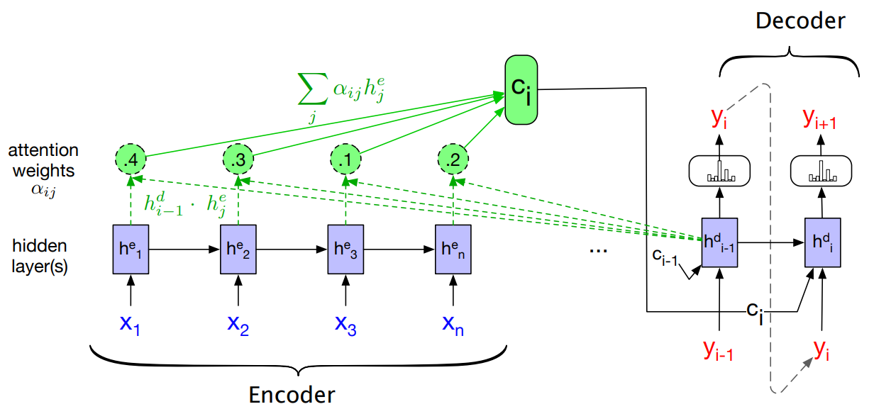

<!-- .slide: class="title-slide" id="title" -->

CS40008.01

# Attention and the Transformer

Lecture 05 – NLP and LLMs

Baojian Zhou School of Data Science Fudan University October 10, 2026

Note:
Allow 1 minute. Saturday make-up class. Three 45-minute periods, with 15 minutes reserved for Quiz 2. Core practices E01–E06 are ungraded. The CPU implementation notebook remains a separate, explicitly labeled resource. Both notebooks now follow the same invented Noa example. This 60-slide material bank includes follow-up implementation pages; use the classroom route in teaching-plan.md rather than presenting every page in 120 minutes. Quiz 2 assesses previously taught material and is administered separately. Time and room follow the university notice. Adapted from the instructor's 2025 Lecture 05, with the source map in teaching-plan.md.

---

<!-- .slide: id="learning-objectives" -->

## What you will be able to do

**How does attention select context, and how does it build a Transformer?**

- Trace self-attention, learned projections, and multiple heads.
- Explain positions, residuals, LayerNorm, and the FFN.
- Count parameters and check causal next-token prediction.
- Read the original paper's results with its experimental setup.

Note:
Allow 1 minute. The six core practices use the default Notebook link. A separate implementation notebook supplies the complete PyTorch decoder, numerical references, fitting loop, and causality checks. It remains available for the labeled implementation activities and follow-up work. No model or dataset downloads are needed for these notebooks. Preserve 15 minutes for the separately administered Quiz 2.

---

<!-- .slide: class="outline-slide" id="outline-heads" -->

## Outline

<ul class="outline-topics">
<li aria-current="step">Self-attention and positional information</li>
<li>Multiple heads and Transformer blocks</li>
<li>A working model and the paper's evidence</li>
</ul>

Period 1 · self-attention, sinusoidal positions, and RoPE

Note:
Allow 1 minute. Retrieve recurrent alignment, then follow the integrated Noa component sequence. Core E01 and E02 are in the default notebook. The permutation demonstration links to the separate implementation notebook.

---

<!-- .slide: id="recurrent-attention-recap" -->

## Recall recurrent encoder–decoder attention

$e_{t,j}=a(s_{t-1},h_j),\quad \alpha_t=\operatorname{softmax}_{\text{all source}}(e_t),\quad c_t=\sum_j\alpha_{t,j}h_j$

Figure: $h^d_{i-1}\equiv s_{t-1}$, $h^e_j\equiv h_j$; dot-product scores (Lecture 04: additive).

Note:
Allow 2 minutes. Retrieve Lecture 04's encoder–decoder story without rederiving recurrence or additive alignment. Bahdanau's alignment score is an additive network. Its source and target indices refer to different sequences. This lecture changes the score function and develops self-attention. Source: Bahdanau et al., §3 and Appendix A.1.2, https://arxiv.org/abs/1409.0473.

The query comes from the previous decoder state; the source annotations come from the recurrent encoder. Softmax over all source scores gives alpha_(t,j), and the whole source is available at each target step. In the figure, i is the target-step index, h^d_(i-1) is the query state, and h^e_j is a source annotation. Trace the dashed score connections, normalized weights, weighted context, and its connection to the decoder. The supplied image uses dot-product scores and a schematic encoder; it illustrates recurrent attention generally rather than the exact bidirectional, additive Bahdanau architecture. The displayed weights are illustrative.

Illustration: the instructor-supplied 83-slide lecture-05-slides-transformers.pptx, slide 8 (Context vector), embedded ppt/media/image11.png, reused without modification.

Bridge to self-attention: recurrent alignment queries source encoder annotations using the previous decoder state. Self-attention obtains its query, keys, and values from the current states of one sequence. Bahdanau uses a learned additive score; the Transformer examples use scaled dot products. Both normalize scores and combine source vectors. The later architecture comparison also shows cross-attention. This consolidates the former recurrent-and-self-attention table.

---
<!-- .slide: id="context-for-text" -->

## Context for a token

Note:
Allow 1–2 minutes. This single slide condenses “Get more context for text,” pages 4–6 of the 49-slide Desktop lecture-05-slides-transformers.pptx inspected on October 10, 2026 (Asia/Shanghai). Those pages attribute the example to Rasa Algorithm Whiteboard. The sentence and linguistic motivation are retained; the three reveals are redesigned for the course's causal GPT focus.

Start with the complete example sentence and the highlighted word “she.” Ask which earlier word identifies its referent. Give students a few seconds to respond; the expected answer is “Noa.” This oral check introduces the mechanism and adds no notebook exercise.

1. Reveal the backward link from “she” to “Noa.” Intervening words do not prevent a useful relation. The link represents a human reading of this sentence. It does not prescribe a model's attention weights or claim a particular head will learn a coreference explanation.
2. Reveal the causal boundary. At the position of “she,” a GPT model can use the prefix including “she.” The later words “is a great cat” are masked at this position, even when training provides the complete sentence. Treat the ten displayed words as toy token positions; a real tokenizer may split them differently.
3. Reveal the context equation. t is the position of “she,” v_j is a value vector at available position j, and alpha_(t,j) is its attention weight. In standard softmax attention these weights are nonnegative and sum to one over the available positions. The model learns the score computation through training and computes the weights from the current representations. It can combine information from the whole available prefix, including the current token.

The next slide keeps this same prefix: positions 0–5 are Noa, can, be, annoying, but, she. The query is she at position 5, and all six prefix positions are available. The next target is is at position 6. Initially the input vectors also act as keys and values; learned Q/K/V projections follow. The later one-head slide writes the causal mask explicitly, and the numeric demonstration displays the future is token to test that masking prevents access to it.

Use zero-based positions throughout. The full illustrative sentence is “Noa can be annoying but she is a great cat.” For teaching, each displayed word is one toy token. A real tokenizer can split words differently. This language example motivates useful context; none of the schematic vectors or attention patterns are measurements from a trained model.

---

<!-- .slide: id="self-attention" -->

## Self-attention

Note:
Source mechanism: Baojian Zhou, Spring 2026, lecture-05-slides-transformers.pptx, slide 24. Original attribution: [Rasa Algorithm Whiteboard 2](https://www.youtube.com/watch?v=tIvKXrEDMhk). The main lecture adapts its eight-step computation to the shared Noa example; the original reproduction remains in lecture-05-test.

Use Space, Right, Next, or click the diagram to reveal the next group. Left and Previous reverse a group. Reset returns to the title-only start.

1. Select she at position 5 as the query; show the six prefix embeddings for Noa, can, be, annoying, but, she.
2. Compare x_5 with each available x_j using a dot product, j = 0,…,5.
3. Normalize these scores with softmax.
4. Show six nonnegative weights whose sum is one.
5. Reuse the six input vectors as values in this introductory operation.
6. Multiply each available vector by its weight.
7. Sum the products to obtain the context at she.
8. Repeat for other query positions, using the prefix available to each one.

There are no learned Q/K/V projection matrices yet; the embedding table and upstream layers can still be trained. The colored bars are schematic vectors, not measured encodings. Purple identifies the query and teal the weights/context. The input and output vector widths agree in this simplified operation. The query at she can use all six displayed words because each belongs to its prefix. Earlier query positions must exclude later words; the later scaled-dot-product slide makes this causal mask explicit. The next-token target is is, which is not included among these six keys or values.

This is one row of a six-position attention computation. Every query row gets newly computed scores and weights. A dot-product weight is computed from input representations; it is not a separately learned fixed parameter. The main diagram uses the modern Noa design in either query-design mode. The archival test deck retains the historical reproduction.

---

<!-- .slide: id="attention-roles" -->

## One input, three roles

Note:
Allow 1 minute. The mechanism is adapted from pages 5–7 of the 43-slide Desktop lecture-05-slides-transformers.pptx inspected on October 10, 2026 (Asia/Shanghai), with its running sentence replaced by the same Noa prefix.

1. Name the three roles in the existing calculation. For the output at she, x_5 is the query. Each x_j, j = 0,…,5, is a key in the row-vector dot product x_5 x_j^T and a value in the weighted sum. The colors name roles; no projection has been applied yet. The query is the sixth displayed word because positions are zero-based. At another output position, select that input as the query and restrict the context to its causal prefix.
2. Motivate separate learned representations for these roles. The source says “No weights for model to train”; qualify this as no learned Q/K/V projection parameters in this simplified operation. Embeddings and upstream layers can already be trainable. Attention weights are computed from the current inputs and differ from learned projection matrices.

The next slide gives the matrices and dimensions for the same six rows. Keep attention-roles between self-attention and learned-projections. This bridge adds no notebook exercise; E03 later checks head dimensions. Source: the instructor's supplied slides and [Vaswani et al., §3.2](https://arxiv.org/html/1706.03762v7#S3.S2).

---

<!-- .slide: id="learned-projections" -->

## Learned queries, keys, and values

Note:
Source mechanism: Baojian Zhou, Spring 2026, lecture-05-slides-transformers.pptx, slide 29. Original attribution: [Rasa Algorithm Whiteboard 2](https://www.youtube.com/watch?v=tIvKXrEDMhk). The current diagram uses Noa, can, be, annoying, but, she in the same zero-based order as the preceding calculation.

Keep the five reveals:

1. Query projection: produce the features used to score available context.
2. Key projection: produce the features compared with the query.
3. Value projection: produce the information passed into the weighted sum.
4. Learn all three projection matrices jointly with the model. W_Q is shared across all six positions; likewise W_K and W_V. These three matrices have separate parameters.
5. Stack token states as rows of X and show Q = X W_Q, K = X W_K, V = X W_V, with dimensions.

For this six-token prefix, X is 6 × d_model. W_Q and W_K are d_model × d_k; W_V is d_model × d_v. Therefore Q and K are 6 × d_k, V is 6 × d_v, QK^T is 6 × 6, and the weighted output AV is 6 × d_v. One query row, q_5 for she, has width d_k and is compared with six key rows. Softmax normalizes over the last/key axis. Query and key widths must agree; the value width may differ.

The self-attention diagrams use row vectors consistently. The later two-coordinate RoPE illustration writes column-vector rotations explicitly; its row-vector implementation would multiply by the transposed rotation on the right. These conventions describe the same dot products. n=6 counts token rows; it is unrelated to the embedding width or head count. The colored cells are schematic, not numerical trained vectors. The compact output path previews scaling and masking; the later single-head slide unpacks them before introducing multiple heads. The next target is is at position 6 and is not a row of this prefix matrix.

The main lecture uses this Noa diagram in both query-design modes; the untouched test deck keeps its original comparison artwork. Reset restarts the current slide. The dimensions follow [Vaswani et al., §§3.2.1–3.2.2](https://arxiv.org/html/1706.03762v7#S3.S2).

---

<!-- .slide: id="gpt-architecture" -->

## GPT-style causal Transformer

Note:
This is the causal language-model architecture to build in the course. It
adapts the architecture topic from Spring 2026 source page 40, which shows the
2017 encoder-decoder Transformer. The five reveals on this slide are new.
Read the data flow upward, from the two embedding components at the bottom
to the final LayerNorm and language-model head at the top. The reveal order
follows this computation. The two embedding branches meet at an addition node.

Visual reference: [Full GPT architecture](https://commons.wikimedia.org/wiki/File:Full_GPT_architecture.svg),
original by Marxav, vectorization by Mrmw (2024), CC0 1.0. The reference is
available through the toolbar. The teaching diagram combines attention's
internal operations and the MLP's internal projections into named modules.

Architecture source: [OpenAI GPT-2 implementation](https://github.com/openai/gpt-2/blob/master/src/model.py),
functions `attention_mask`, `block`, and `model`. This example uses GPT-2-style
learned position embeddings and LayerNorm before each sublayer. The final
LayerNorm follows the last block; see also the
[GPT-2 report, section 2.3](https://cdn.openai.com/better-language-models/language_models_are_unsupervised_multitask_learners.pdf).
GPT variants may use other position schemes
and normalization layers. Dropout is omitted from this overview.

1. Map token IDs to embeddings and add learned position embeddings. The prefix
   contains six toy token positions 0–5; the input caption abbreviates its
   middle words with an ellipsis. A real tokenizer may split words differently.
   Here the hidden states have shape 6 by d_model.
2. Normalize each position, compute causal multi-head self-attention, and add
   the result to the unnormalized residual stream. Position i can attend to
   positions j <= i, including itself. Set future attention logits to negative
   infinity before softmax, so their attention weights are zero.
3. Normalize again, apply the same MLP independently at every position, and
   add its output to the residual stream. Both additions preserve d_model.
4. Repeat the complete block L times. Blocks have separate learned parameters;
   each block shares its own parameters across token positions. The bypass
   arrows and plus symbols are residual connections.
5. Apply final LayerNorm, a linear vocabulary projection (the LM head), and
   softmax. At generation time, use the final input position's distribution,
   choose a token, append it to the prefix, and repeat. “is” is the illustrative
   next token after she, not a measured model prediction.

The input to each block is H. Its two updates are
U = H + CausalMHA(LN_1(H)) and H_next = U + MLP(LN_2(U)).
The vocabulary head acts at every position during training. Train in parallel
against shifted next-token targets; sampling and appending are generation
steps. The causal mask prevents access to each target token. A KV cache can
reuse earlier keys and values during generation; it is omitted here.

The first component walkthrough starts next: positional information. The two
input branches here illustrate additive positions (GPT-2 learns those vectors).
We will first replace the learned table with the original Transformer's fixed
sinusoidal code. Then we will show a different insertion point for RoPE:
inside attention, after the query/key projections. RoPE is not an additional
vector to add at the bottom of this diagram.

---

<!-- .slide: id="position-inputs" -->

## Token identity and position

Note:
Component 01 · 2 minutes. New design based on the topic of Spring 2026 source
pages 51–54. Learning objective: distinguish token identity, absolute position,
and the place where a position method enters the computation.

Use she at its actual prefix position p = 5 and at a clearly hypothetical position p = 2. This compares one fixed token embedding under two position choices; it does not claim she occurs twice in the running sentence. The lookup embedding is identical, while different position vectors produce different inputs. Read upward, as on the architecture slide. The colored cells are schematic, not numeric measurements. Keep token identity and position as separate branches before the addition. Positions are zero-based and the example uses one toy token per displayed word.

Reveal 1: token lookup. Reveal 2: position lookup/function and addition.
Reveal 3: model input. Position vectors have width d_model, the same as token
embeddings. In the 2017 paper, e_t = sqrt(d_model) E[t] is the scaled token
embedding, so the full input is x_p = sqrt(d_model) E[t_p] + PE(p).
Dropout is omitted here. The addition happens at the input to the stack.

Do not claim that a causal Transformer has no position information without a
position embedding: the causal mask itself introduces asymmetry. The purpose
here is to introduce an explicit position representation. Unmasked attention
without any positional mechanism is permutation equivariant. The NoPos paper
on source page 54 is a useful caveat, not a third method for this section.

Source: [Vaswani et al., Attention Is All You Need, §§3.4–3.5](https://arxiv.org/html/1706.03762v7#S3.S5).
Caveat: [Haviv et al., Transformer Language Models without Positional Encodings Still Learn Positional Information](https://arxiv.org/abs/2203.16634).

---

<!-- .slide: id="sinusoidal-frequencies" -->

## Sinusoidal encoding: many clocks

  $\omega_i=10000^{-2i/d}$
  $PE(p,2i)=\sin(p\omega_i)$
  $PE(p,2i+1)=\cos(p\omega_i)$

Example: embedding width $d=8$. Pair $i$ shares one frequency; its sine channel is shown.

Note:
3 minutes. Replaces the frequency plots on source pages 51–52. Horizontal axis:
token position p; vertical axis: the value of one position-encoding coordinate.
Hover to read values. Curves use dense samples for legibility; real token
positions are integers. No parameters are learned in this position function.

d abbreviates d_model, an even embedding width. Pair i = 0, …, d/2 − 1 uses
coordinates 2i and 2i+1. With d = 8, the angular frequencies are 1, 0.1, 0.01,
and 0.001 radians per token. The figure shows sine coordinates 0, 2, and 4.
Their cosine partners have the same frequencies and a quarter-cycle phase
offset. Dimension 6 and its cosine partner 7 are omitted to keep the chart clear.
All eight coordinates together make one vector for one position.

The binary-counter analogy on source page 53 motivates combining fast and
slow changes. These are smooth rotations, not binary digits; avoid claiming
an exact binary representation. At p = 0 all sine entries are zero and all
cosine entries are one. The next slide asks students to calculate that vector.

Source: [Attention Is All You Need, §3.5](https://arxiv.org/html/1706.03762v7#S3.S5).
The chart is computed from the formula by build-positions.mjs; it is original
artwork. Do not promise that a defined code at unseen positions guarantees
accurate extrapolation by a trained model.

---

<!-- .slide: id="sinusoidal-example" -->

## Build one position vector

Practice E01 · 2 min · Predict $PE(0)$, then add $PE(1)$ to the embedding.

For $d=4$: $\quad PE(p)=[\sin p,\cos p,\sin(p/100),\cos(p/100)]$.

<table class="position-table">
  <thead><tr><th>Position</th><th>Dim. 0</th><th>Dim. 1</th><th>Dim. 2</th><th>Dim. 3</th></tr></thead>
  <tbody>
    <tr><td>$p=0$</td><td>0</td><td>1</td><td>0</td><td>1</td></tr>
    <tr><td>$p=1$</td><td>0.841</td><td>0.540</td><td>0.010</td><td>1.000</td></tr>
  </tbody>
</table>

Toy embedding for “can” at $p=1$: $e_{t_1}=[1,0,1,0]$.

  
$x_1=e_{t_1}+PE(1)\approx[1.841,\;0.540,\;1.010,\;1.000]$

  
Coordinate-wise addition; the vector still has four coordinates.

Note:
Practice E01. Pause before the first reveal. Students write the four entries
for Noa at p = 0, then compute the four coordinate-wise sums for can at p = 1. Use radians.
The first click reveals [0, 1, 0, 1]; the second reveals the sum.

Checked values: PE(1) = [0.8414709848078965, 0.5403023058681398,
0.009999833334166664, 0.9999500004166653]. The last entry rounds to 1.000;
it is not exactly one. The two frequencies are 1 and 0.01 radians per token.
Do not reuse the d = 8 denominator from the preceding illustration: we chose
d = 4 here so students can calculate the entire vector.

e is the already-scaled embedding from the preceding slide. With d = 4,
the invented raw lookup E[can] would be [0.5, 0, 0.5, 0]. No trained model
or dataset is used in this example. Notebook E01 implements the formula and
checks these numbers using Python's standard math library. This is ungraded
classroom practice, not an assignment or a grading rubric.

Source formula: [Attention Is All You Need, §§3.4–3.5](https://arxiv.org/html/1706.03762v7#S3.S5).

---

<!-- .slide: id="position-demo" data-exercise-notebook="lecture-05-exercise.ipynb" -->

## Does the output move with the token?

Implementation E02 · 3 minutes · <a href="../shared/notebook.html?lecture=lecture-05&notebook=lecture-05-exercise.ipynb" target="_blank" rel="noopener noreferrer">Implementation notebook</a>

<button id="position-toggle" type="button" aria-pressed="false">Positions: off</button>
<button id="position-swap" type="button" aria-pressed="false">Swap Noa / she</button>
<button id="position-reset" type="button">Reset</button>

Note:
Allow 3 minutes for predictions and the prepared browser comparison; the original notebook activity can be completed separately. This combines why-positions, position-demo, and exercise-02 from the previous main deck. Keep this distinct from core E02, which tests RoPE relative offsets in the default notebook.

Ask students to swap Noa at position 0 and she at position 5 and then undo the permutation on the outputs. Without any position mechanism or mask, shared self-attention projections satisfy SA(PX) = P SA(X). This is permutation equivariance, not equality of tensors before undoing the permutation. With fixed sinusoidal position vectors attached to slots, moving a token changes its input and its output.

The six word vectors are rows of I6, not trained embeddings. Q/K/V projections are identity and the scale is sqrt(6). The permutation is [5,1,2,3,4,0]. Without positions, restored outputs agree up to rounding; with fixed sinusoidal positions, the outputs change. The checked maximum difference is approximately 0.4492044856670271 for this six-token fixture. Compare the actual tensors in the implementation notebook, not only colors in the chart. There is deliberately no causal mask: a fixed causal mask already introduces order asymmetry and does not satisfy this arbitrary-permutation identity. Reset restores the PDF's initial state.

The implementation notebook uses the same six-token fixture and checks the permutation numerically. Its E02 is a section reference; run that notebook top-to-bottom when completing the full implementation sequence. Source: Vaswani et al., §3.5; the data and controls are original teaching examples.

---

<!-- .slide: id="rope-rotation" -->

## RoPE: rotate each query/key pair

  <label for="rope-position">Position $p$ <input id="rope-position" type="range" min="0" max="6" step="1" value="5"><output id="rope-position-value" for="rope-position">5</output></label>
  “she” starts at $p=5$. Move $p$ while holding its content fixed.

Note:
4 minutes. RoPE = rotary position embedding. Source page 54 names RoFormer;
this slide adds the mechanism. The formulas here use column vectors. q and k
are content vectors after the learned projections, before applying RoPE.

Assign the invented content pair (1,0) to the query for she. At its actual position p = 5, the teaching frequency θ = π/6 radians gives a 150° rotation: (−sqrt(3)/2, 1/2). Drag the position slider to ask what would happen if this fixed content pair appeared elsewhere. At p = 0 it is unchanged; at p = 3 it becomes (0,1). Rotation preserves length. Reset returns to she at p = 5. These controls isolate the positional operation; they do not recompute a whole model after editing the sentence. The toy frequency is 30° per token, not the standard first-pair frequency of 1 radian.

For a head of even width d_h, apply a 2D rotation independently to each
coordinate pair (2i, 2i+1), with θ_i = 10000^(−2i/d_h). Other coordinate
pairing conventions can implement the same construction. The shown formula
uses the baseline from RoFormer; model-specific bases and scaling can differ.

Apply RoPE to each head's queries and keys in each attention layer. The
standard construction leaves V unchanged. RoPE does not replace the learned
Q/K projections or the causal mask, and it does not require an additive
position vector at the model input. It is a different insertion point from
the previous sinusoidal addition and the GPT-2 architecture's learned table.

Source: [Su et al., RoFormer, §§3.2.1–3.2.2, equations 13–16](https://arxiv.org/html/2104.09864v5).

---

<!-- .slide: id="rope-relative-offset" -->

## RoPE: relative offsets in the score

  <button id="rope-shift" type="button">Shift both +1</button>
  <button id="rope-gap" type="button">Gap +1</button>
  Next reveals the scores, then the identity. Reset restores the example.

Note:
Practice E02 · 2 minutes for prediction, then 3 minutes for the explanation.
Ask students to predict both dot products before the first reveal. The
content vectors q = k = (1, 0) are held fixed. Use the same toy θ = 30° as
the preceding slide. The query is purple and the key is teal.

Initially the query is she at m = 5 and the key is Noa at n = 0. The hypothetical shared shift s = 3 gives (m+s,n+s) = (8,3). In the first circle, q rotates to (−sqrt(3)/2,1/2) and k remains (1,0). In the second, q is (−1/2,−sqrt(3)/2) and k is (0,1). Both raw dot products equal −sqrt(3)/2, approximately −0.866. The key precedes the query, so both relative arrangements are allowed by a causal mask. Negative raw scores are valid; softmax later produces nonnegative weights.

First reveal: both scores. Second reveal: the general identity. For one pair,
q_tilde_m^T k_tilde_n = q_m^T R(mθ)^T R(nθ) k_n
= q_m^T R((n−m)θ) k_n. The sign is n minus m for this column-vector
rotation convention. In our running example n−m = −5. Although the controls display
the nonnegative gap m−n for readability, the formula keeps the signed offset.

Shift both +1 increases the right circle's shared shift s up to 6. Gap +1 changes the separation in both controlled examples, up to gap 7. Their scores stay equal at any common shift. Increasing gap 5 to 6 changes both scores from −sqrt(3)/2 to −1; gap 7 gives −sqrt(3)/2 again. Reset restores the running prefix's gap 5 and the comparison shift s = 3, then hides the answers. The fixed content vectors deliberately isolate positions; the shifted and enlarged-gap cases are what-if arrangements, not the literal running sentence. The scores shown are raw dot products, before scaling, masking,
and softmax. A cosine is not a monotonic distance-decay function.

For multiple pairs, sum these identities using each pair's own θ_i. The
relative-offset claim holds for the positional operation with fixed content
q_m and k_n. It does not assert invariance of an entire language model's
outputs when the prompt content or context changes. Notebook E02 checks
norm preservation and the multi-pair identity on nonidentical vectors.

Source: [RoFormer, §3.2, especially equation 16](https://arxiv.org/html/2104.09864v5).

---

<!-- .slide: id="position-methods" -->

## Two methods, two insertion points

<table class="position-compare">
  <thead><tr><th></th><th>Sinusoidal · 2017</th><th>RoPE · 2021</th></tr></thead>
  <tbody>
    <tr><th>Acts on</th><td>Token embeddings</td><td>Queries and keys</td></tr>
    <tr><th>Operation</th><td>Add a position vector</td><td>Rotate coordinate pairs</td></tr>
    <tr><th>Applied</th><td>At the stack input</td><td>In every attention layer</td></tr>
  </tbody>
</table>

Note:
2 minutes. Return to the architecture overview. Read both simplified paths
upward. The left path can use the positional input branch already drawn on
that slide. In the RoPE version, remove that additive positional branch and
place rotations on Q and K inside each attention head. The V branch bypasses
rotation. Projection boxes summarize the surrounding normalization/attention
block; the sketch does not change the pre-LN architecture shown earlier.

The 2017 Transformer uses fixed sinusoidal position vectors. The earlier GPT-2
overview instead has a learned position table; both are additive input
schemes. RoPE, introduced in the 2021 RoFormer preprint, uses fixed rotation
frequencies in its baseline form. Both leave the learned embedding and
projection parameters trainable. d_model controls the additive code's width;
d_h controls the per-head RoPE rotations. Full-width RoPE is illustrated.

Both causal language-model variants need a causal mask. Neither method by
itself guarantees accurate behavior beyond the training context length.
End by asking students to point to the addition node or the Q/K rotation
node on the appropriate architecture. The next component can now unpack
scaled dot-product attention and its mask.

Readings: [Attention Is All You Need, §§3.4–3.5](https://arxiv.org/html/1706.03762v7#S3.S5)
and [RoFormer, §§3.2.1–3.2.2](https://arxiv.org/html/2104.09864v5).

---

<!-- .slide: class="outline-slide" id="outline-blocks" -->

## Outline

<ul class="outline-topics">
<li>Self-attention and positional information</li>
<li aria-current="step">Multiple heads and Transformer blocks</li>
<li>A working model and the paper's evidence</li>
</ul>

Period 2 · heads, residuals, normalization, and the FFN

Note:
Allow 1 minute. Keep the single-head and multiple-head explanations together, followed by the complete Add & Norm and FFN sequences. Core E03–E05 are in the default notebook. The later tensor implementation pages are retained for follow-up; do not spend the quiz slot on them.

---

<!-- .slide: id="scaled-dot-product" -->

## One head: scaled dot-product attention

Note:
Component 02 · 3 minutes. Source: page 38, left diagram, of the instructor's
Desktop copy of lecture-05-slides-transformers.pptx. This redraw follows its
upward computation. The next slides motivate multiple heads, unpack their
computation, and connect them to the architectures on source pages 39–40.

Read the arrows upward. Q and K form a score matrix. Divide by sqrt(d_k),
apply the mask to the logits, run softmax across keys, and multiply by V.
The value branch enters only at the final weighted sum. The mask is optional
in the source's generic attention block; our causal language model uses it.

Four clicks reveal: (1) dot products and scaling, (2) causal mask, (3) row-wise
softmax, (4) value mixing and output. With token rows, Q and K are n by d_k,
V is n by d_v, the scores and weights are n by n, and Z is n by d_v. For the Noa prefix n = 6; the selected query is she at zero-based position 5. For a
query at t, keys j <= t remain available, including the query position itself.
Future logits become negative infinity before softmax, giving zero weights.
All retained weights in one query row sum to one. Padding masks are omitted.

Equivalently, Z = softmax_row(Q K^T / sqrt(d_k) + M) V, where M[t,j] is zero
for j <= t and negative infinity otherwise. If using RoPE, Q and K here are
already rotated separately within each head. Values are not rotated.
This is the row-vector notation used on the learned-projections slide.

The sqrt(d_k) factor moderates the scale of dot products; under independent,
zero-mean, unit-variance coordinate assumptions, the dot-product variance is
d_k. Do not present these assumptions as universal properties of trained
query/key vectors. We next motivate repeating this operation with separate projections.

Source: [Attention Is All You Need, §3.2.1 and Figure 2](https://arxiv.org/html/1706.03762v7#S3.S2).

---

<!-- .slide: id="attention-demo" -->

## Causal attention in numbers

<form class="demo-form" id="attention-controls" aria-label="Attention controls">
<button type="button" data-query="0" aria-label="Select Noa query at position 0">Noa</button>
<button type="button" data-query="5" aria-label="Select she query at position 5">she</button>
<button type="button" data-query="6" aria-label="Select is query at position 6">is</button>
<button type="button" id="attention-mask">Mask: on</button>
<button type="button" id="attention-value">Change future V</button>
<button type="button" id="attention-reset">Reset</button>
</form>

Note:
Allow 2 minutes for the prepared numeric example. Positions 0–5 are the running prefix Noa, can, be, annoying, but, she. Display the next word is at position 6 only to test the causal mask: she must not use its key or value. Each displayed word is one toy token. All projected vectors are invented.

The selected query is q_she = (sqrt(2),0), with d_k = 2. Its scaled scores over the seven displayed positions are (log 4,0,0,log 2,0,log 2,log 3). The matching values are (1,0), (0,1), (1,1), (2,0), (0,2), (1,2), (3,1). Masking is at position 6 gives weights (4,1,1,2,1,2,0)/11 and output (1,8/11), approximately (1,0.727273). The future column is displayed but excluded from the available prefix.

Without the mask, weights become (4,1,1,2,1,2,3)/14 and the output becomes (10/7,11/14), approximately (1.428571,0.785714). Change only V_is by (10,10). The masked she output remains unchanged; the unmasked output increases by 15/7 in each coordinate. Reset restores the she query, mask, and values. Other query buttons expose their own visibility rows.

Zeroing the future weight after unmasked softmax leaves total weight 11/14; it is not the same normalized computation. An all-masked row has undefined softmax, so the diagonal is retained with shifted next-token targets. The notebook checks these values in float64. Implementation E05 later perturbs an input before all projections and checks complete-model input-state gradients.

Optional one-minute external walkthrough: https://poloclub.github.io/transformer-explainer/. Trace one query through its allowed keys and values. Its model and prompt differ from our invented fixture. Use the local chart if unavailable; do not extend the allocated classroom block. Source mechanism: Vaswani et al., §§3.2.1 and 3.2.3.

---

<!-- .slide: class="exercise" id="practice-01" data-exercise-notebook="lecture-05-exercise.ipynb" -->

Implementation P01 · 3 minutes · calculate, then check

## A masked weighted sum

For <strong>she</strong> at $p=5$, another toy head has scaled scores $(\log2,0,0,\log2,0,\log3,\log4)$.

| Noa | can | be | annoying | but | she | is |
| --- | --- | --- | --- | --- | --- | --- |
| $(1,0)$ | $(0,1)$ | $(1,1)$ | $(2,0)$ | $(0,2)$ | $(1,2)$ | $(3,1)$ |

Find the causal weights and output. Can changing $V_{\text{is}}$ change that output?

Weights $(2,1,1,2,1,3,0)/10$; output $(1,1)$.
The future value has zero weight.

<a href="../shared/notebook.html?lecture=lecture-05&notebook=lecture-05-exercise.ipynb" target="_blank" rel="noopener noreferrer">Implementation notebook · P01</a>

Note:
Allow 3 minutes. The table reuses the preceding demonstration's invented values. This practice supplies a different toy head's scaled scores while reusing the value rows. Retain positions 0–5 and replace the future is score at position 6 with negative infinity before normalizing. Exponentials on allowed positions are (2,1,1,2,1,3), with sum 10. Their weighted values sum to (10,10), so the context is (1,1). Changing only V_is cannot change this row.

Have students calculate before revealing the answer. The single-head-practice notebook cell checks these weights, the output, and the future-value perturbation. Every displayed word is one toy token; the exact numbers are supplied rather than learned. This ungraded activity uses P01 in the separately linked implementation notebook.

---

<!-- .slide: id="why-multiple-heads" -->

## Why use multiple heads?

Note:
Allow 2 minutes. Adapted from the multiple-head motivation in pages 2–3 of the instructor's 26-slide Desktop lecture-05-slides-transformers.pptx. The main lecture now uses the same Noa prefix as the preceding single-head calculation.

Keep the query at she, position 5. All six displayed positions are in its available prefix. Ask three possible questions: which earlier name identifies the referent, which earlier feature describes it, and which word signals a contrast? Noa, annoying, and but provide human interpretations of these relationships.

1. Reveal one invented attention row: (0.60,0.05,0.04,0.10,0.06,0.15), over Noa, can, be, annoying, but, she. It emphasizes Noa.
2. Reveal two more rows: (0.10,0.06,0.08,0.58,0.10,0.08), emphasizing annoying, and (0.10,0.05,0.05,0.12,0.60,0.08), emphasizing but. Each row sums to 1. Each head forms a separate context mixture before the outputs are combined.

The rows are invented normalized illustrations, not trained attention weights or assigned grammatical jobs. Patterns can overlap. One head can weight several words, but for this query it still supplies one distribution over positions. Multiple heads supply different distributions and separately projected values. Attention weights alone do not establish a causal explanation of a prediction.

Each head learns its own Q/K/V projections. With fixed d_model and d_k = d_v = d_model/h, changing h does not multiply the aggregate Q/K/V and output-projection parameter count. The following E03 checks the width split with six token rows. Keep this slide adjacent to the multi-head mechanism and architecture explanation.

Source: [Attention Is All You Need, §3.2.2](https://arxiv.org/html/1706.03762v7#S3.S2).

---

<!-- .slide: id="multi-head-attention" -->

## Multi-head attention: project, attend, combine

Note:
4 minutes plus Practice E03 · 1 minute. Source: page 38, right diagram, and
the multi-head block on page 39 of the Desktop PowerPoint. Read upward from
the same input matrix X. Heads 1, 2, and h stand for an arbitrary number of
heads; the ellipsis matters. The three drawn boxes do not mean h is three.
The preceding slide showed possible weight patterns; this slide explains
the learned projections that produce them and combine their outputs.

1. Each head has its own W_i^Q, W_i^K, and W_i^V. Every projection can use all
   d_model input features: this is not simply cutting raw X into fixed slices.
2. H_i = Attention(X W_i^Q, X W_i^K, X W_i^V). Each head independently forms
   its score matrix and normalizes its rows. In the causal model, every head
   applies the same causal visibility rule. Head patterns can differ, but
   distinct interpretable specializations are not guaranteed.
3. Concatenate H_1, …, H_h along features, preserving each token's row.
4. Multiply by the learned output matrix: Y = Concat(H_1, …, H_h) W^O.
   W^O mixes the heads' features. Concatenation itself does not average them.
5. Reveal the exercise answer after students calculate it.

Practice E03: use the original base-model setting d_model = 512, h = 8,
and d_k = d_v = d_model / h. Ask for the width per head; expected answer: 64.
Then ask verbally for the concatenated width: 8 × 64 = 512. For the six-word Noa prefix n = 6, each H_i is 6 × 64, the concatenation is 6 × 512, and Y is 6 × 512. Each W_i^Q, W_i^K, and W_i^V is 512 × 64; W^O is 512 × 512. The token axis stays six rows throughout. This width-512 calculation illustrates the original base-model head split; it is separate from the small width-16 implementation notebook.
The notebook checks row-preserving feature concatenation in this example.

This is standard multi-head self-attention with equal key and value widths.
The general output projection is (h d_v) by d_model; other configurations
need not make h d_v equal d_model. Grouped-query attention and multi-query
attention are separate variants, outside the scope of this introduction.

Optional discussion from page 7 of the updated 26-slide Desktop source:
“Do we need every trained head?” Michel, Levy, and Neubig, NeurIPS 2019,
[Are Sixteen Heads Really Better than One?, §§3–5](https://papers.neurips.cc/paper_files/paper/2019/file/2c601ad9d2ff9bc8b282670cdd54f69f-Paper.pdf).
Their trained translation and BERT models tolerated some head pruning;
translation cross-attention was more sensitive. The one-head-per-layer
ablation changed one layer at a time. A pruning result measures dependence
after training; it does not establish how many heads suffice during training
or justify reducing every layer to one head. Treat this as optional reading.

Source: [Attention Is All You Need, §3.2.2 and Figure 2](https://arxiv.org/html/1706.03762v7#S3.S2).

---

<!-- .slide: id="attention-in-architecture" -->

## Where multi-head attention is used

Note:
3 minutes. Source: model architecture on Desktop pages 39–40. The original
2017 diagram is simplified to show the origins of Q, K, and V. The course's
GPT-style model is alongside it. Every attention box represents multi-head
attention, with the mechanism just unpacked. Read both models upward.

Retain the distinction from page 5 of the updated 26-slide Desktop source:
heads operate in parallel within one attention sublayer; Transformer layers
run sequentially. Each layer uses the preceding layer's hidden states and
has its own learned projections. The repeated-block labels show depth,
while the previous slide's h labels the number of heads within one layer.

Reveal 1: encoder self-attention. Each source position can read all source
positions, aside from any padding mask. Q, K, and V come from the encoder's
current hidden states. The drawing groups the repeated encoder stack; its
final outputs supply the cross-attention memory.

Reveal 2: the original decoder has two attention sublayers. Causal self-
attention reads its own target prefix. Cross-attention takes Q from the
decoder states following that self-attention sublayer and K/V from the
encoder's final outputs. The cross-attention keys cover the source sequence;
they do not use the target sequence's causal triangular mask. A source
padding mask can still apply. Repeat the decoder block N times. During
training, target inputs are shifted right to predict the next target token.

Reveal 3: our GPT-style causal decoder attends within a single prefix and
has no encoder cross-attention sublayer. Repeat its attention/MLP block L
times, then apply the vocabulary head. The source/prefix states at the bottom
already include the embedding stage and the appropriate positional treatment.

This diagram deliberately isolates attention paths. Residual additions,
normalization, dropout, and embedding internals are omitted and remain as
described on the existing architecture overview. The 2017 paper uses
post-LayerNorm, whereas the earlier GPT-2-style overview uses pre-LayerNorm;
the simplified boxes here do not imply that these normalization orders match.

Source: [Attention Is All You Need, §§3.1–3.2.3 and Figure 1](https://arxiv.org/html/1706.03762v7#S3.S2).
GPT-style example: [OpenAI GPT-2 model implementation](https://github.com/openai/gpt-2/blob/master/src/model.py).

---

<!-- .slide: id="residual-addition" -->

## Residual addition keeps a direct path

A sublayer learns an update to the current representation.

$$y=\underbrace{x}_{\text{direct path}}+\underbrace{G(x)}_{\text{learned update}}$$

<h3>Forward</h3>

Add matching coordinates. The shape stays $(B,T,d)$.

If $G(x)=0$, then $y=x$.

<h3>Backward</h3>

$\displaystyle \frac{\partial y}{\partial x}=I+J_G(x)$

The identity term gives gradients a direct route.

In our pre-LN model, the update is $G(x)=F(\operatorname{LN}(x))$.

Note:
Allow 2 minutes. Adapted from page 10 of the 25-slide Desktop
lecture-05-slides-transformers.pptx inspected on October 10, 2026
(Asia/Shanghai). Preserve the residual-learning motivation and replace the
paper/code screenshots with the forward and backward computations.

Start with the two terms in y = x + G(x). G denotes the complete update branch;
in our pre-LN model it includes normalization followed by attention or the FFN.
The input and update must have the same shape. The operation adds corresponding
features at corresponding token positions. It introduces no trainable
parameters and does not concatenate vectors or add token positions together.
Attention has already mixed the permitted positions inside its own branch.

Ask: if the update is zero, what leaves this addition? Expected response: x.
Then reveal the backward column. J_G is the Jacobian of the update with
respect to x, with the tensor regarded as a vector. For column gradients,
grad_x L = grad_y L + J_G(x)^T grad_y L. The identity contribution bypasses the
learned branch. It does not guarantee that total gradients stay large or small:
the two contributions can cancel or amplify. For example, G(x) = -x cancels
the identity derivative. The near-identity interpretation assumes a small
update; it is not an assertion about every trained block.

Source: [He et al., Deep Residual Learning for Image Recognition, §3.2](https://arxiv.org/abs/1512.03385).
The preprint appeared in 2015; the conference paper is CVPR 2016, correcting
the source slide's “CVPR, 2015.” The Transformer applies residual connections
around each attention and FFN sublayer; see
[Vaswani et al., §3.1](https://arxiv.org/html/1706.03762v7#S3.S1).

---

<!-- .slide: id="layernorm-features" -->

## LayerNorm normalizes one token's features

For each token vector $x\in\mathbb{R}^{d}$, compute its own statistics.

$$\mu=\frac1d\sum_{j=1}^{d}x_j,\qquad
\sigma^2=\frac1d\sum_{j=1}^{d}(x_j-\mu)^2$$

$$\operatorname{LN}(x)_j=\gamma_j\frac{x_j-\mu}{\sqrt{\sigma^2+\epsilon}}+\beta_j$$

<ul>
<li>For $(B,T,d)$, normalize the last axis; keep tokens separate.</li>
<li>Learned $\gamma,\beta\in\mathbb{R}^{d}$ are shared across tokens.</li>
<li>Recenter and rescale features; $\epsilon$ keeps the denominator positive.</li>
</ul>

Note:
Allow 2 minutes. Adapted from page 11 of the same 25-slide Desktop revision.
Here d = d_model. The statistics belong to one batch item and one token
position: every (b,t) gets its own mean and variance over j. An affine
LayerNorm module has 2d parameters, reused at all token positions. Different
normalization modules in a block have separate parameters.

The motivation is to control shifts and scale in the features seen by the
next computation, while the learned scale and bias retain flexibility.
Avoid promising better accuracy, faster iterations, or stable training for
every configuration. After the affine transform, the output need not have
mean zero or variance one. Before it, the variance is sigma^2/(sigma^2+eps),
so even that variance is only approximately one for nonzero epsilon.

Use population variance: divide by d. With eps = 1e-5, place epsilon inside
the square root. The source's historical code uses x.std(-1) and adds epsilon
after the standard deviation; it should not be copied as an exact equivalent
of PyTorch LayerNorm. Its unqualified std call also uses the sample correction
in PyTorch. An explicit implementation is:

    mean = x.mean(dim=-1, keepdim=True)
    var = x.var(dim=-1, correction=0, keepdim=True)
    y = gamma * (x - mean) / torch.sqrt(var + eps) + beta

LayerNorm uses the input's statistics in both training and evaluation. No
batch running averages are needed. Normalizing across time would couple token
statistics, potentially letting future tokens change an earlier position.
The exercise after the order comparison checks this distinction on two rows.

Sources: [Ba et al., Layer Normalization, §3](https://arxiv.org/html/1607.06450v1#S3);
[PyTorch LayerNorm implementation and documented formula](https://github.com/pytorch/pytorch/blob/v2.8.0/torch/nn/modules/normalization.py#L88).

---

<!-- .slide: id="normalization-order" -->

## Where does normalization go?

Let $F$ be attention or the feedforward network. Dropout is omitted.

<table class="position-table">
<thead><tr><th>Architecture</th><th>One sublayer</th></tr></thead>
<tbody>
<tr><td>Original Transformer: post-LN</td><td>$y=\operatorname{LN}(x+F(x))$</td></tr>
<tr><td>Our GPT-style model: pre-LN</td><td>$y=x+F(\operatorname{LN}(x))$</td></tr>
</tbody>
</table>

Pre-LN leaves the direct path unchanged through each sublayer.

Our model applies a final LayerNorm after the block stack.

Normalization placement changes gradient flow and training behavior.

Note:
Allow 2 minutes. This comparison resolves an inconsistency in source pages
10–11: “Add & Norm” follows the 2017 architecture, but the code screenshot
on page 10 normalizes the input before calling the sublayer. Read that code
as pre-LN; it is not the same computation as LN(x + F(x)).

Ask students to trace the unchanged x term in each formula before revealing
the explanation. In pre-LN, normalization lies inside the update branch.
In post-LN, normalization also acts on the result of the direct addition;
its full Jacobian is J_LN(x + F(x)) (I + J_F(x)). Thus the preceding slide's
identity derivative describes the addition node, not an unchanged path
through the whole post-LN sublayer. A final normalization in our pre-LN
model is applied once after the stack, before the vocabulary head.

The original model also applies dropout to sublayer outputs before adding
them; it is omitted here to isolate the order. The two sublayers in our
block use distinct LayerNorm modules, as on the GPT architecture overview.
Xiong et al. analyze initialization and warm-up under stated assumptions;
their findings motivate this comparison, not a universal ranking of all
pre-LN and post-LN models. Architecture, initialization, depth, learning
rate, and the training setup still matter.

Sources: [Vaswani et al., §3.1 and §5.4](https://arxiv.org/html/1706.03762v7#S3.S1);
[OpenAI GPT-2 implementation, block and model](https://github.com/openai/gpt-2/blob/master/src/model.py);
[Xiong et al., §§2–4](https://proceedings.mlr.press/v119/xiong20b.html).

---

<!-- .slide: id="add-norm-practice" -->

## Normalize, then add the update

Practice E04 · 2 min · Supplied state at “she”

$x=(1,3)$, $\gamma=(1,1)$, $\beta=(0,0)$, $\epsilon=10^{-5}$.

The update is given: $F(\operatorname{LN}(x))=(2,-1)$.

<ol>
<li>Find $\mu$, $\sigma^2$, $\operatorname{LN}(x)$, and the output $y$.</li>
<li>Can another token change $\operatorname{LN}(x)$?</li>
</ol>

$\mu=2,\;\sigma^2=1,\;\operatorname{LN}(x)\approx(-1,1)$; $y=(1,3)+(2,-1)=(3,2)$.

No: each token's normalization uses only its own features.

Note:
Practice E04, ungraded. Treat x=(1,3) as an invented supplied state at she, position 5. The actual course model has a wider state; two coordinates keep this arithmetic transparent. Students calculate the two statistics and the final
sum before the reveal. The exact normalized vector is (-1,1)/sqrt(1.00001),
approximately (-0.999995,0.999995). The supplied update is already the result
of F(LN(x)); do not infer F or apply F again. The residual term is the original
x, so the output is (3,2), not LN(x) + (2,-1).

The last question isolates LayerNorm, whose statistics are local to one
token. An allowed earlier token can still affect this token's attention
update through F; independence of LayerNorm does not imply independence
of the complete attention sublayer.

Notebook E04 uses Python's standard library to check the values, the last
feature axis, a constant vector, and learned scale/bias. It perturbs another
token in a toy (B,T,d) tensor and verifies that this token's normalized vector
is unchanged. All inputs are invented; no model, training run, or GPU is used.
Source formula: [Ba et al., §3](https://arxiv.org/html/1607.06450v1#S3), with the
epsilon and population-variance convention of PyTorch LayerNorm.

---

<!-- .slide: id="feedforward-network" -->

## Feedforward network: transform each token

Note:
Allow 3 minutes. Adapt page 6 of the 19-slide Desktop lecture-05-slides-transformers.pptx inspected on October 10, 2026 (Asia/Shanghai). Read the three illustrated token columns upward: Noa at position 0, can at position 1, and she at position 5. They are a nonadjacent subset of the six-word prefix; each applies the same parameters. The other prefix positions use the identical operation.

1. Expand with W_1 of shape d_model by d_ff and bias b_1 of width d_ff.
2. Apply sigma coordinate by coordinate. Use ReLU for the 2017 model and GELU for the GPT-2 architecture already shown. The source's code also has dropout, omitted here to isolate the computation.
3. Project with W_2 of shape d_ff by d_model and bias b_2 of width d_model. The output keeps the batch and token axes: (B,T,d_model). The 512 → 2048 → 512 example is the 2017 base model; the expansion ratio is a design choice.

Use row vectors, as in the source formula. Parameters are shared across positions within this FFN and differ between Transformer layers. In the pre-LN block, x_t here denotes the input after its LayerNorm; the residual addition remains outside the FFN. The supplied state can already contain context from attention. For fixed input states, this FFN introduces no additional communication across token positions.

Sources: [Vaswani et al., §3.3](https://arxiv.org/html/1706.03762v7#S3.S3), and
[GPT-2 implementation, mlp and block](https://github.com/openai/gpt-2/blob/master/src/model.py).

---

<!-- .slide: id="why-ffn" -->

## Why the FFN matters

Attention gathers context. The FFN learns nonlinear features from it.

One GPT-style block, standard multi-head attention, $d_{\mathrm{ff}}=4d$.

<table class="position-table">
<thead><tr><th>Module</th><th>Weight matrices</th><th>Parameters</th></tr></thead>
<tbody>
<tr><td>Attention</td><td>$W_Q,W_K,W_V,W_O$</td><td>$4d^2$</td></tr>
<tr><td>FFN</td><td>$d\times4d$ and $4d\times d$</td><td>$8d^2$</td></tr>
</tbody>
</table>

FFN share: $\frac{8d^2}{4d^2+8d^2}=\frac23\approx67\%$.

Block matrix parameters. Embeddings, biases, and normalization are excluded.

Note:
Allow 2 minutes. Explain why the architecture dedicates a substantial module to processing each token after attention has gathered context. W_1 builds learned combinations of features, the activation changes their response nonlinearly, and W_2 combines the resulting features into an update of the original width. A wider hidden space supplies more such nonlinear features. Removing the activation would collapse these two affine maps into one affine map. Attention's softmax is already nonlinear; do not claim that a Transformer without its FFN would become entirely linear.

Derive the displayed ratio from matrix shapes. Standard multi-head attention has four aggregate d by d projections: Q, K, V, and output. Summing over the heads introduces no extra factor of h. A two-matrix FFN has d*d_ff + d_ff*d weights. At d_ff = 4d, attention contributes 4d^2 and the FFN 8d^2, so the FFN occupies two thirds of these block matrix parameters. For d = 512, the counts are 1,048,576 and 2,097,152. These are calculated counts, not a measured training result.

“Capacity” here means parameter count, not an exact measure of reasoning ability, stored facts, memory use, or inference time. The ratio can approximate the whole-model parameter share when the repeated blocks dominate. Counting embeddings, position tables, output heads, biases, and normalization changes that share. Changing d_ff, using gated FFNs or grouped-query attention, or adding cross-attention also changes the accounting. In particular, the original encoder-decoder's decoder has an additional attention sublayer; the displayed denominator describes our GPT-style block.

This calculation follows the shapes in [Vaswani et al., §§3.2.2–3.3](https://arxiv.org/html/1706.03762v7#S3.S2)
and the fourfold MLP expansion in [GPT-2's block implementation](https://github.com/openai/gpt-2/blob/master/src/model.py).

---

<!-- .slide: id="ffn-practice" -->

## Apply the FFN to one token

Practice E05 · 2 min · “she” input · ReLU · zero biases

$$x=(1,-2),\qquad W_1=\begin{pmatrix}1&-1&2\\0&1&-1\end{pmatrix},\qquad W_2=\begin{pmatrix}1&0\\0&1\\1&-1\end{pmatrix}$$

<ol>
<li>Compute $xW_1$, then $\operatorname{ReLU}(xW_1)W_2$.</li>
<li>Can changing another token's FFN input change this output?</li>
</ol>

$xW_1=(1,-3,4)$; after ReLU: $(1,0,4)$. $\operatorname{FFN}(x)=(5,-4)$.

No. This FFN processes each supplied token vector independently.

Note:
Practice E05, ungraded. Use the invented supplied state x=(1,−2) at she, position 5, with the row-vector convention from the preceding diagram. The toy widths are 2 → 3 → 2, showing that the hidden width need not be four times the model width. Both biases are zero. First multiply (1,-2) by W_1 to obtain (1,-3,4); zero the negative coordinate; then (1,0,4) W_2 = (5,-4). This is the isolated FFN output before any residual addition.

Hold this token's supplied input fixed when changing another token. The FFN's lack of cross-token mixing is a statement about this isolated operation. Earlier attention can still change the contextual input received by the FFN.

Notebook E05 verifies the intermediate and final vectors, token isolation, the effect of the nonlinearity, and the two-thirds block parameter count from the previous slide. Its small deterministic examples use the standard library and no trained model. With the opposite input (-1,2), the FFN output is (0,3); the two outputs do not sum to FFN(0), illustrating nonlinearity.

Keep feedforward-network, why-ffn, and ffn-practice together when integrating Lecture 05, and reconcile E05 with that deck's existing exercise numbering. Source formula: [Vaswani et al., §3.3](https://arxiv.org/html/1706.03762v7#S3.S3).

---

<!-- .slide: id="head-shapes" -->

## Shapes through multiple heads

| Quantity | Shape |
| --- | --- |
| Input and projected Q/K/V | $(B,T,d)$ |
| Q/K/V after splitting | $(B,h,T,d_h)$ |
| Scores and weights | $(B,h,T,T)$ |
| Per-head outputs | $(B,h,T,d_h)$ |
| Joined and projected output | $(B,T,d)$ |

Full Noa sentences: $B=2,\ T=10,\ d=16,\ h=4$.

Note:
Follow-up implementation walkthrough: allow 2 minutes. Key positions are the last axis of the score tensor. The query and key lengths happen to agree for self-attention; they can differ in cross-attention. The implementation batch has B=2, T=10, d=16, h=4, and d_h=4. Each input is a full ten-word Noa sentence before its appended EOS target. The earlier head diagram uses the six-word prefix; T=10 here includes the continuation. Label every axis explicitly.

---

<!-- .slide: id="split-heads" -->

## Split, attend, and join the heads

~~~python
q = q_proj(x).reshape(B, T, h, dh).transpose(1, 2)
# Apply the same split to projected K and V.
scores = q @ k.transpose(-2, -1) / math.sqrt(dh)
scores = scores.masked_fill(~allowed, -torch.inf)
weights = scores.softmax(dim=-1)
z = weights @ v
z = z.transpose(1, 2).contiguous().view(B, T, d)
out = out_proj(z)
~~~

Split features, then move the head axis. Join in the reverse order.

Note:
Follow-up implementation walkthrough: allow 3 minutes. This combines the original split-heads and join-heads pages. B is batch size, T is sequence length, h is the head count, and dh = d // h. Projected Q/K/V start at (B,T,d), then reshape to (B,T,h,dh) and transpose to (B,h,T,dh). Directly reshaping to (B,h,T,dh) generally mixes token and head indices even when dimensions happen to match.

The scores and weights have axes (batch, head, query_position, key_position). The lower-triangular (T,T) Boolean allowed mask broadcasts over batch and heads. True means permitted. Normalize the last key axis. Attention returns (B,h,T,dh); transpose and contiguous().view restore the token rows before the output projection. Transpose changes strides, which is why contiguous is used before view here. PyTorch nn.Linear stores (out_features,in_features), while the equations use row-vector matrices.

The implementation notebook supplies imports, device-aware masks, projections, shape validation, and an independent loop over heads. Compare both values and gradients in its E01. This explicit teaching version materializes the attention matrix; it is not a production fused kernel.

---

<!-- .slide: class="exercise" id="exercise-01" data-exercise-notebook="lecture-05-exercise.ipynb" -->

Implementation E01 · 5 minutes · predict, then check

## Trace and verify the heads

Use $B=2,\ T=10,\ d=16,\ h=4$.

Give the split-Q, score, and joined-output shapes.
Then compare batched attention with a loop over heads.

$(2,4,10,4)$; $(2,4,10,10)$; $(2,10,16)$.
Label the axes; check values and gradients as well as shapes.

<a href="../shared/notebook.html?lecture=lecture-05&notebook=lecture-05-exercise.ipynb" target="_blank" rel="noopener noreferrer">Implementation notebook · E01</a>

Note:
Follow-up implementation activity: allow 5 minutes. Notebook E01 runs the independently expressed head reference in float64. Students identify every axis and inspect the agreement. A wrong reshape is a useful negative control. Do not merely verify that the output has the right shape.

This activity uses E01 in the separate implementation notebook, not the core component notebook opened by the default Notebook link. Its two Noa sentences use the configuration stated in the model section.

---

<!-- .slide: id="block-code" -->

## A complete pre-LN block

~~~python
def forward(self, x, causal=True):
    update, _ = self.attention(self.attention_norm(x), causal)
    x = x + update
    return x + self.ffn(self.ffn_norm(x))
~~~

Each block has its own attention, FFN, and normalization parameters.

The notebook defines every component explicitly.

Note:
Allow 2 minutes. This is the pre-LN branch of the notebook's Block.forward. Attention also returns its weights for inspection; the underscore discards them here. Inputs and outputs keep shape (B,T,d). Distinct blocks have distinct parameters; the same block parameters apply to all time positions. No recurrence over positions is introduced.

---

<!-- .slide: class="outline-slide" id="outline-working" -->

## Outline

<ul class="outline-topics">
<li>Self-attention and positional information</li>
<li>Multiple heads and Transformer blocks</li>
<li aria-current="step">A working model and the paper's evidence</li>
</ul>

Implementation and paper evidence · keep 15 minutes for Quiz 2

Note:
Allow 30 seconds. The full material bank includes code, parameter counts, causality, fitting, and a controlled comparison. The classroom route selects the complete-model and causality bridge before the original-paper section; detailed implementation work remains in the supplied notebook. Core E06 counts a separate encoder-only configuration, whose assumptions differ from our tiny decoder.

---

<!-- .slide: id="input-tokenization" -->

## From raw text to model inputs

Note:
3 minutes. Layout requested by the instructor: combine Desktop pages 41–42
on the left and page 43 on the right. This is a recap of Lecture 01's
tokenization and Lecture 03's embedding lookup, now placed in the Transformer.

Left: raw text is segmented into tokens, mapped to token IDs, and used to
look up trainable embedding vectors. Tokens can be words, characters, or
subwords. The running prefix is Noa / can / be / annoying / but / she, with toy IDs 0,1,2,3,4,5. This deliberately uses one displayed word per toy token; it is not output from BPE, WordPiece, or a named tokenizer. A real tokenizer may split annoying or any other word into multiple pieces. Spacing markers and tokenizer-specific normalization are omitted. Subword
vocabularies can contain both whole words and word fragments. The 2017-style
additive position formula recalls the source page 41 figure; e denotes the
scaled token embedding used earlier. RoPE uses the separate Q/K insertion
point already discussed, rather than this additive position branch.

Corrected from source page 41: input embeddings are not necessarily obtained
from a separate pretrained embedding model. A Transformer normally has an
embedding table trained with its other parameters; a pretrained model comes
with an already-trained table. Vocabulary learning is a different training
process from learning neural embedding weights. The diagram's colored vector
cells are schematic, with no claimed numeric encoding values.

Right: list the three algorithms from source page 43. BPE builds units by
iterative pair merging; the Unigram tokenizer fits a probabilistic subword
model; WordPiece builds a subword vocabulary and segments using it. These
are three alternatives, not three stages of one tokenizer. Avoid implying
that the slide title “Input (BPE)” makes Unigram and WordPiece BPE algorithms.

The learner consumes a training corpus and produces a vocabulary plus any
associated rules or model parameters: BPE merge ranks, Unigram probabilities,
or the WordPiece vocabulary/segmentation rules. The segmenter applies that
fitted tokenizer to new text and returns token IDs. Reuse the same tokenizer
configuration used for the model; do not refit it on each test sentence.

Reveal 1: text, tokens, IDs, embeddings. Reveal 2: three algorithms. Reveal 3:
learner and its output. Reveal 4: segmenter, new text, and use of that output.

Sources: [Sennrich et al. (2016), §3](https://aclanthology.org/P16-1162/),
[Kudo (2018), §3.2](https://aclanthology.org/P18-1007/), and
[Schuster & Nakajima (2012)](https://research.google/pubs/japanese-and-korean-voice-search/).
Embedding treatment: [Attention Is All You Need, §3.4](https://arxiv.org/html/1706.03762v7#S3.S4).

---

<!-- .slide: id="toy-configuration" -->

## A model small enough to inspect

Complete the prefix with **is a great cat** or **is a great friend**.

| Setting | Teaching baseline |
| --- | --- |
| Data | Two Noa sentences; vocabulary size 12 |
| Shape | Batch 2, length 10, width 16 |
| Blocks | 2; each has 4 heads and FFN width 32 |
| Positions / normalization | Learned absolute / pre-LN |
| Readout / total parameters | Tied / 4,608 |

ReLU, bias-free Linear layers, and $d_{\mathrm{ff}}=2d$ distinguish this tiny model from GPT-2.

Note:
Allow 1 minute. No dropout or Linear biases; affine LayerNorm with epsilon 1e-5. Parameters use seed 7 and a documented initialization. The two sentences are “Noa can be annoying but she is a great cat” and the same sentence ending with friend. Append EOS to each, with no BOS. There are 12 vocabulary entries. This is a transparent mechanism and debugging example; two invented sentences support no generalization or benchmark-quality claim.

---

<!-- .slide: id="learned-positions" -->

## Learned absolute positions

~~~python
token_table = nn.Embedding(vocab_size, d)
position_table = nn.Embedding(max_length, d)
positions = torch.arange(ids.shape[1], device=ids.device)
x = token_table(ids) + position_table(positions)
~~~

Both tables are learned jointly in our implementation model.

The position table covers a fixed range of slots.

Note:
Allow 1 minute. Our implementation uses a ten-row position table for the ten-word inputs. Reject sequences beyond max_length rather than silently recycling indices. Learned positions add max_length*d parameters. They do not require a pretrained word-vector model. This resolves the inconsistent descriptions in 2025 slides 42 and 57. Source: Vaswani et al. (2017), §3.5, learned-position comparison.

---

<!-- .slide: id="block-parameters" -->

## Count one block's parameters

Use $d=16$, $h=4$, and $d_{\mathrm{ff}}=32$.

| Component | Count | Value |
| --- | --- | ---: |
| Q, K, V, output projections | $4d^2$ | 1,024 |
| Two FFN matrices | $2d\,d_{\mathrm{ff}}$ | 1,024 |
| Two affine LayerNorms | $4d$ | 64 |
| **One block** | | **2,112** |

Here $d_{\mathrm{ff}}=2d$: the FFN has half the matrix weights. Linear layers are bias-free.

Note:
Allow 2 minutes. Four heads of width 4 partition each full-width projection. There is no extra factor of h in 4d². The operations softmax, reshape, mask, residual addition, and ReLU add no trainable parameters. This makes the conventions missing from 2025 slide 77 explicit.

The preceding core why-ffn slide assumes d_ff = 4d and counts only block matrices, giving an FFN share of 2/3. This unchanged tiny implementation uses d_ff = 2d: its attention and FFN matrices each have 1024 parameters, so the FFN share is 1/2 of their 2048 matrix weights. Including 64 normalization parameters changes the within-block fraction to 1024/2112. Affine LayerNorm has both scale and bias. These examples intentionally use different widths; the two-thirds statement is not a universal whole-model fraction.

---

<!-- .slide: id="full-model" -->

## Assemble the language model

Every position produces a vocabulary logit vector: $(B,T,12)$.

Interactive model: <a href="https://bbycroft.net/llm" target="_blank" rel="noopener noreferrer">Brendan Bycroft's LLM Visualization</a>.

Note:
Allow 2 minutes in the classroom route; use the optional external walkthrough during implementation follow-up. Match each box to a notebook module. The repeated blocks change representations but preserve shape. Only the token embedding table is reused for readout; the position table is independent. The source architecture's encoder and cross-attention are omitted because this model predicts a continuation from one prefix.

For follow-up, spend 3 minutes on our diagram, then at most 1 minute in the prepared https://bbycroft.net/llm tab. Trace an input token through embeddings, attention, the feedforward computation, and the output. The working small model sorts letters; it has its own dimensions and parameters. Ask students to identify the token axis and feature axis, then return to our 12-entry-vocabulary, two-block model before Implementation E04. Source and implementation: https://github.com/bbycroft/llm-viz. If the visualization does not load promptly, trace the same path in the local diagram.

---

<!-- .slide: class="exercise" id="exercise-04" data-exercise-notebook="lecture-05-exercise.ipynb" -->

Implementation E04 · 5 minutes · predict, then check

## Count the whole language model

Two blocks; $d=16$; vocabulary size 12; 10 learned positions.

Add one final affine LayerNorm.
Tie the bias-free output matrix to the token table.

$2(2112)+12(16)+10(16)+2(16)=\mathbf{4608}$.
Untying the readout adds 192 parameters.

<a href="../shared/notebook.html?lecture=lecture-05&notebook=lecture-05-exercise.ipynb" target="_blank" rel="noopener noreferrer">Implementation notebook · E04</a>

Note:
Follow-up implementation activity: allow 5 minutes. Verify 4608 unique trainable parameters, or 4800 with an untied output. Weight tying means the same Parameter object is reused; equal initial values in distinct Parameters are not tying. This is a new ungraded practice inspired by the parameter-count concept in 2025 slide 77, not the current private quiz.

This activity uses E04 in the separate implementation notebook, not the core component notebook opened by the default Notebook link. Its corpus, vocabulary, position count, and parameter totals match the Noa configuration.

---

<!-- .slide: id="causal-visibility" -->

## The diagonal is allowed

Position $t$ can read input $t$ while predicting target $t+1$.

Note:
Allow 1 minute. Revisit the off-by-one ambiguity in 2025 slide61. The token at the diagonal is an observed input, not the next target. A strict lower triangle would create a fully masked first row unless another special convention were used. Our lower triangle includes the diagonal and every row has at least one allowed key.

The running prefix contains Noa, can, be, annoying, but, she at positions 0–5. The logit row at she predicts is at position 6. For full-model training, use the complete ten-word sentence ending cat and a second sentence ending friend, then append EOS to each. Inputs are each document's first ten tokens; targets are its last ten. There is no BOS, padding, or cross-document window. Teacher forcing supplies observed words together, but the causal mask still excludes future words from each query.

---

<!-- .slide: id="logits-and-loss" -->

## Compute next-token loss from logits

~~~python
inputs = documents[:, :-1]
targets = documents[:, 1:]
logits = model(inputs)              # (2, 10, 12)
loss = F.cross_entropy(
    logits.reshape(-1, 12), targets.reshape(-1)
)
~~~

Cross-entropy receives raw logits.

At **she** (5), predict **is** (6). At **cat** (9), predict **EOS** (10).

Note:
Allow 1 minute. Flatten batch and position in the same order for logits and targets. The library computes log-softmax internally; applying softmax first changes the expected input. Each input begins with Noa; each target sequence ends with EOS. No BOS token is used. There is no ignored padding in this toy batch. In each eleven-token document, input positions are 0–9 and target tokens come from positions 1–10. The output row at cat or friend (input position 9) predicts EOS (document position 10). EOS is a target here, so this batch needs only ten input position embeddings. The same one-position shift maps she at 5 to is at 6.

---

<!-- .slide: class="exercise" id="exercise-05" data-exercise-notebook="lecture-05-exercise.ipynb" -->

Implementation E05 · 3 min + follow-up · predict, then check

## Can the future change the prefix?

Change only input position 6 (“is”) in the two-block model.

Which logits can change? Where may an early-output loss send gradients?

Logits at positions 0–5, through “she,” stay unchanged.
Their loss has zero gradient to future input states at positions 6–9.
An unmasked negative control can leak.

<a href="../shared/notebook.html?lecture=lecture-05&notebook=lecture-05-exercise.ipynb" target="_blank" rel="noopener noreferrer">Implementation notebook · E05</a>

Note:
Allow 3 minutes in class for prediction and prepared evidence; reserve another 3 minutes for the notebook follow-up. The notebook compares complete-model logits and uses a prefix loss on positions 0–5, ending at she. It checks zero gradients to input states at positions 6–9 and nonzero allowed-prefix gradients. The future token replacement is legal but deliberately different. Then inspect the unmasked negative control so a trivially constant implementation cannot satisfy the lesson.

This activity uses E05 in the separate implementation notebook, not the core component notebook opened by the default Notebook link. Its full Noa-sentence batch uses the model configuration stated above.

Consolidated verification checklist: compare batched attention with an independent head-loop reference, perturb a future token in the complete model, and differentiate a prefix loss with respect to per-position input states. Run deterministically, with dropout disabled and explicit tolerances. Embedding-table gradients are not a positional leakage test because one parameter can be shared by multiple occurrences. A correct head alone does not verify a complete decoder: a wrong normalization axis or reshape can leak. Check the unmasked negative control as well as zero future-state gradients. A fitting loss curve alone cannot establish tensor correctness or causality.

---

<!-- .slide: id="irreducible-toy-loss" -->

## This toy batch cannot reach zero loss

Both sentences share <strong>“Noa can be annoying but she is a great”</strong>.
The next token is <strong>cat</strong> or <strong>friend</strong>, equally often.

$$L_{\min}=\frac{\log 2}{10}\approx0.0693
\quad\text{nats per token}$$

The other nine targets per sentence can be predicted consistently.

Note:
Implementation follow-up: allow 2 minutes. Each ten-word sentence has EOS appended, producing ten next-token targets and twenty targets across the two examples. The prefixes through great, at input position 8, are identical. Their next targets differ: cat versus friend, equally often. Those two target positions each contribute log 2 at the optimum; every other target can approach zero loss. Thus the mean-loss infimum is 2 log(2)/20 = log(2)/10, approximately 0.0693147 nats per token.

Keep the ambiguous target positions in the loss. A deterministic top-1 choice at the shared prefix cannot be correct for both sentences. Evaluate the other eighteen targets and the model's balanced cat/friend probabilities separately. This lower bound describes the invented fitting batch, not held-out performance. With finite softmax logits, the deterministic target losses approach rather than attain zero. Use the measured outcomes reported with the regenerated Noa fixture; do not reuse losses from the previous vocabulary.

---

<!-- .slide: id="tiny-training-loop" -->

## Fit the checked model on the tiny batch

~~~python
optimizer = torch.optim.AdamW(
    model.parameters(), lr=0.02, weight_decay=0.0
)
for step in range(200):
    optimizer.zero_grad()
    logits = model(inputs)
    loss = F.cross_entropy(
        logits.flatten(0, 1), targets.flatten()
    )
    loss.backward()
    optimizer.step()
~~~

CPU, seed 7, full batch, no dropout. This is a fitting check.

Note:
Implementation follow-up: allow 1 minute. Parameters are initialized with standard deviation 0.02 for embeddings and Linear weights; norms start with scale 1 and bias 0. AdamW uses betas (0.9,0.999), epsilon 1e-8, and zero weight decay. Record losses before training and after completed updates; do not confuse update index with an epoch over a large dataset. See assets/README.md for the exact run and caveats.

---

<!-- .slide: id="norm-comparison" -->

## Compare normalization order

Same initial state and budget; only block norm order changes. One seed and one toy batch.

Note:
Implementation follow-up: allow 4 minutes including the limits of this comparison. Both variants retain the same final LayerNorm, tied readout, learned position table, and training configuration. The graph is recomputed from the notebook; it is not a claim that one placement always trains faster. Values at 0 are before any update; values at 200 follow 200 updates. Historical motivation: Xiong et al. (2020). The measured comparison is our own controlled toy experiment.

Keep the previous comparison-limits discussion with this figure. Both runs share data, initialization, optimizer, and compute budget; both retain the final LayerNorm. Report losses and gradient norms even if the expected winner does not win. One seed, two layers, and two sentences do not establish a general normalization ranking or held-out performance. If extending the experiment, change one factor at a time and split documents before forming overlapping windows. The Noa corpus changes the vocabulary, sequence length, parameter count, and irreducible loss. Regenerate the measured figure from this revised notebook and record its command, revision and dirty state, configuration, seed, runtime, and notebook hash. Preserve the earlier figure and its provenance in the archive; do not relabel that old curve as a Noa result.

---

<!-- .slide: id="attention-cost" -->

## A materialized attention matrix grows quadratically

$$\text{score storage}=4BhT^2\ \text{bytes in float32}$$

| Length $T$ | One matrix, $B=2,\ h=4$ |
| --- | ---: |
| 256 | 2 MiB |
| 1,024 | 32 MiB |
| 2,048 | 128 MiB |

One layer's score or weight tensor; this is not total training memory.

Generation walkthrough: <a href="https://www.llm-visualized.com/?token=4&amp;generation=0&amp;kvCache=0" target="_blank" rel="noopener noreferrer">LLM-Visualized</a>.

Note:
Implementation follow-up: allow 2 minutes. MiB means 2^20 bytes. The formula counts a materialized (B,h,T,T) tensor, not every kernel's implementation or total model state. Our full-sentence T=10 tensor needs 3,200 bytes; the six-token prefix view would need 1,152 bytes at the same B=2 and h=4. At fixed width, QK and AV together take approximately 4BT²d floating-point operations when a multiply-add counts as 2. Original slides 81–82 survey approximate alternatives; later efficiency material will distinguish algorithm changes from memory-efficient exact attention. Training positions can be parallelized, but autoregressive generation still depends on preceding generated tokens.

Use 1 minute for the storage table and 1 minute for the prepared https://www.llm-visualized.com/?token=4&generation=0&kvCache=0 tab. Preserve this starting URL and keep KV caching off. Trace one forward pass to the next-token probabilities and show how the next pass extends the prefix. Keep KV caching for Lecture 13. The site illustrates a separate model; its numerical values do not reproduce our notebook. If it is unavailable, return to causal-visibility and trace the next prediction with the local decoder diagram. Keep the entire walkthrough within this slide's 2-minute allocation.

---

<!-- .slide: id="original-and-baseline" -->

## Keep the three configurations separate

| Choice | 2017 translation model | GPT-2 overview | Tiny implementation |
| --- | --- | --- | --- |
| Architecture | Encoder–decoder | Causal decoder | Two decoder blocks |
| Positions | Sinusoidal | Learned | Learned, ten slots |
| Norm order | Post-LN | Pre-LN | Pre-LN |
| FFN | ReLU, $4d$ | GELU, $4d$ | ReLU, $2d$ |
| Linear biases | Yes | Yes | No |

The tiny model is an inspectable implementation, with 4,608 tied parameters.

Note:
Implementation follow-up: allow 2 minutes. The integrated component slides use the source's 2017 definitions and a GPT-2-style causal overview; this table makes their relation to the original tiny PyTorch model explicit. Its width is 16, its FFN width is 32, and all nn.Linear layers are bias-free. Its affine LayerNorms still learn scale and bias, and its output reuses the token embedding Parameter.

The 2017 translation model includes encoder-to-decoder cross-attention, dropout, and label smoothing. The tiny fit includes none of those. The overview omits dropout to expose the computation; its reference GPT-2 implementation includes dropout. The controlled post-LN toy comparison changes only sublayer norm placement and retains its final LayerNorm, so it is not a complete reproduction of the 2017 architecture.

The standard decoder block with FFN width 4d allocates two thirds of its matrix weights to the FFN. The tiny model uses 2d, giving one half of its block matrix weights. Embeddings, norms, biases, and additional cross-attention change a total-model fraction. Sources: Vaswani et al., §§3 and 5.4; OpenAI GPT-2 model.py; the Noa implementation notebook configuration.

---

<!-- .slide: id="original-transformer-paper" -->

## Attention Is All You Need · 2017

Vaswani et al., NeurIPS. An encoder–decoder for translation without recurrent or convolutional layers.

<h3>The original model</h3>
<ul>
<li>Six encoder and six decoder layers.</li>
<li>Self-attention, cross-attention, and position-wise ReLU networks.</li>
<li>Post-LN residual blocks and sinusoidal positions.</li>
</ul>

<h3>Why remove recurrence?</h3>
<table>
<thead><tr><th>For $n$ tokens</th><th>RNN</th><th>Attention</th></tr></thead>
<tbody>
<tr><td>Sequential steps</td><td>$O(n)$</td><td>$O(1)$</td></tr>
<tr><td>Path length</td><td>$O(n)$</td><td>$O(1)$</td></tr>
</tbody>
</table>

Parallel training, sequential generation. Shorter paths do not guarantee stable gradients.

Note:
Allow 2 minutes. This section asks what evidence established the architecture's usefulness, after the preceding slides explain its components. The original paper is about sequence-to-sequence translation; the earlier GPT-style causal decoder is a later adaptation. In the original model each decoder block also reads encoder states through cross-attention. Its feedforward sublayer uses two affine maps with ReLU between them, independently at each position. No recurrent or convolutional layers does not mean no feedforward layers.

The comparison concerns sequence-axis dependencies for a layer, not a promise of constant wall-clock runtime or fewer optimization updates. Projection and feedforward costs remain; dense attention materializes quadratic scores. Teacher forcing supplies target input tokens together for training, whereas autoregressive generation still generates one new token at a time. Transformers can still have vanishing or exploding gradients; initialization, residuals, normalization, depth, and optimization matter.

Source mapping: pages 4 and 16 of the 17-slide Desktop PowerPoint snapshot used on October 10, 2026 (Asia/Shanghai). Its historical citation-count screenshot is omitted because it is a dated popularity statistic, not experimental evidence. Sources: Vaswani et al., §§3–4, Figure 1 and Table 1, https://arxiv.org/html/1706.03762v7. Table 1 holds the layer type and representation width fixed while comparing sequence length. The source's absolute claims about gradient problems and fewer training steps are replaced by the narrower supported claims here.

---

<!-- .slide: id="paper-experimental-setup" -->

## Translation data and model configurations

<h3>WMT 2014</h3>

<strong>English → German:</strong> 4.5M sentence pairs; shared vocabulary of about 37k BPE tokens.

<strong>English → French:</strong> 36M sentence pairs; 32k wordpieces.

Batch by similar lengths: about 25k source + 25k target tokens.

<h3>Base and big</h3>
<table>
<thead><tr><th>Setting</th><th>Base</th><th>Big</th></tr></thead>
<tbody>
<tr><td>Layers per stack</td><td>6</td><td>6</td></tr>
<tr><td>$d_{\mathrm{model}}$</td><td>512</td><td>1024</td></tr>
<tr><td>$d_{\mathrm{ff}}$</td><td>2048</td><td>4096</td></tr>
<tr><td>Heads</td><td>8</td><td>16</td></tr>
<tr><td>Dropout</td><td>0.1</td><td>0.3*</td></tr>
</tbody>
</table>

Both: $d_k=d_v=64$; label smoothing $0.1$.

Eight P100 GPUs: base, 100k steps / 12 hours; big, 300k / 3.5 days. *Big uses dropout 0.1 for English–French.

Note:
Allow 3 minutes. Source pages 5 and 8. The datasets, vocabularies, batching, hardware, and optimization budget define the experiment. M means million sentence pairs, not tokens. N counts layers in each stack, so N=6 means six encoder layers and six decoder layers. The attention projections split the model width into h equal heads; d_model/h remains 64 for base and big. The FFN expands features to four times the model width and projects back. Table 3 reports about 65M and 213M parameters for the full base and big translation models; the next slide is a different encoder-only exercise.

Training details for follow-up reading: Adam beta1=0.9, beta2=0.98, epsilon=1e-9; 4,000 linear warm-up steps, then inverse-square-root decay. The learning rate is d_model^(-1/2) min(step^(-1/2), step * 4000^(-3/2)). Dropout is applied to sublayer outputs and embedding-plus-position sums. Label smoothing uses epsilon_ls=0.1. The English–French big run uses dropout 0.1 rather than the 0.3 general big configuration. The paper reports about 0.4 seconds per base step and 1 second per big step on its hardware, not expected performance on a student's machine.

Sources: Vaswani et al., §§3.2–3.5 and 5, Table 3, https://arxiv.org/html/1706.03762v7#S5. These are historical paper experiments, not experiments performed for this lecture.

---

<!-- .slide: class="exercise" id="paper-parameter-count" -->

Practice E06 · 3 minutes · count an encoder

## Parameters in an encoder-only model

$N=12$, $d=768$, $h=12$, $|V|=30{,}522$; $d_k=d_v=64$, $d_{\mathrm{ff}}=4d$.

Include biases and two LayerNorms per layer. Use sinusoidal positions and no prediction head.

<table>
<thead><tr><th>Component</th><th>Parameters</th></tr></thead>
<tbody>
<tr><td>Token embeddings</td><td>$|V|d$</td></tr>
<tr><td>Q/K/V + output, per layer</td><td>$4d^2+4d$</td></tr>
<tr><td>FFN, per layer</td><td>$8d^2+5d$</td></tr>
<tr><td>Two LayerNorms, per layer</td><td>$4d$</td></tr>
</tbody>
</table>

<h3>Combine the terms</h3>

$P=|V|d+N(12d^2+13d)$

Embeddings: <strong>23,440,896</strong> Encoder stack: <strong>85,054,464</strong>

Total: <strong>108,495,360 ≈ 108.50M</strong>

Note:
Allow 3 minutes, using the component tally as a scaffold. Source page 9 specifies N=12, d=768, h=12, V=30522, dk=d/h, and d_ff=4d. This is not the paper's six-layer base model. The original prompt does not specify biases, learned positions, segment embeddings, or an output head; an exact parameter count requires those choices. Here we include all linear biases, learned gamma/beta in both LayerNorms, one token-embedding table, and fixed sinusoidal positions. We exclude embedding normalization, segment embeddings, pooling, final extra normalization, and all prediction heads. Do not label this as an exact BERT parameter count.

Each attention layer has three d-by-d projections and one d-by-d output map, each with d bias entries. Splitting a fixed width into h heads does not multiply this count by h again. The FFN is ReLU(xW1+b1)W2+b2: shapes d-by-4d and 4d-by-d, with 4d and d biases. Each LayerNorm contributes d scale and d shift entries. Residual additions, softmax, dropout, and sinusoidal positions add no learned parameters.

One layer has 7,087,872 parameters; twelve have 85,054,464. The token table adds 23,440,896, giving 108,495,360. If all linear and LayerNorm bias vectors were omitted but LayerNorm scales retained, the count would change; keep the stated scope when comparing answers. Notebook E06 counts explicit tensor shapes; the numerical checks compare with an independent PyTorch module count without allocating model weights.

Source: instructor's encoder-count exercise, page 9; architecture definitions in Vaswani et al., §§3.1–3.4. These dimensions define a classroom calculation, not a measured model run.

---

<!-- .slide: id="paper-translation-results" -->

## Translation quality and training cost

WMT <strong>newstest2014 test set</strong> · BLEU, higher is better

<table>
<thead><tr><th>Model</th><th>EN–DE</th><th>EN–FR</th><th>EN–FR training FLOPs</th></tr></thead>
<tbody>
<tr><td>ConvS2S, single</td><td>25.16</td><td>40.46</td><td>$1.5\times10^{20}$</td></tr>
<tr><td>ConvS2S, ensemble</td><td>26.36</td><td>41.29</td><td>$1.2\times10^{21}$</td></tr>
<tr><td>Transformer base</td><td>27.3</td><td>38.1</td><td>$3.3\times10^{18}$</td></tr>
<tr><td><strong>Transformer big</strong></td><td><strong>28.4</strong></td><td><strong>41.8</strong></td><td>$2.3\times10^{19}$</td></tr>
</tbody>
</table>

Big uses about <strong>6.5× fewer estimated training FLOPs</strong> than single ConvS2S; about <strong>52× fewer</strong> than its ensemble.

Table 2. Training FLOPs are estimates across different systems, not a controlled inference-speed comparison.

Note:
Allow 3 minutes. Source pages 6–7. The numeric table replaces two bar charts and the full comparison screenshot. Use the values in the paper's Table 2: the source's EN–FR chart does not exactly match that table, and versions of the prose report a different EN–FR score. These slide values explicitly follow Table 2, including 41.8 for big and 38.1 for base. Do not silently combine numbers from the chart or narrative with the table.

The source's “50 times faster” statement conflates compute and time and leaves the comparator ambiguous. Calculate 1.5e20 / 2.3e19 = 6.5217 for the single ConvS2S model, and 1.2e21 / 2.3e19 = 52.1739 for the ensemble. The paper estimates training FLOPs from wall-clock training time, GPU count, and estimated sustained single-precision FLOPs per GPU. These ratios are not per-token inference throughput and are not a matched-hardware speed measurement. The base row also makes clear that the smaller model does not beat every baseline on both tasks.

The original Table 2 additionally includes ByteNet, Deep-Att + PosUnk, GNMT + RL, and MoE; the selected rows retain both single-model and ensemble comparisons needed for the source's claim. Its best prior EN–DE ensemble is 26.36 versus big's 28.4. BLEU compares generated translations with references; it is not perplexity and its absolute value should not be compared across the two language pairs as if they were the same test.

The translation evaluation averages the last 5 checkpoints for base or 20 for big, then uses beam size 4 and length penalty 0.6. Source: Vaswani et al., §6.1 and Table 2, https://arxiv.org/html/1706.03762v7#S6.S1. Numerical cost ratios are also checked in the notebook.

---

<!-- .slide: id="paper-ablations" -->

## Which choices mattered in the paper?

English–German <strong>newstest2013 development set</strong> · Table 3

<table>
<thead><tr><th>Change from base</th><th>Dev PPL ↓</th><th>Dev BLEU ↑</th></tr></thead>
<tbody>
<tr><td>Base: 8 heads, FFN width 2048</td><td>4.92</td><td>25.8</td></tr>
<tr><td>One head; keep total head width fixed</td><td>5.29</td><td>24.9</td></tr>
<tr><td>FFN width 4096</td><td>4.75</td><td>26.2</td></tr>
<tr><td>No dropout</td><td>5.77</td><td>24.6</td></tr>
<tr><td>No label smoothing</td><td>4.67</td><td>25.3</td></tr>
<tr><td>Learned positions instead of sinusoids</td><td>4.92</td><td>25.7</td></tr>
</tbody>
</table>

Lower perplexity need not mean better translation BLEU. These are results under this training setup, not universal rankings.

Note:
Allow 3 minutes. Source page 10. This is an ablation table on the development set, with no checkpoint averaging; do not compare its 25.8 base BLEU directly with Table 2's 27.3 test BLEU. PPL is per wordpiece under this BPE vocabulary, not per word. Each listed row changes the named setting while holding unspecified base settings fixed. The larger FFN also increases parameters and compute, so its improvement is not a free architectural gain.

Other rows in the source table remain useful for discussion: head counts 4, 16, and 32 give BLEU 25.5, 25.8, and 25.4; more heads are not monotonically better. Reducing key width to 16 or 32 gives 25.1 or 25.4. Encoder/decoder depth 2, 4, or 8 gives 23.7, 25.3, or 25.5. Model width 256 or 1024 gives 24.5 or 26.0. FFN width 1024 gives 25.4. Dropout 0.2 gives 25.5; label smoothing 0.2 gives 25.7. Big uses more capacity and 300K steps, so its 26.4 dev BLEU and 4.33 PPL are not a single-factor ablation of the 100K-step base.

Ask why removing smoothing gives lower PPL but lower BLEU. Label smoothing changes the objective and confidence of the predicted distribution; the metrics measure different things. Learned positions and sinusoids perform almost identically here, which is not a proof of equal length extrapolation. Source: Vaswani et al., §6.2 and Table 3, https://arxiv.org/html/1706.03762v7#S6.S2.

---

<!-- .slide: id="paper-constituency-parsing" -->

## Beyond translation: constituency parsing

Predict a phrase structure for the input sentence.

<h3>A structured target</h3>

“Noa can be annoying but she is a great cat”

“a great cat” forms a noun phrase inside the second clause.

A sequence of brackets and labels can encode the tree.

Four-layer Transformer; $d=1024$.

<h3>WSJ section 23 · F1 ↑</h3>
<table>
<thead><tr><th>Training setting</th><th>F1</th></tr></thead>
<tbody>
<tr><td>Transformer, WSJ only (~40k sentences)</td><td>91.3</td></tr>
<tr><td>Transformer, semi-supervised (~17M sentences)</td><td>92.7</td></tr>
<tr><td>Dyer et al., WSJ-only discriminative</td><td>91.7</td></tr>
</tbody>
</table>

Table 4. Evidence of transfer to structured prediction; training data and modeling assumptions differ across rows.

Note:
Allow 2 minutes. Source pages 11–12 motivate phrase structure with an attachment example. The main lecture instead reuses the Noa sentence: identify the noun phrase “a great cat” and the clauses joined by but. This invented illustration is not a model prediction, WSJ example, or reported test case. The historical training data and evaluation results remain those of the paper. Constituency F1 evaluates labeled spans against reference parses, rather than n-gram overlap as BLEU does. An output sequence can serialize a tree with brackets and labels.

The paper trains a four-layer model of width 1024 on about 40K WSJ training sentences, and also in a semi-supervised setting with approximately 17M sentences. It uses vocabularies of 16K and 32K, respectively. Development choices use WSJ section 22; the table reports section 23. Parsing uses beam size 21 and length penalty 0.3, with a longer maximum output length to accommodate trees. These are adaptations to a different task, not an unchanged pretrained translation model evaluated without training.

The remaining original table provides context: earlier WSJ-only discriminative systems report 88.3, 90.4, 90.4, and 91.7; semi-supervised systems report 91.3, 91.3, 92.1, and 92.1; the Transformer is 91.3 or 92.7 in its two settings. Multi-task Luong et al. reports 93.0, and generative Dyer et al. reports 93.3. Thus the experiment demonstrates broader applicability, not that the Transformer wins every parsing setting. Source: Vaswani et al., §6.3 and Table 4, https://arxiv.org/html/1706.03762v7#S6.S3.

---

<!-- .slide: id="paper-efficient-attention" -->

## Later work on long-sequence cost

Dense attention has $n\times n$ scores per head. These papers appeared in <strong>2020</strong>.

<table>
<thead><tr><th>Method</th><th>Main idea</th><th>Sequence-length cost</th></tr></thead>
<tbody>
<tr><td>Dense attention</td><td>Compare every query with every key</td><td>$O(n^2)$</td></tr>
<tr><td><a href="https://arxiv.org/abs/2001.04451">Reformer</a></td><td>Hash similar vectors into buckets; attend within buckets</td><td>$O(n\log n)$</td></tr>
<tr><td><a href="https://arxiv.org/abs/2006.04768">Linformer</a></td><td>Project keys and values along the sequence to rank $k$</td><td>$O(nk)$</td></tr>
</tbody>
</table>

Reformer also uses reversible residual layers to reduce saved activations across depth.

Widths and method settings held fixed; Linformer is linear in $n$ for fixed $k$. These methods change the attention computation.

Note:
Allow 2 minutes. Source pages 13–14. Distinguish a long-sequence limitation of the 2017 architecture from later responses to it. With feature width fixed, materialized dense score storage is quadratic in n; the attention multiplication cost also carries a feature-width factor. Reformer uses locality-sensitive hashing, sorting, and bucket/chunk attention to avoid evaluating every pair. Its complexity statement assumes the method's bucket and hash settings; hashing is an approximation to all-pairs attention, not a guarantee that every relevant pair survives. Its reversible residual layers reconstruct intermediate states to reduce the layer-depth contribution to stored activations; this does not make all training memory independent of depth.

Linformer projects the sequence dimension of K and V from n to k, so a query attends to k projected positions. At fixed feature widths this gives O(nk) work and score storage, linear in n if k is held fixed. Low-rank approximations can change model outputs; neither paper is an exact implementation of arbitrary dense attention with an unconditional speed guarantee. The original source's comparison table also lists sparse attention at O(n sqrt(n)) and recurrence at O(n) for fixed width; the three rows here focus on the two named follow-up papers.

Sources: Kitaev, Kaiser, and Levskaya, Reformer (ICLR 2020), §§2–3, https://arxiv.org/abs/2001.04451; Wang et al., Linformer (2020), §3, https://arxiv.org/abs/2006.04768. These are separate papers, not sections of Attention Is All You Need.

---

<!-- .slide: id="recap" -->

## Check your model of the Transformer

1. Which operations exchange information between token positions?
2. Why can causal attention read its diagonal input?
3. Under which parameter-count assumptions is the FFN share two thirds?

**Read the computation and the evidence together.**

Note:
Allow 1 minute. Expected responses: attention exchanges information across permitted positions; the current input predicts the next target; the two-thirds fraction counts standard decoder-block matrix weights with d_ff = 4d. A position-wise FFN and feature-wise LayerNorm do not themselves mix token positions. The tiny implementation uses d_ff = 2d and therefore a different fraction. Ask students to state the configuration behind any numerical or quality claim. This recap is ungraded and does not expose current quiz questions.

---

<!-- .slide: id="next-steps" -->

## Before Lecture 06

- Finish core E01–E06; use the implementation notebook for full-model checks.
- A2 and candidate projects are scheduled for release today.
- A2 is due October 31; project proposals are due October 21.

**October 14:** pretraining and decoding in practice.

Submission deadlines: 23:59, Asia/Shanghai. Follow the course announcements and eLearning.

Note:
Allow 1 minute. These are the published course dates at authoring; the slide introduces no new release or deadline. Quiz 2 uses the 15-minute slot and covers prior material through the private instructor workflow. Keep instructions to students in the published assignment/project announcements. Later Lecture 06 covers optimizer schedules, checkpoint/resume behavior, and decoding. References: ../../docs/schedule.md and ../../index.html.

---

<!-- .slide: class="references" id="implementation-readings" -->

## Implementation and further reading

- [Core component notebook · E01–E06](../shared/notebook.html?lecture=lecture-05&notebook=practice.ipynb)
- [PyTorch implementation notebook · P01 and E01–E05](../shared/notebook.html?lecture=lecture-05&notebook=lecture-05-exercise.ipynb)
- [Xiong et al., LayerNorm in Transformers](https://proceedings.mlr.press/v119/xiong20b.html): pre-LN and post-LN.
- [Bahdanau et al.](https://arxiv.org/abs/1409.0473) and [Luong et al.](https://aclanthology.org/D15-1166/): learned alignment.
- [Devlin et al., BERT](https://aclanthology.org/N19-1423/): §3.1, masked prediction.
- [Further reading and interactive walkthroughs](optional-reading.md)

Note:
Follow-up reading. The default Notebook link opens the core component practices. The implementation link opens its separate working copy with the six-word prefix and full Noa-sentence training configuration. Run that notebook from the beginning for its complete dependency chain. E labels belong to the named notebook; an Implementation E05 link does not refer to core E05.

The course's slides remain available locally and on the course site. The shared launcher opens JupyterLab on a local course server and provides setup instructions on the public site. Existing personal work is preserved. Source diagrams, historical material, and reported values must be checked against their cited versions rather than copied from screenshots. The next and final slide closes with the paper conclusions and primary references.

---

<!-- .slide: id="references" -->

## What should we carry forward?

<h3>Read the evidence with the design</h3>
<ul>
<li>Architecture, data, and training budget jointly determine the result.</li>
<li>Keep test results separate from development ablations.</li>
<li>Compare a modification in the target implementation and task.</li>
</ul>

Narang et al. (EMNLP 2021) found that most tested modifications did not improve performance meaningfully in their shared evaluation.

<h3>Reading</h3>
<ul>
<li><a href="https://arxiv.org/html/1706.03762v7">Attention Is All You Need</a>: §§3–6</li>
<li><a href="https://arxiv.org/abs/2001.04451">Reformer</a>; <a href="https://arxiv.org/abs/2006.04768">Linformer</a></li>
<li><a href="https://aclanthology.org/2021.emnlp-main.465/">Do Transformer Modifications Transfer?</a></li>
<li><a href="http://nlp.seas.harvard.edu/annotated-transformer/">The Annotated Transformer</a>: code walkthrough</li>
</ul>

Note:
Allow 2 minutes. Source pages 15 and 17, plus the qualified RNN comparison already covered at this section's start. Narang et al. study many modifications across implementations and applications in a common experimental setting. Their conclusion is scoped to those comparisons; it does not say that no later improvement works. Improvements that did carry over were often relatively small or developed in the same codebase, which motivates controlled reproduction and re-evaluation rather than adopting every proposed change. The source's large result screenshot is available in the linked paper; read it by task and metric, not as a universal leaderboard.

Ask students to name the comparison behind a claim: BLEU on which test, F1 in which data regime, training FLOPs or inference speed, fixed compute or larger model? The key paper contribution combines parallel sequence processing, an encoder–decoder built around attention, and evidence from translation and parsing. Later long-context methods and modification studies test different questions.

Primary source: Narang et al., Do Transformer Modifications Transfer Across Implementations and Applications?, EMNLP 2021, https://aclanthology.org/2021.emnlp-main.465/. Earlier source sections and exact tables are cited in the preceding slide notes.

Source-page 17 optional resources, grouped for self-study: Harvard's Annotated Transformer (http://nlp.seas.harvard.edu/annotated-transformer/); Jay Alammar's Illustrated Transformer (https://jalammar.github.io/illustrated-transformer/) and recurrent-translation visualization (https://jalammar.github.io/visualizing-neural-machine-translation-mechanics-of-seq2seq-models-with-attention/); Rasa videos on self-attention (https://www.youtube.com/watch?v=yGTUuEx3GkA), Q/K/V (https://www.youtube.com/watch?v=tIvKXrEDMhk), multiple heads (https://www.youtube.com/watch?v=23XUv0T9L5c), and architecture (https://www.youtube.com/watch?v=EXNBy8G43MM). Additional historical links in that source: https://cs.uwaterloo.ca/~ppoupart/teaching/cs480-spring19/schedule.html, https://primo.ai/index.php?title=Attention, https://ai.googleblog.com/2017/08/transformer-novel-neural-network.html, https://koaning.io/, https://colah.github.io/posts/2015-08-Understanding-LSTMs/, and https://people.cs.umass.edu/~miyyer/cs685_f22/slides/04-attention.pdf. These are supplementary explanations, not sources for the reported numerical results. The old “Next lecture: LLMs and Benchmarks” footer is omitted because the current course sequence continues with pretraining and decoding.
