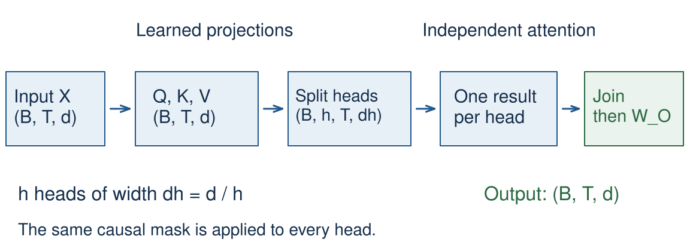
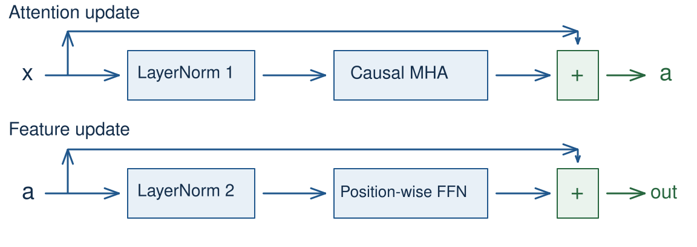
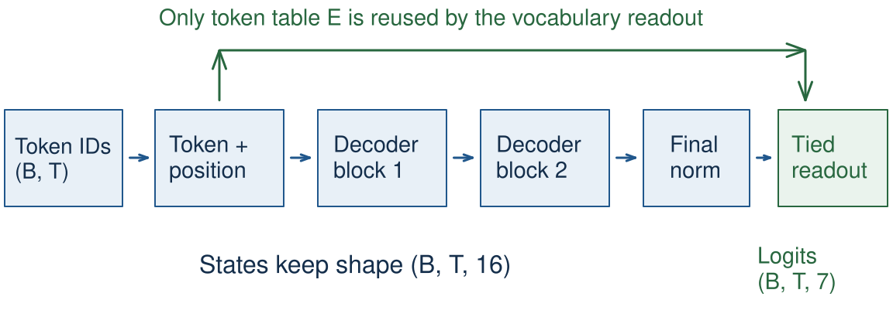
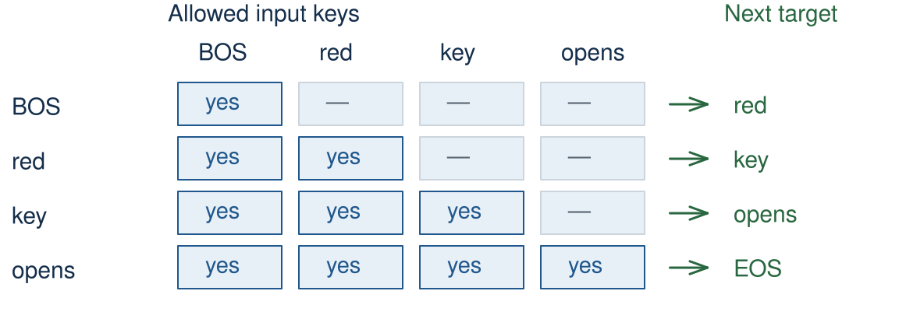

<!-- .slide: class="title-slide" id="title" -->

CS40008.01

# The Transformer as a working model

Lecture 05 – NLP and LLMs

Baojian Zhou School of Data Science Fudan University October 10, 2026

Note:
Saturday make-up class. Three 45-minute periods, with 15 minutes reserved for Quiz 2. The five E exercises are ungraded practices. Quiz 2 assesses previously taught material and is administered separately. Time and room follow the university notice. Adapted from the instructor's 2025 Lecture 05, with the source map in teaching-plan.md.

---

<!-- .slide: id="learning-objectives" -->

## What you will be able to do

**Which components turn attention into a trainable language model?**

- Trace multiple heads and the complete decoder block.
- Explain positions, residual paths, normalization, and the FFN.
- Check a small model's parameters, gradients, and causality.
- Interpret a controlled comparison on toy data.

Note:
Allow 2 minutes for the opening two slides. The notebook contains the full code; slides isolate the important operations. No datasets or model weights need downloading. Predictions before execution are the expected classroom response.

---

<!-- .slide: class="outline-slide" id="outline-heads" -->

## Outline

<ul class="outline-topics">
<li aria-current="step">Multi-head attention and positions</li>
<li>Transformer blocks</li>
<li>A working language model</li>
</ul>

Period 1 · 45 minutes, including E01 and E02

Note:
Allow 1 minute. Lecture 04 gave us one checked causal attention head. This period adds multiple projections and explicit position representations.

---

<!-- .slide: id="context-recap" -->

## Context changes a representation

**bank of the river**

A representation of <strong>bank</strong> can use information from <strong>river</strong>.

Attention forms a weighted combination of value vectors.

The weights depend on the query and the available keys.

Illustrative sentence; these words do not prescribe a learned attention pattern.

Note:
Allow 2 minutes. Retain the contextualization example from 2025 slides 22–31. Its bidirectional reading is permitted in an encoder. In a causal decoder, the first token cannot yet see river. At the last position, the prefix contains the whole phrase. The earlier noisy-signal analogy can motivate weighted averaging, but learned attention need not favor nearby positions. Background: Lecture 04, selecting context and causal attention.

---

<!-- .slide: id="attention-contract" -->

## The head we already checked

$$Q=XW_Q,\qquad K=XW_K,\qquad V=XW_V$$

$$A=\operatorname{softmax}_{\text{keys}}
\left(\frac{QK^\top}{\sqrt{d_k}}+M\right),\qquad O=AV$$

- A causal mask allows the current and earlier input positions.
- Queries and keys share $d_k$; values may have another width.

Note:
Allow 2 minutes. Row vectors throughout this lecture; batch dimensions are suppressed here. M is zero on allowed entries and negative infinity elsewhere. Every query must retain an allowed key. The variance motivation for sqrt(d_k) assumes independent, zero-mean, unit-variance components. Lecture 04 already verified outputs, gradients, and future-input independence. Correct the 2025 slide 29 dictionary analogy: d['b'] is 2, not 3. Source: Vaswani et al. (2017), §§3.2.1 and 3.2.3, https://arxiv.org/abs/1706.03762.

---

<!-- .slide: id="architecture-families" -->

## Three uses of Transformer blocks

| Architecture | Available context | Example objective |
| --- | --- | --- |
| Encoder | Both directions | Predict a masked token |
| Decoder language model | Current prefix | Predict the next token |
| Encoder–decoder | Source plus target prefix | Translate a sentence |

**Our executable model is a decoder language model.**

Note:
Allow 1 minute. The 2025 deck develops the original translation architecture (slides 3–8 and 38–41). Keep it as the source of the building blocks and use a decoder language model for the course's working implementation. An encoder–decoder Transformer also has decoder-to-encoder cross-attention. Sources: Vaswani et al. (2017), §3; Devlin et al. (2019), §3, https://aclanthology.org/N19-1423/.

---

<!-- .slide: id="multiple-views" -->

## Multiple learned views of context

**I gave my dog Charlie some food.**

The representation at <strong>gave</strong> may benefit from several relations.

Each head learns its own query, key, and value projections.

The sentence illustrates possible relations. Heads are not assigned grammatical roles.

Note:
Allow 2 minutes. Adapt 2025 slides 32–35. This example uses bidirectional context, as in the original encoder. Do not draw a causal arrow from gave to food in our language model. Multiple heads permit different learned projections; neither unique specialization nor improved quality is guaranteed. At fixed model width with d_h=d/h, increasing h does not itself increase the four dense projection matrices' total parameters. Source: Vaswani et al. (2017), §3.2.2.

---

<!-- .slide: id="head-equations" -->

## Separate projections, one output

$$H_i=\operatorname{Attention}
(XW_Q^{(i)},XW_K^{(i)},XW_V^{(i)})$$

$$\operatorname{MHA}(X)
=[H_1;\ldots;H_h]W_O$$

Each head has width $d_h=d/h$ in our model.

Concatenate along features, then mix with $W_O$.

Note:
Allow 3 minutes. The semicolon denotes feature concatenation, not addition. All heads receive the same sequence but use different learned projections. Our baseline uses d_k=d_v=d_h and no projection biases. More general dimension choices are possible. Source: 2025 slides 34 and 39; Vaswani et al. (2017), §3.2.2.

---

<!-- .slide: id="multihead-path" -->

## The multi-head computation

Splitting heads rearranges features. It creates no new parameters.

Note:
Allow 2 minutes. Trace one token through every stage, then trace one head across tokens. The projections do the learning; reshape and transpose do bookkeeping. Original editable diagram, following 2025 slides 34 and 39.

---

<!-- .slide: id="head-shapes" -->

## Shapes through multiple heads

| Quantity | Shape |
| --- | --- |
| Input and projected Q/K/V | $(B,T,d)$ |
| Q/K/V after splitting | $(B,h,T,d_h)$ |
| Scores and weights | $(B,h,T,T)$ |
| Per-head outputs | $(B,h,T,d_h)$ |
| Joined and projected output | $(B,T,d)$ |

Note:
Allow 2 minutes. Key positions are the last axis of the score tensor. The query and key lengths happen to agree for self-attention; they can differ in cross-attention. Our example has B=2, T=4, d=16, h=4, and d_h=4. Use labels, not just the repeated number 4, to identify axes.

---

<!-- .slide: id="split-heads" -->

## Split features, then move the head axis

~~~python
B, T, d = x.shape
q = q_proj(x)
q = q.reshape(B, T, h, d // h)
q = q.transpose(1, 2)
# q: (batch, head, query_position, head_feature)
~~~

The transpose changes which axis is a token position.

Note:
Allow 2 minutes. Apply the same operations to K and V. A direct reshape to (B,h,T,d_h) generally mixes token and head indices; matching output shapes cannot establish correctness. The notebook compares with a loop over heads. PyTorch uses row-vector batches, while nn.Linear stores each matrix as (out_features,in_features).

---

<!-- .slide: id="join-heads" -->

## Join the head outputs

~~~python
scores = q @ k.transpose(-2, -1) / math.sqrt(dh)
scores = scores.masked_fill(~allowed, -torch.inf)
weights = scores.softmax(dim=-1)
z = weights @ v
z = z.transpose(1, 2).contiguous().view(B, T, d)
out = out_proj(z)
~~~

The allowed mask broadcasts across the batch and heads.

Note:
Allow 3 minutes. Here allowed is a lower triangular (T,T) Boolean tensor, with True meaning permitted. Explain contiguous before view: transpose changes strides. This explicit version materializes scores for teaching. The notebook supplies imports, projections, shape validation, and mask construction on the input device; this slide is an excerpt.

---

<!-- .slide: class="exercise" id="exercise-01" -->

Exercise E01 · 5 minutes · predict, then check

## Trace and verify the heads

Use $B=2,\ T=4,\ d=16,\ h=4$.

Give the split-Q, score, and joined-output shapes.
Then compare batched attention with a loop over heads.

$(2,4,4,4)$; $(2,4,4,4)$; $(2,4,16)$.
Equal shapes hide different axis meanings. Check values and gradients.

Note:
Allow 5 minutes, including checking. Notebook E01 runs the independently expressed head reference in float64. Students identify every axis and inspect the agreement. A wrong reshape is a useful negative control. Do not merely verify that the output has the right shape.

---

<!-- .slide: id="why-positions" -->

## What changes when tokens move?

Without positions or a mask, self-attention satisfies

$$\operatorname{SA}(PX)=P\operatorname{SA}(X)$$

$P$ permutes the token rows.

The output moves with each token; it does not identify its original slot.

Note:
Allow 3 minutes. This is permutation equivariance, not invariance of the whole output tensor. It assumes shared projections and no position-dependent mask or bias. A causal mask already constrains ordering, so do not apply this identity to a fixed causal mask under arbitrary permutations. Connect to the paired-key/value permutation in Lecture 04. Source: 2025 slides 23 and 52–55; Vaswani et al. (2017), §3.5.

---

<!-- .slide: id="sinusoidal-positions" -->

## Sinusoidal positions

$$\operatorname{PE}(p,2i)
=\sin\left(p/10000^{2i/d}\right)$$

$$\operatorname{PE}(p,2i+1)
=\cos\left(p/10000^{2i/d}\right)$$

Add this vector to the token embedding at position $p$.

$i=0,\ldots,d/2-1$; the teaching example uses an even width.

Note:
Allow 3 minutes. A pair of coordinates uses the same frequency. Correct the duplicate final sine in 2025 slide 54 and use zero-based frequency indices consistently. At p=0 each pair is (0,1), not (0,0). The original model used sinusoidal positions and also evaluated learned positions. Source: Vaswani et al. (2017), §3.5.

---

<!-- .slide: id="position-frequencies" -->

## Different coordinates change at different rates

Deterministic formula values, with $d=8$. This is not a training result.

Note:
Allow 2 minutes. The source deck compares positional frequencies with binary digits (slides 53–54). The graph makes the frequency change visible without suggesting that sine coordinates are bits. The omitted cosine partners have the same frequency. Explicit position features do not guarantee extrapolation to arbitrary sequence lengths.

---

<!-- .slide: id="learned-positions" -->

## Learned absolute positions

~~~python
token_table = nn.Embedding(vocab_size, d)
position_table = nn.Embedding(max_length, d)
positions = torch.arange(ids.shape[1], device=ids.device)
x = token_table(ids) + position_table(positions)
~~~

Both tables are learned jointly with the model.

The position table covers a fixed range of slots.

Note:
Allow 2 minutes. Our baseline uses a four-row position table. Reject sequences beyond max_length rather than silently recycling indices. Learned positions add max_length*d parameters. They do not require a pretrained word-vector model. This resolves the inconsistent descriptions in 2025 slides 42 and 57. Source: Vaswani et al. (2017), §3.5, learned-position comparison.

---

<!-- .slide: id="rotary-positions" -->

## Rotary positions change Q and K

$$\widetilde q_p=R_pq_p,\qquad
\widetilde k_s=R_sk_s$$

$$\widetilde q_p^\top\widetilde k_s
=q_p^\top R_{s-p}k_s$$

Each coordinate pair rotates with position.
The relative offset enters the dot product.

RoPE comparison; the notebook baseline uses learned absolute positions.

Note:
Allow 2 minutes. Column vectors in this two-dimensional rotation identity; the rest of the implementation stores row-vector batches. Each pair has its own frequency, and R_p transpose times R_s equals R_(s-p). Standard RoPE rotates Q and K, not V. This is a short continuation of the reference on 2025 slide 55; do not turn it into a survey of long-context modifications. Source: Su et al., RoFormer, §3.2, https://arxiv.org/abs/2104.09864.

---

<!-- .slide: id="position-demo" -->

## Position changes a token's output

<button id="position-toggle" type="button" aria-pressed="false">Positions: off</button>
<button id="position-swap" type="button" aria-pressed="false">Swap bank / river</button>
<button id="position-reset" type="button">Reset</button>

Note:
Allow 1 minute before E02. The four word labels reuse the source sentence, but their vectors are the rows of the identity matrix, not trained embeddings. Q/K/V projections are identity and the scale is sqrt(4). Swap the first and last token and compare each token's output after undoing that permutation. Position vectors, when enabled, remain attached to slots. There is deliberately no causal mask. Reset restores the PDF's initial state.

---

<!-- .slide: class="exercise" id="exercise-02" -->

Exercise E02 · 5 minutes · predict, then check

## Does the output move with the token?

Swap <strong>bank</strong> and <strong>river</strong>, then undo that permutation on the output.

Predict the difference with positions <strong>off</strong>, then <strong>on</strong>.

Off: the outputs agree up to rounding.
On: fixed slot vectors change the token's input and output.

Note:
Allow 5 minutes. Use the browser before running the corresponding notebook cells. Both use X=I4 and permutation [3,1,2,0], with sinusoidal positions at slots 0–3. Check the actual tensors, not only the attention visualization. The statement is specific to unmasked attention. In our causal language model, position embeddings and the mask both contribute ordering information.

---

<!-- .slide: class="outline-slide" id="outline-blocks" -->

## Outline

<ul class="outline-topics">
<li>Multi-head attention and positions</li>
<li aria-current="step">Transformer blocks</li>
<li>A working language model</li>
</ul>

Period 2 · 45 minutes, including E03 and E04

Note:
Allow 1 minute. The head mixes context; a block also needs feature transformations and a trainable path through depth. The original source returns to the architecture repeatedly in slides 51,56,59,65,68,70,71; this section follows that progression in a simpler decoder diagram.

---

<!-- .slide: id="residual-paths" -->

## Keep a residual path through each sublayer

Every update and its residual have shape $(B,T,d)$.

Note:
Allow 4 minutes. Trace the direct path and the learned update separately. The attention sublayer mixes allowed positions; the FFN transforms features at each position. Addition requires identical shapes. Residual paths provide a direct gradient contribution but do not guarantee stable gradients at all depths. Sources: 2025 slides 66–67; Vaswani et al. (2017), §3.1; Xiong et al. (2020).

---

<!-- .slide: id="norm-location" -->

## Where does normalization go?

**Original post-LN sublayer**

$$y=\operatorname{LN}\bigl(x+F(x)\bigr)$$

**Our pre-LN sublayer**

$$y=x+F\bigl(\operatorname{LN}(x)\bigr)$$

The placement changes the computation and its gradients.

Note:
Allow 4 minutes. F is attention or the FFN. The original 2017 Transformer also uses dropout; the teaching model has none. Our pre-LN decoder includes a final normalization before readout. For the controlled comparison later, both variants retain that final norm, so only sublayer norm order changes. Do not describe the comparison model as a full reproduction of the 2017 architecture. Source: Xiong et al., On Layer Normalization in the Transformer Architecture, https://proceedings.mlr.press/v119/xiong20b.html.

---

<!-- .slide: id="layernorm-axis" -->

## LayerNorm works across one token's features

$$\mu=\frac1d\sum_jx_j,\qquad
v=\frac1d\sum_j(x_j-\mu)^2$$

$$\operatorname{LN}(x)_j
=\gamma_j\frac{x_j-\mu}{\sqrt{v+\epsilon}}+\beta_j$$

For $(B,T,d)$ states, normalize the last axis.

Each token has its own statistics; $\gamma,\beta$ are shared across tokens.

Note:
Allow 4 minutes. Use the population variance (divide by d), as in nn.LayerNorm. Our epsilon is 1e-5, with learned affine scale and bias. Normalizing across time would mix statistics from future positions and can break causality. Source: Ba et al., Layer Normalization (2016), https://arxiv.org/abs/1607.06450; 2025 slide 67.

---

<!-- .slide: class="exercise" id="exercise-03" -->

Exercise E03 · 4 minutes · predict, then check

## Normalize and add

For $x=(1,3)$, find $\mu$, $v$, and $\operatorname{LN}(x)$ with $\gamma=1$, $\beta=0$, $\epsilon=10^{-5}$.

A sublayer returns $(2,-1)$. What is the residual sum?

$\mu=2,\ v=1$; $\operatorname{LN}(x)\approx(-1,1)$.
The residual sum is $(3,2)$.

Note:
Allow 4 minutes. The exact normalized vector is (-1,1)/sqrt(1+epsilon), approximately(-0.999995,0.999995). The residual sum is x+F(...), not LN(x)+F(...), in our pre-LN model. The sublayer output in the question is given; students need not infer F. Notebook checks this calculation and the feature axis.

---

<!-- .slide: id="feedforward" -->

## A feedforward network at each position

$$\operatorname{FFN}(x)
=\operatorname{ReLU}(xW_1)W_2$$

$$d\ \longrightarrow\ d_{\mathrm{ff}}\ \longrightarrow\ d$$

The same weights are applied independently to every token.

Our teaching FFN omits biases.

Note:
Allow 3 minutes. The original Transformer uses two affine layers with biases and a ReLU. State our deliberate simplification before counting parameters. The inner width need not be 4d; our tiny model uses d=16 and d_ff=32. No new context is mixed by a position-wise FFN alone. Source: 2025 slide69; Vaswani et al. (2017), §3.3.

---

<!-- .slide: id="token-feature-mixing" -->

## Attention and the FFN do different work

| Sublayer | Information combined | Output shape |
| --- | --- | --- |
| Causal attention | Features from allowed token positions | $(B,T,d)$ |
| Position-wise FFN | Features within one token state | $(B,T,d)$ |

Changing another token can affect attention's output.

It cannot affect a standalone FFN's output at this token.

Note:
Allow 2 minutes. Test this on already supplied input states to an isolated FFN. In a complete block, the FFN input already contains context from attention. Avoid implying the full model's FFN states are context-free. Notebook includes a position-isolation check.

---

<!-- .slide: id="block-code" -->

## A complete pre-LN block

~~~python
def forward(self, x, causal=True):
    update, _ = self.attention(self.attention_norm(x), causal)
    x = x + update
    return x + self.ffn(self.ffn_norm(x))
~~~

Each block has its own attention, FFN, and normalization parameters.

The notebook defines every component explicitly.

Note:
Allow 3 minutes. This is the pre-LN branch of the notebook's Block.forward. Attention also returns its weights for inspection; the underscore discards them here. Inputs and outputs keep shape (B,T,d). Distinct blocks have distinct parameters; the same block parameters apply to all time positions. No recurrence over positions is introduced.

---

<!-- .slide: id="block-parameters" -->

## Count one block's parameters

Use $d=16$, $h=4$, and $d_{\mathrm{ff}}=32$.

| Component | Count | Value |
| --- | --- | ---: |
| Q, K, V, output projections | $4d^2$ | 1,024 |
| Two FFN matrices | $2d\,d_{\mathrm{ff}}$ | 1,024 |
| Two affine LayerNorms | $4d$ | 64 |
| **One block** | | **2,112** |

All Linear layers are bias-free. LayerNorm has both scale and bias.

Note:
Allow 2 minutes. Four heads of width 4 partition each full-width projection. There is no extra factor of h in 4d². The operations softmax, reshape, mask, residual addition, and ReLU add no trainable parameters. This makes the conventions missing from 2025 slide 77 explicit.

---

<!-- .slide: class="exercise" id="exercise-04" -->

Exercise E04 · 5 minutes · predict, then check

## Count the whole language model

Two blocks; $d=16$; 7 tokens; 4 learned positions.

Add one final affine LayerNorm.
Tie the bias-free output matrix to the token table.

$2(2112)+7(16)+4(16)+2(16)=\mathbf{4432}$.
Untying the readout adds 112 parameters.

Note:
Allow 5 minutes. Verify 4432 unique trainable parameters, or 4544 with an untied output. Weight tying means the same Parameter object is reused; equal initial values in distinct Parameters are not tying. This is a new ungraded practice inspired by the parameter-count concept in 2025 slide 77, not the current private quiz.

---

<!-- .slide: id="full-model" -->

## Assemble the language model

Every position produces a vocabulary logit vector: $(B,T,7)$.

Note:
Allow 4 minutes. Match each box to a notebook module. The repeated blocks change representations but preserve shape. Only the token embedding table is reused for readout; the position table is independent. The source architecture's encoder and cross-attention are omitted because this model predicts a continuation from one prefix.

---

<!-- .slide: id="shifted-targets" -->

## The input and target are shifted

| Position | 0 | 1 | 2 | 3 |
| --- | --- | --- | --- | --- |
| Input | BOS | red | key | opens |
| Target | red | key | opens | EOS |

The logit vector at position $t$ predicts token $t+1$.

Teacher forcing supplies the observed input prefix during training.

Note:
Allow 3 minutes. Continue Lecture 04's seven-token vocabulary and two invented sentences. The second is BOS blue key closes EOS. Inputs and targets are sliced within each document; nothing crosses a sentence boundary. There is no padding in this example. Source: 2025 slide58 and original Transformer shifted-right decoder input.

---

<!-- .slide: id="causal-visibility" -->

## The diagonal is allowed

Position $t$ can read input $t$ while predicting target $t+1$.

Note:
Allow 2 minutes. Revisit the off-by-one ambiguity in 2025 slide61. The token at the diagonal is an observed input, not the next target. A strict lower triangle would create a fully masked first row unless another special convention were used. Our lower triangle includes the diagonal and every row has at least one allowed key.

---

<!-- .slide: id="attention-inputs" -->

## Where do Q, K, and V come from?

| Attention use | Q | K and V | Visibility |
| --- | --- | --- | --- |
| Encoder self-attention | Source states | Source states | All valid source tokens |
| Decoder self-attention | Target states | Target states | Target prefix |
| Decoder cross-attention | Target states | Encoder outputs | All valid source tokens |

Note:
Allow 2 minutes. This table completes the bridge from the original source's translation diagram to the implemented model. Source and target lengths can differ in cross-attention, so its score matrix can be rectangular. Padding masks still apply when sequences are padded. Our no-padding decoder-only notebook needs just the causal self-attention row. Source: Vaswani et al. (2017), §3.2.3.

---

<!-- .slide: id="bert-contrast" -->

## Bidirectional masked prediction

**The cat sat on the [MASK].**

A BERT-style encoder can use context on both sides of a selected token.

The training objective predicts selected corrupted positions.

A causal language model instead predicts the next token from its prefix.

Note:
Allow 2 minutes. In BERT's original recipe, selected prediction positions are corrupted using a mixture of masking, replacement, and unchanged tokens; this sentence shows only the mask-token case. Do not imply BERT is obtained by removing a causal mask while keeping next-token targets, which would leak target information. Source: Devlin et al. (2019), §3.1. Keep the broader model-family survey for other material.

---

<!-- .slide: class="outline-slide" id="outline-working" -->

## Outline

<ul class="outline-topics">
<li>Multi-head attention and positions</li>
<li>Transformer blocks</li>
<li aria-current="step">A working language model</li>
</ul>

Period 3 · 30 minutes of teaching, then Quiz 2 (15 minutes)

Note:
Allow 1 minute. The complete code is already in the notebook. Run small checks before interpreting a training curve. Quiz 2 is separate private material on previous lectures. The teaching plan reserves the published 15-minute quiz duration.

---

<!-- .slide: id="toy-configuration" -->

## A model small enough to inspect

| Setting | Teaching baseline |
| --- | --- |
| Data | Two invented sentences, seven token IDs |
| Shape | Batch 2, length 4, width 16 |
| Blocks | 2; each has 4 heads and FFN width 32 |
| Positions / normalization | Learned absolute / pre-LN |
| Readout / total parameters | Tied / 4,432 |

Note:
Allow 1 minute. No dropout or Linear biases; affine LayerNorm with epsilon 1e-5. Parameters use seed 7 and a documented initialization. This is a transparent mechanism and debugging example; no generalization or benchmark-quality claim is possible from two sentences.

---

<!-- .slide: id="logits-and-loss" -->

## Compute next-token loss from logits

~~~python
inputs = documents[:, :-1]
targets = documents[:, 1:]
logits = model(inputs)              # (2, 4, 7)
loss = F.cross_entropy(
    logits.reshape(-1, 7), targets.reshape(-1)
)
~~~

Cross-entropy receives raw logits.

Note:
Allow 1 minute. Flatten batch and position in the same order for logits and targets. The library computes log-softmax internally; applying softmax first changes the expected input. Our targets include EOS, while BOS is an input-only token. There is no ignored padding in this toy batch.

---

<!-- .slide: id="check-complete-model" -->

## Check the complete computation

1. Compare multiple heads with an independent reference.
2. Perturb a future token and compare earlier logits.
3. Differentiate an early-output loss with respect to input states.

Run comparisons with dropout disabled and stated tolerances.

Note:
Allow 2 minutes. A correct head can still be embedded in an incorrect model. A wrong normalization axis or reshape can introduce leakage. The gradient test must use per-position input states, not embedding-table gradients: the same token embedding parameters can be used at several positions. No dropout is present here; eval mode remains a useful habit for deterministic comparisons.

---

<!-- .slide: class="exercise" id="exercise-05" -->

Exercise E05 · 6 minutes · predict, then check

## Can the future change the prefix?

Change only input position 3 in the two-block model.

Which logits can change? Where may an early-output loss send gradients?

Logits at positions 0–2 stay unchanged.
Their loss has zero gradient to the input state at position 3.
An unmasked negative control can leak.

Note:
Allow 6 minutes. The notebook compares complete-model logits and uses a prefix loss on positions 0–2. It checks zero future gradients and nonzero allowed-prefix gradients. The future token replacement is legal but deliberately different. Then inspect the unmasked negative control so a trivially constant implementation cannot satisfy the lesson.

---

<!-- .slide: id="verification-evidence" -->

## Evidence for correctness

| Check | Expected evidence |
| --- | --- |
| Batched heads vs head loop | Outputs and gradients agree in float64 |
| Full-model future perturbation | Earlier logits agree |
| Loss on earlier logits | Future input-state gradients are zero |
| Unmasked negative control | Earlier logits can change |

A loss curve alone cannot establish causality or tensor correctness.

Note:
Allow 1 minute. Forward and gradient comparisons use explicit numerical tolerances in the tests; inspect the notebook's printed errors. Causality tests cover two blocks, feature-wise norms, residual additions, and final readout. A finite-difference or library reference complements the independently expressed head loop when checking derivatives.

---

<!-- .slide: id="irreducible-toy-loss" -->

## This toy batch cannot reach zero loss

Both sentences start with <strong>BOS</strong>.
The next token is <strong>red</strong> or <strong>blue</strong>, equally often.

$$L_{\min}=\frac{\log 2}{4}\approx0.1733
\quad\text{nats per token}$$

The other three targets per sentence can be predicted consistently.

Note:
Allow 2 minutes. There are eight target positions in the two-sentence batch. The identical BOS prefix contributes two copies of log 2 at optimum; other terms can approach zero. We do not mask away the ambiguous targets or claim perfect top-1 accuracy. A fitting criterion below 0.20 nats is meaningful here. The lower bound is an infimum for finite softmax logits; the other target losses approach zero with increasing margins.

---

<!-- .slide: id="tiny-training-loop" -->

## Fit the checked model on the tiny batch

~~~python
optimizer = torch.optim.AdamW(
    model.parameters(), lr=0.02, weight_decay=0.0
)
for step in range(200):
    optimizer.zero_grad()
    logits = model(inputs)
    loss = F.cross_entropy(
        logits.flatten(0, 1), targets.flatten()
    )
    loss.backward()
    optimizer.step()
~~~

CPU, seed 7, full batch, no dropout. This is a fitting check.

Note:
Allow 2 minutes. Parameters are initialized with standard deviation 0.02 for embeddings and Linear weights; norms start with scale 1 and bias 0. AdamW uses betas (0.9,0.999), epsilon 1e-8, and zero weight decay. Record losses before training and after completed updates; do not confuse update index with an epoch over a large dataset. See assets/README.md for the exact run and caveats.

---

<!-- .slide: id="norm-comparison" -->

## Compare normalization order

Same initial parameters and training budget; only block norm order changes.

Note:
Allow 3 minutes. Both variants retain the same final LayerNorm, tied readout, learned position table, and training configuration. The graph is recomputed from the notebook; it is not a claim that one placement always trains faster. Values at 0 are before any update; values at 200 follow 200 updates. Historical motivation: Xiong et al. (2020). The measured comparison is our own controlled toy experiment.

---

<!-- .slide: id="comparison-limits" -->

## What does this comparison establish?

- Both models use the same data, initialization, optimizer, and budget.
- Their losses and gradient norms describe this small fitting run.
- One seed and two blocks cannot establish a general ranking.

Next: change one factor and repeat the checks.

Note:
Allow 2 minutes. The notebook records initial/final losses and gradient norms even if post-LN performs as well as or better than pre-LN. Preserve that result. Training stability can depend on depth, initialization, learning rate, and normalization details; the source deck's blanket claim of no vanishing/exploding gradients is removed. Do not infer held-out performance because there is no held-out set. If extending to a corpus, split documents before forming overlapping windows.

---

<!-- .slide: id="attention-cost" -->

## A materialized attention matrix grows quadratically

$$\text{score storage}=4BhT^2\ \text{bytes in float32}$$

| Length $T$ | One matrix, $B=2,\ h=4$ |
| --- | ---: |
| 256 | 2 MiB |
| 1,024 | 32 MiB |
| 2,048 | 128 MiB |

One layer's score or weight tensor; this is not total training memory.

Note:
Allow 2 minutes. MiB means 2^20 bytes. The formula counts a materialized (B,h,T,T) tensor, not every kernel's implementation or total model state. Our tiny T=4 tensor needs 512 bytes. At fixed width, QK and AV together take approximately 4BT²d floating-point operations when a multiply-add counts as 2. Original slides 81–82 survey approximate alternatives; later efficiency material will distinguish algorithm changes from memory-efficient exact attention. Training positions can be parallelized, but autoregressive generation still depends on preceding generated tokens.

---

<!-- .slide: id="historical-result" -->

## A historical translation result

| WMT14 English–French | BLEU | Estimated training FLOPs |
| --- | ---: | ---: |
| ConvS2S, single model | 40.46 | $1.5\times10^{20}$ |
| Transformer, big | 41.8 | $2.3\times10^{19}$ |

Vaswani et al., Table 2, arXiv v7. Historical systems with different training setups.

Note:
Allow 1 minute, or assign as reading if the comparison discussion runs long. These are the table values, not a controlled same-hardware timing experiment. The roughly 6.5x ratio is estimated FLOPs; the roughly 50x source claim compared an ensemble's cost and called it speed. The paper's prose and historical versions can report a different EN-FR number; explicitly pin this table. Source: 2025 slides72–75; https://arxiv.org/html/1706.03762v7#S6.T2. Further MT and parsing details are in optional-reading.md.

---

<!-- .slide: id="original-and-baseline" -->

## The original architecture and our baseline

| Choice | 2017 Transformer | Teaching decoder |
| --- | --- | --- |
| Architecture | Encoder–decoder | Two decoder blocks |
| Positions | Sinusoidal | Learned absolute |
| Sublayer norm | Post-LN | Pre-LN |
| Regularization | Dropout and label smoothing | Neither in the toy fit |

State each choice before interpreting a result or counting parameters.

Note:
Allow 1 minute. This table identifies deliberate adaptation rather than silently mixing diagrams from incompatible designs. The original FFN also has biases, while ours does not. Our controlled post-LN comparison changes only sublayer placement and keeps a final norm, so it is not the complete original model. Sources: Vaswani et al. §§3,5.4; source deck 76; teaching-plan.md configuration.

---

<!-- .slide: id="recap" -->

## Check your model of the Transformer

1. Which operation combines information across token positions?
2. Why can a causal model read its diagonal input?
3. Why can this two-sentence batch never reach zero mean loss?

**A working model needs a correct computation and evidence that checks it.**

Note:
Allow 1 minute. Expected responses: attention combines permitted positions; the current input predicts the next target; identical BOS prefixes have two equally frequent next tokens. The FFN and LayerNorm act within features at a position. This recap is ungraded; it does not expose the private quiz.

---

<!-- .slide: id="next-steps" -->

## Before Lecture 06

- Reopen E05 and inspect the complete-model checks.
- A2 and candidate projects are scheduled for release today.
- A2 is due October 31; project proposals are due October 14.

**October 14:** pretraining and decoding in practice.

Submission deadlines: 23:59, Asia/Shanghai. Follow the course announcements and eLearning.

Note:
Allow 1 minute. These are the published course dates at authoring; the slide introduces no new release or deadline. Quiz 2 uses the 15-minute slot and covers prior material through the private instructor workflow. Keep instructions to students in the published assignment/project announcements. Later Lecture 06 covers optimizer schedules, checkpoint/resume behavior, and decoding. References: ../../docs/schedule.md and ../../index.html.

---

<!-- .slide: class="references" id="references" -->

## Reading

- [Vaswani et al., Attention Is All You Need](https://arxiv.org/abs/1706.03762): §§3.1–3.5; §4.
- [Xiong et al., LayerNorm in Transformers](https://proceedings.mlr.press/v119/xiong20b.html): pre-LN and post-LN.
- [Devlin et al., BERT](https://aclanthology.org/N19-1423/): §3.1, masked prediction.
- [Su et al., RoFormer](https://arxiv.org/abs/2104.09864): §3.2, optional RoPE reading.
- [Historical examples and further reading](optional-reading.md)

Note:
The 2025 Lecture 05 PowerPoint supplied the content sequence and examples; teaching-plan.md maps every source slide and records corrections. All new diagrams are editable and documented in assets/README.md. The core notebook is offline. Figures and reported values must be checked against their cited versions rather than carried forward from a screenshot.
