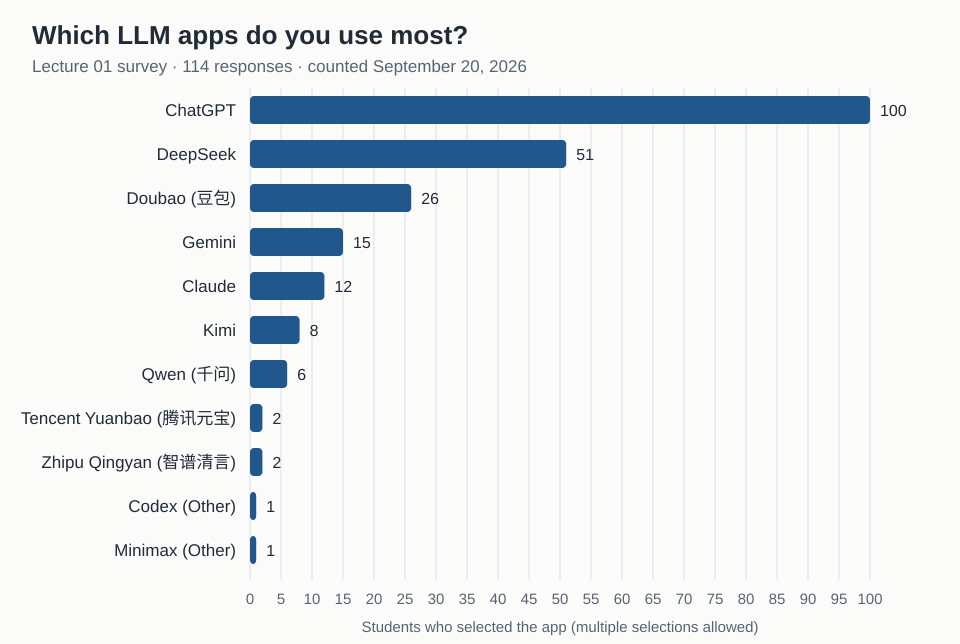

# Lecture 01: Which LLM apps do you use most?

Help us understand the class's experience with LLM apps while practicing your
first pull request (PR). Select at most two apps you regularly use in everyday
life from nine listed apps and Other. If you do not regularly use any LLM app,
leave all boxes unchecked.

The shared [survey issue #6](https://github.com/baojian/llm-26-fall/issues/6)
contains the instructions and a complete response template.

Responses and PRs are public. Use your GitHub username; no real name or student
ID is needed. Share only app names you are comfortable making public.

## Results so far

<!-- survey-results:start -->
Counted from the merged files in [responses/](responses/) on September 11, 2026:
**26 responses**, at most two selections each. 2 responses selected more than 2 apps and are not counted.

| App | Students |
| :--- | ---: |
| ChatGPT | 22 |
| DeepSeek | 13 |
| Gemini | 4 |
| Doubao (豆包) | 4 |
| Claude | 3 |
| Kimi | 1 |
| Qwen (千问) | 0 |
| Tencent Yuanbao (腾讯元宝) | 0 |
| Zhipu Qingyan (智谱清言) | 0 |

Apps written under *Other* get their own bar with the suffix "(Other)".
<!-- survey-results:end -->

## Prepare your response

Copy the [response template](template.md) and mark at most two choices with
`[x]`. The choices are ChatGPT, Claude, Gemini, DeepSeek, Doubao, Qwen, Kimi,
Tencent Yuanbao, Zhipu Qingyan, and Other. If you select Other, give one app
name; it counts as one of your two selections. Count the web and mobile
versions of the same app as one choice. One or zero selections is also valid.

Use your GitHub username in lowercase as the filename. For example, the username
`octocat` would submit `surveys/lecture-01/responses/octocat.md`.

## Submit using the GitHub website

1. Sign in to GitHub and open the
   [course repository](https://github.com/baojian/llm-26-fall) on its `main` branch.
2. Select **Add file → Create new file**. GitHub may ask you to fork the
   repository into your account; accept this to create your own copy.
3. Enter `surveys/lecture-01/responses/YOUR_USERNAME.md` as the full filename,
   replacing `YOUR_USERNAME` with your lowercase GitHub username. Paste the
   template into the editor, fill in your answers, and use **Preview** to check
   the formatting. Create your own response file; keep the template unchanged.
4. Choose **Commit changes** or **Propose changes**, with the commit message
   `add lecture 01 survey response`. Use a new branch named `lecture-01-survey`
   if GitHub asks you to choose a branch.
5. Follow **Compare & pull request** or **Create pull request**. Check that the
   destination is `baojian/llm-26-fall`, base branch `main`, and the source is the
   branch containing your response in your fork.
6. Set the PR title to `survey: YOUR_USERNAME` and put `Related to #6` in the
   description. Check that **Files changed** contains only your response file,
   then select **Create pull request**. Keep the PR URL as your submission link.
   The teaching team will review and merge it.

Do not reference the shared issue with `Fixes`, `Closes`, or `Resolves`, since
merging a response should leave the issue open for the other students.

If you need to correct an open PR, edit your response on the same branch in your
fork and commit the correction there; the PR will update automatically. Keep
one PR per student for this survey.

For more help, see GitHub's guides to
[creating a file](https://docs.github.com/en/repositories/working-with-files/managing-files/creating-new-files)
and
[creating a pull request](https://docs.github.com/en/pull-requests/how-tos/create-pull-requests/creating-a-pull-request).

## For the teaching team

Demonstrate one response and PR during the lecture. Each response has its own
file, so submissions can be merged independently. Review the changed file for
the expected filename, at most two checked boxes, and an app name if Other is
selected before merging. Zero selections is a valid response.

After merging a batch of responses, run `uv run python scripts/survey_results.py`
from the repository root. It rewrites the bar chart [results.svg](results.svg)
and the **Results so far** block above, which GitHub shows on this folder's
page and the course website links from the Week 1 row. Responses with more
than two selections are not counted.

The `survey:` title prefix makes these PRs easy to find. Divide review among the
teaching team to handle the class's submissions. After merging, the files in
[responses/](responses/) provide the survey record. Close the shared issue
after collecting the class's responses.
