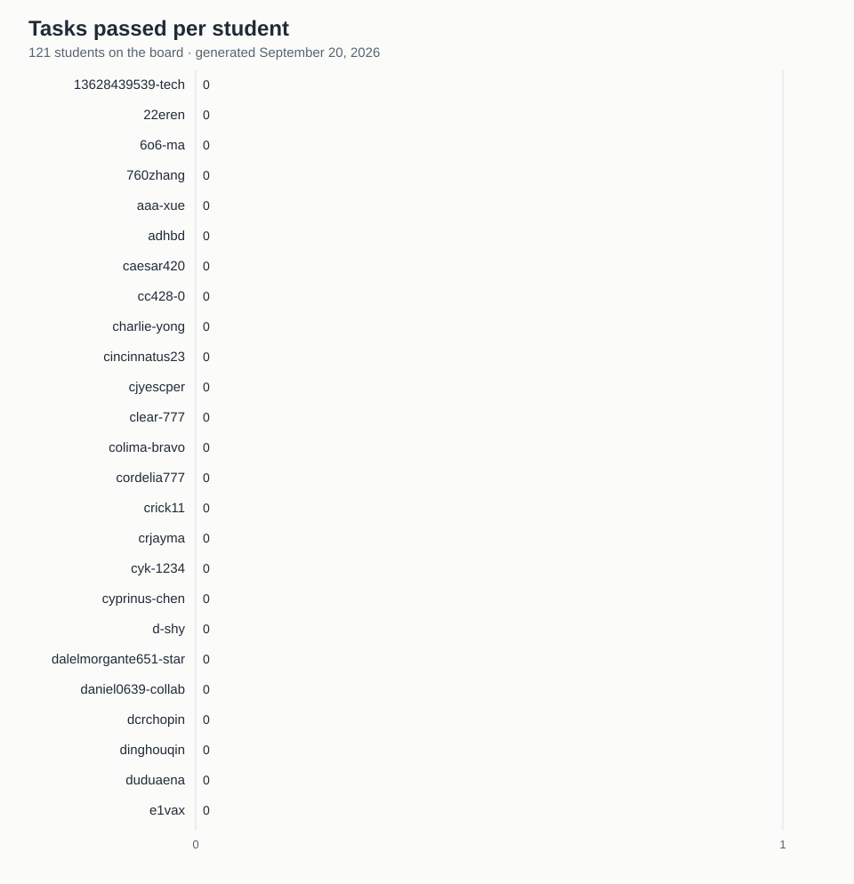

# Progress board

Generated on September 11, 2026 from the merged files in this repository.
Click a username to see that student's merged pull requests.

| # | Student | Tasks passed | Correct rate | Participation | Merged PRs | Badges |
| ---: | :--- | ---: | ---: | ---: | ---: | :--- |
| 1 | [760zhang](https://github.com/baojian/llm-26-fall/pulls?q=is%3Apr+is%3Amerged+author%3A760zhang) | 0 | — | 1 | 1 | 🥇 |
| 2 | [d-shy](https://github.com/baojian/llm-26-fall/pulls?q=is%3Apr+is%3Amerged+author%3Ad-shy) | 0 | — | 1 | 1 | 🥇 |
| 3 | [dinghouqin](https://github.com/baojian/llm-26-fall/pulls?q=is%3Apr+is%3Amerged+author%3Adinghouqin) | 0 | — | 1 | 1 | 🥇 |
| 4 | [e1vax](https://github.com/baojian/llm-26-fall/pulls?q=is%3Apr+is%3Amerged+author%3Ae1vax) | 0 | — | 1 | 1 | 🥇 |
| 5 | [eric15342335](https://github.com/baojian/llm-26-fall/pulls?q=is%3Apr+is%3Amerged+author%3Aeric15342335) | 0 | — | 1 | 1 | 🥇 |
| 6 | [garyagasa](https://github.com/baojian/llm-26-fall/pulls?q=is%3Apr+is%3Amerged+author%3Agaryagasa) | 0 | — | 1 | 1 | 🥇 |
| 7 | [garyguan2419](https://github.com/baojian/llm-26-fall/pulls?q=is%3Apr+is%3Amerged+author%3Agaryguan2419) | 0 | — | 1 | 1 | 🥇 |
| 8 | [geekeraman](https://github.com/baojian/llm-26-fall/pulls?q=is%3Apr+is%3Amerged+author%3Ageekeraman) | 0 | — | 1 | 1 | 🥇 |
| 9 | [gxj230958](https://github.com/baojian/llm-26-fall/pulls?q=is%3Apr+is%3Amerged+author%3Agxj230958) | 0 | — | 1 | 1 | 🥇 |
| 10 | [harmonyhhh66](https://github.com/baojian/llm-26-fall/pulls?q=is%3Apr+is%3Amerged+author%3Aharmonyhhh66) | 0 | — | 1 | 1 | 🥇 |
| 11 | [huangz065](https://github.com/baojian/llm-26-fall/pulls?q=is%3Apr+is%3Amerged+author%3Ahuangz065) | 0 | — | 1 | 1 | 🥇 |
| 12 | [huuob](https://github.com/baojian/llm-26-fall/pulls?q=is%3Apr+is%3Amerged+author%3Ahuuob) | 0 | — | 1 | 1 | 🥇 |
| 13 | [jckinpku](https://github.com/baojian/llm-26-fall/pulls?q=is%3Apr+is%3Amerged+author%3Ajckinpku) | 0 | — | 1 | 1 | 🥇 |
| 14 | [jdjxhll](https://github.com/baojian/llm-26-fall/pulls?q=is%3Apr+is%3Amerged+author%3Ajdjxhll) | 0 | — | 1 | 1 | 🥇 |
| 15 | [liuyglucky](https://github.com/baojian/llm-26-fall/pulls?q=is%3Apr+is%3Amerged+author%3Aliuyglucky) | 0 | — | 1 | 1 | 🥇 |
| 16 | [lllusia](https://github.com/baojian/llm-26-fall/pulls?q=is%3Apr+is%3Amerged+author%3Alllusia) | 0 | — | 1 | 1 | 🥇 |
| 17 | [moonlightafar](https://github.com/baojian/llm-26-fall/pulls?q=is%3Apr+is%3Amerged+author%3Amoonlightafar) | 0 | — | 1 | 1 | 🥇 |
| 18 | [naonaozhong](https://github.com/baojian/llm-26-fall/pulls?q=is%3Apr+is%3Amerged+author%3Anaonaozhong) | 0 | — | 1 | 1 | 🥇 |
| 19 | [nashknight](https://github.com/baojian/llm-26-fall/pulls?q=is%3Apr+is%3Amerged+author%3Anashknight) | 0 | — | 1 | 1 | 🥇 |
| 20 | [steven9912](https://github.com/baojian/llm-26-fall/pulls?q=is%3Apr+is%3Amerged+author%3Asteven9912) | 0 | — | 1 | 1 | 🥇 |
| 21 | [still-fantasy-star](https://github.com/baojian/llm-26-fall/pulls?q=is%3Apr+is%3Amerged+author%3Astill-fantasy-star) | 0 | — | 1 | 1 | 🥇 |
| 22 | [wangzj1020](https://github.com/baojian/llm-26-fall/pulls?q=is%3Apr+is%3Amerged+author%3Awangzj1020) | 0 | — | 1 | 1 | 🥇 |
| 23 | [wsqusaqi537](https://github.com/baojian/llm-26-fall/pulls?q=is%3Apr+is%3Amerged+author%3Awsqusaqi537) | 0 | — | 1 | 1 | 🥇 |
| 24 | [xpxpz](https://github.com/baojian/llm-26-fall/pulls?q=is%3Apr+is%3Amerged+author%3Axpxpz) | 0 | — | 1 | 1 | 🥇 |
| 25 | [yanghongpeng8-rgb](https://github.com/baojian/llm-26-fall/pulls?q=is%3Apr+is%3Amerged+author%3Ayanghongpeng8-rgb) | 0 | — | 1 | 1 | 🥇 |
| 26 | [yannickchen77](https://github.com/baojian/llm-26-fall/pulls?q=is%3Apr+is%3Amerged+author%3Ayannickchen77) | 0 | — | 1 | 1 | 🥇 |
| 27 | [yunlangli-shtj](https://github.com/baojian/llm-26-fall/pulls?q=is%3Apr+is%3Amerged+author%3Ayunlangli-shtj) | 0 | — | 1 | 1 | 🥇 |
| 28 | [zifangchu](https://github.com/baojian/llm-26-fall/pulls?q=is%3Apr+is%3Amerged+author%3Azifangchu) | 0 | — | 1 | 1 | 🥇 |

**Columns.** *Tasks passed*: submissions whose checker passes. *Correct rate*:
passed ÷ submitted. *Participation*: lectures with at least one submission,
plus one for the Lecture 01 survey. *Merged PRs*: all pull requests merged
into this repository, including fixes and proposals.

**Badges.** 🥇 first merged PR · 🔥 5 tasks passed · 🏆 10 tasks passed · 🎯 all correct (3+ tasks) · 💡 proposal accepted.

To be left off this board, add your username to `tasks/.progress-optout`.
Regenerate with `uv run python scripts/progress.py`.
