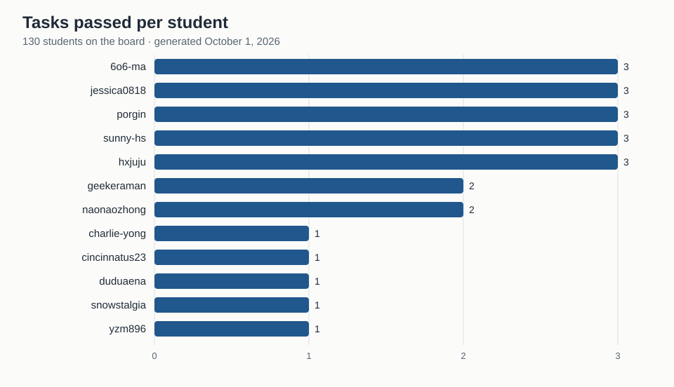

# Progress board

Generated on October 1, 2026 from the merged files in this repository.
Click a username to see that student's merged pull requests.

| # | Student | Tasks passed | Correct rate | Participation | Merged PRs | Badges |
| ---: | :--- | ---: | ---: | ---: | ---: | :--- |
| 1 | [6o6-ma](https://github.com/baojian/llm-26-fall/pulls?q=is%3Apr+is%3Amerged+author%3A6o6-ma) | 3 | 100% | 2 | 4 | 🥇 🎯 |
| 2 | [jessica0818](https://github.com/baojian/llm-26-fall/pulls?q=is%3Apr+is%3Amerged+author%3Ajessica0818) | 3 | 100% | 2 | 4 | 🥇 🎯 |
| 3 | [porgin](https://github.com/baojian/llm-26-fall/pulls?q=is%3Apr+is%3Amerged+author%3Aporgin) | 3 | 100% | 2 | 4 | 🥇 🎯 |
| 4 | [sunny-hs](https://github.com/baojian/llm-26-fall/pulls?q=is%3Apr+is%3Amerged+author%3Asunny-hs) | 3 | 100% | 2 | 4 | 🥇 🎯 |
| 5 | [hxjuju](https://github.com/baojian/llm-26-fall/pulls?q=is%3Apr+is%3Amerged+author%3Ahxjuju) | 3 | 100% | 1 | 3 | 🥇 🎯 |
| 6 | [geekeraman](https://github.com/baojian/llm-26-fall/pulls?q=is%3Apr+is%3Amerged+author%3Ageekeraman) | 2 | 100% | 2 | 3 | 🥇 |
| 7 | [naonaozhong](https://github.com/baojian/llm-26-fall/pulls?q=is%3Apr+is%3Amerged+author%3Anaonaozhong) | 2 | 100% | 2 | 3 | 🥇 |
| 8 | [charlie-yong](https://github.com/baojian/llm-26-fall/pulls?q=is%3Apr+is%3Amerged+author%3Acharlie-yong) | 1 | 100% | 2 | 2 | 🥇 |
| 9 | [cincinnatus23](https://github.com/baojian/llm-26-fall/pulls?q=is%3Apr+is%3Amerged+author%3Acincinnatus23) | 1 | 100% | 2 | 2 | 🥇 |
| 10 | [duduaena](https://github.com/baojian/llm-26-fall/pulls?q=is%3Apr+is%3Amerged+author%3Aduduaena) | 1 | 100% | 2 | 2 | 🥇 |
| 11 | [snowstalgia](https://github.com/baojian/llm-26-fall/pulls?q=is%3Apr+is%3Amerged+author%3Asnowstalgia) | 1 | 100% | 2 | 2 | 🥇 |
| 12 | [yzm896](https://github.com/baojian/llm-26-fall/pulls?q=is%3Apr+is%3Amerged+author%3Ayzm896) | 1 | 100% | 2 | 2 | 🥇 |
| 13 | [13628439539-tech](https://github.com/baojian/llm-26-fall/pulls?q=is%3Apr+is%3Amerged+author%3A13628439539-tech) | 0 | — | 1 | 1 | 🥇 |
| 14 | [22eren](https://github.com/baojian/llm-26-fall/pulls?q=is%3Apr+is%3Amerged+author%3A22eren) | 0 | — | 1 | 1 | 🥇 |
| 15 | [760zhang](https://github.com/baojian/llm-26-fall/pulls?q=is%3Apr+is%3Amerged+author%3A760zhang) | 0 | — | 1 | 1 | 🥇 |
| 16 | [aaa-xue](https://github.com/baojian/llm-26-fall/pulls?q=is%3Apr+is%3Amerged+author%3Aaaa-xue) | 0 | — | 1 | 1 | 🥇 |
| 17 | [adhbd](https://github.com/baojian/llm-26-fall/pulls?q=is%3Apr+is%3Amerged+author%3Aadhbd) | 0 | — | 1 | 1 | 🥇 |
| 18 | [boomboom-yyy](https://github.com/baojian/llm-26-fall/pulls?q=is%3Apr+is%3Amerged+author%3Aboomboom-yyy) | 0 | — | 1 | 1 | 🥇 |
| 19 | [caesar420](https://github.com/baojian/llm-26-fall/pulls?q=is%3Apr+is%3Amerged+author%3Acaesar420) | 0 | — | 1 | 1 | 🥇 |
| 20 | [cc428-0](https://github.com/baojian/llm-26-fall/pulls?q=is%3Apr+is%3Amerged+author%3Acc428-0) | 0 | — | 1 | 1 | 🥇 |
| 21 | [cjyescper](https://github.com/baojian/llm-26-fall/pulls?q=is%3Apr+is%3Amerged+author%3Acjyescper) | 0 | — | 1 | 1 | 🥇 |
| 22 | [clear-777](https://github.com/baojian/llm-26-fall/pulls?q=is%3Apr+is%3Amerged+author%3Aclear-777) | 0 | — | 1 | 1 | 🥇 |
| 23 | [colima-bravo](https://github.com/baojian/llm-26-fall/pulls?q=is%3Apr+is%3Amerged+author%3Acolima-bravo) | 0 | — | 1 | 1 | 🥇 |
| 24 | [cordelia777](https://github.com/baojian/llm-26-fall/pulls?q=is%3Apr+is%3Amerged+author%3Acordelia777) | 0 | — | 1 | 1 | 🥇 |
| 25 | [crick11](https://github.com/baojian/llm-26-fall/pulls?q=is%3Apr+is%3Amerged+author%3Acrick11) | 0 | — | 1 | 1 | 🥇 |
| 26 | [crjayma](https://github.com/baojian/llm-26-fall/pulls?q=is%3Apr+is%3Amerged+author%3Acrjayma) | 0 | — | 1 | 1 | 🥇 |
| 27 | [cyk-1234](https://github.com/baojian/llm-26-fall/pulls?q=is%3Apr+is%3Amerged+author%3Acyk-1234) | 0 | — | 1 | 1 | 🥇 |
| 28 | [cyprinus-chen](https://github.com/baojian/llm-26-fall/pulls?q=is%3Apr+is%3Amerged+author%3Acyprinus-chen) | 0 | — | 1 | 1 | 🥇 |
| 29 | [d-shy](https://github.com/baojian/llm-26-fall/pulls?q=is%3Apr+is%3Amerged+author%3Ad-shy) | 0 | — | 1 | 1 | 🥇 |
| 30 | [dalelmorgante651-star](https://github.com/baojian/llm-26-fall/pulls?q=is%3Apr+is%3Amerged+author%3Adalelmorgante651-star) | 0 | — | 1 | 1 | 🥇 |
| 31 | [daniel0639-collab](https://github.com/baojian/llm-26-fall/pulls?q=is%3Apr+is%3Amerged+author%3Adaniel0639-collab) | 0 | — | 1 | 1 | 🥇 |
| 32 | [dcrchopin](https://github.com/baojian/llm-26-fall/pulls?q=is%3Apr+is%3Amerged+author%3Adcrchopin) | 0 | — | 1 | 1 | 🥇 |
| 33 | [dinghouqin](https://github.com/baojian/llm-26-fall/pulls?q=is%3Apr+is%3Amerged+author%3Adinghouqin) | 0 | — | 1 | 1 | 🥇 |
| 34 | [e1vax](https://github.com/baojian/llm-26-fall/pulls?q=is%3Apr+is%3Amerged+author%3Ae1vax) | 0 | — | 1 | 1 | 🥇 |
| 35 | [ecta-afk](https://github.com/baojian/llm-26-fall/pulls?q=is%3Apr+is%3Amerged+author%3Aecta-afk) | 0 | — | 1 | 1 | 🥇 |
| 36 | [eric15342335](https://github.com/baojian/llm-26-fall/pulls?q=is%3Apr+is%3Amerged+author%3Aeric15342335) | 0 | — | 1 | 1 | 🥇 |
| 37 | [fenglin178](https://github.com/baojian/llm-26-fall/pulls?q=is%3Apr+is%3Amerged+author%3Afenglin178) | 0 | — | 1 | 1 | 🥇 |
| 38 | [fengrui0319](https://github.com/baojian/llm-26-fall/pulls?q=is%3Apr+is%3Amerged+author%3Afengrui0319) | 0 | — | 1 | 1 | 🥇 |
| 39 | [fengyuxiang595-droid](https://github.com/baojian/llm-26-fall/pulls?q=is%3Apr+is%3Amerged+author%3Afengyuxiang595-droid) | 0 | — | 1 | 1 | 🥇 |
| 40 | [flwfdd](https://github.com/baojian/llm-26-fall/pulls?q=is%3Apr+is%3Amerged+author%3Aflwfdd) | 0 | — | 1 | 1 | 🥇 |
| 41 | [fxpdcstfn-ops](https://github.com/baojian/llm-26-fall/pulls?q=is%3Apr+is%3Amerged+author%3Afxpdcstfn-ops) | 0 | — | 1 | 1 | 🥇 |
| 42 | [garyagasa](https://github.com/baojian/llm-26-fall/pulls?q=is%3Apr+is%3Amerged+author%3Agaryagasa) | 0 | — | 1 | 1 | 🥇 |
| 43 | [garyguan2419](https://github.com/baojian/llm-26-fall/pulls?q=is%3Apr+is%3Amerged+author%3Agaryguan2419) | 0 | — | 1 | 1 | 🥇 |
| 44 | [gxj230958](https://github.com/baojian/llm-26-fall/pulls?q=is%3Apr+is%3Amerged+author%3Agxj230958) | 0 | — | 1 | 1 | 🥇 |
| 45 | [harmonyhhh66](https://github.com/baojian/llm-26-fall/pulls?q=is%3Apr+is%3Amerged+author%3Aharmonyhhh66) | 0 | — | 1 | 1 | 🥇 |
| 46 | [huangz065](https://github.com/baojian/llm-26-fall/pulls?q=is%3Apr+is%3Amerged+author%3Ahuangz065) | 0 | — | 1 | 1 | 🥇 |
| 47 | [huuob](https://github.com/baojian/llm-26-fall/pulls?q=is%3Apr+is%3Amerged+author%3Ahuuob) | 0 | — | 1 | 1 | 🥇 |
| 48 | [hzx074](https://github.com/baojian/llm-26-fall/pulls?q=is%3Apr+is%3Amerged+author%3Ahzx074) | 0 | — | 1 | 1 | 🥇 |
| 49 | [ivanjfey](https://github.com/baojian/llm-26-fall/pulls?q=is%3Apr+is%3Amerged+author%3Aivanjfey) | 0 | — | 1 | 1 | 🥇 |
| 50 | [ivy-max](https://github.com/baojian/llm-26-fall/pulls?q=is%3Apr+is%3Amerged+author%3Aivy-max) | 0 | — | 1 | 1 | 🥇 |
| 51 | [jackychu99994](https://github.com/baojian/llm-26-fall/pulls?q=is%3Apr+is%3Amerged+author%3Ajackychu99994) | 0 | — | 1 | 1 | 🥇 |
| 52 | [jaric-zhang](https://github.com/baojian/llm-26-fall/pulls?q=is%3Apr+is%3Amerged+author%3Ajaric-zhang) | 0 | — | 1 | 1 | 🥇 |
| 53 | [jckinpku](https://github.com/baojian/llm-26-fall/pulls?q=is%3Apr+is%3Amerged+author%3Ajckinpku) | 0 | — | 1 | 1 | 🥇 |
| 54 | [jdjxhll](https://github.com/baojian/llm-26-fall/pulls?q=is%3Apr+is%3Amerged+author%3Ajdjxhll) | 0 | — | 1 | 1 | 🥇 |
| 55 | [jeffieong](https://github.com/baojian/llm-26-fall/pulls?q=is%3Apr+is%3Amerged+author%3Ajeffieong) | 0 | — | 1 | 1 | 🥇 |
| 56 | [jingqidu](https://github.com/baojian/llm-26-fall/pulls?q=is%3Apr+is%3Amerged+author%3Ajingqidu) | 0 | — | 1 | 1 | 🥇 |
| 57 | [julyq-y](https://github.com/baojian/llm-26-fall/pulls?q=is%3Apr+is%3Amerged+author%3Ajulyq-y) | 0 | — | 1 | 1 | 🥇 |
| 58 | [junyii37](https://github.com/baojian/llm-26-fall/pulls?q=is%3Apr+is%3Amerged+author%3Ajunyii37) | 0 | — | 1 | 1 | 🥇 |
| 59 | [kevin-ld](https://github.com/baojian/llm-26-fall/pulls?q=is%3Apr+is%3Amerged+author%3Akevin-ld) | 0 | — | 1 | 1 | 🥇 |
| 60 | [kirby-monster](https://github.com/baojian/llm-26-fall/pulls?q=is%3Apr+is%3Amerged+author%3Akirby-monster) | 0 | — | 1 | 1 | 🥇 |
| 61 | [layleace6](https://github.com/baojian/llm-26-fall/pulls?q=is%3Apr+is%3Amerged+author%3Alayleace6) | 0 | — | 1 | 1 | 🥇 |
| 62 | [liaoliao-lee](https://github.com/baojian/llm-26-fall/pulls?q=is%3Apr+is%3Amerged+author%3Aliaoliao-lee) | 0 | — | 1 | 1 | 🥇 |
| 63 | [libigmountain](https://github.com/baojian/llm-26-fall/pulls?q=is%3Apr+is%3Amerged+author%3Alibigmountain) | 0 | — | 1 | 1 | 🥇 |
| 64 | [licheng-mxj](https://github.com/baojian/llm-26-fall/pulls?q=is%3Apr+is%3Amerged+author%3Alicheng-mxj) | 0 | — | 1 | 1 | 🥇 |
| 65 | [lijiachen34](https://github.com/baojian/llm-26-fall/pulls?q=is%3Apr+is%3Amerged+author%3Alijiachen34) | 0 | — | 1 | 1 | 🥇 |
| 66 | [liuyglucky](https://github.com/baojian/llm-26-fall/pulls?q=is%3Apr+is%3Amerged+author%3Aliuyglucky) | 0 | — | 1 | 1 | 🥇 |
| 67 | [liuziyi001-star](https://github.com/baojian/llm-26-fall/pulls?q=is%3Apr+is%3Amerged+author%3Aliuziyi001-star) | 0 | — | 1 | 1 | 🥇 |
| 68 | [lllusia](https://github.com/baojian/llm-26-fall/pulls?q=is%3Apr+is%3Amerged+author%3Alllusia) | 0 | — | 1 | 1 | 🥇 |
| 69 | [lrx09513-star](https://github.com/baojian/llm-26-fall/pulls?q=is%3Apr+is%3Amerged+author%3Alrx09513-star) | 0 | — | 1 | 1 | 🥇 |
| 70 | [lu-0911](https://github.com/baojian/llm-26-fall/pulls?q=is%3Apr+is%3Amerged+author%3Alu-0911) | 0 | — | 1 | 1 | 🥇 |
| 71 | [luo-qing-ming-xi](https://github.com/baojian/llm-26-fall/pulls?q=is%3Apr+is%3Amerged+author%3Aluo-qing-ming-xi) | 0 | — | 1 | 1 | 🥇 |
| 72 | [lzx1225](https://github.com/baojian/llm-26-fall/pulls?q=is%3Apr+is%3Amerged+author%3Alzx1225) | 0 | — | 1 | 1 | 🥇 |
| 73 | [mawenbin782-lgtm](https://github.com/baojian/llm-26-fall/pulls?q=is%3Apr+is%3Amerged+author%3Amawenbin782-lgtm) | 0 | — | 1 | 1 | 🥇 |
| 74 | [michaellu2007](https://github.com/baojian/llm-26-fall/pulls?q=is%3Apr+is%3Amerged+author%3Amichaellu2007) | 0 | — | 1 | 1 | 🥇 |
| 75 | [montannamirela-maker](https://github.com/baojian/llm-26-fall/pulls?q=is%3Apr+is%3Amerged+author%3Amontannamirela-maker) | 0 | — | 1 | 1 | 🥇 |
| 76 | [moonlightafar](https://github.com/baojian/llm-26-fall/pulls?q=is%3Apr+is%3Amerged+author%3Amoonlightafar) | 0 | — | 1 | 1 | 🥇 |
| 77 | [mqxt](https://github.com/baojian/llm-26-fall/pulls?q=is%3Apr+is%3Amerged+author%3Amqxt) | 0 | — | 1 | 1 | 🥇 |
| 78 | [nashknight](https://github.com/baojian/llm-26-fall/pulls?q=is%3Apr+is%3Amerged+author%3Anashknight) | 0 | — | 1 | 1 | 🥇 |
| 79 | [nilajdh](https://github.com/baojian/llm-26-fall/pulls?q=is%3Apr+is%3Amerged+author%3Anilajdh) | 0 | — | 1 | 1 | 🥇 |
| 80 | [nnkevinfd](https://github.com/baojian/llm-26-fall/pulls?q=is%3Apr+is%3Amerged+author%3Annkevinfd) | 0 | — | 1 | 2 | 🥇 |
| 81 | [oooo1027](https://github.com/baojian/llm-26-fall/pulls?q=is%3Apr+is%3Amerged+author%3Aoooo1027) | 0 | — | 1 | 1 | 🥇 |
| 82 | [oscar-zhang0405](https://github.com/baojian/llm-26-fall/pulls?q=is%3Apr+is%3Amerged+author%3Aoscar-zhang0405) | 0 | — | 1 | 1 | 🥇 |
| 83 | [perrychen222](https://github.com/baojian/llm-26-fall/pulls?q=is%3Apr+is%3Amerged+author%3Aperrychen222) | 0 | — | 1 | 1 | 🥇 |
| 84 | [qxb4real](https://github.com/baojian/llm-26-fall/pulls?q=is%3Apr+is%3Amerged+author%3Aqxb4real) | 0 | — | 1 | 1 | 🥇 |
| 85 | [qyt](https://github.com/baojian/llm-26-fall/pulls?q=is%3Apr+is%3Amerged+author%3Aqyt) | 0 | — | 1 | 0 | 🥇 |
| 86 | [rainattic](https://github.com/baojian/llm-26-fall/pulls?q=is%3Apr+is%3Amerged+author%3Arainattic) | 0 | — | 1 | 1 | 🥇 |
| 87 | [rainybluenov](https://github.com/baojian/llm-26-fall/pulls?q=is%3Apr+is%3Amerged+author%3Arainybluenov) | 0 | — | 1 | 1 | 🥇 |
| 88 | [rickyshen0531-wq](https://github.com/baojian/llm-26-fall/pulls?q=is%3Apr+is%3Amerged+author%3Arickyshen0531-wq) | 0 | — | 1 | 1 | 🥇 |
| 89 | [ruo-yu0](https://github.com/baojian/llm-26-fall/pulls?q=is%3Apr+is%3Amerged+author%3Aruo-yu0) | 0 | — | 1 | 1 | 🥇 |
| 90 | [ryanlee0508](https://github.com/baojian/llm-26-fall/pulls?q=is%3Apr+is%3Amerged+author%3Aryanlee0508) | 0 | — | 1 | 1 | 🥇 |
| 91 | [ryming2001](https://github.com/baojian/llm-26-fall/pulls?q=is%3Apr+is%3Amerged+author%3Aryming2001) | 0 | — | 1 | 1 | 🥇 |
| 92 | [s123y-s](https://github.com/baojian/llm-26-fall/pulls?q=is%3Apr+is%3Amerged+author%3As123y-s) | 0 | — | 1 | 1 | 🥇 |
| 93 | [saubazi-jie](https://github.com/baojian/llm-26-fall/pulls?q=is%3Apr+is%3Amerged+author%3Asaubazi-jie) | 0 | — | 1 | 1 | 🥇 |
| 94 | [semiscorpio](https://github.com/baojian/llm-26-fall/pulls?q=is%3Apr+is%3Amerged+author%3Asemiscorpio) | 0 | — | 1 | 1 | 🥇 |
| 95 | [steven9912](https://github.com/baojian/llm-26-fall/pulls?q=is%3Apr+is%3Amerged+author%3Asteven9912) | 0 | — | 1 | 1 | 🥇 |
| 96 | [still-fantasy-star](https://github.com/baojian/llm-26-fall/pulls?q=is%3Apr+is%3Amerged+author%3Astill-fantasy-star) | 0 | — | 1 | 1 | 🥇 |
| 97 | [stoneky666](https://github.com/baojian/llm-26-fall/pulls?q=is%3Apr+is%3Amerged+author%3Astoneky666) | 0 | — | 1 | 1 | 🥇 |
| 98 | [themoment6](https://github.com/baojian/llm-26-fall/pulls?q=is%3Apr+is%3Amerged+author%3Athemoment6) | 0 | — | 1 | 1 | 🥇 |
| 99 | [thomascai35](https://github.com/baojian/llm-26-fall/pulls?q=is%3Apr+is%3Amerged+author%3Athomascai35) | 0 | — | 1 | 1 | 🥇 |
| 100 | [thompsonfcb](https://github.com/baojian/llm-26-fall/pulls?q=is%3Apr+is%3Amerged+author%3Athompsonfcb) | 0 | — | 1 | 1 | 🥇 |
| 101 | [tyu-coder](https://github.com/baojian/llm-26-fall/pulls?q=is%3Apr+is%3Amerged+author%3Atyu-coder) | 0 | — | 1 | 1 | 🥇 |
| 102 | [verityliang](https://github.com/baojian/llm-26-fall/pulls?q=is%3Apr+is%3Amerged+author%3Averityliang) | 0 | — | 1 | 1 | 🥇 |
| 103 | [wangchx2002](https://github.com/baojian/llm-26-fall/pulls?q=is%3Apr+is%3Amerged+author%3Awangchx2002) | 0 | — | 1 | 1 | 🥇 |
| 104 | [wangzj1020](https://github.com/baojian/llm-26-fall/pulls?q=is%3Apr+is%3Amerged+author%3Awangzj1020) | 0 | — | 1 | 1 | 🥇 |
| 105 | [waterwang-001](https://github.com/baojian/llm-26-fall/pulls?q=is%3Apr+is%3Amerged+author%3Awaterwang-001) | 0 | — | 1 | 1 | 🥇 |
| 106 | [wayland12](https://github.com/baojian/llm-26-fall/pulls?q=is%3Apr+is%3Amerged+author%3Awayland12) | 0 | — | 1 | 1 | 🥇 |
| 107 | [weatheringwizu](https://github.com/baojian/llm-26-fall/pulls?q=is%3Apr+is%3Amerged+author%3Aweatheringwizu) | 0 | — | 1 | 1 | 🥇 |
| 108 | [weiruijinglu](https://github.com/baojian/llm-26-fall/pulls?q=is%3Apr+is%3Amerged+author%3Aweiruijinglu) | 0 | — | 1 | 1 | 🥇 |
| 109 | [wesabbit](https://github.com/baojian/llm-26-fall/pulls?q=is%3Apr+is%3Amerged+author%3Awesabbit) | 0 | — | 1 | 1 | 🥇 |
| 110 | [wondy-717](https://github.com/baojian/llm-26-fall/pulls?q=is%3Apr+is%3Amerged+author%3Awondy-717) | 0 | — | 1 | 1 | 🥇 |
| 111 | [wsqusaqi537](https://github.com/baojian/llm-26-fall/pulls?q=is%3Apr+is%3Amerged+author%3Awsqusaqi537) | 0 | — | 1 | 1 | 🥇 |
| 112 | [wt1741037229-zwt](https://github.com/baojian/llm-26-fall/pulls?q=is%3Apr+is%3Amerged+author%3Awt1741037229-zwt) | 0 | — | 1 | 1 | 🥇 |
| 113 | [wuzhutian](https://github.com/baojian/llm-26-fall/pulls?q=is%3Apr+is%3Amerged+author%3Awuzhutian) | 0 | — | 1 | 1 | 🥇 |
| 114 | [xiangyundeyun](https://github.com/baojian/llm-26-fall/pulls?q=is%3Apr+is%3Amerged+author%3Axiangyundeyun) | 0 | — | 1 | 1 | 🥇 |
| 115 | [xiasiyuan18](https://github.com/baojian/llm-26-fall/pulls?q=is%3Apr+is%3Amerged+author%3Axiasiyuan18) | 0 | — | 1 | 1 | 🥇 |
| 116 | [xpxpz](https://github.com/baojian/llm-26-fall/pulls?q=is%3Apr+is%3Amerged+author%3Axpxpz) | 0 | — | 1 | 1 | 🥇 |
| 117 | [xwtan51](https://github.com/baojian/llm-26-fall/pulls?q=is%3Apr+is%3Amerged+author%3Axwtan51) | 0 | — | 1 | 1 | 🥇 |
| 118 | [yanghongpeng8-rgb](https://github.com/baojian/llm-26-fall/pulls?q=is%3Apr+is%3Amerged+author%3Ayanghongpeng8-rgb) | 0 | — | 1 | 1 | 🥇 |
| 119 | [yannickchen77](https://github.com/baojian/llm-26-fall/pulls?q=is%3Apr+is%3Amerged+author%3Ayannickchen77) | 0 | — | 1 | 1 | 🥇 |
| 120 | [yeeee0107](https://github.com/baojian/llm-26-fall/pulls?q=is%3Apr+is%3Amerged+author%3Ayeeee0107) | 0 | — | 1 | 1 | 🥇 |
| 121 | [yoyo-x-star](https://github.com/baojian/llm-26-fall/pulls?q=is%3Apr+is%3Amerged+author%3Ayoyo-x-star) | 0 | — | 1 | 1 | 🥇 |
| 122 | [yuanzhu12345](https://github.com/baojian/llm-26-fall/pulls?q=is%3Apr+is%3Amerged+author%3Ayuanzhu12345) | 0 | — | 1 | 1 | 🥇 |
| 123 | [yunlangli-shtj](https://github.com/baojian/llm-26-fall/pulls?q=is%3Apr+is%3Amerged+author%3Ayunlangli-shtj) | 0 | — | 1 | 1 | 🥇 |
| 124 | [yyyun-0](https://github.com/baojian/llm-26-fall/pulls?q=is%3Apr+is%3Amerged+author%3Ayyyun-0) | 0 | — | 1 | 1 | 🥇 |
| 125 | [zhangbd-bot](https://github.com/baojian/llm-26-fall/pulls?q=is%3Apr+is%3Amerged+author%3Azhangbd-bot) | 0 | — | 1 | 1 | 🥇 |
| 126 | [zhangtuowei4-art](https://github.com/baojian/llm-26-fall/pulls?q=is%3Apr+is%3Amerged+author%3Azhangtuowei4-art) | 0 | — | 1 | 1 | 🥇 |
| 127 | [zhou-qixiang](https://github.com/baojian/llm-26-fall/pulls?q=is%3Apr+is%3Amerged+author%3Azhou-qixiang) | 0 | — | 1 | 1 | 🥇 |
| 128 | [zifangchu](https://github.com/baojian/llm-26-fall/pulls?q=is%3Apr+is%3Amerged+author%3Azifangchu) | 0 | — | 1 | 1 | 🥇 |
| 129 | [zsw-beginning](https://github.com/baojian/llm-26-fall/pulls?q=is%3Apr+is%3Amerged+author%3Azsw-beginning) | 0 | — | 1 | 1 | 🥇 |
| 130 | [zyl-chou](https://github.com/baojian/llm-26-fall/pulls?q=is%3Apr+is%3Amerged+author%3Azyl-chou) | 0 | — | 1 | 1 | 🥇 |

**Columns.** *Tasks passed*: submissions whose checker passes. *Correct rate*:
passed ÷ submitted. *Participation*: lectures with at least one submission,
plus one for the Lecture 01 survey. *Merged PRs*: all pull requests merged
into this repository, including fixes and proposals.

**Badges.** 🥇 first merged PR · 🔥 5 tasks passed · 🏆 10 tasks passed · 🎯 all correct (3+ tasks) · 💡 proposal accepted.

To be left off this board, add your username to `tasks/.progress-optout`.
Regenerate with `uv run python scripts/progress.py`.
