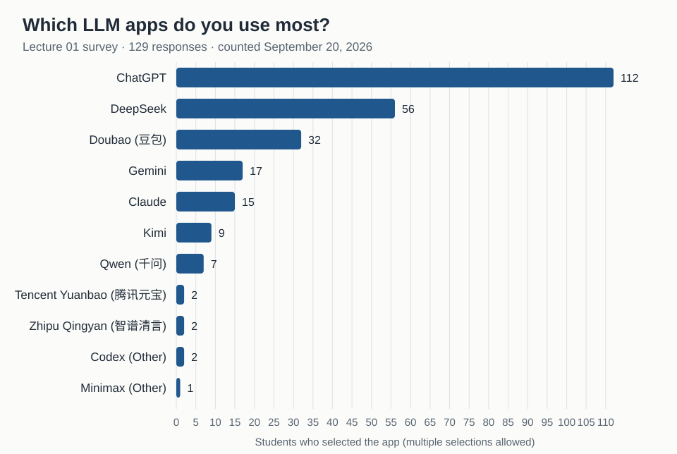

# Lecture 01: LLM-app survey archive

**Collection is closed.** The submission deadline was **September 20, 2026,
23:59 (Asia/Shanghai, UTC+08:00)**. New responses are not accepted here or at
the former `surveys/lecture-01/` location. Accepted responses and participation
are preserved; students do not need to resubmit or open another PR.

This public first-PR activity asked which LLM apps students regularly used.
Each student submitted one Markdown response with their GitHub username.
Any number of selections, including zero or more than two, was valid.
The archived [response files](responses/) retain their original contents
and filenames. The [original template](template.md) is kept for reference.

The survey contributes one participation entry on the
[progress board](../../PROGRESS.md); it is not a Python coding task and does
not affect coding-task correctness. Graded assignments and project
deliverables are submitted privately through [eLearning](https://elearning.fudan.edu.cn/).

## Results

<!-- survey-results:start -->
Counted from the merged files in [responses/](responses/) on September 20, 2026:
**129 responses**. Multiple selections are allowed.



| App | Students |
| :--- | ---: |
| ChatGPT | 112 |
| DeepSeek | 56 |
| Doubao (豆包) | 32 |
| Gemini | 17 |
| Claude | 15 |
| Kimi | 9 |
| Qwen (千问) | 7 |
| Tencent Yuanbao (腾讯元宝) | 2 |
| Zhipu Qingyan (智谱清言) | 2 |
| Codex (Other) | 2 |
| Minimax (Other) | 1 |

Apps written under *Other* get their own bar with the suffix "(Other)".
<!-- survey-results:end -->

## Collection record

- [Collection issue #6](https://github.com/baojian/llm-26-fall/issues/6) is closed.
- Responses submitted by the deadline could be reviewed and merged afterward.
- [Migration issue #139](https://github.com/baojian/llm-26-fall/issues/139) records
  the move on September 21, 2026, after outstanding survey PRs were resolved.
- Return to the [Lecture 01 activities](../README.md) for the separate coding
  exercises and their deadlines. Their deadlines do not reopen this survey.

## Maintainer tooling

Run from the repository root to regenerate the results and participation board:

```sh
uv run python scripts/survey_results.py
uv run python scripts/progress.py
```

Both commands read this archive. Keep accepted response contents and filenames
intact. The survey has its own tally and no `task.toml` or Python `solve`
interface; task discovery includes only the coding exercises. The old location
contains a forwarding README, not a second response directory.
