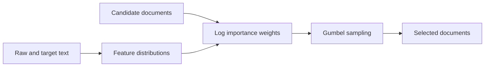

# Select data with n-gram importance weights

**Lecture:** l02-ngram · **Difficulty:** medium · **Time:** 90–120 minutes (target).

**Participation:** Optional. Draft; submissions open after the release PR is merged and this notice is removed.

**Deadline:** October 14, 2026, 23:59 (Asia/Shanghai, UTC+08:00).
**Task issue:** [#273](https://github.com/baojian/llm-26-fall/issues/273).

## Goal

Select documents from a mixed collection that better match a target domain.
Implement **Data Selection via Importance Resampling (DSIR)**: compare target
and raw n-gram frequencies, then sample documents using their likelihood ratio.
A feature common in the target may be even more common in the raw collection;
the ratio captures which features need more representation.
Here n-grams describe documents; no A1 language-model implementation is needed.
Read [DSIR, Sections 3–4 and the resampling paragraph in Appendix F](https://arxiv.org/pdf/2302.03169)
for background.



## Specification

Complete **five helpers** in [starter.py](starter.py). Hashing, input validation,
and `solve(case: dict) -> dict` are supplied. Use the Python standard library.

| Input field | Meaning |
| --- | --- |
| `raw_fit`, `target_fit` | Separate lists of tokenized documents; each collection has at least one token. |
| `pool` | Candidate records: `{"id": str, "tokens": list[str]}` with unique IDs. |
| `num_buckets` | Positive integer `M`; unigrams and bigrams share these buckets. |
| `alpha` | Finite, positive smoothing constant. |
| `k` | Integer from zero through the pool size. |
| `uniforms` | Exactly one finite value `0 < U < 1` for each pool ID. |

Types and required fields are guaranteed. Preserve tokens and document boundaries.
Fit only on `raw_fit` and `target_fit`.

1. **`feature_counts`:** count every unigram and adjacent bigram using the supplied
   `bucket`. Keep repeated occurrences and add colliding counts. A nonempty
   document of length `L` contributes `2L - 1` occurrences. An empty one contributes
   zero. Do not add BOS/EOS or cross-document bigrams.
2. **`fit_distribution`:** pool counts `C[j]` across documents and return
   $p(j)=(C[j]+\alpha)/(\sum_h C[h]+\alpha M)$, separately for raw and target text.
   Scale numerator and denominator together to avoid overflowing `alpha * M`;
   valid cases have representable positive probabilities.
3. **`log_importance`:** for candidate counts `z_i[j]`, return
   $\ell_i=\sum_j z_i[j](\log p_T(j)-\log p_R(j))$ using natural logs.
   Use the sum without length normalization, clipping, or temperature.
4. **`normalized_weights`:** set $a=\max_i\ell_i$ and return
   $w_i=e^{\ell_i-a}/\sum_h e^{\ell_h-a}$ by ID. Empty input gives `{}`.
5. **`sample_ids`:** compute $q_i=\ell_i-\log(-\log U_i)$ and choose the `k`
   largest priorities without replacement. Return IDs in descending priority
   order; break exact ties by ascending ID. Use the supplied uniforms.

`solve` returns exactly:

```python
{
    "raw_probs": [...],           # M probabilities in bucket order
    "target_probs": [...],
    "log_weights": {doc_id: ...}, # every pool ID
    "weights": {doc_id: ...},
    "selected_ids": [...],       # k IDs in priority order
}
```

- An empty candidate has log weight zero. For `k = 0`, select nothing but still
  compute distributions and weights. An empty pool gives empty weight dictionaries.
- Supplied validation raises `ValueError` for invalid bounds, duplicate IDs,
  featureless fitting collections, or missing/extra uniform IDs.
- Keep outputs independent of pool order. Do not round floats; checks use relative
  tolerance `1e-9` and absolute tolerance `1e-10`.

## Examples

| Example | Expected behavior |
| --- | --- |
| One document `red red blue` | Count `red` twice, `blue` once, and each bigram once before hashing. |
| Separate documents `["red"]`, `["blue"]` | Count two unigrams and no bigram. |
| Log weights `0` and `log(3)` | Weights are `1/4` and `3/4`. With equal uniforms and `k = 1`, select the second document. |
| The same documents with `k = 2` | Include both. Weights describe the first draw, not final inclusion probabilities. |

The model assigns probabilities to feature buckets; it does not define a normalized
distribution over complete token sequences.

## Before you code

Fill `PREDICTIONS` in the copied starter **before implementing the helpers**.
Use [examples.json](data/examples.json) and predict the ordered `selected_ids`:

| Fixture | Question |
| --- | --- |
| `same_models` | What determines selection when raw and target distributions agree? |
| `ratio_beats_likelihood` | Does higher target likelihood imply a higher importance weight? |
| `sampling_is_not_topk` | Can sampling select the lower-weight document first? |

Each fitting document here has one token. At `M = 2`, the supplied hash maps
`red` to bucket 0 and `blue` to bucket 1.

After implementing and running the comparison, complete:

- **`MY_CASES`:** two distinct new `(case, expected_selected_ids)` pairs using
  JSON-compatible inputs. Catch a counting/hashing error and a weighting/sampling
  error. Use cases different from all supplied fixtures.
- **`NOTES`:** 3–5 sentences, at least 200 characters. Explain the raw denominator,
  what sampling changes, two report numbers, and one failure or limitation.
  Inspect mixed-topic or boilerplate-heavy selections for your explanation.
  Correct any mistaken prediction and explain the change.

## Submission and checks

From the course repository root, use one terminal and replace `yourname` with
your lowercase GitHub username. Copy the starter and complete `PREDICTIONS`,
`solve` (through the helpers), `MY_CASES`, and `NOTES`.

```sh
task_dir=tasks/l02-ngram/dsir-data-selection
cp "$task_dir/starter.py" "$task_dir/submissions/yourname.py"
uv run python scripts/tasks.py check "$task_dir" yourname
uv run python scripts/task_feedback.py "$task_dir" yourname
```

**Run the comparison** after implementing the helpers:

```sh
uv run python "$task_dir/run_experiment.py" "$task_dir/submissions/yourname.py" \
    --stage dev --output workspace/l02-dsir-dev.json
uv run python "$task_dir/run_experiment.py" "$task_dir/submissions/yourname.py" \
    --stage final --selection workspace/l02-dsir-dev.json \
    --output workspace/l02-dsir-final.json
```

The supplied corpus has **3,200 chunks of 128 tokens**, including **2,048
candidates**, across six topics. It includes mixed topics and shared boilerplate.
The CPU runner compares **uniform sampling, target-only sampling, ratio top-k,
and DSIR**, selecting **64 documents / 8,192 tokens** with `alpha = 1` and
seeds 0–4 for sampling.

Uniform sampling gives every candidate equal weight. Target-only sampling uses
target log likelihood in place of the log ratio. Ratio top-k takes the largest
log ratios without Gumbel noise; DSIR uses the sampling rule above.

Development runs compare `M = 16` and `256`, then freeze the lower mean DSIR
mismatch (smaller `M` breaks a tie). Final evaluation uses separate text and
rejects changed submission/data files. Lower **Jensen–Shannon divergence** means
closer *unhashed* feature distributions. Inspect domain/subtopic/style counts,
`max(weights)`, and one hash collision in the JSON report. Report any baseline
that wins; feature matching alone does not establish better language-model quality.
See [data provenance](data/README.md) for splits and generation.

Finish your cases and reflection, then rerun checks. They cover outputs,
predictions, new cases, lowercase filenames, and reflection length; the teaching
team reviews reasoning. All four fields must be complete to pass.

After release, submit only `submissions/<username>.py` from your own account,
with PR title `l02-ngram/dsir-data-selection: <username>` and body
`Related to #273`. Use your own code and words; keep supplied files
unchanged and reports in ignored `workspace/`.

Open **Checks → Public task feedback** for formatting checks, correctness
results, and failed cases. Push fixes to the same PR branch to rerun the action.
The teaching team reviews your reasoning. Follow the release issue for dates;
solutions merge in one batch after the deadline, after human review.
