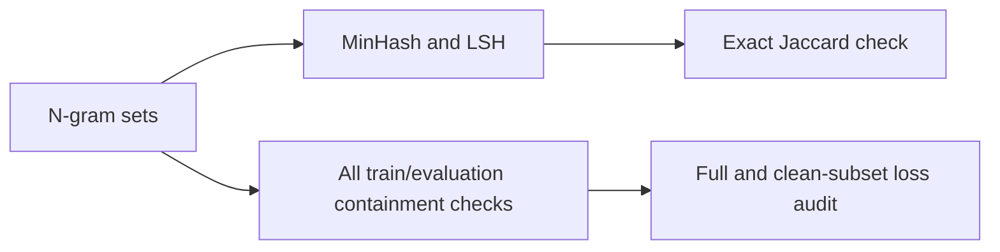

# Find duplicates and train/evaluation overlap

**Lecture:** l02-ngram · **Difficulty:** medium · **Time:** 90–120 minutes (target).

**Participation:** Optional. Submissions are open.

**Deadline:** October 14, 2026, 23:59 (Asia/Shanghai, UTC+08:00).
**Task issue:** [#274](https://github.com/baojian/llm-26-fall/issues/274).

## Goal

Find similar documents with **MinHash and locality-sensitive hashing (LSH)**,
then check whether training text contains an evaluation passage's n-grams.
Use the overlap flags to inspect a supplied perplexity report. No A1 code is needed.
This adapts [CS336 Assignment 4, Section 3.2](https://github.com/stanford-cs336/assignment4-data/blob/0555bea66369872d912652debf10b115ca0688c8/cs336_assignment4_data.pdf),
with containment and evaluation analysis added for this course.



## Specification

Complete **five helpers** in [starter.py](starter.py). Hashing, input validation,
and `solve(case: dict) -> dict` are supplied. Use the Python standard library.

| Input field | Meaning |
| --- | --- |
| `documents` | Records `{"id": str, "split": "train" or "eval", "tokens": list[str]}`; IDs are unique across splits. |
| `n` | Positive integer shingle length. |
| `num_hashes` | Positive integer signature length `H`. |
| `num_bands` | Positive integer `B` dividing `H`; each band has `R = H // B` rows. |
| `jaccard_threshold`, `containment_threshold` | Finite values in `(0, 1]`; comparisons are inclusive. |

Types, fields, and split names are guaranteed. Preserve tokens and document
boundaries; do not add BOS/EOS or normalize text.

1. **`shingles`:** return the set `S_d` of contiguous `n`-token tuples in document
   `d`. Repeated tuples count once. Fewer than `n` tokens gives an empty set.
2. **`signature`:** for a nonempty set, return
   $\mathrm{sig}_d[t]=\min_{g\in S_d}\mathrm{rank}(g,t)$ for `t = 0, ..., H-1`.
   Use the supplied seeded `rank`. Similar sets tend to share more minima;
   with independent random orderings, the match probability equals Jaccard similarity.
3. **`lsh_candidates`:** split signatures into consecutive bands. Return pairs
   matching at least one **same-index** band; include within-split pairs and
   remove duplicates. The bucket key must include the band index.
4. **`verify_pairs`:** keep candidate pairs with exact Jaccard similarity
   $J(a,b)=|S_a\cap S_b|/|S_a\cup S_b|$ at or above `jaccard_threshold`.
5. **`containment_pairs`:** check **every** nonempty train/evaluation pair,
   independently of LSH. Keep `(train_id, eval_id)` when
   $C(e\mid t)=|S_e\cap S_t|/|S_e|$ reaches `containment_threshold`.
   The denominator is the evaluation passage's set size.

Return sets of ID tuples from the last three helpers. Supplied `solve` assembles:

```python
{
    "candidate_pairs": [[id_a, id_b], ...],
    "verified_pairs": [[id_a, id_b], ...],
    "contamination_pairs": [[train_id, eval_id], ...],
    "unscorable_ids": [...],
}
```

- Exclude empty shingle sets from matching; list their IDs in `unscorable_ids`.
  Empty input gives four empty lists.
- Candidate/verified pairs put the smaller ID first; containment pairs put the
  training ID first. Sort output lists lexicographically and remove duplicates.
  Input document order must not affect the result.
- Supplied validation raises `ValueError` for duplicate IDs, nonpositive dimensions,
  `B` not dividing `H`, or thresholds outside the finite range above.
- LSH can miss similar pairs. Check containment over all train/evaluation pairs
  in the 320-document corpus. Report pairs without clustering or deletion.

## Examples

| Example | Expected behavior |
| --- | --- |
| Tokens `a b a b`, `n = 2` | Shingles are `{("a", "b"), ("b", "a")}`. |
| One token, `n = 2` | No shingles; mark the document unscorable. |
| Signatures `[1,2,3,4]`, `[3,4,5,6]`, `B = 2` | No matching same-index band, so no candidate. |
| Train `a b c d e`, evaluation `b c d`, `n = 2` | Jaccard is `2/4`; evaluation containment is `2/2`. |

An overlap flag needs interpretation: boilerplate can match, and sharing local
n-grams does not prove a contiguous copy or training-time exposure. Similarity
is not transitive: matching A–B and B–C does not establish A–C.

## Before you code

Fill `PREDICTIONS` in the copied starter **before implementing the helpers**.
Use [examples.json](data/examples.json) and predict `contamination_pairs`:

| Fixture | Question |
| --- | --- |
| `exact_copy` | What happens when training and evaluation text match? |
| `short_documents` | Do two empty shingle sets count as a match? |
| `contained_passage` | Can containment pass when Jaccard similarity is low? |

These predictions need no manual hash calculation. After running the comparison,
complete:

- **`MY_CASES`:** two distinct new `(case, expected_contamination_pairs)` pairs
  using JSON-compatible inputs. Include one repeated/short-text case and one
  directional-containment case that whole-document similarity could miss.
  Use cases different from all supplied fixtures.
- **`NOTES`:** 3–5 sentences, at least 200 characters. Explain one false/missed
  LSH candidate, Jaccard versus containment, and both runs' clean-subset perplexities.
  Use boilerplate or scattered overlap to discuss what a flag can establish.
  Correct any mistaken prediction and explain the change.

## Submission and checks

From the course repository root, use one terminal and replace `yourname` with
your lowercase GitHub username. Copy the starter and complete `PREDICTIONS`,
`solve` (through the helpers), `MY_CASES`, and `NOTES`.

```sh
task_dir=tasks/l02-ngram/ngram-contamination
cp "$task_dir/starter.py" "$task_dir/submissions/yourname.py"
uv run python scripts/tasks.py check "$task_dir" yourname
uv run python scripts/task_feedback.py "$task_dir" yourname
```

**Run the comparison** after implementing the helpers:

```sh
uv run python "$task_dir/run_experiment.py" "$task_dir/submissions/yourname.py" \
    --output workspace/l02-contamination.json
```

The CPU runner uses **256 training and 64 evaluation documents**, up to **1,024
tokens** long. Cases include exact/edited copies, contained passages, shared
boilerplate, scattered overlapping trigrams, independent text, and short/empty text.

1. **Compare `B = 4` and `8`**, fixing `n = 3`, `H = 16`, Jaccard threshold `0.8`,
   and containment threshold `0.9`. Inspect candidate count, recall (fraction of
   all exact above-threshold pairs retrieved), and precision (fraction of candidates
   verified). Zero denominators give `N/A`. Inspect missed/false pairs in the JSON
   and confirm that containment results stay the same.
2. **Read the constructed loss audit.** The helper uses the supplied
   [audit data](data/evaluation-audit.json) to compute
   $\mathrm{PPL}=2^{\sum\mathrm{loss\_bits}/\sum\mathrm{scored\_tokens}}$
   for runs A and B on the full set and the **same clean subset**. Each evaluation
   document has three word predictions plus EOS; BOS is context only.
   Explain why the ranking changes. These are invented teaching scores.

The audit uses `n = 2`, `H = 4`, `B = 2`, Jaccard threshold `0.8`, and containment
threshold `1.0`. Keep both full-set and clean-subset results. Synthetic retrieval
rates and loss scores do not establish production performance; see
[data provenance](data/README.md).

Finish your cases and reflection, then rerun checks. They cover outputs,
predictions, new cases, lowercase filenames, and reflection length; the teaching
team reviews reasoning. All four fields must be complete to pass.

Submit only `submissions/<username>.py` from your own account,
with PR title `l02-ngram/ngram-contamination: <username>` and body
`Related to #274`. Use your own code and words; keep supplied files
unchanged and reports in ignored `workspace/`.

Open **Checks → Public task feedback** for formatting checks, correctness
results, and failed cases. Push fixes to the same PR branch to rerun the action.
The teaching team reviews your reasoning. Follow the release issue for dates;
solutions merge in one batch after the deadline, after human review.
